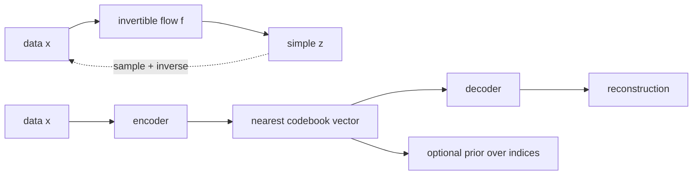

# Normalizing Flows and Discrete Latent Models

Source: `DL_exam.pdf`, Question 55

Original question:

> Normalizing Flows и дискретные латентные модели. Обратимые преобразования, change of variables, exact likelihood, идея VQ-VAE.

## Главная идея

`Normalizing flow` учит обратимое отображение между данными $x$ и простым latent $z$, поэтому плотность $p_\theta(x)$ считается точно через `change of variables`. VQ-VAE решает другую задачу: переводит объект в дискретные индексы из codebook, удобно сжимая представление, но не является flow и не дает exact likelihood исходного $x$ тем же способом.

## Минимум для ответа

- Flow: биекция $z=f_\theta(x)$, $x=f_\theta^{-1}(z)$; обычно $x,z \in \mathbb{R}^D$.
- Base distribution простое: $\mathcal{N}(0,I)$ или factorized logistic.
- Exact likelihood: оптимизируем настоящий $\log p_\theta(x)$, а не ELBO и не adversarial loss.
- Практический flow требует обратимых блоков и дешевого $\det J$: coupling layers, autoregressive flows, invertible $1 \times 1$ convolution, actnorm.
- Цена flows: равная размерность data/latent, архитектурные ограничения, сложность для дискретных пикселей без dequantization, likelihood не всегда совпадает с визуальным качеством.
- VQ-VAE: encoder дает $z_e(x)$, nearest-neighbor quantization выбирает embedding из codebook $E=\{e_1,\dots,e_K\}$, decoder восстанавливает $\hat{x}$.
- Через $\arg\min$ градиент не проходит, поэтому используют `straight-through estimator`.
- Для генерации VQ-VAE обычно отдельно обучают prior над индексами, например PixelCNN или Transformer.

## Формулы / схема

Change of variables:

$$
p_X(x)=p_Z(f_\theta(x))\left|\det \frac{\partial f_\theta(x)}{\partial x}\right|
$$

Для композиции $z_0=x$, $z_k=f_k(z_{k-1})$:

$$
\log p_X(x)=\log p_Z(z_K)+\sum_{k=1}^{K}\log\left|\det J_{f_k}(z_{k-1})\right|
$$

VQ-VAE:

$$
k^*=\arg\min_k\|z_e(x)-e_k\|_2,\qquad z_q(x)=e_{k^*}
$$

$$
\mathcal{L}=-\log p_\theta(x\mid z_q(x))+\|\operatorname{sg}[z_e(x)]-e\|_2^2+\beta\|z_e(x)-\operatorname{sg}[e]\|_2^2
$$

## Диаграмма

## Уточнения экзаменатора

- Почему log-determinants суммируются? Jacobian композиции перемножается, а log переводит произведение в сумму.
- Почему determinant должен быть дешевым? У произвольной dense-сети determinant матрицы $D \times D$ стоит дорого и непрактичен для изображений.
- Чем flow отличается от VAE? Flow считает exact likelihood; VAE обычно максимизирует ELBO.
- Что делает commitment loss? Заставляет encoder output держаться около выбранного codebook vector.
- Что такое codebook collapse? Модель использует мало кодов, и дискретное представление теряет емкость.

## Частые ошибки

- Называть VQ-VAE normalizing flow.
- Забывать модуль в $\left|\det J\right|$.
- Путать направления: если $z=f(x)$, то берется $\partial z/\partial x$.
- Считать quantization дифференцируемой без straight-through estimator.
- Приравнивать хороший likelihood к хорошим samples без оговорок.
