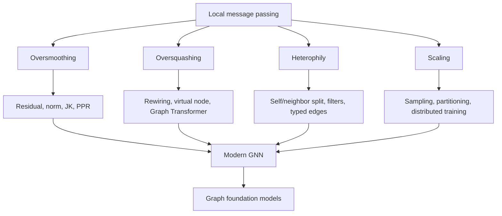

# GNN Problems and Modern Directions

Source: `DL_exam.pdf`, Question 57

Original question:

> Проблемы и современные направления GNN. Oversmoothing, oversquashing, heterophily, масштабирование и graph foundation models.

## Главная идея

GNN передают информацию по ребрам, но локальная агрегация создает ограничения. Глубокая модель может сгладить признаки, потерять дальние зависимости через bottlenecks или испортить сигнал, если соседи не похожи. Современные направления управляют распространением сообщений, лучше кодируют структуру и масштабируют обучение.

## Минимум для ответа

- `Oversmoothing`: при многих слоях embeddings вершин становятся похожими из-за повторного Laplacian smoothing.
- `Oversquashing`: дальняя информация сжимается в hidden vector фиксированной размерности, особенно через graph bottlenecks.
- `Heterophily`: ребра соединяют вершины разных классов или ролей; простая агрегация соседей может вредить.
- Против `oversmoothing`: residual/skip, normalization, Jumping Knowledge, DropEdge, APPNP/PPR.
- Против `oversquashing`: rewiring, virtual node, structural encodings, Graph Transformers.
- Для `heterophily`: self/neighbor split, high-pass filters, higher-order neighborhoods, typed edges, attention/gating.
- Масштабирование: neighbor sampling, subgraph sampling, cluster/partition training, sparse kernels, caching, distributed training.
- `Graph foundation models`: предобучение на графах через masked prediction, contrastive/generative objectives, graph-text alignment, prompts/adapters.

## Формулы / схема

Message passing:

$$
m_v^{(l)}=\operatorname{AGG}_{u\in\mathcal{N}(v)}\phi(h_v^{(l)},h_u^{(l)},e_{uv}), \quad
h_v^{(l+1)}=\psi(h_v^{(l)},m_v^{(l)}).
$$

GCN-сглаживание:

$$
H^{(L)} \approx \hat{A}^L XW.
$$

Homophily:

$$
h_{\text{edge}}=\frac{|\{(u,v)\in E:y_u=y_v\}|}{|E|}.
$$

Full-batch слой: $O(|E|d+|V|d^2)$; при fanout $s$ и глубине $L$ sampling растет как $O(s^L)$.

## Диаграмма

## Уточнения экзаменатора

- Чем `oversmoothing` отличается от `oversquashing`? Первое стирает различия, второе сжимает дальние сигналы.
- Почему heterophily ломает GCN? GCN как low-pass filter усредняет соседей, хотя полезны различия или роли.
- Зачем Graph Transformer? Для глобального attention и structural/positional encodings.
- Почему graph foundation models сложнее LLM? Графы различаются типами вершин, ребер, признаками, доменами и задачами.

## Частые ошибки

- Путать `oversmoothing` с overfitting.
- Считать низкую homophily доказательством бесполезности графа.
- Думать, что большая глубина всегда решает long-range dependencies.
- Игнорировать data leakage в transductive splits и inference cost на полном графе.
