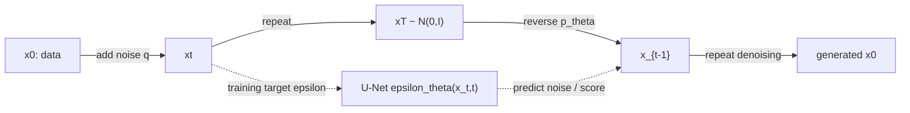

# Diffusion Models

Source: `DL_exam.pdf`, Question 58

Original question:

> Диффузионные модели. Генерация из шума, score matching, denoising diffusion, forward/reverse process, U-Net.

## Главная идея

Diffusion model учится не сразу порождать сложный объект, а много раз решать простую задачу `denoising`: прямой процесс постепенно портит реальные данные Gaussian noise, а обратный процесс учится снимать шум и идти от $x_T \sim \mathcal{N}(0,I)$ к похожему на данные $x_0$.

## Минимум для ответа

- Есть два марковских процесса: фиксированный `forward process` $q(x_t \mid x_{t-1})$ добавляет шум; обучаемый `reverse process` $p_\theta(x_{t-1}\mid x_t)$ шум убирает.
- В DDPM задают schedule $\beta_t$, $\alpha_t=1-\beta_t$, $\bar{\alpha}_t=\prod_{s=1}^t \alpha_s$.
- Нейросеть обычно предсказывает добавленный шум: $\epsilon_\theta(x_t,t)\approx \epsilon$. Это supervised-регрессия, потому что при зашумлении $\epsilon$ известен.
- Связь со `score matching`: score $s(x,t)=\nabla_x \log p_t(x)$ показывает направление к более вероятным данным; предсказание шума эквивалентно score с масштабом.
- Для изображений backbone часто `U-Net`: encoder-decoder, skip connections, time embeddings, residual blocks, normalization, attention на некоторых разрешениях.
- Плюсы: стабильное обучение, высокое качество. Минусы: дорогой sampling, много последовательных вызовов U-Net, чувствительность к schedule/sampler.

## Формулы / схема

Forward step:

$$
q(x_t\mid x_{t-1})=\mathcal{N}(\sqrt{\alpha_t}x_{t-1},\beta_t I)
$$

Прямое получение $x_t$ из $x_0$:

$$
x_t=\sqrt{\bar{\alpha}_t}x_0+\sqrt{1-\bar{\alpha}_t}\epsilon,\quad \epsilon\sim\mathcal{N}(0,I)
$$

Обучение:

$$
L_{\text{simple}}=\mathbb{E}_{x_0,t,\epsilon}\lVert \epsilon-\epsilon_\theta(x_t,t)\rVert_2^2
$$

Reverse sampling:

$$
x_{t-1}=\mu_\theta(x_t,t)+\sigma_t z,\quad z\sim\mathcal{N}(0,I)
$$

Score-связь:

$$
\nabla_{x_t}\log q(x_t\mid x_0)=-\frac{\epsilon}{\sqrt{1-\bar{\alpha}_t}}
$$

## Диаграмма

Атрибуция: [assets/ATTRIBUTION.md](../assets/ATTRIBUTION.md).

## Уточнения экзаменатора

- Почему loss на шум корректен? Он получается как практическая форма DDPM variational objective при Gaussian transitions.
- Что делает time embedding? Сообщает U-Net уровень шума $t$.
- Чем stochastic DDPM отличается от DDIM? DDPM добавляет шум в reverse step; DDIM может идти более детерминированно и быстрее.
- Почему sampling медленный? Нужен цикл по многим $t$, каждый шаг вызывает U-Net.

## Частые ошибки

- Путать forward и reverse: forward не обучается, reverse обучается.
- Говорить, что U-Net обязателен математически; это практичный backbone, не часть определения diffusion.
- Забывать, что генерация начинается с Gaussian noise.
- Называть score самим шумом без масштабного коэффициента.
