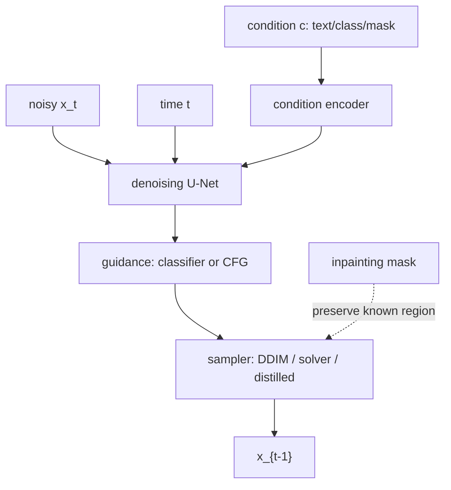

# Conditional and Accelerated Diffusion

Source: `DL_exam.pdf`, Question 59

Original question:

> Условная и ускоренная диффузия. Guidance, text-to-image, DDIM/solvers/distillation, inpainting.

## Главная идея

Условная diffusion model генерирует sample из $p(x \mid c)$, где $c$ -- класс, текст, маска, референс, pose/depth/segmentation. `Guidance` во время sampling усиливает движение к условию. Ускорение нужно потому, что DDPM sampler требует сотни-тысячи шагов; DDIM, ODE/SDE solvers и distillation уменьшают число steps ценой компромисса качество/скорость/разнообразие.

## Минимум для ответа

- Условие подается в denoising network $\epsilon_\theta(x_t,t,c)$: class embedding, concatenation channels, cross-attention, conditioning branch, ControlNet-like adapter.
- В text-to-image prompt кодируется text encoder; token embeddings входят в U-Net через cross-attention. В latent diffusion denoising идет в latent space VAE.
- `Classifier guidance`: внешний noisy classifier добавляет к score градиент совместимости с условием.
- `Classifier-free guidance` (`CFG`): одна модель обучается с condition dropout; на sampling смешиваются unconditional и conditional predictions.
- Большой guidance scale повышает prompt adherence, но уменьшает diversity и может давать артефакты.
- DDIM меняет sampler, а не обязательно обучение: non-Markovian reverse process, sparse timesteps, deterministic sampling при $\eta=0$.
- Solvers трактуют sampling как численное решение reverse SDE или probability-flow ODE.
- Distillation обучает student имитировать многошаговый teacher за few-step inference.
- Inpainting фиксирует known region через mask на каждом noise level, а missing region генерируется условно.

## Формулы / схема

Обучение conditional noise prediction:

$$
L=\mathbb{E}_{x_0,c,t,\epsilon}\lVert \epsilon-\epsilon_\theta(x_t,t,c)\rVert_2^2,\quad
x_t=\sqrt{\bar{\alpha}_t}x_0+\sqrt{1-\bar{\alpha}_t}\epsilon.
$$

Classifier guidance:

$$
s_{\text{guided}}=s_\theta(x_t,t)+\gamma\nabla_{x_t}\log p_\phi(c\mid x_t,t).
$$

CFG:

$$
\epsilon_{\text{CFG}}=\epsilon_{\text{uncond}}+w(\epsilon_{\text{cond}}-\epsilon_{\text{uncond}}).
$$

Inpainting merge:

$$
x_{t-1}=m\odot x_{t-1}^{\text{known}}+(1-m)\odot x_{t-1}^{\text{gen}}.
$$

## Диаграмма

## Уточнения экзаменатора

- Чем CFG отличается от classifier guidance? CFG не требует отдельного классификатора; нужны conditional и unconditional forward pass.
- Почему DDIM быстрее? Можно идти по разреженным timesteps и при $\eta=0$ без нового шума.
- Что дают solvers? Крупные точные шаги reverse ODE/SDE; ошибки растут при плохом schedule.
- Зачем distillation? Переносит trajectory teacher sampler в student с меньшим числом шагов.

## Частые ошибки

- Путать conditioning как вход модели и guidance как изменение sampling trajectory.
- Считать, что большой $w$ всегда лучше.
- Называть DDIM отдельной моделью обучения.
- Делать inpainting вставкой патча только в конце, а не согласованием known region на каждом шаге.
