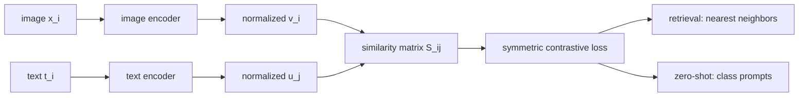

# Multimodal Tasks and CLIP

Source: `DL_exam.pdf`, Question 60

Original question:

> Мультимодальные задачи и CLIP. Image-text retrieval, zero-shot classification, contrastive learning, общее пространство изображений и текста.

## Главная идея

CLIP связывает изображения и текст через общее embedding space: картинка и ее подпись должны быть близки, а случайные несовпадающие пары - далеки. После pretraining retrieval делается поиском ближайших embeddings, а zero-shot classification - сравнением изображения с текстовыми prompt-ами классов.

## Минимум для ответа

- Мультимодальная задача использует разные modality; здесь пара $(x_i, t_i)$: изображение и текст.
- CLIP - two-tower модель: image encoder $f_\theta$ и text encoder $g_\phi$.
- Оба encoder-а проецируют входы в одну размерность и L2-нормируют embeddings:
  $v_i = f_\theta(x_i)/\|f_\theta(x_i)\|_2$, $u_i = g_\phi(t_i)/\|g_\phi(t_i)\|_2$.
- Сходство: cosine similarity, практически dot product нормированных векторов.
- Обучение: symmetric contrastive learning; диагональ batch-матрицы - matched пары, остальное - in-batch negatives.
- Image-text retrieval: по запросу image или text ранжировать кандидатов по $v^\top u$; метрики Recall@K, median rank, mAP.
- Zero-shot classification: классы превращаются в prompt-ы вроде `a photo of a {class}`, затем выбирается класс с максимальным сходством.
- Ограничения: prompt sensitivity, bias, false negatives, слабые fine-grained различия, счет, пространственные отношения и локализация.

## Формулы / схема

Для batch из $N$ пар:

$$
S_{ij} = \frac{v_i^\top u_j}{\tau}
$$

$$
\mathcal{L}_{I \to T} =
-\frac{1}{N}\sum_i \log \frac{\exp(S_{ii})}{\sum_j \exp(S_{ij})},
\qquad
\mathcal{L}_{T \to I} =
-\frac{1}{N}\sum_i \log \frac{\exp(S_{ii})}{\sum_j \exp(S_{ji})}
$$

$$
\mathcal{L}=\frac{1}{2}(\mathcal{L}_{I \to T}+\mathcal{L}_{T \to I})
$$

Zero-shot:

$$
\hat{y}=\arg\max_k v^\top u_k
$$

где $u_k$ - embedding prompt-а класса, а $\tau$ задает резкость softmax.

## Диаграмма

## Уточнения экзаменатора

- Почему zero-shot возможен? Классы задаются текстом, а не весами classifier head.
- Зачем L2 normalization? Dot product становится cosine similarity.
- Что такое false negative? Непарный элемент batch, который семантически тоже подходит.
- Чем retrieval отличается от captioning? Retrieval ранжирует готовые кандидаты, captioning генерирует текст.
- Зачем большие batch-и? Они дают больше in-batch negatives.

## Частые ошибки

- Называть CLIP обычным supervised classifier по классам.
- Забывать второе направление loss: text-to-image.
- Считать все negatives истинно неправильными.
- Игнорировать зависимость zero-shot качества от prompt engineering.
- Утверждать, что shared embedding гарантирует понимание отношений и локализацию.
