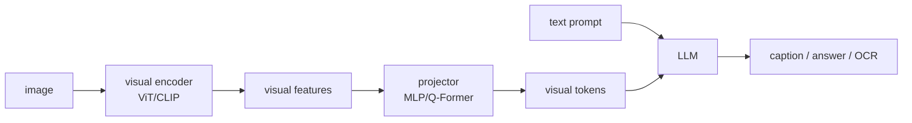

# Vision Language Models and MLLM

Source: `DL_exam.pdf`, Question 61

Original question:

> Vision-Language Models и MLLM. Captioning, VQA, OCR, BLIP/LLaVA-подходы, visual encoder, projector, LLM, visual tokens.

## Главная идея

`VLM/MLLM` соединяет изображение и язык: visual encoder превращает картинку в признаки, projector переводит их в пространство LLM, а LLM генерирует текстовый ответ. Главное: модель должна не просто "узнать объекты", а связать визуальные факты с текстовым запросом.

## Минимум для ответа

- Типовые задачи: `captioning`, `VQA`, `OCR`, document QA, visual grounding, multimodal chat.
- Базовый pipeline: image $\to$ `visual encoder` $\to$ visual features $\to$ `projector/adapter` $\to$ `visual tokens` $\to$ `LLM` $\to$ answer.
- `Visual encoder`: часто ViT/CLIP encoder; извлекает patch-level или pooled признаки.
- `Projector`: linear/MLP/Q-Former/resampler; согласует размерность vision features с embedding dimension LLM.
- `Visual tokens` - это не слова, а векторы в том же пространстве, что и токены LLM.
- `Captioning`: сгенерировать описание $p(y \mid x)$.
- `VQA`: ответить на вопрос $p(a \mid x,q)$; нужно выбрать релевантную область изображения.
- `OCR`: требует высокого разрешения, сохранения layout и мелких деталей; обычный CLIP encoder может терять текст.
- BLIP/BLIP-2: image-text pretraining; BLIP-2 использует `Q-Former` между frozen visual encoder и frozen LLM.
- LLaVA: CLIP/ViT encoder + projector + pretrained LLM; затем alignment на image-text pairs и multimodal instruction tuning.

## Формулы / схема

$$
V = E_{\text{vis}}(x), \qquad Z = P(V)
$$

$$
p(y \mid x,t)=\prod_i p(y_i \mid y_{<i}, Z, t)
$$

Обучение generative MLLM:

$$
\mathcal{L}_{\text{gen}}=-\sum_i \log p_\theta(y_i \mid y_{<i}, x,t)
$$

Ключевой trade-off: больше visual tokens $\Rightarrow$ больше деталей, но дороже attention и длиннее context.

## Диаграмма

## Уточнения экзаменатора

- Зачем projector? Чтобы привести visual features к размерности и распределению embeddings LLM.
- Чем VQA сложнее captioning? Вопрос выбирает конкретный визуальный факт.
- Почему OCR труден? Мелкий текст теряется при resize/patching.
- Что делает Q-Former? Компактно извлекает из изображения токены, полезные для LLM.
- Почему возможны hallucinations? LLM может опираться на языковые prior-ы при слабом visual grounding.

## Частые ошибки

- Считать visual tokens обычными текстовыми токенами.
- Забывать projector между vision encoder и LLM.
- Говорить, что CLIP encoder автоматически хорошо читает OCR.
- Путать retrieval-модели и generative MLLM.
- Игнорировать стоимость длинной последовательности visual tokens.

