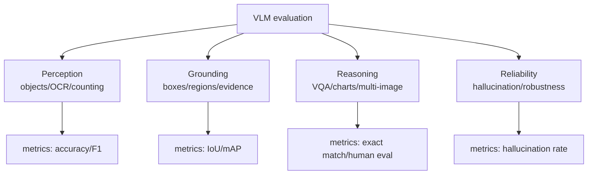

# Evaluation and Limits of Multimodal Models

Source: `DL_exam.pdf`, Question 62

Original question:

> Оценка и ограничения мультимодальных моделей. Бенчмарки, работа с большими изображениями, multi-image режим, типичные ошибки VLM.

## Главная идея

VLM нужно оценивать не по fluent text, а по groundedness: поддержан ли ответ изображением. Сильная LLM может звучать уверенно, но придумывать объекты, неверно читать текст или смешивать факты между несколькими изображениями.

## Минимум для ответа

- Оценивают разные навыки: VQA, captioning, OCR/document QA, chart/table QA, grounding, retrieval, spatial reasoning, counting, hallucination, robustness, multi-image reasoning.
- Метрики зависят от задачи: accuracy/exact match/F1 для QA, IoU/mAP для grounding, Recall@K для retrieval, CIDEr/SPICE/BLEU для captioning, hallucination rate для invented objects.
- Benchmark score измеряет конкретный протокол; multiple-choice легче открытого диалога.
- Для free-form answers нужны нормализация ответов или human evaluation.
- Большие изображения: resize дешевый, но теряет мелкий текст и small objects; tiling сохраняет детали, но усложняет global reasoning.
- Multi-image режим: visual tokens нескольких изображений конкатенируются с разделителями; модель должна не перепутать image index и evidence.
- Типичные ошибки: object hallucination, wrong OCR, counting errors, spatial relation errors, attribute confusion, chart/table mistakes, overconfidence, prompt injection через текст на изображении.

## Формулы / схема

Число патчей:

$$
N_{\text{patch}}=\left\lceil\frac{H}{P}\right\rceil
\cdot
\left\lceil\frac{W}{P}\right\rceil
$$

Для multi-image context:

$$
N_{\text{total}} = T + \sum_{i=1}^{M} n_i
$$

Retrieval:

$$
\text{Recall@}K=\frac{1}{N}\sum_i \mathbf{1}[\text{target}_i \in \text{top-}K]
$$

Grounding:

$$
\text{IoU}(A,B)=\frac{|A\cap B|}{|A\cup B|}
$$

## Диаграмма

## Уточнения экзаменатора

- Почему caption metrics недостаточны? Они сравнивают с reference text, но не гарантируют фактическую истинность.
- Что такое groundedness? Ответ должен иметь визуальное подтверждение.
- Почему high-res дорого? Больше visual tokens и выше стоимость attention.
- Чем опасен multi-image режим? Модель смешивает факты и ссылки между изображениями.
- Как проверять OCR? Exact match, F1/edit distance, document QA benchmarks.

## Частые ошибки

- Оценивать VLM только языковой плавностью.
- Считать один benchmark полной мерой качества.
- Игнорировать preprocessing: resize/crops сильно меняют результат.
- Не различать retrieval, captioning, VQA и grounding metrics.
- Не требовать отказа, когда изображение не содержит нужной информации.
