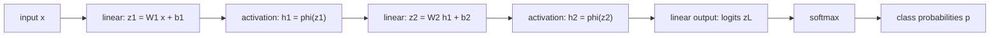

# Neural Network as Function Composition

Source: `DL_exam.pdf`, Question 02

Original question:

> Нейронная сеть как композиция функций. Линейный слой, bias, функции активации, глубина, нелинейность, softmax.

## Интуиция

Нейронная сеть - это параметризованная функция, собранная из простых блоков. Каждый слой берет представление с предыдущего слоя, применяет к нему линейное преобразование с добавкой `bias`, затем обычно пропускает результат через нелинейную функцию активации. Композиция таких блоков постепенно переводит исходные признаки в более удобное представление для решения задачи.

Главная идея глубокой сети не в том, что один слой сам по себе сложен, а в том, что много простых преобразований, соединенных последовательно, могут задавать очень сложную функцию. Если между линейными слоями не поставить нелинейности, вся сеть схлопнется в один линейный слой. Поэтому активации принципиальны: они позволяют строить нелинейные границы решений и иерархические признаки.

Для классификации последний слой обычно выдает `logits` - произвольные вещественные оценки классов. `Softmax` превращает их в распределение вероятностей по классам, чтобы можно было интерпретировать выход и обучать модель через cross-entropy.

## Что нужно сказать на экзамене

- Нейронная сеть задает функцию $f_\theta(x)$ как композицию слоев: $f_\theta = f_L \circ f_{L-1} \circ \dots \circ f_1$.
- Линейный, точнее affine, слой имеет вид $z = Wx + b$, где $W$ - матрица весов, $b$ - `bias`.
- `Bias` сдвигает affine-преобразование и позволяет нейронам иметь ненулевой порог срабатывания; без него модель менее гибкая.
- Активация применяется поэлементно или блочно: $h = \phi(z)$. Типичные функции: ReLU, sigmoid, tanh, GELU, Leaky ReLU.
- Без нелинейных активаций композиция линейных слоев остается линейной/affine-функцией.
- Глубина - число последовательных преобразований; она дает иерархические признаки и часто более компактное представление сложных функций, но усложняет оптимизацию.
- `Softmax`:
  $$p_i = \frac{\exp(z_i)}{\sum_{j=1}^{K}\exp(z_j)}$$
  переводит logits в вероятности классов.
- Для численной устойчивости считают:
  $$\operatorname{softmax}(z)_i = \frac{\exp(z_i - m)}{\sum_{j=1}^{K}\exp(z_j - m)}, \quad m = \max_j z_j.$$
- В классификации softmax обычно используют вместе с cross-entropy; на практике loss часто принимает logits напрямую.

## Подробный ответ

Пусть вход $x \in \mathbb{R}^{d_0}$. Полносвязная feed-forward сеть из $L$ слоев строит последовательность скрытых представлений:

$$
h_0 = x,
$$

$$
z_l = W_l h_{l-1} + b_l,\quad h_l = \phi_l(z_l),\quad l = 1,\dots,L-1,
$$

$$
z_L = W_L h_{L-1} + b_L.
$$

Здесь $W_l \in \mathbb{R}^{d_l \times d_{l-1}}$, $b_l \in \mathbb{R}^{d_l}$, $z_l$ называется pre-activation, а $h_l$ - activation или hidden representation. Параметры сети:

$$
\theta = \{W_1,b_1,\dots,W_L,b_L\}.
$$

Композиционная запись:

$$
f_\theta(x) = f_L(f_{L-1}(\dots f_1(x)\dots)).
$$

Если слой имеет вид $f_l(h) = \phi_l(W_l h + b_l)$, то вся сеть - это вложенная композиция affine-преобразований и нелинейностей.

### Линейный слой и bias

В машинном обучении термин "linear layer" часто означает affine layer:

$$
z = Wx + b.
$$

Строго линейное отображение должно удовлетворять $g(\alpha x + \beta y) = \alpha g(x) + \beta g(y)$ и иметь вид $g(x)=Wx$. Добавление $b$ делает отображение affine, потому что оно может сдвигать гиперплоскости.

Для одного нейрона:

$$
z_i = w_i^\top x + b_i.
$$

Геометрически $w_i$ задает направление и наклон разделяющей гиперплоскости, а $b_i$ задает сдвиг. Без bias гиперплоскость обязана проходить через начало координат, что может быть слишком жестким ограничением.

Bias можно включить в матрицу весов через расширенный вход:

$$
\tilde{x} =
\begin{bmatrix}
x \\
1
\end{bmatrix},
\quad
\tilde{W} =
\begin{bmatrix}
W & b
\end{bmatrix},
\quad
Wx + b = \tilde{W}\tilde{x}.
$$

Это полезно для понимания, что bias - тоже обучаемый параметр.

### Функции активации

Активация вводит нелинейность:

$$
h = \phi(z).
$$

Обычно она применяется поэлементно. Основные примеры:

| Активация | Формула | Особенности |
|---|---|---|
| Sigmoid | $\sigma(z)=\frac{1}{1+\exp(-z)}$ | Выход в $(0,1)$, может насыщаться, часто дает vanishing gradients |
| Tanh | $\tanh(z)$ | Выход в $(-1,1)$, центрирована около нуля, тоже насыщается |
| ReLU | $\max(0,z)$ | Простая, разреживает активации, хорошо работает в глубоких сетях |
| Leaky ReLU | $\max(\alpha z,z)$ | Уменьшает проблему "мертвых" ReLU |
| GELU | $z\Phi(z)$ | Гладкая активация, часто используется в Transformer-like моделях |

ReLU не является дифференцируемой в нуле, но это не мешает обучению: в `backpropagation` используют субградиент или выбранную библиотекой конвенцию.

### Почему нужна нелинейность

Если убрать активации или сделать их тождественными, то сеть из нескольких линейных слоев не станет выразительнее одного слоя. Для двух слоев:

$$
z_1 = W_1x + b_1,
$$

$$
z_2 = W_2z_1 + b_2 = W_2(W_1x + b_1) + b_2.
$$

Раскрываем скобки:

$$
z_2 = (W_2W_1)x + (W_2b_1 + b_2).
$$

Это снова affine-преобразование $W'x + b'$. Для любого числа слоев результат аналогичен. Поэтому глубина без нелинейности не дает сложной нелинейной функции.

С нелинейностями сеть может аппроксимировать сложные зависимости: например, кусочно-линейные границы решений при ReLU. Глубина позволяет строить иерархию признаков: ранние слои выделяют простые комбинации входа, последующие слои комбинируют их в более абстрактные признаки.

### Глубина и выразительность

Глубина - это количество последовательных слоев с параметрами и преобразованиями. Ширина - количество нейронов или каналов в слое. Увеличение глубины может:

- повысить выразительность модели;
- дать более компактное представление некоторых функций, чем очень широкий shallow network;
- позволить учить признаки по уровням абстракции;
- усложнить оптимизацию из-за vanishing/exploding gradients, плохой инициализации, насыщения активаций.

Важно не говорить, что "чем глубже, тем всегда лучше". Глубина полезна при достаточных данных, корректной оптимизации, регуляризации и архитектурных приемах вроде нормализации и residual connections.

### Softmax

Для задачи классификации на $K$ классов последний слой часто выдает logits:

$$
z = (z_1,\dots,z_K) \in \mathbb{R}^K.
$$

Logits не обязаны быть вероятностями: они могут быть отрицательными, больше единицы и не суммируются в 1. Softmax превращает их в вероятностное распределение:

$$
p_i = \operatorname{softmax}(z)_i = \frac{\exp(z_i)}{\sum_{j=1}^{K}\exp(z_j)}.
$$

Свойства:

- $p_i > 0$ для всех классов;
- $\sum_i p_i = 1$;
- больший logit дает большую вероятность;
- softmax инвариантен к добавлению одной и той же константы ко всем logits:
  $$\operatorname{softmax}(z) = \operatorname{softmax}(z + c\mathbf{1}).$$

Последнее свойство используют для численной устойчивости: перед exponentiation вычитают максимум $m=\max_j z_j$, чтобы избежать overflow.

В multiclass classification softmax обычно соединяют с cross-entropy. Если истинный класс $y$, то:

$$
\mathcal{L}(z,y) = -\log p_y = -\log \operatorname{softmax}(z)_y.
$$

Если метка задана one-hot вектором $q$, то:

$$
\mathcal{L}(p,q) = -\sum_{i=1}^{K} q_i \log p_i.
$$

На практике в PyTorch `CrossEntropyLoss` ожидает именно logits, а не заранее примененный softmax: softmax и log считаются внутри устойчивым способом.

## Формулы / алгоритмы

Базовый forward pass для MLP-классификатора:

1. Вход: объект $x \in \mathbb{R}^{d_0}$.
2. Для скрытых слоев $l=1,\dots,L-1$:
   $$z_l = W_l h_{l-1} + b_l,$$
   $$h_l = \phi_l(z_l).$$
3. Для последнего слоя:
   $$z_L = W_L h_{L-1} + b_L.$$
4. Для классификации:
   $$p = \operatorname{softmax}(z_L).$$
5. Предсказанный класс:
   $$\hat{y} = \arg\max_i p_i = \arg\max_i z_{L,i}.$$

Последнее равенство верно, потому что softmax сохраняет порядок logits. Поэтому для выбора класса softmax можно не считать; он нужен для вероятностной интерпретации и loss.

Композиция сети:

$$
f_\theta(x)
= W_L\phi_{L-1}(W_{L-1}\phi_{L-2}(\dots \phi_1(W_1x+b_1)\dots)+b_{L-1}) + b_L.
$$

Если последний слой тоже имеет активацию, например softmax, то:

$$
\hat{p}(y \mid x) = \operatorname{softmax}(f_\theta(x)).
$$

Число параметров в полносвязном слое:

$$
\#\text{params} = d_{\text{out}}d_{\text{in}} + d_{\text{out}},
$$

где первая часть - веса $W$, вторая - bias $b$.

## Диаграмма или изображение

В этой схеме каждый блок `linear + activation` является функцией, а вся сеть - их композиция. Последний `linear output` обычно не ограничивает значения logits; `softmax` добавляют для multiclass probability output.

## Быстрая устная версия

Нейронная сеть можно понимать как композицию параметризованных функций. В полносвязном случае слой считает $z = Wx + b$, где $W$ - веса, а $b$ - bias, который сдвигает гиперплоскости и делает affine-преобразование гибче. Затем применяется нелинейная активация $h=\phi(z)$, например ReLU, sigmoid, tanh или GELU.

Ключевой момент: если между линейными слоями нет нелинейности, то вся глубокая сеть эквивалентна одному affine-слою, потому что композиция линейных преобразований снова линейна. Нелинейности позволяют строить сложные функции и нелинейные границы решений, а глубина позволяет делать это иерархически.

В классификации последний слой выдает logits. Softmax переводит logits в вероятности: $p_i=\frac{\exp(z_i)}{\sum_j \exp(z_j)}$. Для выбора класса достаточно argmax по logits, а для обучения обычно используют softmax cross-entropy, причем библиотеки часто принимают logits напрямую ради численной устойчивости.

## Возможные уточняющие вопросы

- Чем linear layer отличается от affine layer? Строго linear - это $Wx$, а $Wx+b$ является affine; в DL под `linear layer` обычно подразумевают affine-преобразование.
- Зачем нужен bias? Он сдвигает разделяющие гиперплоскости и пороги нейронов; без него все гиперплоскости ограничены прохождением через начало координат в соответствующем пространстве.
- Почему сеть без активаций эквивалентна одному слою? Потому что произведение матриц дает новую матрицу, а все bias можно свернуть в один общий bias.
- Почему ReLU популярнее sigmoid в скрытых слоях? ReLU проще, меньше насыщается при положительных значениях и обычно лучше передает градиенты в глубоких сетях.
- Что такое logits? Это сырые выходы последнего линейного слоя до softmax; они не являются вероятностями.
- Почему softmax можно не применять перед argmax? Softmax монотонно сохраняет порядок logits, поэтому класс с максимальным logit будет иметь максимальную вероятность.
- Почему из logits вычитают максимум перед softmax? Для численной устойчивости: exponentiation больших чисел может привести к overflow, а softmax не меняется при добавлении или вычитании общей константы.
- Можно ли использовать softmax для binary classification? Можно с двумя logits, но часто используют один logit и sigmoid с binary cross-entropy.

## Частые ошибки

- Называть $Wx+b$ строго линейным преобразованием, не уточняя, что математически это affine-преобразование.
- Забывать, что bias - обучаемый параметр, а не фиксированная константа.
- Говорить, что глубина сама по себе дает нелинейность; нелинейность появляется из активаций и других нелинейных операций.
- Применять softmax после каждого скрытого слоя без причины; обычно скрытые слои используют ReLU/GELU/tanh, а softmax ставится на выходе классификатора.
- Подавать probabilities после softmax в `CrossEntropyLoss`, когда библиотека ожидает logits.
- Думать, что softmax делает независимые вероятности по классам; в multiclass softmax классы конкурируют, потому что вероятности суммируются в 1.
- Путать multiclass softmax с multilabel sigmoid: для multilabel задачи каждый класс может быть активен независимо.
- Игнорировать численную устойчивость softmax и напрямую считать $\exp(z_i)$ для больших logits.
