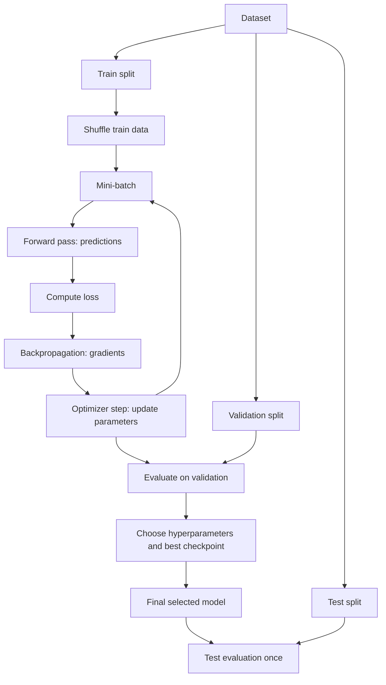

# Neural Network Training Basics

Source: `DL_exam.pdf`, Question 03

Original question:

> Обучение нейронной сети. Функция потерь, эмпирический риск, mini-batch training, train/validation/test split.

## Интуиция

Обучение нейронной сети - это подбор параметров $\theta$ так, чтобы модель $f_\theta(x)$ хорошо решала задачу не только на уже виденных примерах, но и на новых данных из той же задачи. Так как истинное качество на всей неизвестной генеральной совокупности напрямую недоступно, его заменяют средним значением функции потерь на обучающей выборке - эмпирическим риском.

Функция потерь превращает ошибку модели на одном объекте в число: чем хуже предсказание, тем больше loss. Оптимизатор меняет веса сети, чтобы уменьшить средний loss. На практике градиент считают не по всей train-выборке, а по небольшим mini-batch, потому что это быстрее, дешевле по памяти и добавляет полезный стохастический шум.

Разделение на `train/validation/test` нужно, чтобы не спутать обучение, настройку и честную оценку. `train` используется для обновления весов, `validation` - для выбора гиперпараметров и early stopping, `test` - для финальной оценки один раз после выбора модели.

## Что нужно сказать на экзамене

- Дана обучающая выборка $D = \{(x_i, y_i)\}_{i=1}^n$, модель $f_\theta$ и функция потерь $\ell(f_\theta(x), y)$.
- Истинная цель - минимизировать ожидаемый риск:

$$
R(\theta) = \mathbb{E}_{(x,y) \sim p_{\text{data}}}[\ell(f_\theta(x), y)].
$$

- Так как $p_{\text{data}}$ неизвестно, минимизируют эмпирический риск:

$$
\hat R_D(\theta) = \frac{1}{n}\sum_{i=1}^{n}\ell(f_\theta(x_i), y_i).
$$

- Обучение обычно делается градиентными методами: forward pass, вычисление loss, `backpropagation`, шаг оптимизатора.
- В `mini-batch training` на шаге берут подмножество $B \subset D$ размера $m$:

$$
\hat R_B(\theta) = \frac{1}{m}\sum_{i \in B}\ell(f_\theta(x_i), y_i),
\qquad
g_B = \nabla_\theta \hat R_B(\theta).
$$

- При равномерном случайном сэмплировании mini-batch градиент $g_B$ является стохастической оценкой полного градиента.
- `train/validation/test split`: `train` обновляет параметры, `validation` выбирает модель и гиперпараметры, `test` оценивает итоговую обобщающую способность.
- Важно упомянуть переобучение, data leakage, отличие параметров от гиперпараметров, batch size, epoch и iteration.

## Подробный ответ

Пусть есть supervised learning задача: вход $x$, целевая переменная $y$, модель $f_\theta(x)$ с параметрами $\theta$. Параметры - это обучаемые веса и bias слоев. Гиперпараметры - это настройки процесса обучения и архитектуры: learning rate, batch size, число эпох, регуляризация, размер сети, тип оптимизатора.

Функция потерь $\ell(\hat y, y)$ задает локальный критерий ошибки для одного объекта. Она должна быть согласована с задачей и выходом модели:

| Задача | Типичный выход | Типичная loss |
|---|---|---|
| Регрессия | число или вектор | MSE, MAE, Huber loss |
| Binary classification | вероятность класса 1 | binary cross-entropy |
| Multiclass classification | logits или вероятности классов | cross-entropy |

Для классификации часто используют logits $z = f_\theta(x)$, затем `softmax`:

$$
p_k = \frac{\exp(z_k)}{\sum_{j=1}^{K}\exp(z_j)}.
$$

Если правильный класс равен $y$, то multiclass cross-entropy:

$$
\ell(z, y) = -\log p_y.
$$

Loss на одном объекте еще не равен цели обучения на распределении. В идеале нужно минимизировать ожидаемый риск $R(\theta)$ - среднюю ошибку на новых примерах из настоящего распределения данных. Но распределение неизвестно, поэтому используют train-выборку и минимизируют эмпирический риск $\hat R_D(\theta)$.

Принцип `empirical risk minimization`:

$$
\theta^* = \arg\min_\theta \hat R_D(\theta).
$$

В deep learning функция $\hat R_D(\theta)$ обычно невыпуклая, поэтому на практике не гарантируют нахождение глобального минимума. Вместо этого ищут достаточно хорошее решение градиентными методами. Базовый шаг для полного batch gradient descent:

$$
\theta_{t+1} = \theta_t - \eta \nabla_\theta \hat R_D(\theta_t),
$$

где $\eta$ - learning rate.

Полный градиент по всей обучающей выборке дорогой для больших данных, поэтому используют `mini-batch training`. На каждой итерации берут batch $B_t$ размера $m$ и делают шаг:

$$
\theta_{t+1} = \theta_t - \eta \nabla_\theta \hat R_{B_t}(\theta_t).
$$

Если объекты в batch выбираются случайно и равномерно, то:

$$
\mathbb{E}_{B_t}[g_{B_t}] = \nabla_\theta \hat R_D(\theta_t).
$$

То есть mini-batch gradient является шумной, но в среднем корректной оценкой полного градиента по train-выборке. Шум может помогать выходить из плохих областей ландшафта loss, но слишком маленький batch делает обучение нестабильным. Слишком большой batch лучше использует параллелизм GPU, но требует больше памяти и может хуже обобщаться без настройки learning rate.

Один `iteration` - один шаг оптимизатора по одному mini-batch. Одна `epoch` - проход по всей train-выборке, обычно после перемешивания (`shuffle`). Например, если $n=10000$, batch size $m=100$, то в одной эпохе примерно 100 итераций.

Типичный training loop:

1. Инициализировать параметры $\theta$.
2. Разделить данные на `train`, `validation`, `test`.
3. Для каждой эпохи перемешать train-данные.
4. Для каждого mini-batch выполнить forward pass.
5. Посчитать loss на batch.
6. Выполнить `backpropagation` и получить градиенты.
7. Сделать шаг оптимизатора.
8. Периодически считать validation loss/metric без обновления весов.
9. Выбрать лучшую модель по validation, настроить гиперпараметры.
10. Один раз оценить выбранную модель на test.

Разделение данных:

| Split | Для чего используется | Что нельзя делать |
|---|---|---|
| `train` | обучение параметров $\theta$ | оценивать по нему финальное качество как честное |
| `validation` | выбор гиперпараметров, early stopping, model selection | обучать по нему веса как по обычному train без специального решения |
| `test` | финальная оценка выбранной модели | многократно подбирать по нему архитектуру или гиперпараметры |

Главная опасность - `data leakage`: информация из validation или test попадает в обучение. Например, если нормализацию fit-ят на всей выборке до split, если один и тот же пользователь или почти одинаковые объекты попадают в train и test, если test используют для выбора learning rate. В таких случаях test score становится завышенным и уже не оценивает обобщение честно.

Validation нужен потому, что train loss может уменьшаться даже при ухудшении качества на новых данных. Это называется overfitting. При early stopping сохраняют модель с лучшим validation quality и прекращают обучение, если validation metric долго не улучшается.

Важно различать loss и metric. Loss обычно дифференцируемая и используется для оптимизации. Metric может быть недифференцируемой или неудобной для прямого обучения, например accuracy, F1, mAP. На экзамене можно сказать: оптимизируем loss, но выбираем модель и отчитываем качество часто по task-specific metric.

## Формулы / алгоритмы

Обозначения:

- $D_{\text{train}} = \{(x_i,y_i)\}_{i=1}^{n}$ - обучающая выборка.
- $f_\theta(x)$ - нейронная сеть.
- $\ell(f_\theta(x_i), y_i)$ - loss на одном объекте.
- $B_t$ - mini-batch на итерации $t$.
- $\eta$ - learning rate.

Ожидаемый риск:

$$
R(\theta) = \mathbb{E}_{(x,y) \sim p_{\text{data}}}[\ell(f_\theta(x), y)].
$$

Эмпирический риск:

$$
\hat R_{\text{train}}(\theta) =
\frac{1}{|D_{\text{train}}|}
\sum_{(x_i,y_i)\in D_{\text{train}}}
\ell(f_\theta(x_i), y_i).
$$

Mini-batch loss:

$$
\hat R_{B_t}(\theta) =
\frac{1}{|B_t|}
\sum_{(x_i,y_i)\in B_t}
\ell(f_\theta(x_i), y_i).
$$

SGD update:

$$
g_t = \nabla_\theta \hat R_{B_t}(\theta_t),
\qquad
\theta_{t+1} = \theta_t - \eta g_t.
$$

Практический алгоритм:

```text
Input: train set, validation set, model f_theta, loss ell, optimizer, epochs E
Output: selected model parameters theta_best

initialize theta
theta_best = theta
best_val = +infinity

for epoch = 1..E:
    shuffle train set
    split train set into mini-batches

    for batch B:
        y_hat = f_theta(x_B)
        loss = mean ell(y_hat, y_B)
        compute gradients with backpropagation
        optimizer step
        clear gradients

    compute validation loss or metric without gradient updates
    if validation quality improved:
        theta_best = theta
        best_val = current validation score

evaluate theta_best once on test set
```

Практические замечания:

- Batch size влияет на память, скорость, шум градиента и стабильность обучения.
- Learning rate слишком большой может вызвать расходимость, слишком маленький - медленное обучение.
- Validation loss используется для early stopping и выбора гиперпараметров.
- Test set не должен участвовать в цикле принятия решений.
- Для несбалансированных данных split лучше делать стратифицированным; для временных рядов нельзя случайно перемешивать будущее с прошлым.

## Диаграмма или изображение



## Быстрая устная версия

Обучение нейронной сети - это минимизация функции потерь по параметрам модели. В идеале мы хотим минимизировать ожидаемый риск на неизвестном распределении данных, но доступна только конечная выборка, поэтому минимизируем эмпирический риск - средний loss на train. На практике градиент считают по mini-batch: это стохастическая оценка полного градиента, которая дешевле по памяти и вычислениям. Training loop состоит из forward pass, loss, backpropagation и optimizer step. Данные делят на train, validation и test: train обучает веса, validation выбирает гиперпараметры и момент остановки, test используется один раз для честной финальной оценки. Главное не допустить data leakage и не подбирать модель по test.

## Возможные уточняющие вопросы

- Чем функция потерь отличается от метрики? Loss обычно дифференцируемая и используется для обучения; metric отражает качество задачи и может быть недифференцируемой, например accuracy или F1.
- Почему нельзя оценивать финальное качество на train? Потому что модель оптимизировалась именно под train и может переобучиться; train score обычно завышает качество на новых данных.
- Зачем нужен validation, если есть test? Validation нужен для выбора гиперпараметров и checkpoints; test должен оставаться независимым для финальной оценки.
- Что такое epoch и iteration? Iteration - один шаг оптимизатора по mini-batch; epoch - один проход по всей train-выборке.
- Почему mini-batch gradient называют стохастическим? Потому что batch выбирается случайно, и градиент зависит от случайного подмножества данных.
- Что будет при слишком большом learning rate? Loss может колебаться или расходиться, потому что шаги перескакивают хорошие области параметров.
- Что будет при слишком маленьком batch size? Оценка градиента будет шумной, обучение может стать нестабильным, хотя память и вычисления на шаг меньше.
- Что такое data leakage? Это попадание информации из validation/test в обучение или настройку модели, из-за чего оценка качества становится нечестной.
- Когда нужен stratified split? При классификации с несбалансированными классами, чтобы доли классов в train, validation и test были похожи.
- Можно ли после выбора гиперпараметров дообучить модель на train и validation вместе? Можно, если это явно часть протокола, но финальная оценка все равно должна быть только на untouched test set.

## Частые ошибки

- Называть loss и metric одним и тем же: они могут совпадать, но часто имеют разные роли.
- Говорить, что эмпирический риск равен истинному риску; он только оценивает его по конечной выборке.
- Забывать, что mini-batch loss считается как среднее по batch, а не по всей выборке.
- Подбирать гиперпараметры по test set и затем считать test score честным.
- Делать preprocessing по всей выборке до split, создавая data leakage.
- Сравнивать модели только по train loss и не смотреть validation.
- Путать параметры модели и гиперпараметры обучения.
- Не учитывать зависимость данных: например, случайно делить временные ряды или почти дубликаты одного объекта между train и test.
- Считать, что уменьшение train loss всегда означает улучшение generalization.
- Забывать выключать gradient updates при validation/test evaluation.
