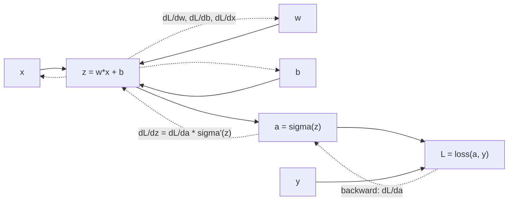

# Backpropagation and Autodiff

Source: `DL_exam.pdf`, Question 04

Original question:

> Backpropagation и автоматическое дифференцирование. Вычислительный граф, правило цепочки, forward-mode и reverse-mode autodiff.

## Интуиция

Нейросеть - это большая композиция простых дифференцируемых операций: матричных умножений, сложений, активаций, нормализаций, функций потерь. Чтобы обучать сеть, нужно эффективно найти градиенты функции потерь по миллионам параметров. Ручное дифференцирование всей композиции неудобно и легко приводит к ошибкам, а численное дифференцирование слишком дорого и неточно.

`Backpropagation` решает эту задачу как систематическое применение правила цепочки по вычислительному графу в обратном порядке. Сначала делается `forward pass`: считаются промежуточные значения и loss. Затем `backward pass`: от loss назад распространяются производные, и для каждого параметра накапливается вклад в градиент. `Autodiff` - общий механизм, который строит или использует вычислительный граф и автоматически применяет эти локальные правила дифференцирования.

Главная идея для устного ответа: backpropagation - это не отдельная магическая формула для нейросетей, а частный случай `reverse-mode automatic differentiation`, особенно эффективный, когда выход скалярный loss, а входов-параметров очень много.

## Что нужно сказать на экзамене

- Нейросеть и loss представляются как вычислительный граф: узлы - операции или промежуточные тензоры, ребра - зависимости.
- `Forward pass` вычисляет значения узлов в топологическом порядке и сохраняет нужные промежуточные результаты.
- `Backward pass` применяет правило цепочки в обратном топологическом порядке.
- Для скалярного loss $L$ у каждого узла $v$ можно хранить adjoint/градиент $\bar{v} = \frac{\partial L}{\partial v}$.
- Если $y = f(x_1, \dots, x_k)$, то вклад в каждый вход:
  $$\bar{x_i} \mathrel{+}= \bar{y} \frac{\partial y}{\partial x_i}.$$
- Для многомерных величин используются Jacobian-vector products (`JVP`) и vector-Jacobian products (`VJP`), а не явное построение больших якобианов.
- `Forward-mode autodiff` распространяет производные вперед и эффективно считает $Jv$; полезен, когда входов мало, а выходов много.
- `Reverse-mode autodiff` распространяет производные назад и эффективно считает $v^T J$; полезен для обучения нейросетей, где loss обычно скалярный.
- `Backpropagation` дает точные производные машинной точности для реализованных операций, но требует памяти под промежуточные активации.
- Нужно отличать automatic differentiation от symbolic differentiation и finite differences.

## Подробный ответ

Пусть модель задает функцию $f_\theta(x)$, функция потерь на одном примере или mini-batch равна:

$$
L(\theta) = \ell(f_\theta(x), y).
$$

Обучение градиентными методами требует $\nabla_\theta L$. Так как $f_\theta$ обычно является глубокой композицией функций, например:

$$
h_0 = x,\quad h_i = \phi_i(h_{i-1}; \theta_i),\quad L = \ell(h_n, y),
$$

градиент удобно считать по правилу цепочки:

$$
\frac{\partial L}{\partial \theta_i}
= \frac{\partial L}{\partial h_i}
  \frac{\partial h_i}{\partial \theta_i}.
$$

Вычислительный граф - это ориентированный ациклический граф для одного вычисления. В простом случае узлы соответствуют значениям, а операции задают переходы. Например:

$$
z = wx + b,\quad a = \sigma(z),\quad L = (a-y)^2.
$$

Для него forward pass считает $z$, $a$, $L$, а backward pass считает:

$$
\frac{\partial L}{\partial a} = 2(a-y),
$$

$$
\frac{\partial L}{\partial z}
= \frac{\partial L}{\partial a}\sigma'(z),
$$

$$
\frac{\partial L}{\partial w}
= \frac{\partial L}{\partial z}x,\quad
\frac{\partial L}{\partial b}
= \frac{\partial L}{\partial z},\quad
\frac{\partial L}{\partial x}
= \frac{\partial L}{\partial z}w.
$$

В общем случае для узла $v$ удобно обозначать $\bar{v} = \frac{\partial L}{\partial v}$. Если один узел влияет на loss через несколько последующих ветвей, вклады суммируются:

$$
\bar{v}
= \sum_{u \in \mathrm{children}(v)}
\bar{u}\frac{\partial u}{\partial v}.
$$

Именно поэтому в реализациях градиенты часто "аккумулируются": один параметр может использоваться в нескольких местах графа, и общий градиент равен сумме вкладов.

`Automatic differentiation` использует заранее известные локальные правила для элементарных операций: сложение, умножение, матричное умножение, `exp`, `log`, `ReLU`, `softmax`, `cross-entropy` и т.д. В отличие от символьного дифференцирования, autodiff не строит большую аналитическую формулу. В отличие от finite differences, он не приближает производную через малые возмущения, а вычисляет производную композиции с точностью, ограниченной численной арифметикой.

Сравнение подходов:

| Подход | Идея | Плюсы | Минусы |
|---|---|---|---|
| Symbolic differentiation | Алгебраически выводит формулу производной | Может дать закрытую форму | Формулы разрастаются, плохо подходит для больших программ |
| Finite differences | Приближает $\frac{f(x+\epsilon)-f(x)}{\epsilon}$ | Просто проверить отдельный градиент | Дорого, чувствительно к $\epsilon$, неточно |
| Automatic differentiation | Применяет chain rule к программе вычисления | Точно и эффективно для DL | Требует правил для операций и памяти под граф/активации |

### Forward-mode autodiff

В forward-mode вместе со значением каждого узла распространяется его производная по выбранному направлению входа. Если функция $f: \mathbb{R}^n \to \mathbb{R}^m$, forward-mode эффективно считает `Jacobian-vector product`:

$$
J_f(x)v,
$$

где $J_f(x) \in \mathbb{R}^{m \times n}$, а $v \in \mathbb{R}^n$ - выбранное направление в пространстве входов.

Для композиции $y = f(g(x))$ forward-mode идет в том же направлении, что и вычисление:

$$
\dot{g} = J_g(x)\dot{x},\quad
\dot{y} = J_f(g(x))\dot{g}.
$$

Здесь точка означает directional derivative. Чтобы получить весь якобиан по $n$ входным координатам, нужно обычно запустить forward-mode $n$ раз с базисными направлениями. Поэтому forward-mode хорош, когда входов мало или нужен градиент по небольшому числу направлений.

### Reverse-mode autodiff и backpropagation

В reverse-mode сначала выполняется обычный forward pass, затем производные распространяются назад от выходов к входам. Он эффективно считает `vector-Jacobian product`:

$$
v^T J_f(x).
$$

Если $f: \mathbb{R}^n \to \mathbb{R}$ - скалярная функция потерь, то $J_f(x)$ фактически является строкой, и одного обратного прохода достаточно, чтобы получить все частные производные по $n$ входам:

$$
\nabla_x L =
\left(
\frac{\partial L}{\partial x_1},
\dots,
\frac{\partial L}{\partial x_n}
\right).
$$

Именно поэтому reverse-mode является основой обучения глубоких нейросетей: параметров много, а оптимизируемый loss обычно один скаляр. `Backpropagation` - это reverse-mode autodiff, примененный к вычислительному графу нейросети с учетом структуры слоев и параметров.

Сравнение режимов:

| Режим | Что эффективно считает | Когда выгоден | Типичный пример |
|---|---|---|---|
| Forward-mode | $Jv$ | Мало входов, много выходов; directional derivatives | Производная по одному гиперпараметру или координате |
| Reverse-mode | $v^T J$ | Много входов, мало выходов | Градиент scalar loss по всем весам сети |

Практический нюанс: reverse-mode требует хранить промежуточные значения forward pass, потому что локальные производные часто зависят от них. Например, для $a = \sigma(z)$ нужно знать $z$ или $a$, чтобы вычислить $\sigma'(z)$. Это создает trade-off: вычисления эффективны, но расход памяти может быть большим. Для экономии памяти применяют checkpointing: часть активаций не хранится, а пересчитывается во время backward pass.

В современных фреймворках вроде PyTorch граф часто динамический: операции над тензорами с `requires_grad=True` создают граф во время forward pass, а вызов `loss.backward()` запускает reverse-mode autodiff и заполняет поля градиентов параметров. Важно, что backpropagation считает градиенты только для дифференцируемых операций; разрывы, дискретные выборы, `argmax`, индексация или detach-операции могут обрывать или менять путь градиента.

## Формулы / алгоритмы

Общее правило цепочки для композиции:

$$
y = f(g(x)),\quad
\frac{dy}{dx}
= \frac{df}{dg}\frac{dg}{dx}.
$$

Для векторных функций:

$$
f: \mathbb{R}^n \to \mathbb{R}^m,\quad
J_f(x) =
\left[
\frac{\partial f_i}{\partial x_j}
\right]_{i,j}.
$$

Forward-mode распространяет касательные переменные:

$$
\dot{y} = J_f(x)\dot{x}.
$$

Reverse-mode распространяет adjoint-переменные:

$$
\bar{x} = \bar{y}J_f(x)
$$

или, в принятой для градиентов форме столбцов:

$$
\bar{x} = J_f(x)^T\bar{y}.
$$

Алгоритм reverse-mode autodiff для скалярного loss:

1. Вход: вычислительный граф, входы $x$, параметры $\theta$, скалярный loss $L$.
2. Выполнить forward pass в топологическом порядке и сохранить значения, нужные для локальных производных.
3. Инициализировать $\bar{L} = 1$, для остальных узлов $\bar{v} = 0$.
4. Обойти узлы в обратном топологическом порядке.
5. Для каждой операции $y = f(x_1, \dots, x_k)$ добавить вклады:
   $$\bar{x_i} \mathrel{+}= J_{f,x_i}^T \bar{y}.$$
6. На выходе получить $\frac{\partial L}{\partial \theta}$ для всех параметров и, если нужно, $\frac{\partial L}{\partial x}$.
7. Передать градиенты оптимизатору, например:
   $$\theta \leftarrow \theta - \eta \nabla_\theta L.$$

Сложность: для большинства нейросетевых графов один backward pass имеет вычислительную стоимость того же порядка, что и forward pass, часто в несколько раз больше из-за дополнительных операций. Память в reverse-mode обычно пропорциональна числу сохраненных промежуточных активаций.

## Диаграмма или изображение

Диаграмма показывает одну и ту же программу вычисления в двух направлениях: сплошные стрелки - forward pass, пунктирные - backward pass с применением локальных производных и правила цепочки.

## Быстрая устная версия

Backpropagation - это эффективное вычисление градиентов в нейросети через правило цепочки по вычислительному графу. На forward pass мы считаем значения всех операций и loss, на backward pass идем от loss назад и для каждого узла накапливаем $\frac{\partial L}{\partial v}$. Если операция $y=f(x)$, то градиент входа получается как локальная производная, умноженная на пришедший сверху градиент: $\bar{x}=J_f^T\bar{y}$. Это и есть reverse-mode autodiff.

Forward-mode autodiff распространяет производные вперед и эффективно считает $Jv$, поэтому удобен при малом числе входов. Reverse-mode считает $v^TJ$ и для скалярного loss за один обратный проход дает градиенты по всем параметрам, поэтому он используется в обучении deep learning моделей. Цена reverse-mode - необходимость хранить промежуточные активации и аккуратно обращаться с недифференцируемыми операциями.

## Возможные уточняющие вопросы

- Чем backpropagation отличается от autodiff? Backpropagation - конкретное применение reverse-mode autodiff к нейросетям; autodiff - более общий механизм дифференцирования программ.
- Почему reverse-mode лучше для обучения нейросетей? Потому что входов-параметров очень много, а выход обычно один scalar loss; один backward pass дает весь $\nabla_\theta L$.
- Что такое вычислительный граф? Это DAG зависимостей между операциями и промежуточными значениями, по которому можно выполнить forward и backward проходы.
- Почему градиенты в узле суммируются? Если узел влияет на loss по нескольким путям, полная производная равна сумме вкладов по всем путям по правилу цепочки.
- Что такое JVP и VJP? JVP - произведение якобиана на вектор $Jv$, характерное для forward-mode; VJP - произведение вектора на якобиан $v^TJ$, характерное для reverse-mode.
- Нужно ли явно строить матрицу Якоби в backpropagation? Обычно нет; фреймворк применяет локальные JVP/VJP-правила, что дешевле по памяти и вычислениям.
- Почему нужен `zero_grad()` в PyTorch? Потому что градиенты параметров аккумулируются; перед новым шагом оптимизации их обычно нужно обнулить.
- Что происходит с `argmax` в графе? `argmax` недифференцируем почти везде и обычно обрывает путь градиента, поэтому в обучении часто используют дифференцируемые суррогаты.
- Зачем хранить активации? Локальные производные многих операций зависят от значений forward pass; без хранения их пришлось бы пересчитывать.

## Частые ошибки

- Говорить, что backpropagation - это оптимизатор. Это не оптимизатор, а способ вычислить градиенты; оптимизатором является, например, SGD или Adam.
- Путать autodiff с численным дифференцированием. Autodiff применяет chain rule к операциям программы, а не подбирает малое $\epsilon$.
- Считать, что forward-mode и reverse-mode отличаются только направлением обхода. Главное отличие - что они эффективно вычисляют: $Jv$ или $v^TJ$.
- Забывать, что reverse-mode для scalar loss дает градиенты по всем параметрам за один backward pass.
- Не учитывать суммирование градиентов, когда переменная используется в нескольких ветвях графа.
- Ошибаться в порядке умножения якобианов для векторных функций: в backward обычно используется транспонированный локальный якобиан, умноженный на входящий градиент.
- Думать, что все операции в программе дифференцируемы. Дискретные операции, detach, in-place изменения и недифференцируемые функции могут нарушить граф или путь градиента.
- Игнорировать память: reverse-mode эффективен по вычислениям, но требует хранения активаций или их пересчета.
