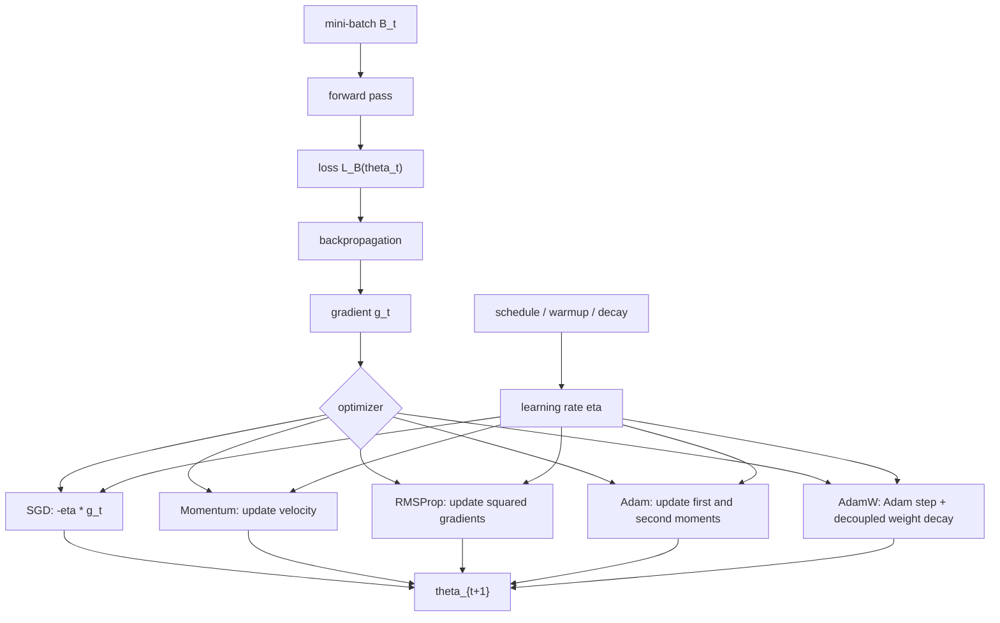

# Optimization Algorithms in DL

Source: `DL_exam.pdf`, Question 05

Original question:

> Оптимизация в DL. Gradient descent, SGD, Momentum, Nesterov, RMSProp, Adam/AdamW, роль learning rate.

## Интуиция

Обучение нейросети - это минимизация функции потерь по параметрам модели. После `backpropagation` мы знаем направление локального роста loss: градиент $\nabla_\theta L$. Оптимизатор решает, как превратить этот градиент в шаг обновления параметров.

Самый простой ответ: `gradient descent` идет против градиента. Но в deep learning loss обычно считается на огромном датасете, поверхность ошибки невыпуклая, плохо обусловленная и шумная, а параметры имеют разные масштабы. Поэтому на практике используют mini-batch `SGD`, momentum, адаптивные методы вроде `RMSProp` и `Adam`, а также аккуратно выбирают `learning rate`.

Главная идея для устного ответа: оптимизатор не "заменяет" градиент, а фильтрует и масштабирует его. `Momentum` накапливает направление движения, `RMSProp` нормирует шаг по истории квадратов градиента, `Adam` объединяет оба механизма, а `AdamW` корректнее реализует weight decay. `Learning rate` задает размер шага и часто важнее выбора конкретного оптимизатора.

## Что нужно сказать на экзамене

- Цель оптимизации в DL:
  $$\min_\theta J(\theta) = \frac{1}{N}\sum_{i=1}^N \ell(f_\theta(x_i), y_i) + \Omega(\theta).$$
- `Gradient descent` использует полный градиент по всему датасету:
  $$\theta_{t+1} = \theta_t - \eta \nabla_\theta J(\theta_t).$$
- `SGD` и mini-batch SGD используют несмещенную или приближенно несмещенную оценку градиента по batch:
  $$g_t = \frac{1}{|B_t|}\sum_{i \in B_t}\nabla_\theta \ell_i(\theta_t).$$
- `Learning rate` $\eta$ - главный гиперпараметр размера шага: слишком большой дает расходимость или скачки, слишком маленький - медленное обучение и застревание.
- `Momentum` сглаживает шумные градиенты и ускоряет движение вдоль устойчивых направлений:
  $$v_t = \mu v_{t-1} + g_t,\quad \theta_{t+1} = \theta_t - \eta v_t.$$
- `Nesterov momentum` смотрит на градиент в "предсказанной" точке, что дает более упреждающее торможение:
  $$g_t = \nabla J(\theta_t - \eta\mu v_{t-1}),\quad v_t = \mu v_{t-1} + g_t.$$
- `RMSProp` делит градиент на скользящее среднее его квадратов, уменьшая шаги по координатам с большими градиентами:
  $$s_t = \rho s_{t-1} + (1-\rho)g_t^2,\quad \theta_{t+1} = \theta_t - \eta \frac{g_t}{\sqrt{s_t}+\epsilon}.$$
- `Adam` объединяет momentum по первому моменту и RMS-нормировку по второму моменту, обычно с bias correction.
- `AdamW` отделяет weight decay от градиентного шага Adam; это стандартный вариант для многих современных моделей.
- Для хорошего обучения важны schedule, warmup, batch size, нормализация, clipping и согласованность optimizer settings с архитектурой.

## Подробный ответ

Пусть есть обучающая выборка $D = \{(x_i, y_i)\}_{i=1}^N$, модель $f_\theta$ и loss на примере $\ell(f_\theta(x_i), y_i)$. Эмпирический риск:

$$
J(\theta) = \frac{1}{N}\sum_{i=1}^N \ell(f_\theta(x_i), y_i).
$$

Если используется регуляризация, к цели добавляется $\Omega(\theta)$, например L2:

$$
J_{\text{reg}}(\theta) = J(\theta) + \frac{\lambda}{2}\|\theta\|_2^2.
$$

В DL почти всегда используется итеративная оптимизация первого порядка: на шаге $t$ считаем градиент $g_t$ и обновляем параметры $\theta_t$. Методы первого порядка не используют полный Hessian, потому что число параметров большое, а вычисление и хранение матрицы вторых производных непрактично.

### Gradient descent

`Gradient descent` берет полный градиент по всей выборке:

$$
g_t = \nabla_\theta J(\theta_t),
$$

$$
\theta_{t+1} = \theta_t - \eta g_t.
$$

Знак минус важен: градиент указывает направление наибольшего локального роста функции, а при минимизации нужно идти в противоположную сторону. Для гладкой функции при достаточно малом $\eta$ значение loss локально уменьшается, потому что:

$$
J(\theta - \eta \nabla J(\theta))
\approx J(\theta) - \eta \|\nabla J(\theta)\|^2.
$$

Недостаток полного gradient descent в DL: один шаг требует прохода по всему датасету. Это дорого, плохо использует стохастический шум как регуляризующий эффект и медленно обновляет параметры на больших данных.

### SGD и mini-batch SGD

В `SGD` градиент оценивается по одному примеру или mini-batch:

$$
g_t = \frac{1}{m}\sum_{i \in B_t}\nabla_\theta \ell(f_{\theta_t}(x_i), y_i),
$$

где $B_t$ - mini-batch размера $m$. Если batch выбирается случайно, то:

$$
\mathbb{E}[g_t] = \nabla_\theta J(\theta_t)
$$

при равномерной выборке и без дополнительных искажений. Поэтому SGD делает шумный, но в среднем правильный шаг:

$$
\theta_{t+1} = \theta_t - \eta g_t.
$$

Плюсы mini-batch SGD: дешевле один шаг, можно эффективно использовать GPU, шум помогает не слишком точно подстраиваться под один batch и иногда помогает выходить из плохих областей. Минусы: градиенты шумные, loss на batch может колебаться, нужен careful tuning `learning rate`, batch size и schedule.

В невыпуклой оптимизации, типичной для deep learning, не гарантируется нахождение глобального минимума. Практическая цель - найти параметры с хорошей обобщающей способностью, а не строго решить выпуклую задачу.

### Momentum

Обычный SGD может медленно идти по узким "оврагам" loss landscape: в одном направлении кривизна большая, в другом маленькая. Из-за этого шаги могут зигзагообразно колебаться.

`Momentum` вводит скорость $v_t$, которая накапливает историю градиентов:

$$
v_t = \mu v_{t-1} + g_t,
$$

$$
\theta_{t+1} = \theta_t - \eta v_t,
$$

где $\mu \in [0, 1)$ - коэффициент momentum, часто около $0.9$. Если градиенты долго указывают в похожем направлении, скорость растет и обучение ускоряется. Если градиенты меняют знак, накопление частично гасит колебания.

Существует эквивалентная распространенная запись через экспоненциальное среднее:

$$
m_t = \beta m_{t-1} + (1-\beta)g_t,
$$

$$
\theta_{t+1} = \theta_t - \eta m_t.
$$

Отличие в масштабе можно компенсировать настройкой $\eta$. На экзамене важно не перепутать смысл: momentum использует первый момент, то есть среднее направление градиента.

### Nesterov accelerated gradient

`Nesterov momentum` делает градиентный шаг более упреждающим. Идея: сначала посмотреть, куда нас уже несет momentum, и считать градиент не в текущей точке, а в lookahead-точке:

$$
\tilde{\theta}_t = \theta_t - \eta\mu v_{t-1},
$$

$$
g_t = \nabla_\theta J(\tilde{\theta}_t),
$$

$$
v_t = \mu v_{t-1} + g_t,
$$

$$
\theta_{t+1} = \theta_t - \eta v_t.
$$

Интуитивно Nesterov раньше замечает, что впереди склон меняется, и может начать тормозить до того, как обычный momentum перелетит через хорошую область. В глубоких сетях отличие от обычного momentum не всегда драматическое, но это важный классический метод.

### RMSProp

Проблема одного общего learning rate: разные параметры могут иметь разные масштабы градиентов. Для одной координаты шаг может быть слишком большим, для другой - слишком маленьким.

`RMSProp` хранит экспоненциальное скользящее среднее квадратов градиента:

$$
s_t = \rho s_{t-1} + (1-\rho)g_t^2,
$$

где квадрат берется покоординатно. Затем градиент нормируется:

$$
\theta_{t+1} = \theta_t - \eta \frac{g_t}{\sqrt{s_t}+\epsilon}.
$$

Если по координате градиенты часто большие, $s_t$ растет и эффективный шаг уменьшается. Если градиенты маленькие, шаг относительно увеличивается. $\epsilon$ нужен для численной стабильности и чтобы не делить на ноль.

RMSProp полезен при шумных, нестационарных и плохо масштабированных градиентах. Но он тоже требует выбора базового $\eta$, decay-параметра $\rho$ и аккуратной интерпретации: адаптивность не отменяет tuning.

### Adam

`Adam` означает adaptive moment estimation. Он объединяет:

- momentum по первому моменту градиента;
- RMSProp-подобную нормировку по второму моменту.

Формулы Adam:

$$
g_t = \nabla_\theta J(\theta_t),
$$

$$
m_t = \beta_1 m_{t-1} + (1-\beta_1)g_t,
$$

$$
v_t = \beta_2 v_{t-1} + (1-\beta_2)g_t^2.
$$

Так как $m_0 = 0$ и $v_0 = 0$, в начале оценки смещены к нулю. Поэтому используется bias correction:

$$
\hat{m}_t = \frac{m_t}{1-\beta_1^t},
$$

$$
\hat{v}_t = \frac{v_t}{1-\beta_2^t}.
$$

Обновление:

$$
\theta_{t+1} = \theta_t - \eta \frac{\hat{m}_t}{\sqrt{\hat{v}_t}+\epsilon}.
$$

Типичные значения: $\beta_1 = 0.9$, $\beta_2 = 0.999$, $\epsilon = 10^{-8}$, но их нельзя считать универсальными. Adam часто быстро начинает снижать training loss и хорошо работает "из коробки", особенно в задачах NLP, Transformers и sparse/noisy gradients. Возможный минус: адаптивные методы не всегда дают лучшую generalization по сравнению с хорошо настроенным SGD with momentum, особенно в некоторых vision-задачах.

### AdamW и weight decay

В SGD L2-регуляризация и weight decay часто выглядят почти одинаково. Если добавить к loss член $\frac{\lambda}{2}\|\theta\|^2$, то в градиент добавится $\lambda\theta$:

$$
g_t^{\text{reg}} = g_t + \lambda\theta_t.
$$

Для SGD обновление:

$$
\theta_{t+1} = \theta_t - \eta(g_t + \lambda\theta_t)
= (1-\eta\lambda)\theta_t - \eta g_t.
$$

То есть параметры явно "усыхают". Но в Adam добавление $\lambda\theta$ внутрь градиента проходит через адаптивную нормировку $\sqrt{\hat{v}_t}$, поэтому регуляризация по координатам искажается.

`AdamW` использует decoupled weight decay: сначала делается Adam-шаг по градиенту loss, а weight decay применяется отдельно:

$$
\theta_{t+1}
= \theta_t
- \eta \frac{\hat{m}_t}{\sqrt{\hat{v}_t}+\epsilon}
- \eta\lambda\theta_t.
$$

Эквивалентно:

$$
\theta_{t+1}
= (1-\eta\lambda)\theta_t
- \eta \frac{\hat{m}_t}{\sqrt{\hat{v}_t}+\epsilon}.
$$

Практически это делает смысл weight decay более стабильным и отделяет его от адаптивного масштабирования градиентов. На экзамене важно сказать: AdamW - это не "просто Adam с L2", а Adam с decoupled weight decay.

### Роль learning rate

`Learning rate` $\eta$ определяет масштаб шага в пространстве параметров. Даже идеальный градиент бесполезен, если шаг выбран плохо.

Если $\eta$ слишком большой:

- loss может расти или становиться `NaN`;
- обучение скачет вокруг минимума;
- модель может не сходиться;
- особенно опасно в начале обучения, когда веса и активации еще не стабилизированы.

Если $\eta$ слишком маленький:

- обучение идет медленно;
- модель может застрять на плато;
- вычислительный бюджет тратится неэффективно;
- итоговое качество может быть хуже из-за недообучения.

Для квадратичной функции:

$$
J(\theta)=\frac{1}{2}a\theta^2,\quad \nabla J(\theta)=a\theta,
$$

gradient descent дает:

$$
\theta_{t+1} = (1-\eta a)\theta_t.
$$

Сходимость в одномерном случае требует:

$$
|1-\eta a| < 1 \quad \Rightarrow \quad 0 < \eta < \frac{2}{a}.
$$

Это показывает связь learning rate с кривизной: чем больше кривизна, тем меньший шаг нужен. В многомерном квадратичном случае ограничение связано с максимальным собственным значением Hessian:

$$
0 < \eta < \frac{2}{\lambda_{\max}(H)}.
$$

В deep learning Hessian явно не считают, но идея остается: резкие направления требуют меньших шагов, а плоские направления допускают большие.

Практические приемы:

- `learning rate schedule`: уменьшать $\eta$ по ходу обучения, например step decay, exponential decay, cosine decay;
- `warmup`: начинать с малого $\eta$ и постепенно повышать, особенно для Transformers и больших batch;
- `learning rate finder`: пробовать диапазон $\eta$ и смотреть, где loss начинает убывать устойчиво;
- `gradient clipping`: ограничивать норму градиента, чтобы единичный взрывной batch не разрушил параметры;
- согласовывать $\eta$ с batch size: при увеличении batch часто можно увеличить learning rate, но это эвристика, а не закон.

### Сравнение методов

| Метод | Что хранит | Основная идея | Плюсы | Ограничения |
|---|---:|---|---|---|
| Gradient descent | ничего кроме градиента | Полный градиент по датасету | Стабильное направление | Очень дорогой шаг на больших данных |
| SGD | ничего кроме градиента batch | Шумная оценка полного градиента | Дешевые шаги, хорошая масштабируемость | Шум, чувствительность к $\eta$ |
| Momentum | скорость / первый момент | Сгладить и ускорить движение | Меньше зигзагов, быстрее по устойчивым направлениям | Нужно настраивать $\mu$ и $\eta$ |
| Nesterov | скорость | Градиент в lookahead-точке | Более упреждающее торможение | Чуть сложнее, выигрыш зависит от задачи |
| RMSProp | второй момент $g^2$ | Покоординатно нормировать шаг | Хорош для разных масштабов градиентов | Может хуже обобщаться, все еще нужен $\eta$ |
| Adam | первый и второй моменты | Momentum + адаптивный шаг | Быстрый старт, удобен на практике | Чувствителен к weight decay и schedule |
| AdamW | первый и второй моменты | Adam + decoupled weight decay | Более корректная регуляризация | Нужно отдельно выбирать $\eta$ и $\lambda$ |

## Формулы / алгоритмы

Общая постановка:

$$
\min_\theta J(\theta),\quad g_t \approx \nabla_\theta J(\theta_t).
$$

Общий шаблон оптимизации первого порядка:

1. Вход: параметры $\theta_0$, training data, loss $\ell$, optimizer state, learning rate $\eta$.
2. Выбрать mini-batch $B_t$.
3. Выполнить forward pass и получить batch loss.
4. Выполнить backward pass и получить $g_t = \nabla_\theta L_{B_t}(\theta_t)$.
5. Обновить состояние оптимизатора: momentum, moments, squared gradients.
6. Обновить параметры $\theta_{t+1}$.
7. Очистить старые градиенты и перейти к следующему batch.
8. Периодически проверять validation loss/metrics и менять learning rate по schedule.

### Gradient descent

$$
g_t = \nabla J(\theta_t),
$$

$$
\theta_{t+1} = \theta_t - \eta g_t.
$$

### Mini-batch SGD

$$
g_t = \frac{1}{|B_t|}\sum_{i \in B_t}\nabla_\theta \ell_i(\theta_t),
$$

$$
\theta_{t+1} = \theta_t - \eta g_t.
$$

### Momentum

$$
v_t = \mu v_{t-1} + g_t,
$$

$$
\theta_{t+1} = \theta_t - \eta v_t.
$$

### Nesterov

$$
\tilde{\theta}_t = \theta_t - \eta\mu v_{t-1},
$$

$$
g_t = \nabla J(\tilde{\theta}_t),
$$

$$
v_t = \mu v_{t-1} + g_t,
$$

$$
\theta_{t+1} = \theta_t - \eta v_t.
$$

### RMSProp

$$
s_t = \rho s_{t-1} + (1-\rho)g_t^2,
$$

$$
\theta_{t+1} = \theta_t - \eta \frac{g_t}{\sqrt{s_t}+\epsilon}.
$$

### Adam

$$
m_t = \beta_1m_{t-1} + (1-\beta_1)g_t,
$$

$$
v_t = \beta_2v_{t-1} + (1-\beta_2)g_t^2,
$$

$$
\hat{m}_t = \frac{m_t}{1-\beta_1^t},\quad
\hat{v}_t = \frac{v_t}{1-\beta_2^t},
$$

$$
\theta_{t+1}
= \theta_t - \eta\frac{\hat{m}_t}{\sqrt{\hat{v}_t}+\epsilon}.
$$

### AdamW

$$
\theta_{t+1}
= (1-\eta\lambda)\theta_t
- \eta\frac{\hat{m}_t}{\sqrt{\hat{v}_t}+\epsilon}.
$$

Практические caveats:

- Сложность одного шага обычно доминируется forward/backward pass; optimizer update имеет стоимость $O(P)$ по числу параметров $P$.
- SGD хранит минимум состояния, momentum хранит один дополнительный тензор на параметр, Adam/AdamW хранят два дополнительных тензора на параметр.
- Для Adam память optimizer state может быть существенной: примерно два состояния размера параметров плюс сами параметры и градиенты.
- Сходимость в строгом смысле проще формулируется для выпуклых или гладких задач; в DL обычно говорят о практической сходимости training/validation loss.
- `zero_grad()` в PyTorch нужен, потому что градиенты по умолчанию аккумулируются.

## Диаграмма или изображение

Диаграмма показывает общий pipeline обучения: `backpropagation` дает градиент, а оптимизатор выбирает правило преобразования градиента и своего внутреннего состояния в обновление параметров. `Learning rate` входит почти во все методы как масштаб итогового шага.

## Быстрая устная версия

Оптимизация в DL - это минимизация loss по параметрам сети методами первого порядка. После `backpropagation` мы получаем градиент $g_t$. В полном gradient descent это градиент по всему датасету, а в mini-batch SGD - шумная оценка по batch. Базовое обновление: $\theta_{t+1}=\theta_t-\eta g_t$.

`Momentum` добавляет скорость и накапливает предыдущие градиенты, поэтому сглаживает шум и ускоряет движение в устойчивом направлении. `Nesterov` считает градиент в lookahead-точке, куда уже ведет momentum. `RMSProp` хранит скользящее среднее квадратов градиентов и делит на корень из него, то есть делает покоординатный адаптивный learning rate. `Adam` объединяет первый момент как momentum и второй момент как RMSProp, плюс делает bias correction. `AdamW` отличается тем, что weight decay отделен от адаптивного градиентного шага.

Learning rate - ключевой гиперпараметр. Если он слишком большой, loss скачет или расходится; если слишком маленький, обучение слишком медленное. Поэтому используют schedules, warmup, decay, gradient clipping и подбирают $\eta$ вместе с batch size и оптимизатором.

## Возможные уточняющие вопросы

**Почему gradient descent редко используют в чистом виде?**  
Потому что полный градиент по всему датасету дорогой. Mini-batch SGD дает более частые дешевые обновления и хорошо работает на GPU.

**Почему SGD называют стохастическим?**  
Потому что градиент считается по случайному примеру или batch, поэтому update зависит от случайной выборки данных.

**Что делает momentum?**  
Он хранит экспоненциально сглаженную историю направлений градиента, уменьшает зигзаги и ускоряет движение там, где градиенты согласованы.

**Чем Nesterov отличается от обычного momentum?**  
Обычный momentum считает градиент в текущей точке, а Nesterov - в lookahead-точке после предполагаемого движения по momentum.

**Зачем RMSProp делит на $\sqrt{s_t}+\epsilon$?**  
Чтобы уменьшать шаг по координатам с большими историческими квадратами градиента и сохранять численную стабильность.

**Что такое bias correction в Adam?**  
Так как моменты $m_t$ и $v_t$ начинаются с нуля, первые оценки занижены. Деление на $1-\beta_1^t$ и $1-\beta_2^t$ исправляет это начальное смещение.

**Почему AdamW лучше, чем Adam с обычной L2-регуляризацией?**  
В Adam L2-член попадает внутрь адаптивной нормировки, и weight decay по координатам искажается. AdamW применяет shrinkage параметров отдельно.

**Всегда ли Adam лучше SGD?**  
Нет. Adam часто быстрее стартует и удобнее, но хорошо настроенный SGD with momentum может давать конкурентное или лучшее обобщение в некоторых задачах.

**Как понять, что learning rate слишком большой?**  
Loss растет, сильно скачет, появляются `NaN`, validation metric не улучшается, градиенты или веса становятся нестабильными.

**Как понять, что learning rate слишком маленький?**  
Training loss убывает очень медленно, модель недообучается при достаточной емкости, а изменение параметров почти незаметно.

## Частые ошибки

- Перепутать направление шага: при минимизации нужно идти против градиента, то есть $\theta \leftarrow \theta - \eta g$.
- Называть SGD "плохим приближением" полного градиента: при случайном batch это шумная, но обычно полезная оценка.
- Забывать, что mini-batch SGD в DL чаще означает batch из нескольких примеров, а не обязательно один пример.
- Считать, что adaptive optimizer полностью убирает необходимость подбирать learning rate.
- Путать первый момент в Adam с градиентом, а второй момент с Hessian: $v_t$ в Adam - это среднее квадратов градиента, не матрица вторых производных.
- Пропускать bias correction в формулах Adam.
- Говорить, что AdamW - это просто Adam плюс L2-регуляризация; ключевое слово - decoupled weight decay.
- Использовать один и тот же weight decay для всех параметров без оговорок: часто bias и параметры normalization layers не decay-ят.
- Не упоминать $\epsilon$ в RMSProp/Adam и деление на ноль.
- Сравнивать оптимизаторы только по training loss и забывать про validation quality и generalization.
- Игнорировать schedule: постоянный learning rate редко является лучшим режимом на всем протяжении обучения.
- Путать gradient clipping с уменьшением learning rate: clipping ограничивает норму конкретного градиента, а learning rate масштабирует все обновление.
