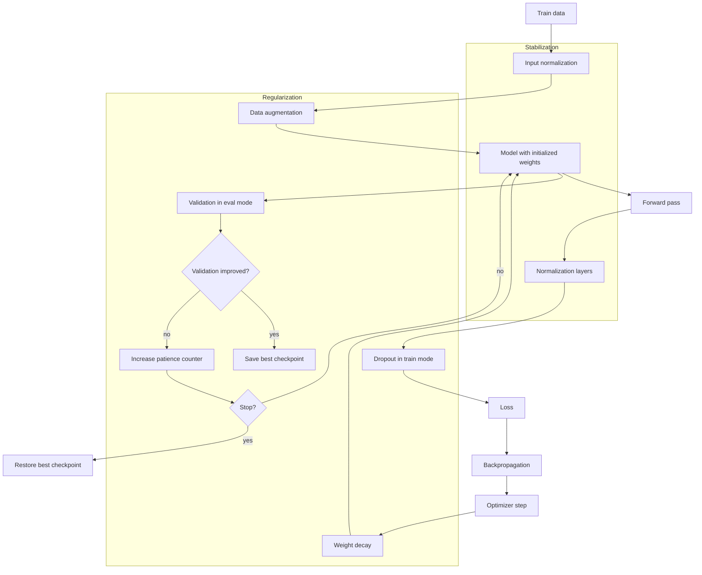

# Stabilization and Regularization

Source: `DL_exam.pdf`, Question 06

Original question:

> Стабилизация и регуляризация обучения. Инициализация, нормализация, dropout, weight decay, early stopping, data augmentation.

## Интуиция

При обучении глубокой нейросети есть две разные, но связанные проблемы. Первая - сделать сам процесс оптимизации устойчивым: чтобы активации и градиенты не взрывались и не затухали, loss убывал, а шаги оптимизатора не разрушали уже найденное решение. Это называют стабилизацией обучения. Вторая - сделать так, чтобы модель не просто запомнила train-выборку, а хорошо работала на новых данных. Это называют регуляризацией и контролем обобщения.

Инициализация и нормализация в первую очередь стабилизируют обучение: они удерживают масштабы сигналов и градиентов в разумном диапазоне. `Dropout`, `weight decay`, `early stopping` и `data augmentation` в первую очередь регуляризуют модель: ограничивают эффективную сложность, добавляют шум или расширяют train-распределение. На практике граница не жесткая: например, BatchNorm стабилизирует оптимизацию и иногда дает регуляризующий шум, а data augmentation может одновременно улучшать устойчивость модели к допустимым преобразованиям входа.

Главная идея для устного ответа: качество deep learning зависит не только от архитектуры и optimizer, но и от набора приемов, которые управляют масштабами, шумом, сложностью модели и разрывом между train и validation.

## Что нужно сказать на экзамене

- Стабилизация отвечает за управляемую оптимизацию: нормальные масштабы активаций, градиентов и обновлений параметров.
- Регуляризация отвечает за обобщение: уменьшает overfitting и разницу между train и validation quality.
- Хорошая инициализация сохраняет дисперсию сигналов при проходе через слои. Для tanh/sigmoid часто используют Xavier/Glorot, для ReLU-сетей - He/Kaiming.
- Нормализация входов и промежуточных активаций уменьшает проблемы масштаба. Важно различать input normalization, BatchNorm, LayerNorm, GroupNorm.
- BatchNorm в train использует статистики mini-batch, а в inference - накопленные running statistics.
- `Dropout` случайно зануляет активации во время training и обычно выключается в eval. В `inverted dropout` оставшиеся активации масштабируются на $\frac{1}{1-p}$.
- `Weight decay` штрафует большие веса. Для SGD L2-регуляризация и weight decay эквивалентны, но для Adam обычно предпочитают decoupled weight decay, то есть AdamW.
- `Early stopping` выбирает checkpoint с лучшим validation score и останавливает обучение при отсутствии улучшений; это implicit regularization.
- `Data augmentation` применяет к train-данным преобразования, которые сохраняют label и учат модель инвариантностям.
- Важно не применять train-only операции к validation/test: augmentation, dropout и BatchNorm-статистики должны иметь корректные режимы `train()` и `eval()`.
- Нужно уметь объяснить trade-off: слишком слабая регуляризация ведет к overfitting, слишком сильная - к underfitting.

## Подробный ответ

### Стабилизация и регуляризация

Пусть модель $f_\theta(x)$ обучается минимизацией empirical risk:

$$
\hat R_{\text{train}}(\theta) =
\frac{1}{n}\sum_{i=1}^{n}\ell(f_\theta(x_i), y_i).
$$

Стабилизационные приемы помогают оптимизатору найти хорошее решение в сложном невыпуклом ландшафте. Они уменьшают проблемы `vanishing gradients`, `exploding gradients`, чувствительности к learning rate и плохого масштаба признаков.

Регуляризационные приемы изменяют задачу или процесс обучения так, чтобы выбранное решение лучше обобщалось. Формально можно думать о минимизации не только train loss, но и критерия с ограничением сложности:

$$
J(\theta) =
\hat R_{\text{train}}(\theta) + \Omega(\theta),
$$

где $\Omega(\theta)$ - регуляризационный штраф или более общий механизм, который не дает модели выбрать слишком сложное объяснение train-данных.

Полезное разделение:

| Прием | Основная роль | Что контролирует |
|---|---|---|
| Инициализация | Стабилизация | Начальные масштабы активаций и градиентов |
| Нормализация | Стабилизация, иногда регуляризация | Масштаб входов, активаций, статистик слоев |
| Dropout | Регуляризация | Co-adaptation нейронов, избыточная зависимость от признаков |
| Weight decay | Регуляризация | Размер весов и эффективную сложность модели |
| Early stopping | Регуляризация, model selection | Момент остановки до переобучения |
| Data augmentation | Регуляризация | Инвариантности и покрытие train-распределения |

### Инициализация

Если веса слишком большие, активации и градиенты могут взрываться. Если веса слишком маленькие, сигнал быстро затухает. Цель инициализации - выбрать начальное распределение весов так, чтобы дисперсия активаций и градиентов примерно сохранялась от слоя к слою.

Рассмотрим линейный слой:

$$
z_j = \sum_{i=1}^{\text{fan\_in}} w_{ji}x_i.
$$

При упрощающих предположениях, что $w_{ji}$ и $x_i$ независимы, имеют нулевое среднее и одинаковую дисперсию:

$$
\operatorname{Var}(z_j)
\approx \text{fan\_in}\operatorname{Var}(w)\operatorname{Var}(x).
$$

Чтобы $\operatorname{Var}(z_j)$ не росла и не уменьшалась сильно, нужно выбирать $\operatorname{Var}(w)$ с учетом числа входов слоя.

`Xavier/Glorot initialization` часто используют для симметричных активаций вроде `tanh`:

$$
\operatorname{Var}(w) = \frac{2}{\text{fan\_in} + \text{fan\_out}}.
$$

Для uniform-варианта:

$$
w \sim U\left[-\sqrt{\frac{6}{\text{fan\_in}+\text{fan\_out}}},
\sqrt{\frac{6}{\text{fan\_in}+\text{fan\_out}}}\right].
$$

`He/Kaiming initialization` подходит для ReLU-подобных активаций, потому что ReLU примерно зануляет половину входов:

$$
\operatorname{Var}(w) = \frac{2}{\text{fan\_in}}.
$$

Для normal-варианта:

$$
w \sim \mathcal{N}\left(0, \frac{2}{\text{fan\_in}}\right).
$$

Практические замечания:

- Bias часто инициализируют нулями или малыми константами.
- Нельзя инициализировать все веса одинаковыми значениями: нейроны слоя будут симметричны и получат одинаковые градиенты.
- Для residual networks требования мягче, потому что skip connections улучшают поток градиентов, но инициализация все равно важна.
- Для очень глубоких сетей часто нужны дополнительные приемы: residual connections, normalization, gradient clipping, learning rate warmup.

### Нормализация

Нормализация приводит признаки или активации к контролируемому масштабу. Это помогает optimizer выбирать один learning rate для разных параметров и уменьшает чувствительность к начальным масштабам.

Input normalization обычно считается по train-выборке:

$$
x' = \frac{x - \mu_{\text{train}}}{\sigma_{\text{train}} + \epsilon}.
$$

Важно: $\mu_{\text{train}}$ и $\sigma_{\text{train}}$ оцениваются только на train, а затем применяются к validation/test. Иначе возникает data leakage.

`Batch Normalization` нормализует активации по mini-batch. Для одного канала:

$$
\mu_B = \frac{1}{m}\sum_{i=1}^{m}x_i,
\qquad
\sigma_B^2 = \frac{1}{m}\sum_{i=1}^{m}(x_i-\mu_B)^2,
$$

$$
\hat x_i = \frac{x_i-\mu_B}{\sqrt{\sigma_B^2+\epsilon}},
\qquad
y_i = \gamma \hat x_i + \beta.
$$

Параметры $\gamma$ и $\beta$ обучаемые: сеть может восстановить нужный масштаб и сдвиг. В convolutional networks BatchNorm обычно считает статистики по batch и spatial positions для каждого channel.

В режиме training BatchNorm использует статистики текущего mini-batch и обновляет running mean/variance. В режиме inference использует накопленные статистики:

$$
\hat x = \frac{x-\mu_{\text{running}}}{\sqrt{\sigma_{\text{running}}^2+\epsilon}}.
$$

Плюсы BatchNorm:

- стабилизирует распределения активаций;
- часто позволяет использовать больший learning rate;
- уменьшает чувствительность к инициализации;
- mini-batch шум может давать небольшой регуляризующий эффект.

Минусы BatchNorm:

- плохо работает при очень маленьком batch size;
- train/eval режимы отличаются, поэтому ошибки режима могут сильно портить качество;
- в RNN и некоторых online/inference сценариях BatchNorm неудобен.

`Layer Normalization` нормализует признаки внутри одного объекта, а не по batch:

$$
\mu = \frac{1}{d}\sum_{j=1}^{d}x_j,
\qquad
\sigma^2 = \frac{1}{d}\sum_{j=1}^{d}(x_j-\mu)^2.
$$

LayerNorm особенно важен в Transformers, потому что не зависит от batch size и одинаково работает в training и inference. `GroupNorm` нормализует группы каналов и часто используется в vision-задачах, когда batch size мал.

### Dropout

`Dropout` - регуляризация через случайное удаление части активаций во время обучения. Для каждого элемента активации генерируется маска:

$$
m_i \sim \operatorname{Bernoulli}(1-p),
$$

где $p$ - вероятность зануления. В распространенном варианте `inverted dropout`:

$$
\tilde h_i = \frac{m_i}{1-p}h_i.
$$

Тогда:

$$
\mathbb{E}[\tilde h_i] = h_i,
$$

и в inference дополнительное масштабирование не нужно: dropout просто выключается.

Интуиция: сеть не может полагаться на один конкретный нейрон или признак, поэтому учит более устойчивые распределенные представления. Dropout можно понимать как приближение обучения ансамбля многих подсетей с общими весами.

Практические замечания:

- Dropout включают в `train()` и выключают в `eval()`.
- Слишком большой $p$ приводит к underfitting.
- В convolutional networks часто используют меньший dropout или `spatial dropout`, потому что соседние spatial activations сильно коррелированы.
- В современных больших architectures dropout иногда уменьшают или отключают, если много данных и уже есть другие регуляризаторы.
- Dropout не применяют одинаково ко всем местам: например, в Transformers есть attention dropout, residual dropout и MLP dropout.

### Weight decay

`Weight decay` штрафует большие веса и тем самым предпочитает более простые решения. Классическая L2-регуляризация добавляет к loss штраф:

$$
J(\theta) =
\hat R_{\text{train}}(\theta) + \frac{\lambda}{2}\lVert\theta\rVert_2^2.
$$

Градиент:

$$
\nabla_\theta J(\theta)
=
\nabla_\theta \hat R_{\text{train}}(\theta) + \lambda\theta.
$$

Для SGD шаг получается:

$$
\theta_{t+1}
=
\theta_t - \eta(\nabla_\theta \hat R_{\text{train}}(\theta_t) + \lambda\theta_t)
=
(1-\eta\lambda)\theta_t - \eta\nabla_\theta \hat R_{\text{train}}(\theta_t).
$$

Поэтому для обычного SGD L2-регуляризация эквивалентна умножению весов на коэффициент меньше единицы на каждом шаге, то есть "decay" весов.

Для adaptive optimizers вроде Adam такая эквивалентность нарушается, если просто добавить $\lambda\theta$ в градиент: адаптивное масштабирование градиентов начинает масштабировать и регуляризационный член. Поэтому часто используют `AdamW` - decoupled weight decay:

$$
\theta_{t+1}
=
(1-\eta\lambda)\theta_t - \eta \cdot \operatorname{AdamUpdate}_t.
$$

Практические замечания:

- Weight decay обычно применяют к весам линейных и convolutional слоев.
- Часто не применяют weight decay к bias, BatchNorm/LayerNorm параметрам $\gamma,\beta$ и embedding scale parameters.
- Большой $\lambda$ может вызвать underfitting.
- Weight decay не заменяет data augmentation: он ограничивает параметры, но не учит инвариантностям к преобразованиям входа.

### Early stopping

`Early stopping` - остановка обучения по validation metric до того, как модель начнет переобучаться. В начале обучения train и validation loss обычно уменьшаются. При overfitting train loss продолжает падать, а validation loss перестает улучшаться или растет. Тогда лучшим решением часто является checkpoint не из последней эпохи, а из момента лучшей validation metric.

Типичный алгоритм:

1. Задать monitored metric, например validation loss или validation accuracy.
2. После каждой эпохи оценивать модель на validation без dropout и без обновления весов.
3. Если metric улучшилась, сохранить checkpoint и сбросить счетчик ожидания.
4. Если улучшения нет `patience` эпох подряд, остановить обучение.
5. Восстановить лучший checkpoint, а не обязательно последние веса.

Early stopping является implicit regularization: оно ограничивает эффективную сложность решения через время обучения. Для многих моделей сначала изучаются простые закономерности, а затем начинается запоминание шумных деталей train-выборки.

Важно не использовать test set для early stopping. Test нужен только для финальной оценки выбранной модели.

### Data augmentation

`Data augmentation` расширяет train-выборку искусственными преобразованиями:

$$
(x, y) \mapsto (T(x), y),
$$

где преобразование $T$ должно сохранять label или корректно преобразовывать label. Это снижает overfitting и учит модель нужным инвариантностям.

Примеры:

| Область | Преобразования | Условие корректности |
|---|---|---|
| Images | crop, flip, rotation, color jitter, blur, Cutout, MixUp, CutMix | Label должен сохраниться или быть правильно смешан |
| Audio | time shift, noise, speed perturbation, SpecAugment | Транскрипция или класс не должны меняться неверно |
| Text | token masking, paraphrase, back-translation | Смысл и label должны сохраниться |

Для классификации изображений horizontal flip обычно допустим для кошек и машин, но недопустим для задач, где направление является label. Для segmentation, detection и pose нужно преобразовывать не только изображение, но и маски, bounding boxes или keypoints.

Сильные методы вроде `MixUp` создают смешанные объекты и смешанные labels:

$$
\tilde x = \lambda x_i + (1-\lambda)x_j,
\qquad
\tilde y = \lambda y_i + (1-\lambda)y_j,
$$

где $\lambda \in [0,1]$. Это сглаживает decision boundary и снижает уверенное запоминание отдельных примеров.

Практические замечания:

- Augmentation применяется только к train-данным.
- Validation/test обычно используют без случайных train augmentations, кроме строго определенного test-time augmentation, если это часть протокола.
- Слишком слабая augmentation не помогает, слишком сильная может изменить label и ухудшить обучение.
- Augmentation должна соответствовать реальным вариациям данных, а не добавлять произвольный шум.

### Как эти приемы работают вместе

Обычно хорошая training setup выглядит так:

1. Нормализовать входы по train statistics.
2. Инициализировать веса с учетом активаций и fan-in/fan-out.
3. Использовать нормализацию внутри сети, если архитектура этого требует.
4. Добавить регуляризацию: weight decay, dropout и/или augmentation.
5. Следить за train/validation curves.
6. Сохранять лучший validation checkpoint и применять early stopping при переобучении.

Если train loss не уменьшается, проблема чаще в стабилизации или оптимизации: learning rate, инициализация, нормализация, exploding/vanishing gradients, ошибки режима training. Если train loss мал, а validation плохой, проблема чаще в регуляризации и данных: overfitting, leakage, слабая augmentation, слишком большая модель, неверный split.

## Формулы / алгоритмы

### Инициализация

Для линейного слоя:

$$
z_j = \sum_{i=1}^{\text{fan\_in}} w_{ji}x_i,
\qquad
\operatorname{Var}(z_j)
\approx \text{fan\_in}\operatorname{Var}(w)\operatorname{Var}(x).
$$

Xavier/Glorot:

$$
\operatorname{Var}(w) = \frac{2}{\text{fan\_in}+\text{fan\_out}}.
$$

He/Kaiming для ReLU:

$$
\operatorname{Var}(w) = \frac{2}{\text{fan\_in}}.
$$

### BatchNorm

$$
\mu_B = \frac{1}{m}\sum_{i=1}^{m}x_i,
\qquad
\sigma_B^2 = \frac{1}{m}\sum_{i=1}^{m}(x_i-\mu_B)^2,
$$

$$
\hat x_i = \frac{x_i-\mu_B}{\sqrt{\sigma_B^2+\epsilon}},
\qquad
y_i = \gamma\hat x_i+\beta.
$$

### Dropout

$$
m_i \sim \operatorname{Bernoulli}(1-p),
\qquad
\tilde h_i = \frac{m_i}{1-p}h_i,
\qquad
\mathbb{E}[\tilde h_i]=h_i.
$$

### Weight decay

Objective с L2:

$$
J(\theta) =
\hat R_{\text{train}}(\theta)
+ \frac{\lambda}{2}\lVert\theta\rVert_2^2.
$$

SGD update:

$$
\theta_{t+1}
=
(1-\eta\lambda)\theta_t
- \eta\nabla_\theta \hat R_{\text{train}}(\theta_t).
$$

AdamW-style decoupled update:

$$
\theta_{t+1}
=
(1-\eta\lambda)\theta_t
- \eta \cdot \operatorname{AdamUpdate}_t.
$$

### Early stopping

Входы: модель $f_\theta$, train set, validation set, optimizer, metric, `patience`, максимум эпох.

Выход: checkpoint с лучшей validation metric.

1. Инициализировать `best_score`, `best_checkpoint`, `bad_epochs = 0`.
2. Для каждой эпохи обучить модель на train в режиме `train()`.
3. Оценить metric на validation в режиме `eval()`.
4. Если validation metric улучшилась: сохранить checkpoint, обновить `best_score`, установить `bad_epochs = 0`.
5. Иначе увеличить `bad_epochs`.
6. Если `bad_epochs >= patience`, остановить обучение.
7. Вернуть `best_checkpoint`.

### Data augmentation

Общий pipeline:

$$
(x,y) \sim D_{\text{train}},
\qquad
T \sim \mathcal{A},
\qquad
(\tilde x,\tilde y) = T(x,y),
\qquad
\nabla_\theta \ell(f_\theta(\tilde x), \tilde y).
$$

Условие корректности:

$$
T \text{ должно сохранять целевую информацию или корректно преобразовывать } y.
$$

## Диаграмма или изображение

## Быстрая устная версия

Стабилизация обучения нужна, чтобы оптимизация глубоких сетей была численно и статистически управляемой: инициализация сохраняет масштаб активаций и градиентов, нормализация выравнивает распределения признаков или активаций, BatchNorm использует batch-статистики в train и running statistics в inference.

Регуляризация нужна, чтобы уменьшить overfitting. Dropout случайно зануляет активации и мешает нейронам слишком сильно зависеть друг от друга. Weight decay добавляет штраф на большие веса; для SGD он эквивалентен L2-регуляризации, а для Adam лучше использовать decoupled вариант AdamW. Early stopping выбирает лучшую модель по validation и останавливает обучение при отсутствии улучшений. Data augmentation расширяет train-данные преобразованиями, которые сохраняют label или корректно меняют его. На практике нужно следить за train/validation curves: если train плохо учится - проблема стабилизации или оптимизации, если train хорош, а validation плохой - проблема регуляризации, данных или leakage.

## Возможные уточняющие вопросы

**Чем стабилизация отличается от регуляризации?**  
Стабилизация делает обучение технически устойчивым: нормальные масштабы, градиенты, learning dynamics. Регуляризация улучшает обобщение и борется с overfitting.

**Почему нельзя инициализировать все веса нулями?**  
Нейроны одного слоя будут симметричны: получат одинаковые активации и одинаковые градиенты, поэтому слой не научится разным признакам.

**Почему He initialization подходит для ReLU?**  
ReLU зануляет примерно часть активаций, поэтому для сохранения дисперсии нужен больший масштаб весов: $\operatorname{Var}(w)=\frac{2}{\text{fan\_in}}$.

**Что происходит с BatchNorm в `eval()`?**  
Он не использует статистики текущего batch, а применяет накопленные running mean и running variance, полученные во время training.

**Почему BatchNorm может плохо работать при маленьком batch size?**  
Оценки mean и variance становятся шумными, из-за чего нормализация нестабильна. Тогда часто используют LayerNorm, GroupNorm или SyncBatchNorm.

**Чем LayerNorm отличается от BatchNorm?**  
BatchNorm нормализует по batch для каждого признака или канала, а LayerNorm нормализует признаки внутри одного объекта. LayerNorm не зависит от batch size.

**Почему dropout выключают на inference?**  
На inference нужна детерминированная полная сеть. В inverted dropout масштабирование уже сделано во время training, поэтому на inference достаточно не занулять активации.

**L2-регуляризация и weight decay всегда одно и то же?**  
Для обычного SGD практически да. Для Adam и других adaptive optimizers нет, поэтому используют decoupled weight decay в AdamW.

**Почему early stopping нельзя делать по test set?**  
Потому что тогда test участвует в выборе модели, и финальная оценка становится смещенной. Для остановки нужен validation set.

**Когда data augmentation вредна?**  
Когда преобразование меняет label или создает неестественные данные. Например, поворот цифры 6 может превратить ее в 9, а horizontal flip может изменить смысл медицинского или дорожного изображения.

## Частые ошибки

- Смешивать стабилизацию и регуляризацию как одно и то же. Они связаны, но отвечают на разные вопросы: "можем ли обучить?" и "будет ли обобщать?".
- Говорить, что BatchNorm всегда используется одинаково в train и inference. На самом деле режимы отличаются.
- Забывать обучаемые параметры BatchNorm/LayerNorm: $\gamma$ и $\beta$.
- Применять normalization statistics, посчитанные по всей выборке до split, что создает data leakage.
- Использовать dropout в `eval()` или забывать включить dropout в `train()`.
- Не учитывать scaling в dropout и путать обычный dropout с inverted dropout.
- Утверждать, что L2 и weight decay эквивалентны для Adam. Для adaptive optimizers это важная ловушка.
- Применять weight decay ко всем параметрам без разбора, включая bias и normalization parameters.
- Выбирать final model по test set вместо validation set.
- Делать data augmentation, которая нарушает label, например меняет расположение bounding boxes без пересчета координат.
- Считать, что регуляризация всегда улучшает качество. Слишком сильный dropout, weight decay или augmentation могут привести к underfitting.
- Оценивать качество по train loss и игнорировать validation curves.
