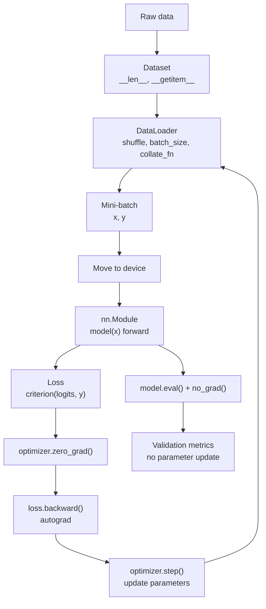

# Practical PyTorch Pipeline

Source: `DL_exam.pdf`, Question 07

Original question:

> Практический PyTorch-пайплайн. Tensor, autograd, nn.Module, Dataset, DataLoader, train/eval.

## Интуиция

PyTorch-пайплайн - это стандартный способ превратить математическую идею "обучить функцию $f_\theta(x)$ минимизировать loss" в рабочий код. Он разделяет задачу на понятные роли: `Tensor` хранит данные и параметры, `autograd` автоматически считает градиенты, `nn.Module` описывает модель, `Dataset` и `DataLoader` подают mini-batch'и, а training loop соединяет forward pass, loss, backward pass и шаг оптимизатора.

Главная идея для экзамена: PyTorch не "обучает модель сам". Он дает строительные блоки. Пользователь явно задает модель, loss, optimizer и цикл обучения, а фреймворк берет на себя эффективные тензорные операции, построение динамического вычислительного графа и вычисление градиентов.

Практический пайплайн нужен, чтобы обучение было воспроизводимым, масштабируемым и корректным: данные обрабатываются одинаково, градиенты не накапливаются случайно, режимы `train` и `eval` переключаются вовремя, а вычисления выполняются на нужном устройстве (`CPU`, `CUDA`, `MPS`).

## Что нужно сказать на экзамене

- `Tensor` - базовая структура PyTorch: многомерный массив с `dtype`, `shape`, `device` и, при необходимости, `requires_grad=True`.
- `autograd` строит динамический вычислительный граф во время forward pass и считает градиенты вызовом `loss.backward()`.
- Параметры модели обычно являются `nn.Parameter`; они автоматически попадают в `model.parameters()`, если зарегистрированы внутри `nn.Module`.
- `nn.Module` инкапсулирует слои, параметры и метод `forward`; вызов `model(x)` запускает `forward`.
- `Dataset` отвечает за доступ к одному примеру: `__len__` и `__getitem__`.
- `DataLoader` собирает mini-batch'и, перемешивает данные, параллелит загрузку и применяет `collate_fn`.
- Обучающий шаг: перенести batch на device, сделать forward, посчитать loss, вызвать `optimizer.zero_grad()`, `loss.backward()`, `optimizer.step()`.
- `model.train()` включает training behavior, например `dropout` и обновление статистик `BatchNorm`.
- `model.eval()` включает inference/evaluation behavior: `dropout` выключается, `BatchNorm` использует накопленные статистики.
- На валидации и тесте используют `torch.no_grad()` или `torch.inference_mode()`, чтобы не строить граф и экономить память.
- Важно различать `model.eval()` и `torch.no_grad()`: первое меняет поведение некоторых слоев, второе отключает запись операций для gradient computation.
- Частые практические риски: забыть `zero_grad`, перепутать shape или dtype target'ов, не перенести tensors на один device, считать validation с включенным dropout, делать `argmax` до loss.

## Подробный ответ

Типичная supervised learning задача в PyTorch выглядит так:

$$
\theta^\* = \arg\min_\theta \frac{1}{N}\sum_{i=1}^{N}\ell(f_\theta(x_i), y_i).
$$

На практике сумма по всему датасету заменяется оценкой по mini-batch:

$$
L_B(\theta) = \frac{1}{|B|}\sum_{(x_i,y_i)\in B}\ell(f_\theta(x_i), y_i),
$$

после чего оптимизатор обновляет параметры:

$$
\theta \leftarrow \theta - \eta \nabla_\theta L_B(\theta)
$$

или использует более сложное правило, например Adam/AdamW. PyTorch-пайплайн организует это вычисление в несколько компонентов.

### Tensor

`torch.Tensor` - многомерный массив, похожий на `numpy.ndarray`, но с поддержкой GPU, automatic differentiation и нейросетевых операций. У тензора важны:

| Свойство | Смысл |
|---|---|
| `shape` | Размерности, например `[batch, channels, height, width]` для изображений |
| `dtype` | Тип данных: `float32`, `float16`, `bfloat16`, `long` и т.д. |
| `device` | Где хранится tensor: `cpu`, `cuda:0`, `mps` |
| `requires_grad` | Нужно ли отслеживать операции для градиентов |
| `grad` | Накопленный градиент для leaf tensor'ов, обычно параметров |

Пример:

```python
import torch

x = torch.randn(32, 10, device="cuda")
w = torch.randn(10, 3, device="cuda", requires_grad=True)
logits = x @ w
```

Для модели важно, чтобы входы, target'ы и параметры были на совместимых устройствах. Нельзя умножать tensor на `cuda` с tensor на `cpu`. Поэтому обычно задают:

```python
device = torch.device("cuda" if torch.cuda.is_available() else "cpu")
model = model.to(device)
x = x.to(device)
y = y.to(device)
```

Также нужно следить за `dtype`. Например, для `nn.CrossEntropyLoss` logits должны быть вещественными shape `[batch, num_classes]`, а target - целочисленным tensor'ом класса `torch.long` shape `[batch]`, содержащим индексы классов. Для `nn.MSELoss` обычно и prediction, и target вещественные.

### Autograd

`autograd` - механизм automatic differentiation в PyTorch. Когда операции выполняются над tensor'ами с `requires_grad=True`, PyTorch динамически строит вычислительный граф. У результата появляется ссылка на функцию, которая знает, как распространять градиент назад:

```python
x = torch.tensor([2.0])
w = torch.tensor([3.0], requires_grad=True)
b = torch.tensor([1.0], requires_grad=True)

y_hat = w * x + b
loss = (y_hat - 10.0) ** 2
loss.backward()

print(w.grad, b.grad)
```

Вызов `loss.backward()` запускает reverse-mode autodiff. Для scalar loss PyTorch по умолчанию начинает backward с производной $\frac{\partial L}{\partial L}=1$ и заполняет `.grad` у параметров. Если output не скалярный, нужно передать внешний градиент, например `output.backward(gradient=v)`.

Важная особенность: градиенты в PyTorch накапливаются. Это полезно для gradient accumulation, но в обычном training loop перед каждым backward нужно обнулить старые градиенты:

```python
optimizer.zero_grad()
loss.backward()
optimizer.step()
```

Если забыть `zero_grad`, фактический градиент будет суммой градиентов нескольких batch'ей:

$$
g_{\text{used}} = \sum_{t=1}^{k}\nabla_\theta L_{B_t},
$$

что обычно является ошибкой, если это не было задумано специально.

Операции `detach()`, `with torch.no_grad()` и преобразование к Python-числу через `.item()` разрывают связь с графом. Это нужно для logging или inference, но опасно внутри loss, если требуется gradient flow. Например, `loss.item()` нельзя использовать для backward, потому что это уже число Python, а не tensor с графом.

### nn.Module

`nn.Module` - базовый класс для моделей и слоев. Он решает несколько задач:

- хранит параметры и подмодули;
- позволяет получить `model.parameters()` для optimizer;
- переключает режимы `train` и `eval`;
- переносит все параметры и buffers на device через `model.to(device)`;
- сохраняет и загружает состояние через `state_dict`.

Минимальная модель:

```python
import torch.nn as nn

class MLP(nn.Module):
    def __init__(self, in_features: int, hidden: int, num_classes: int):
        super().__init__()
        self.net = nn.Sequential(
            nn.Linear(in_features, hidden),
            nn.ReLU(),
            nn.Linear(hidden, num_classes),
        )

    def forward(self, x):
        return self.net(x)
```

Нужно вызывать `model(x)`, а не `model.forward(x)`, потому что `__call__` у `nn.Module` выполняет дополнительную служебную логику: hooks, режимы, mixed precision wrappers и другие механизмы фреймворка.

Если tensor должен быть обучаемым параметром, его регистрируют как `nn.Parameter` или кладут в модульный слой. Если tensor является постоянным состоянием модели, например running mean в normalization, его регистрируют как buffer через `register_buffer`, чтобы он попадал в `state_dict` и переносился на device, но не оптимизировался.

### Dataset

`Dataset` описывает, как получить один пример. Для map-style dataset обычно реализуют два метода:

```python
from torch.utils.data import Dataset

class MyDataset(Dataset):
    def __init__(self, samples, labels, transform=None):
        self.samples = samples
        self.labels = labels
        self.transform = transform

    def __len__(self):
        return len(self.samples)

    def __getitem__(self, idx):
        x = self.samples[idx]
        y = self.labels[idx]
        if self.transform is not None:
            x = self.transform(x)
        return x, y
```

`Dataset` не обязан хранить все данные в памяти. Он может читать файлы, делать tokenization, применять image transforms или возвращать словарь с несколькими полями. Главное, чтобы один вызов `__getitem__` возвращал один training example в согласованном формате.

Разделение на `Dataset` и `DataLoader` полезно: dataset отвечает за смысл данных, loader - за batching и доставку batch'ей в training loop.

### DataLoader

`DataLoader` превращает dataset в iterator по mini-batch'ам:

```python
from torch.utils.data import DataLoader

train_loader = DataLoader(
    train_dataset,
    batch_size=64,
    shuffle=True,
    num_workers=4,
    pin_memory=True,
)

val_loader = DataLoader(
    val_dataset,
    batch_size=128,
    shuffle=False,
)
```

Основные параметры:

| Параметр | Зачем нужен |
|---|---|
| `batch_size` | Размер mini-batch |
| `shuffle` | Перемешивание training data между эпохами |
| `num_workers` | Параллельные процессы загрузки данных |
| `collate_fn` | Как собрать список примеров в batch |
| `drop_last` | Отбросить последний неполный batch |
| `pin_memory` | Ускорить копирование CPU to CUDA в некоторых сценариях |

Стандартный `collate_fn` пытается сложить элементы в batch через `torch.stack`. Если примеры разной длины, например тексты или audio, нужен свой `collate_fn`: padding, masks, сортировка или упаковка последовательностей.

На train обычно ставят `shuffle=True`, чтобы mini-batch'и были менее коррелированы. На validation/test обычно `shuffle=False`, чтобы метрики были воспроизводимыми и легче сопоставлялись с конкретными примерами.

### Loss и optimizer

Loss задает оптимизируемую величину. Например, для multi-class classification часто используют:

```python
criterion = nn.CrossEntropyLoss()
```

Она ожидает сырые logits, а не `softmax` probabilities. Внутри она численно устойчиво объединяет `log_softmax` и negative log-likelihood:

$$
\ell(z, y) = -\log \frac{\exp z_y}{\sum_{c=1}^{C}\exp z_c}.
$$

Optimizer получает параметры модели:

```python
optimizer = torch.optim.AdamW(model.parameters(), lr=1e-3, weight_decay=1e-4)
```

`optimizer.step()` меняет параметры, используя значения `.grad`. Сам optimizer не знает, как был получен loss; он только применяет правило обновления к зарегистрированным параметрам.

### Training loop

Минимальный training loop:

```python
for epoch in range(num_epochs):
    model.train()
    for x, y in train_loader:
        x = x.to(device)
        y = y.to(device)

        logits = model(x)
        loss = criterion(logits, y)

        optimizer.zero_grad()
        loss.backward()
        optimizer.step()
```

Смысл шагов:

1. `model.train()` включает обучающий режим.
2. Batch переносится на тот же device, что и модель.
3. `logits = model(x)` выполняет forward pass.
4. `loss = criterion(logits, y)` строит scalar objective.
5. `optimizer.zero_grad()` очищает старые `.grad`.
6. `loss.backward()` считает $\nabla_\theta L_B$.
7. `optimizer.step()` обновляет параметры.

Порядок `zero_grad` иногда пишут до forward pass. Важно, чтобы перед `backward()` текущего batch'а старые градиенты были очищены, если не используется deliberate gradient accumulation.

### Evaluation loop

Validation/test loop обычно выглядит так:

```python
model.eval()
total_loss = 0.0
total_correct = 0
total_count = 0

with torch.no_grad():
    for x, y in val_loader:
        x = x.to(device)
        y = y.to(device)

        logits = model(x)
        loss = criterion(logits, y)

        total_loss += loss.item() * x.size(0)
        pred = logits.argmax(dim=1)
        total_correct += (pred == y).sum().item()
        total_count += x.size(0)

val_loss = total_loss / total_count
val_acc = total_correct / total_count
```

Здесь `model.eval()` меняет поведение некоторых слоев, а `torch.no_grad()` отключает построение графа. Это разные вещи:

| Механизм | Что делает | Когда нужен |
|---|---|---|
| `model.train()` | Training mode для модулей | Обучение |
| `model.eval()` | Evaluation mode для модулей | Валидация, тест, inference |
| `torch.no_grad()` | Не строит граф autograd | Валидация, тест, inference |
| `torch.inference_mode()` | Еще более строгий и быстрый inference mode | Чистый inference без дальнейшего autograd |

`Dropout` в `train()` случайно зануляет активации, а в `eval()` использует детерминированное поведение. `BatchNorm` в `train()` обновляет running statistics по batch'ам, а в `eval()` использует накопленные оценки. Поэтому забытый `model.eval()` делает validation noisy и некорректной.

### Сохранение и загрузка

Практический пайплайн обычно включает checkpoint:

```python
torch.save(
    {
        "model": model.state_dict(),
        "optimizer": optimizer.state_dict(),
        "epoch": epoch,
    },
    "checkpoint.pt",
)
```

Для загрузки:

```python
checkpoint = torch.load("checkpoint.pt", map_location=device)
model.load_state_dict(checkpoint["model"])
optimizer.load_state_dict(checkpoint["optimizer"])
```

Для inference часто сохраняют только `model.state_dict()`. Для продолжения обучения нужны еще optimizer state, номер эпохи, scheduler state и иногда random states.

## Формулы / алгоритмы

Цель обучения по mini-batch:

$$
L_B(\theta)=\frac{1}{m}\sum_{i=1}^{m}\ell(f_\theta(x_i), y_i).
$$

Градиентный шаг в простом SGD:

$$
g_t = \nabla_\theta L_B(\theta_t),
$$

$$
\theta_{t+1} = \theta_t - \eta g_t.
$$

Для classification с `CrossEntropyLoss`:

$$
p_c = \frac{\exp z_c}{\sum_{j=1}^{C}\exp z_j},
$$

$$
\ell(z,y) = -\log p_y.
$$

Практический алгоритм обучения:

1. Входы: `Dataset`, модель `f_\theta`, loss $\ell$, optimizer, число эпох, `device`.
2. Создать `DataLoader` для train и validation.
3. Перенести модель на `device`.
4. Для каждой эпохи включить `model.train()`.
5. Для каждого train batch перенести tensors на `device`.
6. Выполнить forward pass: $\hat{y}=f_\theta(x)$.
7. Посчитать scalar loss: $L_B=\ell(\hat{y}, y)$.
8. Очистить старые градиенты: `optimizer.zero_grad()`.
9. Выполнить backpropagation: `loss.backward()`.
10. Обновить параметры: `optimizer.step()`.
11. Для validation включить `model.eval()` и `torch.no_grad()`.
12. Посчитать validation loss и метрики без обновления параметров.
13. Сохранить checkpoint, если метрика улучшилась или нужна возможность продолжить обучение.

Сложность одного training step обычно определяется forward и backward проходом модели. Если $C_f$ - стоимость forward pass, то backward pass часто стоит того же порядка, поэтому шаг обучения имеет стоимость $O(C_f)$ с константой больше единицы. Память складывается из параметров, optimizer states, batch tensors и сохраненных активаций для backward.

Практический skeleton:

```python
device = torch.device("cuda" if torch.cuda.is_available() else "cpu")

model = MLP(in_features=784, hidden=256, num_classes=10).to(device)
criterion = nn.CrossEntropyLoss()
optimizer = torch.optim.AdamW(model.parameters(), lr=1e-3)

for epoch in range(num_epochs):
    model.train()
    train_loss_sum = 0.0
    train_count = 0

    for x, y in train_loader:
        x = x.to(device)
        y = y.to(device)

        logits = model(x)
        loss = criterion(logits, y)

        optimizer.zero_grad()
        loss.backward()
        optimizer.step()

        train_loss_sum += loss.item() * x.size(0)
        train_count += x.size(0)

    model.eval()
    val_loss_sum = 0.0
    val_count = 0

    with torch.no_grad():
        for x, y in val_loader:
            x = x.to(device)
            y = y.to(device)
            logits = model(x)
            loss = criterion(logits, y)
            val_loss_sum += loss.item() * x.size(0)
            val_count += x.size(0)

    train_loss = train_loss_sum / train_count
    val_loss = val_loss_sum / val_count
```

## Диаграмма или изображение



Диаграмма показывает полный практический цикл: данные превращаются в batch, модель строит predictions, loss задает objective, `autograd` считает градиенты, optimizer обновляет параметры, а evaluation branch считает метрики без изменения модели.

## Быстрая устная версия

Практический PyTorch-пайплайн состоит из данных, модели и цикла обучения. Данные описываются через `Dataset`, который возвращает один пример, и `DataLoader`, который собирает mini-batch'и, перемешивает train data и может параллелить загрузку. Модель задается как `nn.Module`: в `__init__` объявляются слои, в `forward` описывается вычисление, а параметры доступны через `model.parameters()`.

В training loop мы включаем `model.train()`, переносим batch на device, считаем `logits = model(x)`, считаем loss, очищаем старые градиенты через `optimizer.zero_grad()`, вызываем `loss.backward()` и затем `optimizer.step()`. `autograd` строит динамический граф во время forward и по нему считает градиенты. На validation включаем `model.eval()` и `torch.no_grad()`: это отключает dropout/обновление BatchNorm-статистик и не строит граф. Важно помнить, что `eval()` и `no_grad()` делают разные вещи.

## Возможные уточняющие вопросы

- Чем `Tensor` отличается от `numpy.ndarray`?
  Tensor поддерживает device acceleration, autograd, нейросетевые операции и интеграцию с `nn.Module`; `numpy.ndarray` обычно работает на CPU и не строит autograd graph.

- Что делает `requires_grad=True`?
  PyTorch начинает отслеживать операции над tensor'ом, чтобы потом можно было посчитать производные по нему через `backward()`.

- Почему нужно вызывать `optimizer.zero_grad()`?
  Потому что `.grad` у параметров накапливается между вызовами `backward()`. Без очистки следующий шаг будет использовать сумму старых и новых градиентов.

- Почему optimizer получает `model.parameters()`?
  Так optimizer знает, какие tensors являются обучаемыми параметрами и какие `.grad` нужно использовать для обновления.

- Почему для validation нужен `model.eval()`?
  Потому что некоторые слои ведут себя по-разному при обучении и оценке: `dropout` должен быть выключен, `BatchNorm` должен использовать накопленные статистики.

- Достаточно ли `model.eval()` для validation?
  Нет. `model.eval()` меняет режим модулей, но не отключает autograd. Для экономии памяти и времени нужен еще `torch.no_grad()` или `torch.inference_mode()`.

- Что делает `DataLoader`, чего не делает `Dataset`?
  `Dataset` возвращает один пример, а `DataLoader` организует batching, shuffle, multiprocessing, pinned memory и `collate_fn`.

- Почему `CrossEntropyLoss` не требует предварительного `softmax`?
  Она принимает logits и внутри численно устойчиво считает `log_softmax` плюс negative log-likelihood. Если применить `softmax` заранее, можно ухудшить численную устойчивость и получить неправильный интерфейс.

- Что такое dynamic computation graph?
  Граф autograd строится заново во время каждого forward pass обычным Python-кодом. Это удобно для моделей с условиями, циклами и переменной длиной входа.

- Когда нужен `detach()`?
  Когда нужно использовать значение tensor'а без распространения градиента через его историю, например для logging, target network или остановки gradient flow.

## Частые ошибки

- Забыть `optimizer.zero_grad()` и непреднамеренно накапливать градиенты.
- Считать validation без `model.eval()`, из-за чего `dropout` и `BatchNorm` дают некорректные метрики.
- Использовать `model.eval()`, но забыть `torch.no_grad()`, из-за чего лишний граф расходует память.
- Перенести модель на GPU, но оставить batch на CPU, или наоборот.
- Передать target неправильного `dtype`: например, `float` вместо `long` для `CrossEntropyLoss`.
- Применить `softmax` перед `nn.CrossEntropyLoss`.
- Сделать `argmax` до loss: `argmax` недифференцируем и убирает информацию о вероятностях/логитах.
- Вызывать `model.forward(x)` напрямую вместо `model(x)`.
- Создать tensor-параметр внутри модели без `nn.Parameter`, из-за чего он не попадет в `model.parameters()`.
- Обновлять параметры на validation или случайно вызывать `optimizer.step()` вне train loop.
- Усреднять validation loss как среднее по batch loss без учета разных размеров последнего batch'а.
- Использовать `.item()` или `.detach()` внутри вычисления loss и случайно разорвать граф.
- Не сохранять optimizer state при checkpoint'е, если планируется продолжать обучение.
