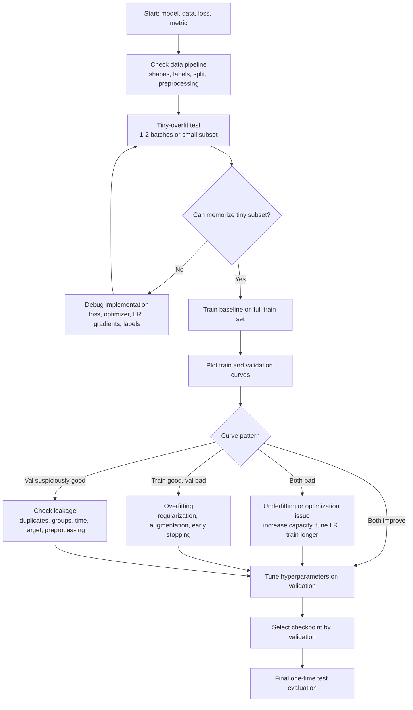

# Training Diagnostics

Source: `DL_exam.pdf`, Question 08

Original question:

> Диагностика обучения нейросети. Переобучение, tiny-overfit test, анализ train/validation curves, leakage, подбор гиперпараметров.

## Интуиция

Диагностика обучения нужна, чтобы понять, почему нейросеть не дает нужное качество: модель недостаточно учится, переобучается, данные размечены или разделены неправильно, в коде есть ошибка, или гиперпараметры выбраны неудачно. В deep learning нельзя смотреть только на итоговую accuracy: нужно анализировать динамику `train loss`, `validation loss`, метрик, градиентов, learning rate и примеров ошибок.

Главная идея: обучение - это эксперимент с несколькими возможными источниками проблемы. Если сеть не может запомнить даже маленький набор, скорее всего, ошибка в коде, loss, данных или оптимизации. Если на train качество хорошее, а на validation плохое, это переобучение, leakage в обратную сторону отсутствует, но обобщение слабое. Если validation подозрительно слишком хорошая, нужно проверять `data leakage`: информация из validation/test могла попасть в train или в признаки.

Для устного ответа удобно держать порядок диагностики: сначала sanity checks и `tiny-overfit test`, затем анализ кривых обучения, затем поиск leakage и ошибок в split, затем регуляризация/архитектура/данные, и только после этого систематический подбор гиперпараметров.

## Что нужно сказать на экзамене

- Диагностика обучения оценивает не только финальное качество, но и весь процесс: loss, метрики, train/validation gap, стабильность градиентов, скорость сходимости и ошибки на примерах.
- `Tiny-overfit test`: взять очень маленький поднабор, например 1-2 batch или 10-100 объектов, отключить сильную регуляризацию и проверить, что модель способна почти идеально запомнить train.
- Если tiny-overfit не проходит, вероятны баги: неверные метки, неправильная размерность, сломанный loss, отсутствие `optimizer.step()`, неправильный режим `train/eval`, слишком маленький learning rate, `detach`, неверная нормализация.
- Переобучение (`overfitting`) - низкая ошибка на train и высокая ошибка на validation/test; признак - растущий generalization gap.
- Недообучение (`underfitting`) - плохое качество и на train, и на validation; модель, оптимизация или признаки недостаточны.
- Анализ `train/validation curves` показывает режим: нормальная сходимость, overfitting, underfitting, нестабильный learning rate, mismatch между train и validation.
- `Data leakage` - попадание информации из validation/test или целевой переменной в train/features/preprocessing; оно дает завышенную оценку качества и ломает честную проверку обобщения.
- Подбор гиперпараметров делается только по validation или через cross-validation, не по test. Test используется один раз для финальной оценки.
- Гиперпараметры включают learning rate, batch size, optimizer, weight decay, dropout, augmentation, архитектуру, scheduler, число эпох, early stopping, loss weights.
- Важно вести controlled experiments: менять один фактор или явно планировать search, фиксировать random seed, логировать конфигурации и сравнивать по одной целевой метрике.

## Подробный ответ

Диагностика обучения нейросети отвечает на вопрос: модель не обучилась из-за ошибки реализации, недостаточной емкости, плохой оптимизации, переобучения, неправильного разбиения данных или неверной процедуры оценки? Формально обычно минимизируется эмпирический риск на train:

$$
\hat{R}_{train}(\theta) =
\frac{1}{n_{train}}\sum_{i=1}^{n_{train}}
\ell(f_\theta(x_i), y_i),
$$

а качество обобщения оценивается на данных, которые не участвовали в обучении:

$$
\hat{R}_{val}(\theta) =
\frac{1}{n_{val}}\sum_{i=1}^{n_{val}}
\ell(f_\theta(x_i), y_i).
$$

Разница между validation и train ошибкой называется generalization gap:

$$
\mathrm{gap} = \hat{R}_{val} - \hat{R}_{train}.
$$

Для метрик, где больше - лучше, например accuracy, gap часто пишут наоборот:

$$
\mathrm{gap}_{acc} = \mathrm{Acc}_{train} - \mathrm{Acc}_{val}.
$$

Большой gap сам по себе не объясняет причину, но указывает, что модель хорошо подстроилась под train и хуже работает на новых данных. Маленький gap при плохом качестве обычно означает недообучение или слишком сложную задачу для текущих данных/модели.

### Tiny-overfit test

`Tiny-overfit test` - базовый sanity check перед серьезными экспериментами. Берется очень маленький набор: один batch, несколько batch или 10-100 примеров. Цель - не получить хорошее обобщение, а доказать, что модель, loss, optimizer и данные в принципе позволяют уменьшать ошибку. На таком наборе достаточно большая нейросеть должна почти идеально запомнить ответы.

Типичная процедура:

1. Зафиксировать маленький train subset.
2. Отключить или ослабить augmentation, dropout, сильный weight decay и early stopping.
3. Использовать достаточно простую и прямую метрику: например, cross-entropy и accuracy для классификации.
4. Обучать больше итераций, чем обычно, и смотреть, падает ли train loss почти до нуля.
5. Проверить несколько предсказаний вручную: входы, метки, logits/probabilities, loss.

Если tiny-overfit проходит, базовый training loop, loss и поток данных, скорее всего, работоспособны. Если не проходит, нужно искать баг до подбора сложных гиперпараметров. Частые причины:

| Симптом | Возможная причина | Что проверить |
|---|---|---|
| Loss не меняется | Нет обновления весов или слишком малый learning rate | `loss.backward()`, `optimizer.step()`, `zero_grad()`, `requires_grad` |
| Loss становится `nan` | Слишком большой learning rate, численная нестабильность | LR, нормализацию, mixed precision, `log(0)`, clipping |
| Accuracy случайная | Перепутаны метки или loss | mapping классов, shape logits, `CrossEntropyLoss` без softmax на входе |
| Train loss падает, метрика плохая | Неверная метрика или threshold | расчет accuracy/F1, порядок классов, postprocessing |
| На train работает, на validation слишком плохо | Overfitting или data mismatch | split, distribution shift, augmentation, регуляризацию |

Tiny-overfit test особенно важен, потому что он отделяет проблемы реализации от проблем обобщения. Если модель не может выучить 20 примеров, бессмысленно обсуждать fine tuning, scheduler или advanced regularization.

### Переобучение и недообучение

`Overfitting` возникает, когда модель слишком хорошо подстраивается под обучающую выборку, включая шум, случайные корреляции и особенности train split, но плохо обобщает на новые данные. На графиках это обычно выглядит так: train loss продолжает снижаться, train metric растет, а validation loss перестает снижаться или начинает расти. Validation metric может выйти на плато или ухудшаться.

Причины overfitting:

- слишком большая модель относительно размера и разнообразия данных;
- мало данных или высокая доля шума в метках;
- слишком долгое обучение без early stopping;
- слабая регуляризация;
- недостаточная augmentation;
- неправильный split, где validation сложнее или отличается от train;
- подбор большого числа гиперпараметров по одной маленькой validation выборке.

Способы борьбы:

- больше данных или более разнообразная augmentation;
- `weight decay`, `dropout`, label smoothing, mixup/cutmix для vision;
- early stopping по validation loss/metric;
- уменьшение модели или freezing части backbone;
- улучшение split и балансировка классов;
- ансамблирование или cross-validation, если данных мало;
- корректный выбор метрики, особенно при дисбалансе классов.

`Underfitting` - обратная ситуация: модель плохо работает и на train, и на validation. Ошибка на train остается высокой, метрики низкие, gap мал. Причины: модель слишком простая, обучение слишком короткое, learning rate неудачный, loss плохо соответствует задаче, входные признаки недостаточно информативны, есть сильная регуляризация или augmentation, которая мешает даже запоминанию.

Способы борьбы с underfitting:

- увеличить емкость модели;
- обучать дольше;
- подобрать learning rate и optimizer;
- ослабить регуляризацию;
- улучшить признаки, нормализацию, preprocessing;
- проверить, что target действительно предсказуем по input;
- использовать pretrained модель или transfer learning.

### Анализ train/validation curves

Кривые обучения - главный инструмент диагностики. Обычно логируют `train loss`, `validation loss`, task metric, learning rate, иногда norm gradients, norm weights, histograms activations и примеры предсказаний. Сравнение train и validation во времени показывает, что происходит с оптимизацией и обобщением.

Типовые паттерны:

| Train curve | Validation curve | Интерпретация | Действия |
|---|---|---|---|
| Train loss падает, val loss падает | Метрики растут | Нормальное обучение | Продолжать, подобрать scheduler/epochs |
| Train loss падает, val loss растет | Gap увеличивается | Overfitting | Early stopping, регуляризация, augmentation, больше данных |
| Train и val loss высокие | Обе метрики плохие | Underfitting или баг | Tiny-overfit, больше модель, лучше LR, дольше обучение |
| Loss скачет или `nan` | Val нестабильна | Слишком большой LR или численная проблема | Уменьшить LR, clipping, проверить normalization |
| Train loss почти не падает | Val тоже не падает | Оптимизация не работает | Проверить gradients, optimizer, LR, data pipeline |
| Val намного лучше train | Подозрительно | Сильная train augmentation, dropout или leakage/mismatch | Сравнить режимы `train/eval`, split, preprocessing |
| Val сразу очень высокая | Подозрительно | Возможен leakage или слишком легкая validation | Проверить дубликаты, split, features, target leakage |

Важно отличать loss и целевую метрику. Loss оптимизируется напрямую и обычно более гладкий. Метрика может быть ступенчатой или зависеть от threshold, например F1, IoU, exact match. Поэтому плохая метрика при падающем loss не всегда означает, что обучение сломано: возможно, нужен другой threshold, calibration или postprocessing.

Если train loss сильно ниже validation loss, это не всегда плохо: некоторый gap нормален. Проблема возникает, когда validation качество перестает улучшаться, а train продолжает улучшаться. Тогда лучшая checkpoint часто соответствует минимуму validation loss, а не последней эпохе:

$$
t^* = \arg\min_t \hat{R}_{val}(\theta_t).
$$

Для метрики, где больше - лучше:

$$
t^* = \arg\max_t M_{val}(\theta_t).
$$

`Early stopping` использует эту идею: сохранять лучший checkpoint по validation и прекращать обучение, если улучшения нет в течение `patience` эпох. Это одновременно диагностический и регуляризационный прием.

### Leakage

`Data leakage` - ситуация, когда в обучение, признаки, preprocessing или выбор гиперпараметров попадает информация, которая не должна быть доступна модели при реальном применении. Leakage часто приводит к завышенному validation/test качеству, а на настоящих новых данных модель работает хуже.

Основные виды leakage:

- `Split leakage`: один и тот же объект или почти дубликат попал и в train, и в validation/test.
- `Group leakage`: данные одного пользователя, пациента, документа, видео или временного периода разделены по объектам, хотя должны разделяться по группе.
- `Temporal leakage`: при прогнозировании будущего используются признаки, вычисленные с учетом будущих событий.
- `Target leakage`: feature напрямую или косвенно содержит ответ, например послеобработанный статус, который появляется только после события.
- `Preprocessing leakage`: normalization, imputation, feature selection, vocabulary или PCA fit сделаны на всех данных до split.
- `Augmentation leakage`: из одного исходного объекта созданы варианты, и они попали в разные split.
- `Hyperparameter leakage`: test используется много раз для выбора модели, поэтому становится частью процедуры обучения.

Правильный порядок: сначала разделить данные на train/validation/test с учетом групп и времени, затем fit preprocessing только на train, затем применить его к validation/test. Для текстов это касается vocabulary/tokenizer training, для табличных данных - scaling/imputation/statistics, для computer vision - вычисления mean/std, если они считаются по датасету.

Признаки возможного leakage:

- validation/test качество неправдоподобно высокое с первых эпох;
- простая baseline модель дает почти идеальный результат;
- качество резко падает на новых данных из production или другого источника;
- похожие картинки, тексты, пользователи или временные окна есть в разных split;
- feature importance показывает признаки, которые подозрительно близки к target;
- validation loss ниже train loss без понятного объяснения вроде сильной augmentation или dropout.

Диагностика leakage начинается с проверки split: дубликаты, группы, временной порядок, пересечение id, пересечение исходных файлов, пересечение текстовых шаблонов. Затем проверяется весь preprocessing pipeline: все операции с `fit` должны выполняться только на train внутри каждой fold/split.

### Подбор гиперпараметров

Гиперпараметры - это настройки, которые не учатся обычным gradient descent как веса модели, но задают процесс обучения или архитектуру. Примеры: learning rate, optimizer, batch size, weight decay, dropout, scheduler, число слоев, hidden size, augmentation strength, loss weights, warmup steps, gradient clipping, label smoothing.

Правило оценки: гиперпараметры подбираются по validation, а test остается закрытым до финального отчета. Если использовать test для многократного выбора, оценка станет оптимистичной:

$$
\theta^*, \lambda^* =
\arg\min_{\theta,\lambda} \hat{R}_{val}(\theta; \lambda),
$$

где $\lambda$ - гиперпараметры. После выбора $\lambda^*$ финальную модель можно переобучить на train+validation, если это разрешено протоколом, и один раз измерить качество на test.

Типовые стратегии search:

- `Manual search`: полезен на ранней стадии, когда нужно понять масштаб LR и поведение модели.
- `Grid search`: перебор сетки значений; прост, но быстро становится дорогим в высокой размерности.
- `Random search`: часто эффективнее grid, если важны только некоторые гиперпараметры.
- `Bayesian optimization`: строит surrogate model качества и выбирает следующие эксперименты более осмысленно.
- `Successive halving` / `Hyperband`: рано останавливает слабые конфигурации и экономит вычисления.

На практике сначала подбирают learning rate, потому что он сильнее всего влияет на сходимость. Затем смотрят batch size, scheduler, weight decay, augmentation и регуляризацию. Для deep learning важны масштабы, поэтому LR и weight decay часто ищут в логарифмической шкале:

$$
\eta \in \{10^{-5}, 3\cdot 10^{-5}, 10^{-4}, 3\cdot 10^{-4}, 10^{-3}\}.
$$

Хорошая процедура экспериментов:

1. Зафиксировать split, seed, metric и baseline.
2. Пройти tiny-overfit test.
3. Запустить простой baseline и получить кривые.
4. Найти рабочий диапазон learning rate.
5. Подбирать регуляризацию и augmentation по validation gap.
6. Сохранять конфигурацию, checkpoint и логи каждого запуска.
7. Не трогать test до финального выбора.
8. Оценивать устойчивость результата по нескольким seed, если разброс существенный.

Нельзя оптимизировать все одновременно без учета вычислительного бюджета. Подбор гиперпараметров сам может переобучиться на validation, особенно если validation маленькая и запусков много. В таком случае используют cross-validation, nested validation или отдельный final test.

### Дополнительные sanity checks

Помимо tiny-overfit полезно проверять следующие вещи:

- Размерности тензоров: logits имеют форму `[batch, num_classes]`, targets - `[batch]` для `CrossEntropyLoss`.
- Диапазон входов: нормализация соответствует pretrained backbone или выбранной архитектуре.
- Баланс классов: accuracy может быть misleading при сильном дисбалансе.
- Режимы модели: `model.train()` для обучения, `model.eval()` для validation; `dropout` и `batch normalization` ведут себя по-разному.
- Градиенты: не все нули, не `nan`, нормы не взрываются.
- Learning rate scheduler вызывается в правильном месте и с правильной частотой.
- Augmentation не меняет label некорректно.
- Validation считается без `optimizer.step()` и обычно в `torch.no_grad()`.
- Метрика агрегируется по всему validation set, а не усредняется ошибочно по batch с разными весами.

Диагностика должна начинаться с простых baseline. Если линейная модель, маленькая CNN или frozen pretrained backbone уже дают сильное качество, это помогает понять сложность задачи. Если сложная модель хуже baseline, часто проблема в optimization или implementation, а не в самой задаче.

## Формулы / алгоритмы

Обучаем модель $f_\theta$ на train и оцениваем на validation:

$$
\hat{R}_{train}(\theta) =
\frac{1}{n_{train}}\sum_{i=1}^{n_{train}}
\ell(f_\theta(x_i), y_i),
$$

$$
\hat{R}_{val}(\theta) =
\frac{1}{n_{val}}\sum_{i=1}^{n_{val}}
\ell(f_\theta(x_i), y_i).
$$

Generalization gap для loss:

$$
\mathrm{gap} = \hat{R}_{val} - \hat{R}_{train}.
$$

Early stopping:

$$
t^* = \arg\min_t \hat{R}_{val}(\theta_t),
$$

или для метрики $M$, где больше - лучше:

$$
t^* = \arg\max_t M_{val}(\theta_t).
$$

Регуляризованная objective с weight decay:

$$
J(\theta) =
\hat{R}_{train}(\theta) + \lambda \lVert \theta \rVert_2^2.
$$

Схема подбора гиперпараметров:

$$
\lambda^* = \arg\min_{\lambda \in \Lambda}
\hat{R}_{val}(\theta^*(\lambda)),
$$

где

$$
\theta^*(\lambda) =
\arg\min_{\theta}
\hat{R}_{train}(\theta; \lambda).
$$

Алгоритм диагностики обучения:

1. Вход: dataset, train/validation/test split, модель, loss, optimizer, метрика, бюджет экспериментов.
2. Проверить data pipeline: shapes, labels, normalization, split, отсутствие явных пересечений.
3. Запустить tiny-overfit на маленьком subset.
4. Если tiny-overfit не проходит, исправлять implementation/optimization/data bugs.
5. Если tiny-overfit проходит, обучить baseline на полном train.
6. Построить train/validation curves для loss и метрик.
7. Если train и validation плохие, диагностировать underfitting или optimization failure.
8. Если train хорошая, validation плохая, диагностировать overfitting, distribution shift или validation issues.
9. Если validation подозрительно хорошая, проверить leakage.
10. Подбирать гиперпараметры по validation, логировать эксперименты, выбирать лучший checkpoint.
11. После финального выбора один раз оценить на test.

Практическая интерпретация curves:

| Случай | Математический признак | Диагноз |
|---|---|---|
| Underfitting | $\hat{R}_{train}$ высокая, $\hat{R}_{val}$ высокая | Модель/оптимизация недостаточны |
| Overfitting | $\hat{R}_{train}$ низкая, $\hat{R}_{val}$ высокая | Плохое обобщение |
| Хорошее обучение | $\hat{R}_{train}$ и $\hat{R}_{val}$ снижаются, gap умеренный | Модель учится и обобщает |
| Leakage | $\hat{R}_{val}$ неправдоподобно низкая или test слишком хороший | Оценка может быть нечестной |

## Диаграмма или изображение

Диаграмма показывает практический порядок: сначала доказать, что обучение вообще работает, затем читать кривые, затем лечить конкретный режим и только после этого использовать validation для выбора гиперпараметров.

## Быстрая устная версия

Диагностика обучения нейросети начинается с sanity checks. Я проверяю данные, loss, shapes, режимы `train/eval`, затем делаю `tiny-overfit test`: модель должна запомнить один batch или маленький subset. Если не запоминает, проблема почти наверняка в коде, данных, loss или optimizer.

Дальше смотрю `train/validation curves`. Если обе ошибки высокие - это underfitting или плохая оптимизация. Если train loss падает, а validation loss растет, это overfitting: нужен early stopping, регуляризация, augmentation, больше данных или меньшая модель. Если validation слишком хорошая, проверяю leakage: дубликаты между split, group/time leakage, target leakage и preprocessing, сделанный до split.

Гиперпараметры подбираются только по validation: learning rate, batch size, weight decay, dropout, scheduler, augmentation, архитектура. Test нельзя использовать для выбора модели, он нужен для финальной честной оценки.

## Возможные уточняющие вопросы

- Что такое tiny-overfit test?
  Это проверка, что модель может почти идеально запомнить очень маленький train subset. Она ловит ошибки в training loop, loss, labels, optimizer и preprocessing.

- Почему tiny-overfit не должен хорошо работать на validation?
  Потому что его цель - не обобщение, а проверка способности модели минимизировать train loss на маленьком наборе.

- Как отличить overfitting от underfitting?
  При overfitting train качество высокое, validation качество низкое, gap большой. При underfitting плохие и train, и validation.

- Почему validation loss может расти, а train loss падать?
  Модель начинает запоминать особенности train и шум, поэтому эмпирический риск на train уменьшается, а качество обобщения ухудшается.

- Что делать при overfitting?
  Добавить данные или augmentation, использовать weight decay/dropout/label smoothing, early stopping, уменьшить модель, проверить split и шум в labels.

- Что делать при underfitting?
  Проверить tiny-overfit, увеличить модель, обучать дольше, подобрать learning rate, ослабить регуляризацию, улучшить features или preprocessing.

- Что такое leakage?
  Это попадание недопустимой информации из validation/test или target в обучение, признаки или preprocessing, из-за чего оценка качества становится завышенной.

- Почему preprocessing надо fit только на train?
  Иначе статистики validation/test попадут в модельный pipeline, и оценка перестанет имитировать работу на новых данных.

- Почему нельзя подбирать гиперпараметры по test?
  Потому что test тогда становится частью выбора модели, и итоговая оценка будет оптимистичной.

- Почему validation может быть лучше train?
  Иногда из-за dropout/augmentation на train или более простой validation, но также это признак для проверки leakage и mismatch.

## Частые ошибки

- Сразу подбирать сложные гиперпараметры, не проверив tiny-overfit.
- Считать, что низкий train loss означает хорошую модель, хотя validation может ухудшаться.
- Использовать test set для выбора learning rate, architecture или early stopping.
- Делать normalization, imputation, feature selection или vocabulary fitting на всех данных до split.
- Разделять данные по отдельным примерам, когда нужен group split по пользователю, пациенту, видео, документу или временному периоду.
- Игнорировать дубликаты и почти дубликаты между train и validation.
- Путать `model.train()` и `model.eval()`, особенно при dropout и batch normalization.
- Подавать `softmax` в `CrossEntropyLoss`, где обычно ожидаются raw logits.
- Неправильно агрегировать validation metric по batch и получать смещенную оценку.
- Интерпретировать accuracy без учета дисбаланса классов.
- Не фиксировать seed и не логировать конфигурации, из-за чего эксперименты невозможно сравнить.
- Делать вывод об архитектуре по одному запуску, если качество сильно зависит от random initialization.
- Считать любой gap переобучением: умеренный gap нормален, важна динамика validation и итоговая метрика.
- Забывать, что гиперпараметрический поиск может переобучиться на маленькую validation выборку.
