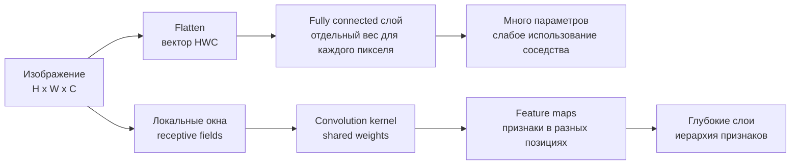

# Images as Tensors and CNN Motivation

Source: `DL_exam.pdf`, Question 09

Original question:

> Изображение как тензор и мотивация CNN. Почему полносвязная сеть плохо использует структуру изображения.

## Интуиция

Изображение - это не просто длинный вектор чисел. В нем есть пространственная структура: соседние пиксели обычно связаны, локальные шаблоны вроде границ и текстур повторяются в разных местах, а небольшое смещение объекта не должно полностью менять смысл картинки. Если развернуть изображение в вектор и подать в обычную fully connected сеть, эта структура почти теряется: модель учит отдельный вес для каждой пары "пиксель-признак" и не знает, что соседние пиксели рядом или что один и тот же фильтр полезен в разных областях изображения.

CNN использует сильный inductive bias для изображений: локальные связи, shared weights и построение иерархии признаков. Первые слои находят простые локальные паттерны, более глубокие - части объектов и объекты. Поэтому CNN обычно требует меньше параметров, лучше обобщает на изображениях и устойчивее к небольшим сдвигам, чем полносвязная сеть сопоставимой выразительности.

## Что нужно сказать на экзамене

- Изображение представляют как тензор: grayscale $H \times W$, RGB $H \times W \times C$ или в PyTorch обычно $C \times H \times W$ для одного объекта и $N \times C \times H \times W$ для batch.
- Каждый пиксель - числовой вектор каналов: например, RGB имеет $C=3$, а значения часто нормализуют из $[0, 255]$ в $[0, 1]$ или стандартизуют по каналам.
- Полносвязный слой после flatten теряет явное понятие соседства: координаты пикселей превращаются в индексы вектора.
- Fully connected сеть имеет много параметров: для входа размера $H \cdot W \cdot C$ и $M$ нейронов нужно $(HWC)M + M$ параметров.
- CNN заменяет глобальную плотную связь локальной сверткой: каждый выходной элемент зависит от небольшого receptive field.
- Один и тот же convolution kernel применяется ко всем позициям, поэтому признаки детектируются независимо от места: это weight sharing.
- Сверточный слой имеет намного меньше параметров: для $K$ фильтров размера $r \times s$ при $C_\text{in}$ входных каналах нужно $K \cdot r \cdot s \cdot C_\text{in} + K$ параметров.
- Основные свойства CNN: locality, translation equivariance, parameter sharing, hierarchical feature learning.
- Ограничение CNN: inductive bias локальности полезен для изображений, но сам по себе не дает полной инвариантности к масштабу, поворотам и сильным деформациям; для этого нужны данные, augmentation, pooling, архитектурные решения или специальные методы.

## Подробный ответ

Цифровое изображение можно рассматривать как дискретную функцию на решетке. Для цветного изображения:

$$
X \in \mathbb{R}^{H \times W \times C},
$$

где $H$ - высота, $W$ - ширина, $C$ - число каналов. Для RGB $C=3$, для grayscale часто $C=1$. Значение $X_{i,j,c}$ - интенсивность канала $c$ в пикселе с координатами $(i,j)$. В практических DL-фреймворках данные часто хранятся как batch:

$$
X \in \mathbb{R}^{N \times C \times H \times W},
$$

где $N$ - размер batch. Такая форма удобна для параллельной обработки и для применения одинаковых операций ко всем изображениям в batch.

Главная особенность изображения - пространственная регулярность. Близкие пиксели часто образуют осмысленные локальные структуры: края, углы, текстуры, цветовые переходы. Эти структуры могут встречаться в разных местах изображения. Например, вертикальная граница может быть слева, справа или в центре, но как локальный признак она остается той же.

Если использовать полносвязную сеть, изображение обычно flatten-ится:

$$
x = \operatorname{vec}(X) \in \mathbb{R}^{HWC}.
$$

Первый fully connected слой вычисляет:

$$
h = \phi(Wx + b), \quad W \in \mathbb{R}^{M \times HWC}.
$$

Формально такая сеть может аппроксимировать сложные функции, но для изображений она плохо использует структуру данных:

| Проблема fully connected подхода | Почему это плохо для изображений |
|---|---|
| Потеря явной 2D-структуры после flatten | Сеть не получает встроенного знания, какие пиксели являются соседями |
| Нет shared weights | Один и тот же локальный паттерн в разных местах нужно учить заново разными весами |
| Слишком много параметров | Растет риск overfitting, требуется больше данных и вычислений |
| Нет translation equivariance | Сдвиг объекта меняет набор активируемых входных весов |
| Слабый inductive bias | Модель должна из данных сама выучить свойства, которые заранее известны для изображений |

Пример по числу параметров: изображение $224 \times 224 \times 3$ имеет $150528$ входных чисел. Fully connected слой на $1000$ нейронов требует:

$$
150528 \cdot 1000 + 1000 = 150529000
$$

параметров только в одном слое. При этом каждый нейрон соединен со всеми пикселями сразу, даже если полезный низкоуровневый признак обычно локален.

CNN строится на свертках. Сверточный фильтр смотрит на маленькое окно изображения, например $3 \times 3$ или $5 \times 5$, и применяет один и тот же набор весов ко всем позициям. Для одного выходного канала:

$$
Y_{i,j} = b + \sum_{u=0}^{r-1} \sum_{v=0}^{s-1} \sum_{c=1}^{C_\text{in}} K_{u,v,c} X_{i+u,j+v,c},
$$

где $K$ - kernel размера $r \times s \times C_\text{in}$. На практике обычно используют несколько фильтров, поэтому выход имеет несколько каналов признаков:

$$
Y \in \mathbb{R}^{H_\text{out} \times W_\text{out} \times C_\text{out}}.
$$

Параметры свертки не зависят напрямую от $H$ и $W$: фильтр $3 \times 3$ с $3$ входными каналами и $64$ выходными каналами имеет:

$$
3 \cdot 3 \cdot 3 \cdot 64 + 64 = 1792
$$

параметра. Это на порядки меньше, чем у dense слоя на большом изображении.

Свойство translation equivariance означает: если вход сдвинуть, карта признаков сдвинется примерно так же. Для свертки без учета граничных эффектов:

$$
\operatorname{Conv}(T_\Delta X) = T_\Delta \operatorname{Conv}(X),
$$

где $T_\Delta$ - оператор сдвига. Это не то же самое, что translation invariance. Equivariance сохраняет информацию о положении признака на feature map, а invariance означает, что ответ модели почти не меняется при сдвиге. Инвариантность обычно усиливают pooling, global average pooling, data augmentation и обучением классификатора на верхних слоях.

CNN также строит иерархию receptive fields. Один нейрон первого слоя видит маленькое окно исходного изображения. Нейрон более глубокого слоя видит уже область, соответствующую нескольким локальным окнам предыдущего слоя. Поэтому глубокая CNN может переходить от простых признаков к сложным:

- ранние слои: границы, цветовые контрасты, простые текстуры;
- средние слои: углы, повторяющиеся паттерны, части объектов;
- поздние слои: высокоуровневые комбинации признаков, связанные с классами или объектами.

Важная оговорка: CNN не является магическим решением всех вариаций изображения. Обычная свертка хорошо кодирует локальность и переносимость признаков по координатам, но не гарантирует устойчивость к поворотам, масштабу, изменению освещения, occlusion или сложной деформации объекта. Эти свойства достигаются комбинацией архитектуры, данных, augmentation, нормализации, pooling и функции потерь.

## Формулы / алгоритмы

**Представление изображения**

$$
X \in \mathbb{R}^{H \times W \times C}, \quad X_\text{batch} \in \mathbb{R}^{N \times C \times H \times W}.
$$

**Flatten для fully connected сети**

$$
x = \operatorname{vec}(X), \quad h = \phi(Wx + b), \quad W \in \mathbb{R}^{M \times HWC}.
$$

Число параметров:

$$
\#\text{params}_\text{FC} = (HWC)M + M.
$$

**Сверточный слой**

Для выходного канала $k$:

$$
Y_{i,j,k} = b_k + \sum_{u=0}^{r-1} \sum_{v=0}^{s-1} \sum_{c=1}^{C_\text{in}} K_{u,v,c,k} X_{i+u,j+v,c}.
$$

Число параметров:

$$
\#\text{params}_\text{conv} = r s C_\text{in} C_\text{out} + C_\text{out}.
$$

**Размер выхода свертки**

Для одной пространственной оси:

$$
L_\text{out} = \left\lfloor \frac{L_\text{in} + 2p - d(k-1) - 1}{s} + 1 \right\rfloor,
$$

где $p$ - padding, $d$ - dilation, $k$ - размер kernel, $s$ - stride. Для высоты и ширины формула применяется отдельно.

**Типичный pipeline CNN для изображения**

1. Вход: batch изображений $X \in \mathbb{R}^{N \times C \times H \times W}$.
2. Нормализация значений пикселей и, при обучении, data augmentation.
3. Несколько блоков `Conv -> activation -> normalization -> pooling/stride` или современных вариантов.
4. Получение feature maps с растущим числом каналов и увеличивающимся effective receptive field.
5. Переход к задаче: `global average pooling` и classifier для classification, dense prediction head для segmentation или detection.
6. Обучение через loss и `backpropagation`, как в обычных нейронных сетях.

## Диаграмма или изображение

## Быстрая устная версия

Изображение удобно рассматривать как тензор $H \times W \times C$: высота, ширина и каналы. В batch обычно используют форму $N \times C \times H \times W$. В изображениях важна пространственная структура: соседние пиксели связаны, а одни и те же локальные паттерны встречаются в разных местах.

Если развернуть картинку в вектор и подать в fully connected сеть, модель теряет явное знание о соседстве пикселей, получает очень много параметров и должна заново учить один и тот же признак для разных позиций. CNN решает это с помощью локальных receptive fields и shared weights: один convolution kernel применяется ко всем позициям. Поэтому свертка имеет меньше параметров, лучше использует структуру изображения и дает translation equivariance. Глубокие CNN строят иерархию признаков от границ и текстур к частям объектов и объектам.

## Возможные уточняющие вопросы

**Чем translation equivariance отличается от invariance?**  
Equivariance означает, что при сдвиге входа карта признаков тоже сдвигается. Invariance означает, что итоговый ответ почти не меняется. Свертка дает equivariance, а invariance обычно усиливают pooling, global average pooling, augmentation и обучением.

**Почему shared weights уменьшают число параметров?**  
Один и тот же kernel используется во всех пространственных позициях. Поэтому число параметров зависит от размера фильтра и числа каналов, а не от общего числа пикселей изображения.

**Что такое receptive field?**  
Это область входного изображения, от которой зависит конкретная активация в feature map. В глубоких слоях effective receptive field растет, поэтому нейроны начинают учитывать более крупные структуры.

**Можно ли использовать fully connected сеть для изображений?**  
Можно, особенно для маленьких изображений, но это обычно неэффективно: много параметров, слабое обобщение и отсутствие встроенной локальности. Для больших изображений такой подход быстро становится вычислительно и статистически невыгодным.

**Почему CNN не полностью устойчива к поворотам и масштабу?**  
Обычная свертка делит веса между позициями, но не между поворотами или масштабами. Для этих вариаций нужны augmentation, специальные архитектуры, multi-scale признаки или другие inductive biases.

## Частые ошибки

- Говорить, что flatten полностью уничтожает информацию об изображении. Числа остаются, но архитектура теряет явный inductive bias соседства и локальности.
- Путать translation equivariance и translation invariance: свертка сама по себе в основном эквивариантна, а не инвариантна.
- Считать, что CNN всегда требует меньше вычислений. Параметров обычно меньше, но вычислительная стоимость зависит от размера feature maps, числа каналов и kernel.
- Забывать про каналы: фильтр в обычной свертке имеет размер $r \times s \times C_\text{in}$, а не только $r \times s$.
- Думать, что каждый фильтр ищет признак только в одном фиксированном месте. Наоборот, из-за shared weights фильтр применяется ко всем позициям.
- Утверждать, что CNN автоматически решает все геометрические преобразования. Стандартная CNN не гарантирует устойчивость к масштабу, поворотам и сильным деформациям.
- Называть pooling обязательной частью CNN. Pooling часто используют, но downsampling можно делать и через stride, а современные архитектуры могут комбинировать разные варианты.
