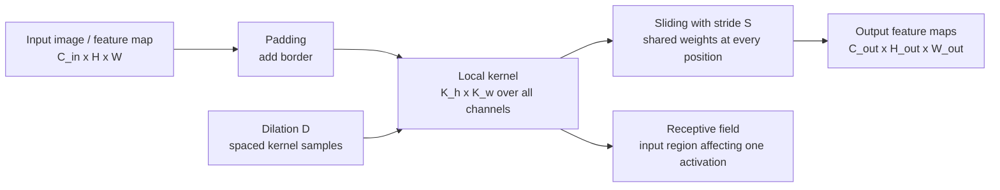

# Операция свертки

Source: `DL_exam.pdf`, Question 10

Original question:

> Операция свертки. Локальность, разделение весов, padding, stride, receptive field, dilation.

## Интуиция

Свертка в CNN заменяет полносвязное соединение на локальный скользящий фильтр. Вместо того чтобы каждый нейрон смотрел сразу на все изображение, фильтр смотрит на небольшой участок, например $3 \times 3$, и применяет одни и те же веса во всех позициях. Поэтому CNN хорошо использует структуру изображения: соседние пиксели обычно связаны, а один и тот же визуальный паттерн может встретиться в разных местах.

Локальность уменьшает число параметров и заставляет слой искать локальные признаки: края, углы, текстуры. Разделение весов (`weight sharing`) делает один фильтр детектором одного типа признака по всему изображению. `padding`, `stride`, `dilation` и `receptive field` задают геометрию этой операции: насколько сохраняется размер, как часто фильтр сдвигается, насколько разреженно он смотрит на вход и какая область исходного изображения влияет на конкретную активацию.

## Что нужно сказать на экзамене

- Сверточный слой принимает тензор $X \in \mathbb{R}^{C_{in} \times H \times W}$ и строит $C_{out}$ feature maps с помощью набора фильтров $W \in \mathbb{R}^{C_{out} \times C_{in} \times K_h \times K_w}$.
- В deep learning обычно реализуют не математическую свертку с переворотом ядра, а cross-correlation; веса все равно обучаются, поэтому различие редко важно.
- Локальность: каждая выходная активация зависит только от локального окна входа.
- Разделение весов: один и тот же фильтр применяется ко всем пространственным позициям, что резко уменьшает число параметров и дает translation equivariance.
- `padding` добавляет рамку вокруг входа, управляет размером выхода и позволяет учитывать края.
- `stride` задает шаг перемещения фильтра; больший stride уменьшает пространственное разрешение.
- `dilation` раздвигает элементы ядра и увеличивает effective kernel size без увеличения числа параметров.
- `receptive field` нейрона - область входного изображения, от которой зависит эта активация; в глубоких сетях он растет от слоя к слою.
- Размер выхода для одной пространственной оси:

$$
H_{out} = \left\lfloor \frac{H + 2P - D(K - 1) - 1}{S} + 1 \right\rfloor,
$$

где $H$ - входной размер, $K$ - размер ядра, $P$ - padding, $S$ - stride, $D$ - dilation.

## Подробный ответ

Рассмотрим 2D convolution для батча изображений. Пусть вход одного объекта имеет форму $C_{in} \times H \times W$, где $C_{in}$ - число каналов, например 3 для RGB. Сверточный слой содержит $C_{out}$ фильтров. Каждый фильтр имеет веса по всем входным каналам и локальному окну размера $K_h \times K_w$, поэтому форма весов:

$$
W \in \mathbb{R}^{C_{out} \times C_{in} \times K_h \times K_w}, \quad b \in \mathbb{R}^{C_{out}}.
$$

Для выходного канала $c$ и позиции $(i, j)$ операция имеет вид:

$$
Y_{c,i,j} =
b_c +
\sum_{q=1}^{C_{in}}
\sum_{u=0}^{K_h-1}
\sum_{v=0}^{K_w-1}
W_{c,q,u,v}
X_{q,\; iS_h + uD_h - P_h,\; jS_w + vD_w - P_w}.
$$

Если индекс входа выходит за границы, значение берется из padding-области, чаще всего из нулей (`zero padding`). Эта формула описывает cross-correlation, потому что ядро не переворачивается по $u, v$. В CNN это стандартная реализация операции, называемой convolution.

Локальность означает, что одна активация смотрит только на ограниченную окрестность входа. Например, при ядре $3 \times 3$ и трех входных каналах один выходной пиксель использует только $3 \cdot 3 \cdot 3 = 27$ входных значений, а не все изображение. Это вводит полезный inductive bias: локальные детали изображения важны, а соседние пиксели статистически связаны.

Разделение весов означает, что один и тот же фильтр используется на всех позициях. Если фильтр научился распознавать вертикальный край, он будет искать такой край в левом верхнем углу, центре и любой другой позиции. Это дает свойство translation equivariance: если сдвинуть вход, карта признаков сдвинется примерно так же, пока не вмешиваются границы, padding, pooling или последующая агрегация. Важно не путать equivariance и invariance: сверточный слой сам по себе не делает классификацию полностью устойчивой к сдвигам, он сохраняет информацию о позиции признака.

Число параметров сверточного слоя:

$$
\#params = C_{out}(C_{in}K_hK_w + 1),
$$

если есть bias. Для сравнения, полносвязный слой между изображением $C_{in}HW$ и выходом $C_{out}H_{out}W_{out}$ имел бы намного больше параметров и не разделял бы знания между позициями.

`Padding` добавляет значения вокруг входа. Основные варианты:

| Вариант | Идея | Практический смысл |
|---|---|---|
| `valid` | $P=0$ | Выход меньше входа, нет искусственной рамки |
| `same` | Padding подбирается для сохранения размера при $S=1$ | Удобно строить глубокие сети без быстрого уменьшения feature maps |
| `zero padding` | За границами стоят нули | Самый частый вариант, но может создавать граничные эффекты |
| reflection/replication | Рамка строится отражением или повтором | Иногда полезно в image restoration и segmentation |

`Stride` - шаг, с которым окно перемещается по входу. При $S=1$ фильтр применяется к соседним позициям. При $S=2$ выходная карта примерно вдвое меньше по высоте и ширине, то есть stride выполняет downsampling. Цена большего stride - потеря пространственной детализации; преимущество - меньше вычислений и больше effective receptive field на следующих слоях.

`Dilation` вставляет промежутки между элементами ядра. При $K=3$ и $D=2$ фильтр покрывает область эффективного размера $5$, но обучаемых весов остается 3 по каждой оси. Effective kernel size:

$$
K_{eff} = D(K - 1) + 1.
$$

Dilated convolution полезна, когда нужно увеличить контекст без pooling или большого ядра, например в segmentation. Недостаток - при больших dilation могут возникать разреженные шаблоны покрытия (`gridding artifacts`), когда соседние входные точки плохо смешиваются.

`Receptive field` - область исходного входа, влияющая на конкретную выходную активацию. Для одного слоя без dilation это размер ядра. Для нескольких слоев receptive field растет. Например, две свертки $3 \times 3$ со stride 1 дают receptive field $5 \times 5$, а не $6 \times 6$, потому что окна перекрываются. Важна разница между theoretical receptive field и effective receptive field: теоретически активация зависит от всей области, но фактический вклад разных пикселей может быть неравномерным и часто сильнее около центра.

Практические trade-offs:

- Малые ядра $3 \times 3$ дешевле больших и позволяют добавлять нелинейности между слоями.
- Большой padding сохраняет размер, но усиливает влияние искусственных границ.
- Большой stride быстро уменьшает feature maps, но может потерять мелкие объекты.
- Dilation расширяет контекст без новых параметров, но требует аккуратного выбора, особенно в dense prediction.
- Свертка хорошо кодирует локальность и переносимость признаков, но хуже моделирует дальние зависимости без глубины, больших receptive fields или attention-механизмов.

## Формулы / алгоритмы

Формула выходного размера для двух осей:

$$
H_{out} = \left\lfloor \frac{H + 2P_h - D_h(K_h - 1) - 1}{S_h} + 1 \right\rfloor,
$$

$$
W_{out} = \left\lfloor \frac{W + 2P_w - D_w(K_w - 1) - 1}{S_w} + 1 \right\rfloor.
$$

Эквивалентная запись через effective kernel size:

$$
K_{eff,h} = D_h(K_h - 1) + 1, \quad
K_{eff,w} = D_w(K_w - 1) + 1,
$$

$$
H_{out} = \left\lfloor \frac{H + 2P_h - K_{eff,h}}{S_h} + 1 \right\rfloor.
$$

Параметры и вычислительная сложность:

$$
\#params = C_{out}(C_{in}K_hK_w + 1),
$$

$$
\#MACs \approx H_{out}W_{out}C_{out}C_{in}K_hK_w.
$$

Рекуррентный расчет receptive field по слоям. Пусть $r_l$ - receptive field после слоя $l$, $j_l$ - шаг между соседними активациями слоя $l$ в координатах исходного изображения (`jump`), $K_l$ - kernel size, $S_l$ - stride, $D_l$ - dilation. Начинаем с $r_0=1$, $j_0=1$:

$$
r_l = r_{l-1} + (K_l - 1)D_lj_{l-1},
$$

$$
j_l = j_{l-1}S_l.
$$

Операционный pipeline сверточного слоя:

1. Получить вход $X$ формы $N \times C_{in} \times H \times W$.
2. Добавить padding по высоте и ширине.
3. Для каждой позиции окна с шагом stride выбрать локальный patch.
4. Для каждого выходного канала посчитать скалярное произведение patch с соответствующим фильтром по всем входным каналам.
5. Добавить bias, получить feature map.
6. Обычно применить нелинейность, например ReLU, и передать результат дальше.

## Диаграмма или изображение

Внешние изображения не использовались; диаграмма воссоздает механизм как Mermaid-схему.

## Быстрая устная версия

Свертка - это локальный фильтр, который скользит по изображению и применяет одни и те же веса во всех позициях. Вход имеет каналы, и каждый фильтр смотрит на маленькое окно по всем входным каналам, после чего создает одну выходную feature map. Локальность уменьшает число связей, weight sharing уменьшает число параметров и дает translation equivariance.

Геометрия задается padding, stride и dilation. Padding контролирует границы и размер выхода, stride задает шаг и может уменьшать разрешение, dilation раздвигает элементы ядра и увеличивает контекст без увеличения числа весов. Receptive field - это область исходного изображения, от которой зависит конкретная активация; в глубоких CNN он растет от слоя к слою.

## Возможные уточняющие вопросы

- Чем convolution в CNN отличается от математической свертки? В CNN обычно используется cross-correlation без переворота ядра; из-за обучения весов это не меняет выразительность слоя.
- Что такое weight sharing? Один набор весов фильтра применяется ко всем пространственным позициям, поэтому один детектор признака работает по всему изображению.
- Почему свертка дает translation equivariance, а не invariance? При сдвиге входа feature map тоже сдвигается; инвариантность обычно появляется позже за счет pooling, global average pooling, augmentation или архитектурных решений.
- Как padding влияет на выход? Он может сохранить пространственный размер и дать фильтру доступ к краевым пикселям, но добавляет искусственные значения около границы.
- Что делает stride больше 1? Он пропускает часть позиций окна, уменьшает $H_{out}$ и $W_{out}$, снижает вычисления, но теряет детализацию.
- Зачем нужна dilation? Чтобы увеличить receptive field и контекст без увеличения числа параметров и без явного downsampling.
- Почему две свертки $3 \times 3$ часто лучше одной $5 \times 5$? У них похожий receptive field, но меньше параметров при одинаковых каналах и между ними можно поставить нелинейность.
- От чего зависит число параметров? От $C_{in}$, $C_{out}$ и размера ядра, но не от $H$ и $W$ входного изображения.

## Частые ошибки

- Говорить, что сверточный слой полностью инвариантен к сдвигам. Правильнее: он примерно equivariant к сдвигам.
- Забывать, что фильтр проходит по всем входным каналам, а не только по одному 2D-слою.
- Путать padding и stride: padding влияет на границы и размер, stride - на шаг скольжения и downsampling.
- Использовать формулу размера выхода без dilation или с неверным $-1$ в числителе.
- Думать, что `same padding` всегда означает ровно тот же размер: это верно в простом случае $S=1$; при $S>1$ соглашения зависят от фреймворка.
- Путать receptive field одного слоя с receptive field всей глубокой сети.
- Считать, что dilation увеличивает число параметров. Она увеличивает effective kernel size, но число весов ядра не меняется.
- Игнорировать граничные эффекты: около краев фильтр видит padding, а не реальные пиксели.
