# Basic CNN for Image Classification

Source: `DL_exam.pdf`, Question 11

Original question:

> Базовая CNN для классификации изображений. Feature maps, conv, pooling, classifier head.

## Интуиция

Базовая `CNN` для классификации изображений строит иерархию признаков. На входе есть изображение как тензор пикселей: локальные соседние пиксели образуют края и текстуры, из них складываются части объектов, а в конце модель должна выбрать один из классов. Поэтому вместо полного соединения каждого пикселя с каждым нейроном `CNN` использует локальные фильтры, которые скользят по изображению и переиспользуют одни и те же веса в разных местах.

`Feature map` - это карта откликов некоторого фильтра или канала признаков. Если фильтр научился находить вертикальные границы, его feature map показывает, где на изображении есть такие границы. Несколько фильтров дают несколько каналов, то есть несколько разных признаков на одной пространственной сетке.

Типичная CNN состоит из повторяющихся блоков `conv -> nonlinearity -> optional normalization -> pooling/downsampling`, которые извлекают признаки, и `classifier head`, который превращает финальное представление в `logits` классов. Главная идея для экзамена: convolutional layers отвечают за локальные признаки и weight sharing, pooling/downsampling уменьшают spatial resolution и повышают устойчивость к малым сдвигам, а head агрегирует признаки и решает задачу классификации.

## Что нужно сказать на экзамене

- Вход изображения обычно имеет форму `[N, C, H, W]`: batch, channels, height, width. Для RGB $C=3$.
- `Convolution layer` применяет набор обучаемых фильтров размера $K_h \times K_w$ к локальным окнам входа и строит выходные feature maps.
- Каждый output channel соответствует одному фильтру; число фильтров равно числу выходных каналов $C_{\text{out}}$.
- `Weight sharing` означает, что один и тот же фильтр применяется ко всем пространственным позициям, поэтому параметров меньше, чем в fully connected слое.
- `Local receptive field` означает, что каждый выходной элемент зависит только от локального окна входа; в глубоких слоях effective receptive field растет.
- После conv обычно ставят `ReLU` или другую нелинейность, иначе композиция линейных conv-слоев оставалась бы линейным преобразованием.
- `Pooling` или strided convolution уменьшают $H$ и $W$, снижают вычисления и дают некоторую устойчивость к малым сдвигам.
- `Max pooling` берет максимум в окне, `average pooling` берет среднее; `global average pooling` усредняет каждый канал по всей spatial grid.
- `Classifier head` преобразует финальные признаки в вектор `logits` размера `num_classes`; softmax интерпретирует logits как вероятности.
- Для multi-class classification обычно используют `CrossEntropyLoss`, которая объединяет `log_softmax` и negative log likelihood.
- Базовая архитектура: несколько conv blocks, затем flatten или global average pooling, затем один или несколько linear layers.
- Важно следить за shapes, padding, stride, размером receptive field, числом параметров и различием между logits, probabilities и predicted class.

## Подробный ответ

### Общий вид задачи

В задаче классификации изображений есть датасет:

$$
\mathcal{D} = \{(x_i, y_i)\}_{i=1}^{N},
$$

где $x_i \in \mathbb{R}^{C \times H \times W}$ - изображение, а $y_i \in \{1,\dots,K\}$ - номер класса. Модель $f_\theta$ строит вектор:

$$
z = f_\theta(x) \in \mathbb{R}^{K},
$$

где $z_k$ - `logit` класса $k$. Предсказанный класс:

$$
\hat y = \arg\max_k z_k.
$$

Вероятности получают через `softmax`:

$$
p(y=k \mid x) =
\frac{\exp(z_k)}{\sum_{j=1}^{K}\exp(z_j)}.
$$

Обучение обычно минимизирует cross-entropy:

$$
L(x,y) = -\log p(y \mid x).
$$

В PyTorch для этого часто используют `nn.CrossEntropyLoss`: на вход ей передают raw logits shape `[N, K]` и target indices shape `[N]`, а не probabilities после softmax.

### Feature maps

Пусть входной batch имеет форму:

$$
X \in \mathbb{R}^{N \times C_{\text{in}} \times H \times W}.
$$

После convolutional layer выход имеет форму:

$$
Y \in \mathbb{R}^{N \times C_{\text{out}} \times H_{\text{out}} \times W_{\text{out}}}.
$$

Каждый канал $Y_{:, c, :, :}$ - это feature map. Он показывает, где и насколько сильно сработал соответствующий фильтр. Ранние feature maps часто кодируют простые локальные признаки: edges, corners, colors, textures. Более глубокие feature maps кодируют более абстрактные паттерны: части объектов, формы и class-specific evidence.

Важные свойства feature maps:

| Свойство | Смысл |
|---|---|
| Spatial grid | Сохраняет расположение признаков по высоте и ширине |
| Channels | Разные типы признаков на одной сетке |
| Activation value | Сила отклика признака в конкретной позиции |
| Depth hierarchy | В глубоких слоях признаки становятся более абстрактными |

### Convolution layer

Для одного примера, одного output channel $o$ и позиции $(i,j)$ дискретная convolution в deep learning обычно реализуется как cross-correlation:

$$
Y_{o,i,j} =
b_o +
\sum_{c=1}^{C_{\text{in}}}
\sum_{u=0}^{K_h-1}
\sum_{v=0}^{K_w-1}
W_{o,c,u,v}
X_{c, i\cdot S_h + u - P_h, j\cdot S_w + v - P_w}.
$$

Здесь $W \in \mathbb{R}^{C_{\text{out}} \times C_{\text{in}} \times K_h \times K_w}$ - веса фильтров, $b_o$ - bias, $S$ - stride, $P$ - padding. Если индекс выходит за границы входа, padding обычно трактуется как добавление нулей.

Размер выхода:

$$
H_{\text{out}} =
\left\lfloor
\frac{H + 2P_h - K_h}{S_h}
\right\rfloor + 1,
\qquad
W_{\text{out}} =
\left\lfloor
\frac{W + 2P_w - K_w}{S_w}
\right\rfloor + 1.
$$

Число параметров conv-слоя:

$$
C_{\text{out}} \cdot C_{\text{in}} \cdot K_h \cdot K_w + C_{\text{out}},
$$

если используется bias. Это число не зависит от $H$ и $W$, потому что фильтры разделяются между позициями. Для сравнения, fully connected layer от всего изображения имел бы число параметров, зависящее от $C_{\text{in}}HW$.

Основные гиперпараметры conv:

| Параметр | Эффект |
|---|---|
| Kernel size | Размер локального окна и локального receptive field |
| Stride | Шаг скольжения; при $S>1$ уменьшает resolution |
| Padding | Контроль границ и сохранения spatial size |
| Number of filters | Число output channels и емкость признаков |
| Dilation | Расширяет receptive field без увеличения числа весов |

После conv почти всегда нужна нелинейность:

$$
\operatorname{ReLU}(a) = \max(0,a).
$$

Без нелинейностей последовательность conv-слоев была бы эквивалентна одному линейному оператору и не давала бы богатую иерархию признаков.

### Pooling и downsampling

`Pooling` агрегирует значения в локальных окнах и обычно уменьшает spatial size. Например, max pooling с окном $2 \times 2$ и stride $2$ превращает $H \times W$ примерно в $\frac{H}{2} \times \frac{W}{2}$:

$$
Y_{c,i,j} =
\max_{0 \le u < K_h,\;0 \le v < K_w}
X_{c, iS_h+u, jS_w+v}.
$$

Зачем pooling нужен:

- уменьшает вычислительную стоимость следующих слоев;
- увеличивает effective receptive field последующих признаков;
- делает представление менее чувствительным к малым сдвигам объекта;
- помогает перейти от локальных пиксельных деталей к более крупным паттернам.

Но pooling теряет точную spatial information. Для классификации это часто приемлемо, потому что нужен class label, а не точная маска объекта. Для segmentation и detection чрезмерное downsampling может быть вредным.

В современных CNN downsampling часто делают не только pooling, но и `strided convolution`. Разница: pooling не имеет обучаемых параметров, а strided conv одновременно учит фильтры и уменьшает resolution.

### Classifier head

После нескольких conv blocks модель получает тензор:

$$
F \in \mathbb{R}^{N \times C \times H' \times W'}.
$$

Нужно превратить его в logits классов. Есть два базовых варианта.

Первый вариант - `flatten + fully connected`:

$$
F \mapsto \operatorname{vec}(F) \in \mathbb{R}^{N \times (CH'W')},
$$

затем:

$$
z = \operatorname{Linear}(\operatorname{vec}(F)).
$$

Плюс: простой и выразительный head. Минус: много параметров, особенно если $H'$ и $W'$ велики.

Второй вариант - `global average pooling`:

$$
g_{n,c} =
\frac{1}{H'W'}
\sum_{i=1}^{H'}
\sum_{j=1}^{W'}
F_{n,c,i,j},
$$

после чего:

$$
z = \operatorname{Linear}(g).
$$

Плюс: меньше параметров, меньше overfitting, можно легче работать с разными input sizes. Минус: head слабее хранит точную пространственную конфигурацию, хотя для image classification это часто нормально.

### Пример базовой CNN

Типичная простая архитектура для RGB-изображения:

```text
Input [N, 3, H, W]
-> Conv(3 -> 32, 3x3, padding=1)
-> ReLU
-> MaxPool(2x2)
-> Conv(32 -> 64, 3x3, padding=1)
-> ReLU
-> MaxPool(2x2)
-> Conv(64 -> 128, 3x3, padding=1)
-> ReLU
-> GlobalAveragePooling
-> Linear(128 -> K)
-> logits [N, K]
```

Если padding $1$, kernel $3$, stride $1$, conv сохраняет $H$ и $W$. Каждый max pooling $2 \times 2$ со stride $2$ уменьшает spatial resolution в два раза. Поэтому после двух pooling-слоев spatial size становится примерно $\frac{H}{4} \times \frac{W}{4}$.

### Почему CNN подходит для изображений

Изображения имеют локальную структуру: соседние пиксели статистически связаны, а один и тот же признак может появиться в разных местах. CNN использует эти свойства через inductive biases:

| Bias | Как реализован | Почему полезен |
|---|---|---|
| Locality | Малые kernels | Признаки строятся из локальных соседств |
| Weight sharing | Один фильтр для всех позиций | Один edge detector работает везде |
| Translation equivariance | Сдвиг входа сдвигает feature map | Модель сохраняет пространственную структуру |
| Downsampling | Pooling или stride | Устойчивость и экономия вычислений |

Важно различать equivariance и invariance. Conv сам по себе скорее translation equivariant: если сдвинуть вход, отклики тоже сдвинутся. Pooling, global average pooling и classifier head добавляют частичную invariance: итоговый класс меньше зависит от точного положения объекта.

## Формулы / алгоритмы

### Основные формулы

Conv output:

$$
Y_{o,i,j} =
b_o +
\sum_{c=1}^{C_{\text{in}}}
\sum_{u=0}^{K_h-1}
\sum_{v=0}^{K_w-1}
W_{o,c,u,v}
X_{c, iS_h + u - P_h, jS_w + v - P_w}.
$$

Размер после convolution:

$$
H_{\text{out}} =
\left\lfloor
\frac{H + 2P_h - K_h}{S_h}
\right\rfloor + 1,
\qquad
W_{\text{out}} =
\left\lfloor
\frac{W + 2P_w - K_w}{S_w}
\right\rfloor + 1.
$$

Число параметров:

$$
\#\theta_{\text{conv}} =
C_{\text{out}}C_{\text{in}}K_hK_w + C_{\text{out}}.
$$

Softmax:

$$
p_k =
\frac{\exp(z_k)}{\sum_{j=1}^{K}\exp(z_j)}.
$$

Cross-entropy для одного объекта:

$$
L = -\log p_y.
$$

### Операционный pipeline

1. Взять batch изображений $X$ shape `[N, C, H, W]` и labels $y$ shape `[N]`.
2. Нормализовать входы по train-statistics, например по mean/std каналов.
3. Пропустить $X$ через conv blocks: `conv -> activation -> optional norm -> pooling/downsampling`.
4. Получить финальный tensor признаков $F$.
5. Агрегировать признаки через `flatten` или `global average pooling`.
6. Применить `classifier head` и получить logits $z$ shape `[N, K]`.
7. Посчитать `CrossEntropyLoss(z, y)`.
8. Во время обучения выполнить `backpropagation` и шаг optimizer.
9. На inference взять $\arg\max_k z_k$ как predicted class.

Практические caveats:

- Complexity conv примерно $O(NH_{\text{out}}W_{\text{out}}C_{\text{out}}C_{\text{in}}K_hK_w)$.
- Увеличение channels повышает емкость, но увеличивает память и compute.
- Слишком раннее сильное downsampling может потерять мелкие признаки.
- Слишком большой fully connected head может переобучаться.
- Для маленьких датасетов полезны data augmentation, weight decay, dropout или transfer learning.

## Диаграмма или изображение

```mermaid
flowchart LR
    A["Image batch<br/>[N, C, H, W]"] --> B["Conv filters<br/>local receptive fields"]
    B --> C["Feature maps<br/>[N, C1, H, W]"]
    C --> D["ReLU / normalization"]
    D --> E["Pooling or stride<br/>downsampling"]
    E --> F["Deeper conv blocks<br/>more channels, smaller grid"]
    F --> G["Global average pooling<br/>or flatten"]
    G --> H["Classifier head<br/>Linear layers"]
    H --> I["Logits<br/>[N, K]"]
    I --> J["Softmax / argmax<br/>class prediction"]
```



Внешние изображения не использовались.

## Быстрая устная версия

Базовая CNN для классификации принимает изображение как тензор `[N, C, H, W]` и строит иерархию feature maps. Conv-слой применяет обучаемые локальные фильтры ко всем позициям изображения; каждый фильтр дает один output channel. Благодаря locality и weight sharing модель имеет меньше параметров и хорошо подходит для изображений.

После conv ставят нелинейность, обычно `ReLU`, иногда normalization. Pooling или strided conv уменьшают spatial resolution, снижают вычисления и дают частичную устойчивость к малым сдвигам. После нескольких conv blocks остается тензор признаков, который classifier head через flatten или global average pooling превращает в logits классов. Для обучения используют softmax cross-entropy, а предсказание берут как `argmax` по logits.

## Возможные уточняющие вопросы

**Что такое feature map?**  
Карта откликов одного канала признаков. Она показывает, где на spatial grid обнаружен соответствующий learned pattern.

**Чем convolution лучше fully connected слоя для изображения?**  
Conv использует локальность и weight sharing: параметров меньше, признаки можно искать в любом месте, сохраняется spatial structure.

**Почему после conv нужна нелинейность?**  
Без нелинейности последовательность линейных conv-слоев сводится к одному линейному преобразованию и не может строить сложные признаки.

**Что делает pooling?**  
Агрегирует локальные значения, уменьшает spatial size, снижает compute и делает признаки менее чувствительными к небольшим сдвигам.

**Max pooling или average pooling?**  
Max pooling выбирает самый сильный локальный отклик и часто полезен для наличия признака. Average pooling усредняет информацию и часто используется как global average pooling перед classifier head.

**Что такое classifier head?**  
Последняя часть сети, которая агрегирует final feature maps и выдает logits по классам, обычно через linear layer или MLP.

**Нужно ли применять softmax перед CrossEntropyLoss?**  
В PyTorch нет: `nn.CrossEntropyLoss` ожидает raw logits и внутри использует стабильный `log_softmax`.

**Как меняется receptive field в глубокой CNN?**  
Каждый следующий слой видит комбинации локальных признаков предыдущего слоя, поэтому effective receptive field относительно исходного изображения растет.

**Чем stride отличается от pooling?**  
Stride в conv уменьшает resolution обучаемой операцией, а pooling обычно фиксированно агрегирует значения без обучаемых параметров.

## Частые ошибки

- Путать shape `[N, C, H, W]` и `[N, H, W, C]`; в PyTorch conv-слои обычно ожидают `NCHW`.
- Называть output conv-слоя "одной картинкой", забывая, что это набор feature maps по каналам.
- Думать, что softmax обязателен перед loss; для `CrossEntropyLoss` нужны logits.
- Забывать padding и получать неожиданное уменьшение spatial size после conv.
- Считать, что pooling всегда улучшает качество; он может потерять важные spatial details.
- Путать translation equivariance conv-слоев и translation invariance всей классификационной модели.
- Делать слишком большой `flatten + fully connected` head и получать много параметров и overfitting.
- Не учитывать, что число параметров conv зависит от channels и kernel size, но не от spatial size входа.
- Забывать, что pooling обычно не меняет число channels, а conv может менять.
- Интерпретировать feature maps как вручную заданные фильтры; в CNN фильтры обучаются из данных через backpropagation.
