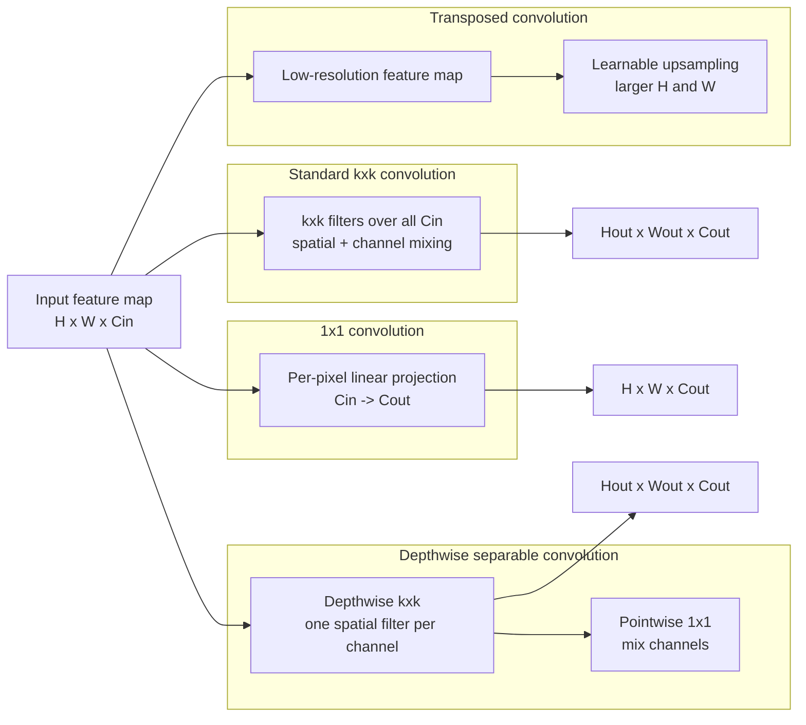

# Efficient and Specialized Convolutions

Source: `DL_exam.pdf`, Question 12

Original question:

> Виды сверток и эффективные операции. 1x1 convolution, separable/depthwise convolution, transposed convolution.

## Интуиция

Обычная convolution одновременно делает две вещи: смотрит на локальную окрестность в пространстве и смешивает каналы. Это выразительно, но дорого: для каждого выходного канала нужен отдельный $k \times k$ фильтр по всем входным каналам. Эффективные варианты сверток пытаются разложить эту операцию на более дешевые части или изменить ее геометрический смысл.

`1x1 convolution` работает как одинаковый linear layer в каждой spatial position: она не видит соседние пиксели, зато дешево смешивает каналы, меняет их число и строит bottleneck. `Depthwise separable convolution` разделяет spatial filtering и channel mixing: сначала отдельный фильтр для каждого канала, затем `1x1 convolution` для смешивания каналов. `Transposed convolution` используется для learnable upsampling: она увеличивает spatial resolution и часто встречается в decoder-сетях, segmentation и generative models.

## Что нужно сказать на экзамене

- Для входа $X \in \mathbb{R}^{H \times W \times C_{in}}$ обычная $k \times k$ convolution с $C_{out}$ фильтрами имеет $k^2 C_{in} C_{out}$ параметров и примерно $H_{out} W_{out} k^2 C_{in} C_{out}$ MACs.
- `1x1 convolution`: ядро $1 \times 1$, параметры $C_{in} C_{out}$; смешивает каналы независимо в каждой точке, меняет размерность каналов, используется в bottleneck blocks, projections, network-in-network, Inception, ResNet bottleneck, MobileNet.
- `Depthwise convolution`: отдельная spatial convolution для каждого входного канала; в PyTorch это обычно `groups=C_in`. Без `1x1` она почти не смешивает информацию между каналами.
- `Depthwise separable convolution`: `depthwise kxk` плюс `pointwise 1x1`; параметры $k^2 C_{in} + C_{in} C_{out}$ вместо $k^2 C_{in} C_{out}$.
- Экономия depthwise separable convolution относительно обычной:

$$
\frac{k^2 C_{in} + C_{in} C_{out}}{k^2 C_{in} C_{out}}
= \frac{1}{C_{out}} + \frac{1}{k^2}.
$$

- `Spatial separable convolution` не то же самое, что `depthwise separable`: spatial separable раскладывает $k \times k$ на $k \times 1$ и $1 \times k$, а depthwise separable разделяет spatial filtering по каналам и channel mixing.
- `Transposed convolution` не является математически гарантированной обратной convolution. Это операция, соответствующая градиенту обычной convolution по входу, и она может увеличивать размер feature map.
- Для transposed convolution важно знать формулу размера:

$$
H_{out} = (H_{in} - 1)s - 2p + d(k - 1) + \text{output\_padding} + 1.
$$

- Главные caveats: depthwise операции могут быть memory-bound и хуже использовать hardware без оптимизированной реализации; transposed convolution может давать checkerboard artifacts.

## Подробный ответ

Пусть обычная двумерная convolution принимает feature map $X$ с $C_{in}$ каналами и строит $C_{out}$ выходных каналов. Для каждого выходного канала используется набор весов размера $k \times k \times C_{in}$. Один выходной пиксель получается как сумма по пространственной окрестности и по всем входным каналам:

$$
Y_{i,j,o} =
\sum_{u=0}^{k-1}
\sum_{v=0}^{k-1}
\sum_{c=1}^{C_{in}}
W_{u,v,c,o} X_{i+u,j+v,c} + b_o.
$$

Такая операция хорошо извлекает локальные признаки, но ее стоимость быстро растет с $k$, $C_{in}$ и $C_{out}$:

$$
\text{Params}_{standard} = k^2 C_{in} C_{out}, \qquad
\text{MACs}_{standard} \approx H_{out} W_{out} k^2 C_{in} C_{out}.
$$

### 1x1 convolution

`1x1 convolution` имеет spatial kernel $1 \times 1$. Для каждой позиции $(i,j)$ она применяет одну и ту же матрицу весов к вектору каналов:

$$
Y_{i,j,:} = W X_{i,j,:} + b, \qquad W \in \mathbb{R}^{C_{out} \times C_{in}}.
$$

Интуитивно это channel-wise linear projection, одинаковая для всех пикселей. Она не расширяет receptive field, если стоит одна, но позволяет:

- уменьшать число каналов перед дорогой $3 \times 3$ convolution;
- увеличивать число каналов после compact representation;
- смешивать информацию между каналами после depthwise convolution;
- делать projection в residual blocks, если надо согласовать размерности;
- строить bottleneck: например $1 \times 1$ reduce, затем $3 \times 3$, затем $1 \times 1$ expand.

Параметры и вычисления:

$$
\text{Params}_{1 \times 1} = C_{in} C_{out}, \qquad
\text{MACs}_{1 \times 1} \approx H W C_{in} C_{out}.
$$

Хотя ядро маленькое, `1x1 convolution` может занимать значительную часть вычислений, особенно в efficient CNN, потому что она выполняется для всех spatial positions и часто имеет много каналов.

### Grouped convolution

`Grouped convolution` делит каналы на $g$ групп. Каждая группа входных каналов соединена только со своей группой выходных каналов. Это промежуточный вариант между обычной convolution и depthwise convolution.

Если $C_{in}$ и $C_{out}$ делятся на $g$, число параметров:

$$
\text{Params}_{grouped} = k^2 \frac{C_{in}}{g} C_{out}
= \frac{k^2 C_{in} C_{out}}{g}.
$$

При $g=1$ получаем обычную convolution. При $g=C_{in}$ и обычно $C_{out}=C_{in}$ получаем depthwise convolution. Grouped convolution использовалась, например, в AlexNet по инженерным причинам и в ResNeXt как способ увеличить cardinality.

### Depthwise и depthwise separable convolution

`Depthwise convolution` применяет отдельный $k \times k$ spatial filter к каждому входному каналу:

$$
Y_{i,j,c} =
\sum_{u=0}^{k-1}
\sum_{v=0}^{k-1}
D_{u,v,c} X_{i+u,j+v,c}.
$$

Параметры:

$$
\text{Params}_{depthwise} = k^2 C_{in}.
$$

Ключевое ограничение: такая операция не смешивает каналы. Если после нее не поставить `1x1 convolution`, каждый канал обрабатывается почти независимо, и модель может потерять выразительность.

`Depthwise separable convolution` исправляет это разложением:

1. `Depthwise kxk`: извлечь spatial patterns отдельно в каждом канале.
2. `Pointwise 1x1`: смешать каналы и получить $C_{out}$ выходных каналов.

Общее число параметров:

$$
\text{Params}_{dw-separable}
= k^2 C_{in} + C_{in} C_{out}.
$$

Сравнение с обычной convolution:

| Операция | Что делает | Параметры | Смешивает каналы | Меняет spatial size |
|---|---|---:|---|---|
| Standard $k \times k$ | Spatial filtering + channel mixing вместе | $k^2 C_{in} C_{out}$ | Да | Зависит от stride/padding |
| $1 \times 1$ | Channel mixing в каждой точке | $C_{in} C_{out}$ | Да | Обычно нет |
| Depthwise $k \times k$ | Spatial filtering отдельно по каналам | $k^2 C_{in}$ | Нет | Зависит от stride/padding |
| Depthwise separable | Depthwise $k \times k$ + pointwise $1 \times 1$ | $k^2 C_{in} + C_{in} C_{out}$ | Да, на втором шаге | Зависит от depthwise stride |
| Grouped $k \times k$ | Standard convolution внутри групп каналов | $\frac{k^2 C_{in} C_{out}}{g}$ | Только внутри групп | Зависит от stride/padding |
| Transposed convolution | Learnable upsampling | $k^2 C_{in} C_{out}$ | Да | Обычно увеличивает |

Например, для $k=3$ и большого $C_{out}$ depthwise separable convolution требует примерно около $\frac{1}{9}$ вычислений от обычной convolution плюс небольшой член $\frac{1}{C_{out}}$. Это основа MobileNet-подобных архитектур. Практически выигрыш зависит от реализации: маленькие depthwise kernels могут быть ограничены memory bandwidth, а не только количеством арифметических операций.

### Spatial separable convolution

`Spatial separable convolution` раскладывает $k \times k$ spatial kernel на две последовательные операции $k \times 1$ и $1 \times k$:

$$
k^2 C_{in} C_{out}
\quad \rightarrow \quad
k C_{in} C_{mid} + k C_{mid} C_{out}.
$$

Это полезно, если фильтр можно хорошо аппроксимировать разложением по пространственным измерениям. Но это другой тип separability: здесь разделяются height и width, а не spatial и channel dimensions.

### Transposed convolution

`Transposed convolution` используется, когда нужно перейти от маленькой feature map к большей: segmentation decoder, autoencoder, GAN generator, super-resolution. Название связано с тем, что если обычную convolution представить как умножение на большую разреженную матрицу $A$, то transposed convolution соответствует умножению на $A^\top$.

Важно: это не "обратная свертка" в смысле восстановления исходного изображения. Обычная convolution со stride может терять информацию, и transposed convolution не обязана ее восстановить. Это learnable операция, которая обучается генерировать более плотную spatial representation.

Для одной spatial dimension размер выхода:

$$
H_{out} = (H_{in} - 1)s - 2p + d(k - 1) + \text{output\_padding} + 1,
$$

где $s$ -- stride, $p$ -- padding, $d$ -- dilation, $k$ -- kernel size. Аналогично считается ширина.

Один способ понимать transposed convolution:

1. Между соседними входными значениями вставляются нули, если $s > 1$.
2. Полученная разреженная карта обрабатывается learnable kernel.
3. Padding и output padding задают точный spatial size.

На практике реализация может не вставлять нули явно, но математическая интуиция полезна для экзамена. Главный artifact -- checkerboard pattern, когда разные выходные пиксели получают разное число вкладов из-за uneven overlap. Частые альтернативы: `resize + convolution`, `PixelShuffle`, carefully chosen kernel/stride, bilinear initialization.

## Формулы / алгоритмы

### Размер выхода обычной convolution

Для одной spatial dimension:

$$
H_{out}
=
\left\lfloor
\frac{H_{in} + 2p - d(k - 1) - 1}{s}
+ 1
\right\rfloor.
$$

### Размер выхода transposed convolution

$$
H_{out} = (H_{in} - 1)s - 2p + d(k - 1) + \text{output\_padding} + 1.
$$

### Стоимость основных операций

Пусть выходная карта имеет размер $H_{out} \times W_{out}$.

$$
\text{MACs}_{standard} \approx H_{out} W_{out} k^2 C_{in} C_{out}.
$$

$$
\text{MACs}_{1 \times 1} \approx H_{out} W_{out} C_{in} C_{out}.
$$

$$
\text{MACs}_{depthwise} \approx H_{out} W_{out} k^2 C_{in}.
$$

$$
\text{MACs}_{dw-separable}
\approx H_{out} W_{out}(k^2 C_{in} + C_{in} C_{out}).
$$

### Pipeline depthwise separable convolution

Вход: feature map $X \in \mathbb{R}^{H \times W \times C_{in}}$.

Выход: feature map $Y \in \mathbb{R}^{H' \times W' \times C_{out}}$.

1. Применить $C_{in}$ независимых spatial filters $D_c \in \mathbb{R}^{k \times k}$:

$$
Z_{:,:,c} = D_c * X_{:,:,c}.
$$

2. Смешать каналы через pointwise convolution:

$$
Y_{i,j,o} = \sum_{c=1}^{C_{in}} P_{c,o} Z_{i,j,c} + b_o.
$$

3. Обычно добавить `BatchNorm` и nonlinearity после одной или обеих стадий, в зависимости от архитектуры.

Практические caveats: экономия по MACs не всегда равна ускорению wall-clock; важны layout тензоров, kernel fusion, SIMD/GPU kernels, batch size и memory access.

## Диаграмма или изображение

Внешние изображения не использовались.

## Быстрая устная версия

Обычная convolution дорогая, потому что каждый $k \times k$ фильтр смотрит на все входные каналы: $k^2 C_{in} C_{out}$ параметров. `1x1 convolution` -- это linear projection по каналам в каждой spatial position, она нужна для channel mixing, bottleneck и изменения числа каналов. `Depthwise convolution` применяет отдельный spatial filter к каждому каналу, а `depthwise separable convolution` добавляет после нее `1x1 convolution`; поэтому стоимость становится $k^2 C_{in} + C_{in} C_{out}$ вместо $k^2 C_{in} C_{out}$. `Transposed convolution` -- learnable upsampling, связанный с транспонированной матрицей обычной convolution, но не настоящая обратная операция; ее надо аккуратно использовать из-за checkerboard artifacts.

## Возможные уточняющие вопросы

- Чем `1x1 convolution` отличается от fully connected layer?  
  Она применяет одну и ту же матрицу ко всем spatial positions и сохраняет spatial grid; fully connected обычно разрушает spatial structure.

- Увеличивает ли `1x1 convolution` receptive field?  
  Нет, сама по себе не увеличивает. Она смешивает только каналы в одной точке.

- Почему depthwise convolution без pointwise convolution слабее обычной?  
  Потому что она не смешивает каналы: каждый канал фильтруется отдельно, и cross-channel interactions почти отсутствуют.

- Что значит `groups=C_in` в convolution layer?  
  Это depthwise convolution, если число групп равно числу входных каналов и каждый входной канал обрабатывается своим фильтром.

- В чем разница между depthwise separable и spatial separable convolution?  
  Depthwise separable разделяет spatial filtering и channel mixing; spatial separable раскладывает $k \times k$ ядро на $k \times 1$ и $1 \times k$.

- Почему transposed convolution может давать checkerboard artifacts?  
  Из-за uneven overlap: разные выходные пиксели получают разное число вкладов от kernel, особенно при неудачной паре kernel size и stride.

- Какие есть альтернативы transposed convolution для upsampling?  
  `Bilinear/nearest resize + convolution`, `PixelShuffle`, interpolation-based decoder blocks, иногда unpooling с indices.

- Является ли transposed convolution deconvolution?  
  В разговорной речи ее иногда так называют, но строго это не inverse convolution и не обязательно восстанавливает исходный сигнал.

## Частые ошибки

- Называть transposed convolution "обратной сверткой" без оговорки, что это не математическая inverse operation.
- Считать, что `1x1 convolution` работает по пространственной окрестности. Она работает только по каналам в фиксированной точке.
- Путать `depthwise separable convolution` и `spatial separable convolution`.
- Забывать, что depthwise convolution сама по себе не смешивает каналы.
- Сравнивать только число параметров и забывать про MACs, memory bandwidth и качество hardware kernels.
- Думать, что depthwise separable convolution всегда лучше обычной: она дешевле, но может снижать accuracy или давать меньшую representational capacity.
- Ошибаться в формуле transposed convolution, особенно в роли `output_padding`: он помогает выбрать размер выхода, но не добавляет learnable pixels.
- Не учитывать stride, padding и dilation при расчете spatial size.
