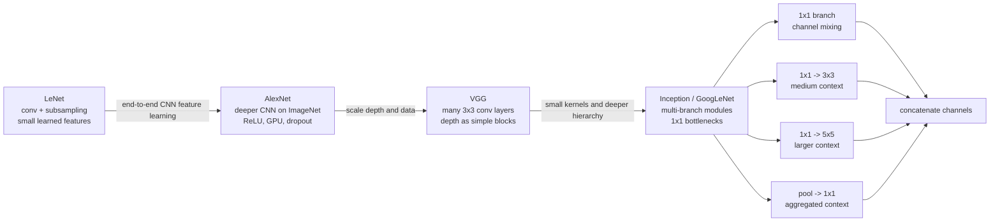

# Classic CNN Architectures

Source: `DL_exam.pdf`, Question 13

Original question:

> Классические CNN-архитектуры. LeNet, AlexNet, VGG, Inception: как развивались идеи глубины, сверток и feature extraction.

## Интуиция

Классические `CNN`-архитектуры показывают, как сверточные сети превратились из небольших моделей для распознавания цифр в глубокие feature extractors для сложных изображений. Общая идея одна: ранние слои ищут простые локальные признаки, средние слои собирают их в текстуры и части объектов, поздние слои строят высокоуровневое представление для классификатора.

`LeNet` доказала, что можно обучать локальные фильтры и использовать `subsampling` вместо ручного feature engineering. `AlexNet` показала, что глубокая CNN на большом датасете и GPU может резко улучшить качество на ImageNet: важны `ReLU`, data augmentation, dropout и достаточно большая емкость. `VGG` упростила архитектурный принцип: много одинаковых маленьких сверток $3 \times 3$ лучше, чем несколько крупных фильтров, потому что глубина добавляет нелинейности и увеличивает receptive field. `Inception` сделала следующий шаг: не выбирать один размер фильтра вручную, а параллельно применять несколько масштабов и удешевлять их через $1 \times 1$ bottleneck-свертки.

Для устного ответа важно объяснить не только список моделей, а эволюцию идей: от неглубокого `conv -> pooling -> classifier` к более глубоким и широким сетям, от больших kernels к малым и факторизованным, от ручных признаков к обучаемой иерархии feature extraction.

## Что нужно сказать на экзамене

- `LeNet-5` - ранняя CNN для распознавания рукописных цифр: чередование convolution и subsampling, затем fully connected classifier.
- Главный вклад `LeNet`: локальные receptive fields, разделение весов, downsampling и end-to-end обучение признаков.
- `AlexNet` - глубокая ImageNet-CNN: большие вычисления на GPU, `ReLU`, data augmentation, dropout, max pooling, крупный первый фильтр и несколько conv/FC слоев.
- Главный вклад `AlexNet`: масштабирование CNN на большой датасет и демонстрация силы learned feature extraction против ручных признаков.
- `VGG` - очень простая глубокая сеть из повторяющихся $3 \times 3$ conv blocks и max pooling; известны `VGG-16` и `VGG-19`.
- Главный вклад `VGG`: глубину можно наращивать стандартными малыми свертками; несколько $3 \times 3$ дают большой receptive field дешевле и с большим числом нелинейностей.
- `Inception` / `GoogLeNet` - сеть из Inception-модулей с параллельными ветками $1 \times 1$, $3 \times 3$, $5 \times 5$ и pooling.
- Главный вклад `Inception`: multi-scale feature extraction и $1 \times 1$ bottlenecks для уменьшения числа каналов и вычислений.
- Эволюция: больше depth, лучше nonlinear feature hierarchy, меньше reliance on hand-crafted features, экономия параметров через small kernels, bottlenecks и global average pooling.
- Ограничения классических CNN: много параметров в FC head у AlexNet/VGG, трудность обучения очень глубоких сетей без residual connections, локальный inductive bias плохо моделирует дальние зависимости без большой глубины.

## Подробный ответ

### Общая схема CNN как feature extractor

Классическая CNN для классификации обычно разделяется на две части:

```text
image -> convolutional feature extractor -> classifier head -> logits
```

Сверточная часть сохраняет пространственную структуру и строит иерархию feature maps. При движении вглубь сети обычно:

- spatial resolution $H \times W$ уменьшается из-за pooling или stride;
- число каналов $C$ растет, потому что нужно хранить больше типов признаков;
- receptive field одной активации растет;
- признаки становятся более абстрактными.

Ранние слои часто реагируют на edges, color blobs и простые texture patterns. Средние слои собирают corners, repeated textures и parts. Поздние слои дают class-discriminative признаки, которые можно подать в linear classifier. Поэтому CNN называют обучаемым feature extractor: вместо ручного описания изображения модель сама учит фильтры под задачу.

### LeNet

`LeNet-5` - классическая ранняя CNN для распознавания рукописных цифр, исторически связанная с задачами вроде MNIST и банковских чеков. Типичная схема:

```text
Input 32x32 grayscale
-> Conv
-> Subsampling / pooling
-> Conv
-> Subsampling / pooling
-> Fully connected layers
-> Class scores
```

В `LeNet` уже есть ключевые идеи CNN:

| Идея | Смысл |
|---|---|
| Local receptive fields | Нейрон смотрит на локальное окно, а не на все изображение |
| Weight sharing | Один фильтр применяется во многих позициях |
| Subsampling | Spatial size уменьшается, появляется устойчивость к малым сдвигам |
| Learned features | Признаки обучаются по loss, а не задаются вручную |
| End-to-end training | Все веса подбираются совместно под задачу классификации |

По современным меркам `LeNet` неглубокая и маленькая. В ней использовались не все современные практики: вместо `ReLU` могли применяться saturating activations вроде `tanh`, не было BatchNorm, больших датасетов и современных GPU-тренировочных рецептов. Но архитектурно `LeNet` задала шаблон `conv -> downsampling -> conv -> downsampling -> classifier`.

### AlexNet

`AlexNet` стала переломной архитектурой для ImageNet classification. Она показала, что CNN можно масштабировать на большой датасет с естественными изображениями, если использовать GPU, достаточно большую модель и практические приемы обучения.

Упрощенная схема:

```text
Input RGB image
-> Conv 11x11, stride 4
-> ReLU
-> MaxPool
-> Conv 5x5
-> ReLU
-> MaxPool
-> Conv 3x3
-> Conv 3x3
-> Conv 3x3
-> MaxPool
-> Large fully connected layers
-> Dropout
-> Class logits
```

Главные особенности `AlexNet`:

- `ReLU` ускорила обучение по сравнению с saturating nonlinearities, потому что меньше страдает от vanishing gradients в активной области.
- `GPU training` позволил обучить большую CNN на ImageNet за разумное время.
- `Data augmentation` уменьшала overfitting: случайные crops, flips, изменения цвета.
- `Dropout` в fully connected layers регуляризовал большую classifier head.
- `Max pooling` выполнял downsampling и давал частичную устойчивость к малым сдвигам.
- `Local response normalization` была исторически использована, но позднее в большинстве архитектур ее вытеснили BatchNorm и другие практики.

`AlexNet` все еще использовала крупные свертки в начале, например $11 \times 11$, потому что нужно было быстро уменьшить большое входное изображение и получить широкий receptive field. Позднее стало понятно, что большие kernels часто можно заменить несколькими малыми слоями, сохранив receptive field и добавив больше нелинейностей.

### VGG

`VGG` упростила дизайн CNN: почти вся сеть строится из маленьких сверток $3 \times 3$ со stride 1 и padding, а downsampling делается max pooling. Самые известные варианты - `VGG-16` и `VGG-19`, где число примерно соответствует количеству слоев с обучаемыми весами.

Типичный VGG-блок:

```text
Conv 3x3 -> ReLU
Conv 3x3 -> ReLU
optional Conv 3x3 -> ReLU
MaxPool 2x2
```

Архитектурный принцип `VGG`: увеличивать глубину, сохраняя простые одинаковые building blocks. Это важно по двум причинам.

Во-первых, стек малых сверток увеличивает receptive field. При stride 1 и без dilation две свертки $3 \times 3$ дают effective receptive field $5 \times 5$, а три свертки $3 \times 3$ дают $7 \times 7$.

Во-вторых, между свертками стоят нелинейности, поэтому стек из нескольких малых conv-слоев выразительнее, чем одна большая линейная свертка. Если число каналов одинаковое и равно $C$, то:

$$
\#params(5 \times 5) = 25C^2,
$$

а две свертки $3 \times 3$ имеют:

$$
\#params(3 \times 3 + 3 \times 3) = 18C^2.
$$

То есть похожий receptive field получается дешевле по параметрам и с дополнительной `ReLU` посередине. Для $7 \times 7$ сравнение еще сильнее:

$$
\#params(7 \times 7) = 49C^2,\qquad
\#params(3 \times 3 + 3 \times 3 + 3 \times 3) = 27C^2.
$$

Недостаток `VGG` - большая вычислительная стоимость и очень много параметров в fully connected classifier head. Несмотря на это, VGG стала важным backbone и feature extractor: ее conv-признаки долго использовались для transfer learning, detection, segmentation и perceptual losses.

### Inception / GoogLeNet

`Inception` решает вопрос: какой размер фильтра лучше использовать в данном слое - $1 \times 1$, $3 \times 3$, $5 \times 5$ или pooling? Вместо одного выбора Inception-модуль применяет несколько веток параллельно и затем конкатенирует их по каналам.

Упрощенный Inception-модуль:

```text
input feature map
-> branch 1: 1x1 conv
-> branch 2: 1x1 conv -> 3x3 conv
-> branch 3: 1x1 conv -> 5x5 conv
-> branch 4: pooling -> 1x1 conv
-> concatenate channels
```

Смысл веток:

| Ветка | Что извлекает |
|---|---|
| $1 \times 1$ conv | Channel mixing, локальные channel-wise комбинации |
| $3 \times 3$ conv | Средний локальный контекст |
| $5 \times 5$ conv | Более широкий локальный контекст |
| Pooling branch | Более инвариантные агрегированные признаки |

Ключевой прием - $1 \times 1$ bottleneck-свертки перед дорогими $3 \times 3$ и $5 \times 5$. Они уменьшают число каналов и резко снижают стоимость последующей свертки. Если вход имеет $C_{in}$ каналов, bottleneck имеет $C_{mid}$ каналов, а выход дорогой свертки имеет $C_{out}$ каналов, то без bottleneck:

$$
\#params = K^2 C_{in} C_{out}.
$$

С bottleneck:

$$
\#params = C_{in}C_{mid} + K^2 C_{mid}C_{out}.
$$

Если $C_{mid} \ll C_{in}$, экономия существенная. Поэтому Inception может быть одновременно широкой, глубокой и вычислительно приемлемой.

`GoogLeNet` также популяризовала более легкую classifier head с global average pooling вместо огромных FC-слоев. Это уменьшает число параметров и overfitting. В ранних версиях использовались auxiliary classifiers: дополнительные выходы на промежуточных слоях, которые помогали передавать gradient в глубокую сеть и слегка регуляризовали обучение.

### Сравнение архитектур

| Архитектура | Период и задача | Главная идея | Типичные блоки | Ограничения |
|---|---|---|---|---|
| `LeNet` | Небольшие изображения, цифры | End-to-end learned local features | Conv, subsampling, FC | Маленькая, неглубокая, старые activations |
| `AlexNet` | ImageNet-scale classification | Масштабирование CNN на большие данные и GPU | Conv, ReLU, max pool, large FC, dropout | Много параметров, крупные ранние kernels, тяжелый FC head |
| `VGG` | Глубокая классификация | Глубина через стек $3 \times 3$ conv | Повторяющиеся conv blocks, max pool | Очень много вычислений и FC-параметров |
| `Inception` | Эффективная глубокая CNN | Multi-scale branches и bottleneck $1 \times 1$ conv | Parallel conv/pooling branches, concat, GAP | Более сложный дизайн модулей |

### Как развивались идеи глубины, сверток и feature extraction

Развитие глубины:

- `LeNet`: несколько conv-слоев, достаточно для простых изображений.
- `AlexNet`: заметно глубже и шире, работает на сложных ImageNet-классах.
- `VGG`: систематическое увеличение depth через повторение простых blocks.
- `Inception`: глубина сочетается с шириной и эффективными bottlenecks.

Развитие сверток:

- ранние сети использовали небольшое число слоев и иногда крупные kernels;
- `AlexNet` применяла крупный первый kernel для быстрого downsampling;
- `VGG` показала силу стеков $3 \times 3$;
- `Inception` использовала разные масштабы фильтров параллельно и $1 \times 1$ conv для channel mixing и reduction.

Развитие feature extraction:

- до CNN часто использовали hand-crafted features;
- `LeNet` обучала признаки end-to-end для узкой задачи;
- `AlexNet` доказала, что learned features переносятся на сложные визуальные категории;
- `VGG` стала удобным универсальным backbone из-за простой иерархии признаков;
- `Inception` улучшила multi-scale extraction и параметрическую эффективность.

Главная экзаменационная мысль: классические CNN постепенно углублялись и становились более эффективными. При этом сохранялся общий inductive bias: локальность, weight sharing, downsampling и иерархическая сборка признаков.

## Формулы / алгоритмы

### Receptive field при стеке малых сверток

Для последовательности conv-слоев со stride 1, dilation 1 и kernel size $K_l$ receptive field растет как:

$$
r_L = 1 + \sum_{l=1}^{L}(K_l - 1).
$$

Если все ядра $3 \times 3$, то:

$$
r_L = 1 + 2L.
$$

Отсюда:

$$
L=2 \Rightarrow r=5,\qquad L=3 \Rightarrow r=7.
$$

Это объясняет, почему `VGG` заменяет большие фильтры стеком малых сверток.

### Число параметров обычной свертки

Для conv-слоя с $C_{in}$ входными каналами, $C_{out}$ выходными каналами и ядром $K \times K$:

$$
\#params = K^2 C_{in} C_{out} + C_{out},
$$

если используется bias. В BatchNorm-совместимых современных слоях bias часто опускают, но для классического подсчета формула с bias полезна.

### Почему bottleneck дешевле

Обычная $5 \times 5$ свертка:

$$
\#params_{\text{plain}} = 25 C_{in} C_{out}.
$$

Ветка Inception с $1 \times 1$ reduction до $C_{mid}$:

$$
\#params_{\text{bottleneck}} = C_{in}C_{mid} + 25 C_{mid}C_{out}.
$$

При $C_{mid} \ll C_{in}$ bottleneck дает сильное сокращение параметров и `MACs`, сохраняя возможность использовать широкий spatial kernel.

### Типовой pipeline классической CNN

1. Вход: изображение $x \in \mathbb{R}^{C \times H \times W}$.
2. Несколько раз применить блоки `conv -> activation -> optional pooling`.
3. Постепенно уменьшать $H, W$ и увеличивать число каналов.
4. Получить финальные feature maps $F \in \mathbb{R}^{C' \times H' \times W'}$.
5. Агрегировать признаки через flatten + FC или global average pooling.
6. Получить logits $z \in \mathbb{R}^{K}$.
7. Обучать по cross-entropy:

$$
L(x,y) = -\log \frac{\exp z_y}{\sum_{k=1}^{K}\exp z_k}.
$$

## Диаграмма или изображение



Внешние изображения не использовались; схема сделана в Mermaid.

## Быстрая устная версия

Классические CNN показывают эволюцию обучаемого feature extraction. `LeNet` - ранняя небольшая сеть для цифр: conv, subsampling и classifier, то есть локальные фильтры и разделение весов вместо ручных признаков. `AlexNet` масштабировала эту идею на ImageNet: больше слоев и каналов, GPU, `ReLU`, data augmentation и dropout, поэтому CNN стала доминирующим подходом к классификации изображений.

`VGG` сделала дизайн регулярным: много маленьких сверток $3 \times 3$, max pooling между блоками и глубокая иерархия признаков. Несколько $3 \times 3$ дают receptive field как большой фильтр, но с меньшим числом параметров и дополнительными нелинейностями. `Inception` добавила multi-scale extraction: параллельные ветки $1 \times 1$, $3 \times 3$, $5 \times 5$ и pooling, а $1 \times 1$ bottlenecks уменьшают число каналов перед дорогими свертками. Общий тренд: больше глубина, лучше learned features, эффективнее свертки и меньше ручного feature engineering.

## Возможные уточняющие вопросы

- Почему `LeNet` важна, если она маленькая? Потому что она ввела работающий шаблон CNN: локальные фильтры, weight sharing, downsampling и end-to-end обучение признаков.
- Что сделало `AlexNet` успешной? Масштаб ImageNet, GPU-обучение, большая емкость, `ReLU`, augmentation, dropout и max pooling.
- Зачем `ReLU` в AlexNet? Она быстрее обучается, чем saturating activations, и уменьшает проблему vanishing gradients в активной области.
- Почему `VGG` использует $3 \times 3$? Стек малых сверток дает большой receptive field, меньше параметров и больше нелинейностей.
- Почему у `VGG` много параметров? Из-за больших fully connected layers в classifier head, особенно после flatten.
- Что делает $1 \times 1$ convolution? Смешивает каналы в каждой spatial position и может уменьшать или увеличивать channel dimension.
- Зачем Inception нужны bottlenecks? Чтобы уменьшить $C_{in}$ перед дорогими $3 \times 3$ и $5 \times 5$ свертками и снизить стоимость.
- Почему Inception multi-scale? Объекты и детали имеют разные размеры, поэтому параллельные фильтры разных масштабов дают более богатые признаки.
- Чем global average pooling лучше большого FC head? Он резко уменьшает число параметров и overfitting, но слабее моделирует точную spatial configuration.
- Почему классические CNN трудно делать очень глубокими? Без residual connections и нормализации ухудшается оптимизация: gradients хуже проходят, появляется degradation problem.

## Частые ошибки

- Перечислять LeNet, AlexNet, VGG и Inception без объяснения эволюции идей.
- Говорить, что `AlexNet` изобрела CNN. CNN существовали раньше; AlexNet показала их масштабируемость и силу на ImageNet.
- Считать, что большие kernels всегда лучше из-за большого receptive field. Часто стек малых kernels эффективнее и выразительнее.
- Забывать, что $1 \times 1$ conv работает по каналам в каждой позиции, а не по пространственной окрестности.
- Путать feature extraction и classifier head: conv-часть строит признаки, head превращает их в logits.
- Называть pooling обучаемой сверткой. Обычный max/average pooling не имеет обучаемых весов.
- Не упоминать trade-off `VGG`: архитектура простая и полезная как backbone, но тяжелая по параметрам и вычислениям.
- Не упоминать, что `Inception` сложнее проектировать, зато она эффективнее использует параметры через bottlenecks и multi-branch design.
- Переоценивать инвариантность CNN: conv дает translation equivariance, а устойчивость к сдвигам появляется за счет pooling, augmentation и финальной агрегации.
