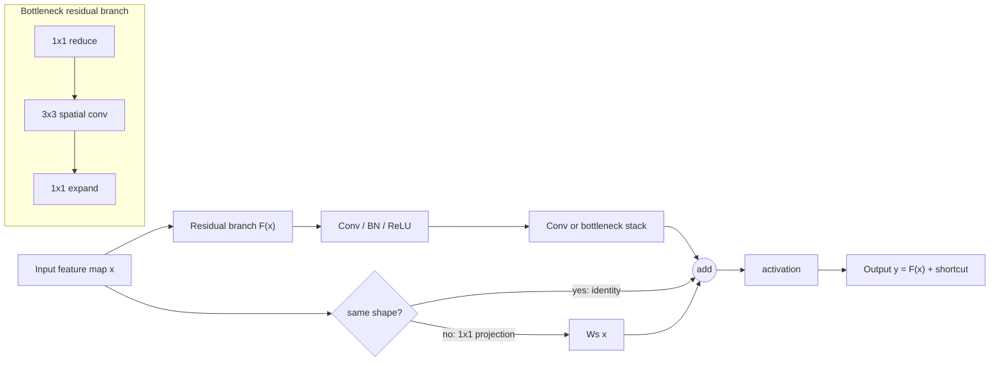

# ResNet and Modern CNN Backbones

Source: `DL_exam.pdf`, Question 14

Original question:

> ResNet и современные CNN-backbone. Skip connections, residual block, bottleneck, идеи эффективных архитектур.

## Интуиция

Главная проблема очень глубоких CNN не только в `vanishing gradients`, но и в том, что обычной сети трудно выучить простое тождественное преобразование, если дополнительные слои не нужны. При увеличении глубины качество может ухудшаться даже на train set: это называют `degradation problem`. ResNet решает это через `skip connections`: блок учит не всю функцию $H(x)$, а поправку к входу, то есть residual function $F(x) = H(x) - x$.

Идея простая: вместо того чтобы заставлять слой заново строить полезное представление, даем ему короткий путь для передачи уже хороших признаков. Тогда блок возвращает:

$$
y = F(x; W) + x.
$$

Если блоку нечего добавить, он может приблизить $F(x) \approx 0$, и весь блок становится почти identity mapping. Это облегчает оптимизацию, улучшает поток градиентов и позволяет строить гораздо более глубокие backbone для classification, detection, segmentation и transfer learning.

Современные CNN-backbone развивают ту же инженерную идею: делать сеть глубокой, выразительной и одновременно эффективной по параметрам, FLOPs, памяти и latency. Для этого используют `bottleneck`, `1x1 convolution`, grouped/depthwise convolution, compound scaling, inverted residual blocks, squeeze-and-excitation, stochastic depth и более transformer-like дизайн в ConvNeXt.

## Что нужно сказать на экзамене

- `Backbone` - основная feature extractor сеть, которая строит иерархию признаков; сверху ставят task-specific head для classification, detection, segmentation, pose и других задач.
- ResNet вводит `residual learning`: блок учит $F(x)$, а не $H(x)$, и возвращает $F(x) + x$.
- `Skip connection` или `shortcut connection` передает вход блока напрямую к выходу. Если размеры совпадают, используют identity shortcut; если нет - projection shortcut, обычно `1x1 convolution`.
- `Residual block` в ResNet для небольших глубин: `3x3 conv -> BN -> ReLU -> 3x3 conv -> BN -> add shortcut -> ReLU`.
- Для глубоких ResNet используют `bottleneck`: `1x1 reduce -> 3x3 conv -> 1x1 expand`. Это уменьшает стоимость дорогой $3 \times 3$ convolution.
- Основная формула блока:

$$
y = \sigma(F(x; W) + W_s x),
$$

где $W_s$ - identity или projection, $\sigma$ часто `ReLU`.

- Skip connection помогает градиенту проходить назад:

$$
\frac{\partial L}{\partial x}
=
\frac{\partial L}{\partial y}
\left(
\frac{\partial F}{\partial x} + I
\right)
$$

в упрощенном случае identity shortcut и без финальной нелинейности.

- Downsampling в ResNet обычно делают в начале нового stage: spatial size уменьшается stride-ом, число каналов увеличивается.
- ResNet не "убирает" проблему оптимизации полностью: важны initialization, BatchNorm, learning rate schedule, regularization и правильный дизайн блока.
- Идеи эффективных CNN: уменьшать вычисления через `1x1 bottleneck`, `depthwise separable convolution`, `grouped convolution`, `inverted residual`, `channel attention`, neural architecture search или scaling rules.
- Примеры современных семейств: ResNeXt, DenseNet, MobileNet, EfficientNet, RegNet, ConvNeXt. На экзамене важнее объяснить идеи, чем запомнить все детали.

## Подробный ответ

### Backbone и stages

`CNN-backbone` - это сеть, которая превращает изображение в набор feature maps. Для классификации финальные признаки поступают в `global average pooling` и linear classifier. Для detection и segmentation backbone часто отдает признаки нескольких масштабов, например в FPN.

Типичная CNN-backbone строится из `stages`. Внутри stage spatial resolution обычно фиксирована, а число каналов постоянно. Между stages происходит downsampling:

```text
Input
-> stem
-> stage 1: high resolution, low/mid channels
-> stage 2: lower resolution, more channels
-> stage 3
-> stage 4: low resolution, high-level semantic features
-> head
```

Например, при переходе между stages высота и ширина уменьшаются примерно в 2 раза, а число каналов увеличивается. Это сохраняет приемлемую вычислительную стоимость и расширяет effective receptive field.

### Почему обычная глубокая CNN обучается плохо

До ResNet было естественно ожидать: если добавить к хорошей сети новые слои, качество не должно стать хуже, потому что новые слои могли бы выучить identity mapping. На практике более глубокая plain CNN часто имела большую training error. Это не просто overfitting, потому что ошибка растет именно на обучающей выборке.

Причины:

- градиенту трудно проходить через длинную последовательность нелинейных преобразований;
- дополнительные слои должны явно выучить identity mapping, что не всегда легко для `conv + BN + ReLU`;
- распределения активаций и scale градиентов становятся сложнее контролировать;
- оптимизационный ландшафт для очень глубокой сети хуже, чем для сети с короткими путями.

ResNet меняет параметризацию задачи. Если желаемое преобразование блока $H(x)$ близко к $x$, то обычный блок должен выучить $H(x) \approx x$, а residual block должен выучить $F(x) = H(x) - x \approx 0$. Второе проще: нулевые веса или малые residual updates уже близки к хорошему поведению.

### Residual block

Базовый residual block задается как:

$$
y = F(x; W) + x,
$$

где $x$ - входной feature map, $F(x; W)$ - residual branch с обучаемыми слоями, а $x$ - shortcut branch. Если после сложения стоит нелинейность:

$$
y = \operatorname{ReLU}(F(x; W) + x).
$$

В классическом `basic block` ResNet residual branch содержит две $3 \times 3$ convolution:

```text
x
|--------------------------------|
|                                v
|   3x3 conv -> BN -> ReLU -> 3x3 conv -> BN
|                                |
+------------ add ---------------+
                 |
                ReLU
```

Такой блок хорошо подходит для ResNet-18 и ResNet-34. Он сравнительно прост, но при большом числе каналов две $3 \times 3$ convolution становятся дорогими.

### Identity shortcut и projection shortcut

Сложение возможно только если у residual branch и shortcut branch одинаковая форма:

$$
F(x) \in \mathbb{R}^{C \times H \times W}, \qquad x \in \mathbb{R}^{C \times H \times W}.
$$

Если spatial size и число каналов не меняются, используют identity shortcut:

$$
W_s x = x.
$$

Если блок делает downsampling или меняет число каналов, нужна projection:

$$
y = F(x; W) + W_s x,
$$

где $W_s$ обычно реализуется как `1x1 convolution` со stride, возможно с BatchNorm. Projection согласует формы, но добавляет параметры и вычисления. На экзамене важно сказать: shortcut не обязан быть identity, но identity дешевле и сохраняет прямой путь без обучаемых параметров.

### Как skip connection помогает backpropagation

Рассмотрим упрощенный блок без финальной нелинейности:

$$
y = x + F(x; W).
$$

Тогда:

$$
\frac{\partial L}{\partial x}
=
\frac{\partial L}{\partial y}
\left(
I + \frac{\partial F}{\partial x}
\right).
$$

Смысл этой формулы: в градиенте есть прямой identity term $I$. Даже если производная residual branch мала или плохо обусловлена, есть путь, по которому сигнал ошибки проходит назад через сложение. В реальных блоках есть BatchNorm, ReLU и projection, поэтому формула не является полным доказательством, но она объясняет основную интуицию.

Для цепочки residual blocks можно записать:

$$
x_{l+1} = x_l + F_l(x_l),
$$

и тогда более позднее представление выражается как:

$$
x_L = x_l + \sum_{i=l}^{L-1} F_i(x_i).
$$

То есть глубокая сеть строит последовательность добавочных refinement-ов, а не полностью переписывает представление на каждом слое.

### Bottleneck block

В глубоких ResNet, например ResNet-50/101/152, используют `bottleneck block`:

```text
1x1 conv reduce -> 3x3 conv -> 1x1 conv expand
```

Если вход имеет $C$ каналов, блок может сначала уменьшить каналы до $C_b$, затем выполнить $3 \times 3$ convolution в узком пространстве, затем расширить каналы обратно. Типичная схема:

$$
C \xrightarrow{1 \times 1} C_b
\xrightarrow{3 \times 3} C_b
\xrightarrow{1 \times 1} 4C_b.
$$

Зачем это нужно:

- $1 \times 1$ convolution дешево смешивает каналы и меняет их число;
- дорогая $3 \times 3$ convolution работает на меньшем числе каналов;
- можно увеличить глубину сети при умеренной вычислительной стоимости;
- расширяющий $1 \times 1$ слой возвращает богатое channel representation.

Сравним грубо стоимость для spatial size $H \times W$. Если обычный блок с двумя $3 \times 3$ convolution работает с $C$ каналами:

$$
\text{MACs}_{basic}
\approx
2HW \cdot 9C^2.
$$

Bottleneck с внутренней шириной $C_b$ имеет:

$$
\text{MACs}_{bottleneck}
\approx
HW(C C_b + 9C_b^2 + C_b C_{out}).
$$

При $C_b \ll C$ это существенно дешевле, чем выполнять все $3 \times 3$ convolution на полной ширине.

### ResNet как архитектура

Классическая ResNet состоит из:

- `stem`: начальная convolution, часто с большим receptive field и downsampling;
- нескольких stages residual blocks;
- `global average pooling`;
- linear classifier.

Схематично:

```text
image
-> conv stem
-> residual stage 1
-> residual stage 2 with downsampling
-> residual stage 3 with downsampling
-> residual stage 4 with downsampling
-> global average pooling
-> linear classifier
```

Чем глубже вариант, тем больше residual blocks. ResNet-18/34 обычно используют basic blocks, а ResNet-50 и глубже - bottleneck blocks. В downstream задачах classifier head часто удаляют, а backbone используют как предобученный feature extractor.

### Pre-activation ResNet

В исходном post-activation block нелинейность стоит после сложения. В `pre-activation ResNet` порядок меняется:

```text
BN -> ReLU -> conv -> BN -> ReLU -> conv -> add
```

Преимущество: shortcut path остается более чистым identity path, потому что после сложения нет обязательной ReLU, которая могла бы обрезать сигнал. Это улучшает обучение очень глубоких residual networks. Для устного ответа достаточно знать идею: normalization и activation переносятся перед convolution, чтобы облегчить поток информации и градиентов через shortcut.

### Современные CNN-backbone: основные идеи

Современные архитектуры обычно оптимизируют не только accuracy, но и практические ограничения: число параметров, FLOPs, latency на CPU/GPU/NPU, memory footprint, удобство transfer learning и качество multi-scale features.

| Семейство / идея | Основной прием | Что дает |
|---|---|---|
| ResNet | Residual blocks, skip connections | Глубокие обучаемые CNN |
| ResNeXt | Grouped convolution, cardinality | Больше параллельных преобразований при контроле FLOPs |
| DenseNet | Dense connections между слоями | Feature reuse, сильный gradient flow, но больше memory cost |
| MobileNet | Depthwise separable convolution | Малая стоимость для mobile/edge inference |
| MobileNetV2/V3 | Inverted residual, linear bottleneck, attention/search | Эффективность при сохранении качества |
| EfficientNet | Compound scaling depth/width/resolution | Сбалансированное масштабирование модели |
| RegNet | Регулярно спроектированное пространство ширин | Простые масштабируемые CNN |
| ConvNeXt | Современный CNN-дизайн с идеями из ViT | Сильный convolutional backbone без attention |

### ResNeXt и grouped convolution

ResNeXt сохраняет residual framework, но меняет residual branch: внутри блока используется grouped convolution. Авторы вводят идею `cardinality` - число параллельных групп или путей. Вместо того чтобы только увеличивать depth или width, можно увеличить cardinality:

$$
F(x) = \sum_{g=1}^{G} F_g(x),
$$

где $G$ - число групп. Grouped convolution уменьшает стоимость по сравнению с полной convolution и позволяет модели учить несколько специализированных преобразований.

### DenseNet

DenseNet соединяет каждый слой со всеми последующими внутри dense block:

$$
x_l = H_l([x_0, x_1, \dots, x_{l-1}]),
$$

где $[\cdot]$ означает concatenation по каналам. Это не residual addition, а именно concat. Плюсы: feature reuse и хороший gradient flow. Минусы: рост числа feature maps и высокая потребность в памяти.

### MobileNet и depthwise separable convolution

MobileNet-подобные сети используют разложение стандартной convolution на:

1. `depthwise kxk convolution`: spatial filtering отдельно для каждого канала;
2. `pointwise 1x1 convolution`: смешивание каналов.

Стоимость:

$$
\text{Params}_{dw-separable}
=
k^2 C_{in} + C_{in} C_{out}
$$

вместо:

$$
\text{Params}_{standard}
=
k^2 C_{in} C_{out}.
$$

Это особенно важно для edge inference. MobileNetV2 добавляет `inverted residual block`: сначала каналы расширяются, затем идет depthwise convolution, затем linear projection обратно в узкое пространство. Shortcut ставится между узкими представлениями, если формы совпадают. Интуиция: нелинейные преобразования удобнее делать в расширенном channel space, а хранить и передавать representation дешевле в узком.

### EfficientNet и compound scaling

Если нужно сделать модель больше, можно увеличить:

- depth - число слоев или blocks;
- width - число каналов;
- input resolution - размер входного изображения.

EfficientNet популяризует `compound scaling`: масштабировать эти три измерения совместно, а не независимо. Идея: если увеличить только resolution, сети может не хватить capacity; если увеличить только width, не растет hierarchical depth; если увеличить только depth, обучение и latency могут стать хуже. Сбалансированное масштабирование часто эффективнее.

### Attention и channel recalibration

Многие CNN-backbone добавляют легкую attention-механику, например `Squeeze-and-Excitation`:

1. `Squeeze`: global average pooling по spatial dimensions получает channel descriptor.
2. `Excitation`: маленькая MLP предсказывает веса каналов.
3. Feature maps умножаются на эти веса.

Формально:

$$
s_c = \frac{1}{HW}\sum_{i=1}^{H}\sum_{j=1}^{W} x_{c,i,j},
$$

$$
\tilde{x}_{c,i,j} = a_c x_{c,i,j},
$$

где $a_c$ - обучаемый gate для канала. Это позволяет сети усиливать полезные каналы и подавлять менее важные.

### ConvNeXt как современный CNN-дизайн

ConvNeXt показывает, что CNN можно модернизировать, используя практики из transformer-era моделей, сохраняя convolution как основной оператор. Типичные идеи:

- меньше hand-crafted операций в stem;
- большие depthwise kernels для расширения receptive field;
- channels-last friendly design;
- LayerNorm вместо BatchNorm в некоторых вариантах;
- inverted bottleneck;
- residual connections и stochastic depth;
- простая stage-based архитектура.

На экзамене не обязательно воспроизводить все детали ConvNeXt. Важно понимать общий вывод: современные CNN не исчезли после ViT; они используют более аккуратный scaling, эффективные convolution blocks и residual design.

### Ограничения ResNet и efficient CNN

Residual connections облегчают optimization, но не гарантируют хорошее обобщение. Нужны данные, regularization, augmentation, нормализация и правильный learning rate. Кроме того:

- очень глубокие сети дороже по latency и memory;
- shortcut connections увеличивают потребление памяти при training, потому что активации нужны для backpropagation;
- bottleneck может потерять информацию, если слишком сильно сжать каналы;
- depthwise convolution уменьшает FLOPs, но реальная latency зависит от hardware и реализации;
- downsampling может ухудшить dense prediction задачи, если потерять spatial detail;
- архитектура backbone должна соответствовать задаче: classification, detection и segmentation требуют разных feature resolutions.

## Формулы / алгоритмы

### Residual block

Вход: $x \in \mathbb{R}^{C_{in} \times H \times W}$.

Выход: $y \in \mathbb{R}^{C_{out} \times H' \times W'}$.

$$
y = \sigma(F(x; W) + W_s x).
$$

Где:

- $F(x; W)$ - residual branch;
- $W_s = I$, если формы совпадают;
- $W_s$ - `1x1 projection`, если нужно изменить $C$, $H$, $W$;
- $\sigma$ - activation, часто `ReLU`.

### Basic block

```text
Input x
shortcut = x or projection(x)
out = Conv3x3(x)
out = BatchNorm(out)
out = ReLU(out)
out = Conv3x3(out)
out = BatchNorm(out)
out = out + shortcut
out = ReLU(out)
```

### Bottleneck block

```text
Input x
shortcut = x or projection(x)
out = Conv1x1_reduce(x)
out = BatchNorm(out)
out = ReLU(out)
out = Conv3x3(out)
out = BatchNorm(out)
out = ReLU(out)
out = Conv1x1_expand(out)
out = BatchNorm(out)
out = out + shortcut
out = ReLU(out)
```

### Gradient intuition

Для $y = x + F(x)$:

$$
\frac{\partial L}{\partial x}
=
\frac{\partial L}{\partial y}
\left(I + \frac{\partial F}{\partial x}\right).
$$

Identity term помогает градиенту проходить через глубокую цепочку blocks.

### Стоимость convolution

Стандартная $k \times k$ convolution:

$$
\text{MACs} \approx H W k^2 C_{in} C_{out}.
$$

Depthwise separable convolution:

$$
\text{MACs} \approx H W (k^2 C_{in} + C_{in} C_{out}).
$$

Grouped convolution с $g$ группами:

$$
\text{Params} = \frac{k^2 C_{in} C_{out}}{g}.
$$

## Диаграмма или изображение



Локальные assets и внешние изображения не использовались.

## Быстрая устная версия

ResNet - это CNN-backbone, где блоки учат не полное преобразование $H(x)$, а residual $F(x) = H(x) - x$. Поэтому выход блока записывается как $y = F(x) + x$ или $y = F(x) + W_sx$, если нужна projection. Shortcut connection дает прямой путь для информации и градиента, поэтому глубокую сеть легче оптимизировать, а блок может стать почти identity, если residual branch дает ноль.

В ResNet-18/34 обычно используют basic block с двумя $3 \times 3$ convolution, а в ResNet-50 и глубже - bottleneck `1x1 -> 3x3 -> 1x1`, чтобы дорогая spatial convolution работала на меньшем числе каналов. Современные CNN-backbone развивают эти идеи: grouped convolution в ResNeXt, dense connections в DenseNet, depthwise separable convolution и inverted residual в MobileNet, compound scaling в EfficientNet, channel attention и ConvNeXt-style blocks. Главный trade-off - accuracy против FLOPs, latency, memory и пригодности признаков для downstream задач.

## Возможные уточняющие вопросы

- Чем residual learning отличается от обычного обучения слоя? Обычный слой учит $H(x)$ напрямую, residual block учит поправку $F(x)$ и добавляет вход: $H(x) = F(x) + x$.
- Зачем нужен shortcut? Он передает признаки без дополнительных преобразований и создает короткий путь для градиента при backpropagation.
- Когда нужен projection shortcut? Когда residual branch меняет число каналов или spatial resolution, поэтому формы для сложения не совпадают.
- Чем basic block отличается от bottleneck? Basic block обычно содержит две $3 \times 3$ convolution; bottleneck использует `1x1 reduce -> 3x3 -> 1x1 expand` для экономии вычислений.
- Почему bottleneck дешевле? Потому что самая дорогая $3 \times 3$ convolution работает во внутреннем пространстве с меньшим числом каналов.
- Что такое ResNeXt cardinality? Это число групп или параллельных преобразований в grouped convolution; его можно увеличивать как отдельное измерение capacity.
- Чем residual connection отличается от DenseNet connection? ResNet складывает признаки, а DenseNet конкатенирует все предыдущие признаки по каналам.
- Почему depthwise separable convolution эффективна? Она разделяет spatial filtering и channel mixing, заменяя $k^2 C_{in}C_{out}$ параметров на $k^2C_{in} + C_{in}C_{out}$.
- Что такое inverted residual? В MobileNetV2 блок сначала расширяет каналы, затем делает depthwise convolution, затем линейно сжимает каналы обратно; shortcut идет между узкими представлениями.
- Почему CNN-backbone важен для transfer learning? Предобученный backbone уже извлекает общие visual features, а новая head или fine-tuning адаптируют их к конкретной задаче.

## Частые ошибки

- Говорить, что ResNet решает только `vanishing gradients`; важен также `degradation problem` и более удобная параметризация функции.
- Забывать, что при сложении shapes должны совпадать; при изменении resolution или channels нужен projection shortcut.
- Называть shortcut отдельным classifier head. Shortcut находится внутри feature extractor blocks.
- Считать, что residual branch всегда должна быть маленькой. Она может быть expressive; важно, что блок параметризован как добавка к shortcut.
- Путать bottleneck в ResNet с bottleneck autoencoder. В ResNet это channel compression внутри residual block для экономии вычислений.
- Путать grouped convolution и depthwise convolution: depthwise - крайний случай группировки, где каждый канал обрабатывается отдельно.
- Думать, что меньше FLOPs всегда означает меньшую latency. На реальном hardware depthwise и мелкие операции могут быть memory-bound.
- Считать, что ResNet всегда лучше любой современной CNN. Выбор backbone зависит от задачи, данных, hardware и нужных feature maps.
- Забывать про BatchNorm и activation order: они существенно влияют на обучение residual blocks.
- Объяснять modern backbones только списком названий, без идей эффективности: bottleneck, separability, grouping, scaling, attention, residual paths.
