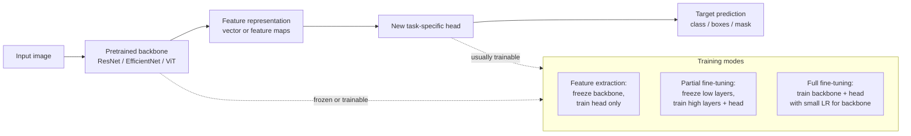

# Transfer Learning in Computer Vision

Source: `DL_exam.pdf`, Question 15

Original question:

> Transfer learning в компьютерном зрении. Feature extraction, fine-tuning, заморозка слоев, использование предобученных backbone.

## Интуиция

`Transfer learning` в компьютерном зрении использует уже обученную на большой задаче модель как хорошую стартовую точку для новой задачи. Идея в том, что ранние и средние слои CNN или современного `backbone` уже научились извлекать полезные признаки: границы, текстуры, формы, части объектов и более сложные визуальные паттерны. Поэтому для новой задачи часто не нужно учить всю сеть с нуля.

Практически это решает две проблемы: мало размеченных данных и ограниченный compute. Вместо обучения всех параметров с нуля мы берем предобученный `backbone`, заменяем задаче-специфичную голову (`classification head`, `detection head`, `segmentation head`) и либо обучаем только голову как `feature extraction`, либо дообучаем часть или всю сеть как `fine-tuning`.

## Что нужно сказать на экзамене

- `Transfer learning`: перенос знаний из source domain/task в target domain/task через предобученные веса.
- В CV обычно используют предобученный `backbone`: ResNet, EfficientNet, ConvNeXt, ViT, Swin Transformer и т.п.
- `Feature extraction`: заморозить `backbone`, считать его детектором признаков, обучать только новую голову.
- `Fine-tuning`: инициализировать модель предобученными весами и обновлять часть или все слои на target dataset.
- `Заморозка слоев`: параметры замороженных слоев имеют `requires_grad=False`, градиенты и optimizer updates для них не применяются.
- Типичная схема: загрузить веса, заменить последнюю голову, заморозить часть слоев, обучить голову, затем при необходимости разморозить верхние блоки и дообучить с малым learning rate.
- Чем меньше target dataset и чем ближе задача к pretraining, тем разумнее сильнее замораживать модель.
- Чем больше данных и чем сильнее domain shift, тем больше пользы от fine-tuning большего числа слоев.
- Важные практические детали: нормализация как при pretraining, разные learning rates для backbone и head, аккуратность с BatchNorm, регуляризация, early stopping.
- Риски: overfitting на малом датасете, catastrophic forgetting, неправильная preprocessing pipeline, несовпадение входных каналов/разрешения/классов.

## Подробный ответ

Пусть есть source-задача с большим датасетом $D_s$ и target-задача с датасетом $D_t$. При обучении с нуля модель учит параметры $\theta$ только по $D_t$:

$$
\theta^* = \arg\min_\theta \frac{1}{|D_t|}\sum_{(x,y)\in D_t} \mathcal{L}(f_\theta(x), y).
$$

В `transfer learning` мы начинаем не со случайной инициализации, а с предобученных параметров $\theta_s$. Обычно модель раскладывают на `backbone` и `head`:

$$
f(x) = h_\phi(g_\theta(x)),
$$

где $g_\theta$ -- `backbone`, извлекающий признаки, а $h_\phi$ -- новая голова для конкретной target-задачи. В классификации голова часто является `global average pooling` плюс `linear layer`; в detection и segmentation это могут быть специальные heads поверх feature maps.

`Backbone` полезен потому, что визуальные признаки имеют иерархическую структуру. Нижние слои CNN обычно кодируют локальные края, цвета и текстуры; средние -- части объектов и повторяющиеся формы; верхние -- более task-specific признаки. Поэтому нижние слои чаще переносятся хорошо, а верхние чаще требуют адаптации к новой задаче.

### Feature extraction

В режиме `feature extraction` веса `backbone` фиксируются:

$$
\theta = \theta_s,\quad \phi^* = \arg\min_\phi \frac{1}{|D_t|}\sum_{(x,y)\in D_t} \mathcal{L}(h_\phi(g_{\theta_s}(x)), y).
$$

Это быстрый и устойчивый режим, особенно если target dataset маленький, классы похожи на source dataset, а доступный compute ограничен. Недостаток: модель не может адаптировать признаки к новому домену, поэтому качество может быть низким при сильном domain shift, например медицинские снимки вместо ImageNet-фотографий.

### Fine-tuning

В режиме `fine-tuning` часть или все веса `backbone` обновляются на target-задаче:

$$
(\theta^*, \phi^*) = \arg\min_{\theta,\phi} \frac{1}{|D_t|}\sum_{(x,y)\in D_t} \mathcal{L}(h_\phi(g_\theta(x)), y),
\quad \theta_0=\theta_s.
$$

Обычно используют меньший learning rate для `backbone`, чем для новой головы:

$$
\eta_{\text{backbone}} \ll \eta_{\text{head}}.
$$

Причина: голова инициализирована случайно и должна быстро обучиться, а `backbone` уже содержит полезные признаки, которые легко испортить слишком большими updates. Частый рецепт: сначала обучить только голову, затем разморозить последние блоки `backbone`, а затем при достаточном объеме данных разморозить всю модель.

### Заморозка слоев

Заморозка означает, что параметры слоя исключаются из обучения. Для параметра $w$ обычный update имеет вид:

$$
w_{t+1} = w_t - \eta \nabla_w \mathcal{L}.
$$

Если слой заморожен, то для его параметров фактически:

$$
\nabla_w \mathcal{L} \text{ не используется},\quad w_{t+1}=w_t.
$$

В PyTorch это обычно делают через `param.requires_grad = False` и не передают такие параметры в optimizer. При этом forward pass через замороженный `backbone` все равно выполняется, потому что его признаки нужны голове.

Отдельная практическая тонкость -- `BatchNorm`. Даже если веса `BatchNorm` заморожены, running mean и running variance могут обновляться в `train()` mode. На маленьком target dataset это иногда портит статистики. Поэтому при feature extraction часто переводят замороженный backbone или его BatchNorm-слои в `eval()` mode.

### Использование предобученных backbone

`Backbone` -- это основная сеть для извлечения признаков без финальной task-specific головы. В классификации это может быть ResNet без последнего fully connected слоя. В detection и segmentation backbone часто выдает не один вектор, а набор feature maps разных масштабов; поверх них строят FPN, detection head или decoder.

Выбор backbone зависит от задачи:

| Условие | Практический выбор |
|---|---|
| Малый датасет, задача похожа на ImageNet | Feature extraction или fine-tuning последних блоков |
| Средний датасет | Обучить голову, затем fine-tune верхние блоки |
| Большой датасет или сильный domain shift | Fine-tuning большей части backbone |
| Ограниченный compute | Замороженный backbone, легкая head |
| Detection/segmentation | Предобученный backbone плюс task-specific head/decoder |

Для успешного переноса важно сохранять preprocessing, близкий к pretraining: размер входа, нормализацию каналов, порядок каналов, augmentation policy. Если модель была обучена с ImageNet-нормализацией, то target images обычно нормализуют теми же mean/std, иначе distribution shift возникает уже на входе.

## Формулы / алгоритмы

Цель transfer learning:

$$
\min_{\theta,\phi} \mathbb{E}_{(x,y)\sim D_t}\left[\mathcal{L}(h_\phi(g_\theta(x)), y)\right],
\quad \theta_0=\theta_s.
$$

Разные режимы обучения:

| Режим | Что обучается | Формально | Когда использовать |
|---|---|---|---|
| Feature extraction | Только head | $\theta=\theta_s,\ \phi$ обновляется | Мало данных, похожий домен |
| Partial fine-tuning | Head и верхние блоки backbone | $\theta_{\text{low}}$ frozen, $\theta_{\text{high}}$ обновляется | Средний датасет, умеренный shift |
| Full fine-tuning | Вся модель | $\theta,\phi$ обновляются | Много данных или сильный shift |

Типичный алгоритм:

1. Выбрать предобученный `backbone` и загрузить веса $\theta_s$.
2. Удалить или заменить старую голову под source-задачу.
3. Добавить новую голову $h_\phi$ под target labels: число классов, bbox-регрессия, mask prediction и т.д.
4. Подготовить preprocessing, совместимый с pretraining: resize/crop, normalization, input channels.
5. Заморозить `backbone`, обучить head несколько эпох.
6. Оценить validation quality и признаки overfitting.
7. При необходимости разморозить последние блоки `backbone`.
8. Дообучать с меньшим learning rate для `backbone` и большим для `head`.
9. Использовать validation set, early stopping, regularization и data augmentation.
10. Финально проверить качество на test set или cross-validation, если данных мало.

Пример learning rates:

$$
\eta_{\text{head}} = 10^{-3},\quad \eta_{\text{backbone}} = 10^{-4}\ \text{или}\ 10^{-5}.
$$

Это не универсальные числа, а типичный порядок: новая голова обучается агрессивнее, предобученные слои адаптируются осторожнее.

## Диаграмма или изображение

Внешние изображения не использовались.

## Быстрая устная версия

`Transfer learning` в CV -- это использование модели, предобученной на большой визуальной задаче, как стартовой точки для новой задачи. Модель удобно разделять на `backbone` $g_\theta$, который извлекает признаки, и `head` $h_\phi$, который решает конкретную задачу. При `feature extraction` backbone заморожен, а обучается только новая head. При `fine-tuning` мы обновляем часть или все слои backbone, обычно с меньшим learning rate, чтобы не разрушить полезные предобученные признаки. Чем меньше данных и чем ближе домен, тем больше слоев можно заморозить; чем сильнее domain shift и больше данных, тем больше слоев нужно дообучать.

## Возможные уточняющие вопросы

- Чем `feature extraction` отличается от `fine-tuning`?  
  В `feature extraction` backbone фиксирован и служит детектором признаков; в `fine-tuning` его веса тоже адаптируются к target-задаче.

- Почему learning rate для backbone часто меньше?  
  Предобученные веса уже полезны, а большие updates могут быстро испортить признаки; новая head обучается с нуля и требует более крупных updates.

- Какие слои лучше замораживать первыми?  
  Обычно нижние слои, потому что они кодируют более универсальные признаки: края, текстуры, простые формы.

- Когда надо размораживать всю модель?  
  Когда target dataset достаточно большой, target domain сильно отличается от source domain или качество замороженного backbone ограничивает результат.

- Что может пойти не так с BatchNorm?  
  Running statistics могут обновляться на маленьком target dataset и ухудшать модель; поэтому замороженные BatchNorm-слои часто оставляют в `eval()` mode.

- Можно ли использовать backbone от классификации для segmentation или detection?  
  Да. Обычно убирают классификационную голову и используют feature maps backbone в FPN, decoder, detection head или segmentation head.

- Что такое negative transfer?  
  Ситуация, когда предобучение ухудшает target performance, потому что source и target domains/tasks плохо согласованы или адаптация сделана неправильно.

## Частые ошибки

- Думать, что transfer learning всегда лучше обучения с нуля: при большом target dataset или сильном mismatch это не гарантировано.
- Путать `feature extraction` и `fine-tuning`: в первом backbone не обновляется, во втором обновляется хотя бы часть backbone.
- Заменить head, но забыть изменить число выходных классов.
- Использовать preprocessing, не совпадающий с pretraining, например другую нормализацию каналов.
- Заморозить параметры, но случайно передать их в optimizer или не проверить `requires_grad`.
- Не учитывать режим `BatchNorm` и `Dropout` при замороженном backbone.
- Дообучать всю модель с большим learning rate на маленьком датасете и получить overfitting или разрушение предобученных признаков.
- Считать, что верхние слои всегда универсальны: часто они более специфичны к source-задаче, чем нижние.
- Использовать validation set для постоянного подбора гиперпараметров и затем сообщать завышенное качество без независимого test set.
