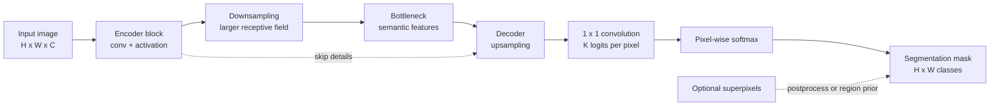

# Semantic Segmentation

Source: `DL_exam.pdf`, Question 16

Original question:

> Семантическая сегментация. Постановка задачи, отличие от классификации, FCN, encoder-decoder подход, superpixels.

## Интуиция

Семантическая сегментация отвечает не на вопрос "что изображено на картинке целиком?", а на вопрос "к какому классу относится каждый пиксель?". Модель строит плотную карту классов того же пространственного размера, что и входное изображение: дорога, небо, человек, фон и так далее.

Главная идея: использовать сверточную сеть не только как классификатор изображения, но как функцию, которая сохраняет пространственную структуру. Поэтому вместо одного вектора классов на выходе нужна сетка предсказаний. `FCN` делает это за счет замены fully connected слоев на сверточные, а `encoder-decoder` подход сначала сжимает изображение до признаков высокого уровня, затем восстанавливает пространственное разрешение.

`Superpixels` - более классическая идея: сначала объединить похожие соседние пиксели в маленькие однородные области, а затем классифицировать или уточнять сегментацию на уровне этих областей. Это не заменяет современные нейросетевые методы, но полезно для понимания до-deep-learning подходов, ускорения разметки и регуляризации границ.

## Что нужно сказать на экзамене

- Семантическая сегментация: для изображения $X \in \mathbb{R}^{H \times W \times C}$ предсказать маску $Y \in \{1,\dots,K\}^{H \times W}$, где каждый пиксель получает класс.
- Отличие от classification: classification дает один label или набор labels на изображение, segmentation дает label для каждого пикселя и требует локализации.
- Отличие от object detection: detection предсказывает bounding boxes, segmentation предсказывает плотную маску.
- Отличие от instance segmentation: semantic segmentation не различает разные объекты одного класса; два человека имеют один класс `person`.
- Базовая нейросетевая постановка: модель выдает logits $Z \in \mathbb{R}^{H \times W \times K}$, затем применяется softmax по классам для каждого пикселя.
- Типичная loss: pixel-wise cross-entropy, часто с весами классов или ignore index для неразмеченных пикселей.
- `FCN`: заменить fully connected слои классификационной CNN на convolutional слои, получить coarse feature map, затем поднять разрешение через upsampling или transposed convolution.
- `Encoder-decoder`: encoder извлекает признаки и уменьшает разрешение, decoder восстанавливает карту сегментации; skip connections помогают вернуть детали границ.
- `Superpixels`: предварительное разбиение изображения на компактные однородные области; можно классифицировать области или использовать их для постобработки, но качество зависит от низкоуровневых признаков и границы могут ошибаться.

## Подробный ответ

В задаче семантической сегментации обучающая выборка состоит из пар $(X, Y)$, где $X$ - изображение размера $H \times W$, а $Y$ - разметка того же размера. Значение $Y_{ij}$ задает класс пикселя с координатами $(i,j)$. В отличие от классификации, здесь нельзя потерять информацию о положении объектов: два изображения с одинаковыми классами, но разным расположением объектов, должны иметь разные маски.

Модель обычно возвращает для каждого пикселя вектор logits:

$$
f_\theta(X) = Z,\quad Z \in \mathbb{R}^{H \times W \times K}.
$$

Вероятность класса $k$ в пикселе $(i,j)$:

$$
p_\theta(y_{ij}=k \mid X) =
\frac{\exp Z_{ijk}}{\sum_{c=1}^{K}\exp Z_{ijc}}.
$$

Если разметка one-hot, стандартная функция потерь:

$$
\mathcal{L}_{CE}
= -\frac{1}{|\Omega|}
\sum_{(i,j)\in \Omega}
\sum_{k=1}^{K}
\mathbf{1}[Y_{ij}=k]\log p_\theta(y_{ij}=k \mid X),
$$

где $\Omega$ - множество размеченных пикселей. В практических задачах часто есть `ignore index`: пиксели без надежной разметки исключаются из суммы. При дисбалансе классов используют веса классов, focal loss, Dice/IoU-like losses, но базовая постановка - именно pixel-wise classification.

### Отличие от классификации

| Задача | Вход | Выход | Что проверяет модель |
|---|---|---|---|
| Image classification | изображение | один class label или вектор вероятностей | наличие главного объекта или класса в целом |
| Semantic segmentation | изображение | карта классов $H \times W$ | класс каждого пикселя и пространственную локализацию |
| Object detection | изображение | boxes + classes | где находятся объекты в прямоугольниках |
| Instance segmentation | изображение | маски отдельных объектов | пиксельный класс и идентичность экземпляра |

Семантическая сегментация не отвечает на вопрос "сколько объектов класса человек?". Если в изображении три человека, все их пиксели обычно имеют один и тот же label `person`.

### FCN

`FCN` (`Fully Convolutional Network`) - ранний ключевой подход к dense prediction. Обычная классификационная CNN постепенно уменьшает пространственный размер признаков и в конце применяет fully connected слои, которые уничтожают явную пространственную сетку. В `FCN` fully connected слои заменяются на сверточные, часто $1 \times 1$ convolution, поэтому сеть может принимать изображения переменного размера и выдавать пространственную карту logits.

Типичный pipeline:

1. Backbone CNN извлекает feature map низкого разрешения, например $H/32 \times W/32$.
2. $1 \times 1$ convolution переводит признаки в $K$ каналов, то есть в logits классов.
3. Upsampling поднимает карту до размера $H \times W$.
4. Softmax применяется отдельно в каждом пикселе.

Главная проблема простого `FCN-32s`: выход грубый, потому что глубокие признаки имеют маленькое пространственное разрешение. Поэтому используют менее агрессивный stride, dilated convolution, multi-scale признаки или skip connections из ранних слоев, где лучше сохранены границы.

### Encoder-decoder подход

В `encoder-decoder` архитектуре encoder отвечает за понимание сцены, а decoder - за восстановление плотной маски:

- encoder: convolution, pooling или strided convolution уменьшают размер, увеличивают receptive field и строят семантически сильные признаки;
- bottleneck: компактное представление с большим receptive field;
- decoder: upsampling, transposed convolution или interpolation + convolution восстанавливают разрешение;
- skip connections: передают детали из ранних feature maps в decoder, чтобы улучшить границы и мелкие объекты.

Компромисс: чем сильнее downsampling, тем больше контекст и дешевле вычисления, но тем хуже точные границы. Decoder пытается восстановить детали, однако потерянную геометрию полностью восстановить трудно, поэтому skip connections важны.

### Superpixels

`Superpixel` - небольшая связная область изображения, состоящая из похожих соседних пикселей. Алгоритмы вроде `SLIC` группируют пиксели по цвету, близости и локальной однородности. После этого можно рассматривать superpixel как атомарную область:

- классифицировать каждый superpixel вместо каждого пикселя;
- использовать superpixels для сглаживания маски;
- ускорять классические алгоритмы сегментации;
- получать кандидаты областей или помогать интерактивной разметке.

Плюсы: меньше элементов, более гладкие области, часто лучше соответствуют локальным границам, чем регулярная сетка. Минусы: это низкоуровневое разбиение без понимания семантики; если superpixel пересекает настоящую границу объекта, ошибка может перейти в итоговую маску. В современных deep learning системах superpixels обычно не являются центральным компонентом, но остаются полезным понятием для классической сегментации и постобработки.

## Формулы / алгоритмы

### Pixel-wise inference

Дано изображение $X \in \mathbb{R}^{H \times W \times C}$ и число классов $K$.

1. Пропустить изображение через сеть: $Z = f_\theta(X)$.
2. Для каждого пикселя $(i,j)$ посчитать softmax по $K$ классам.
3. Предсказать класс:

$$
\hat{Y}_{ij} = \arg\max_{k \in \{1,\dots,K\}} p_\theta(y_{ij}=k \mid X).
$$

4. Получить маску $\hat{Y} \in \{1,\dots,K\}^{H \times W}$.

### Pixel-wise cross-entropy

$$
\mathcal{L}
= -\frac{1}{|\Omega|}
\sum_{(i,j)\in\Omega}
w_{Y_{ij}}
\log p_\theta(y_{ij}=Y_{ij}\mid X),
$$

где $w_{Y_{ij}}$ - optional class weight. Если веса не используются, $w_{Y_{ij}}=1$.

### Encoder-decoder pipeline

Вход: изображение $X$.  
Выход: маска классов $\hat{Y}$.

1. Encoder строит признаки разных масштабов: $F_1, F_2, \dots, F_m$.
2. Bottleneck хранит наиболее семантические признаки с большим receptive field.
3. Decoder постепенно увеличивает spatial resolution.
4. На каждом уровне decoder может объединять upsampled features со skip features из encoder.
5. Последний $1 \times 1$ convolution дает $K$ каналов logits.
6. Softmax и $\arg\max$ дают класс каждого пикселя.

Сложность обычно пропорциональна числу пикселей и стоимости backbone: для dense prediction важно учитывать память, потому что нужно хранить feature maps для всех пространственных позиций.

## Диаграмма или изображение

Внешние изображения не использовались.

## Быстрая устная версия

Семантическая сегментация - это задача pixel-wise classification: для каждого пикселя изображения нужно предсказать класс. В отличие от обычной классификации, выходом является не один label, а карта $H \times W$; в отличие от instance segmentation, разные объекты одного класса не разделяются на экземпляры.

`FCN` решает задачу, заменяя fully connected слои классификационной CNN на convolutional слои, получая spatial logits и затем увеличивая разрешение через upsampling. `Encoder-decoder` подход сначала сжимает изображение, чтобы получить семантические признаки и большой receptive field, а потом восстанавливает плотную маску; skip connections помогают сохранить границы. `Superpixels` - классический способ предварительно группировать похожие соседние пиксели в области, которые можно классифицировать или использовать для сглаживания, но они не обладают настоящим семантическим пониманием.

## Возможные уточняющие вопросы

- Почему нельзя просто применить классификационную CNN к изображению?  
  Потому что classification выдает один вектор классов и теряет точную spatial localization; для сегментации нужен prediction для каждого пикселя.

- Что делает $1 \times 1$ convolution в FCN?  
  Он превращает feature vector в каждой spatial position в $K$ logits классов, не смешивая соседние позиции напрямую.

- Зачем нужен upsampling?  
  Глубокие feature maps имеют меньшее разрешение из-за pooling или strided convolution, а итоговая маска должна соответствовать размеру исходного изображения.

- Чем transposed convolution отличается от bilinear interpolation?  
  Bilinear interpolation фиксированная и не обучается, а transposed convolution имеет обучаемые веса, но может давать checkerboard artifacts при неудачных параметрах.

- Почему skip connections полезны в segmentation?  
  Ранние слои лучше хранят локальные детали и границы, а глубокие слои лучше хранят семантику; их объединение улучшает точность маски.

- Что такое superpixel?  
  Это связная группа похожих соседних пикселей, используемая как более крупная единица обработки вместо отдельного пикселя.

- Почему semantic segmentation не решает задачу подсчета объектов?  
  Она присваивает пикселям классы, но не хранит identity отдельных экземпляров одного класса.

## Частые ошибки

- Говорить, что semantic segmentation выделяет отдельные экземпляры объектов. Это уже instance segmentation.
- Путать segmentation с detection: detection дает boxes, а segmentation дает pixel mask.
- Забывать, что softmax применяется по классам отдельно для каждого пикселя.
- Описывать FCN как сеть с fully connected слоями. В FCN ключевая идея как раз в fully convolutional prediction.
- Игнорировать проблему низкого разрешения: глубокая CNN без decoder или skip connections часто дает грубые границы.
- Считать upsampling полноценным восстановлением потерянной информации. Если spatial details потеряны при downsampling, decoder может только приблизительно их восстановить.
- Приписывать superpixels семантическое понимание. Обычно они строятся по низкоуровневым признакам: цвету, текстуре и близости.
- Не упоминать `ignore index` или class imbalance, хотя в реальных segmentation datasets они часто важны для корректного обучения.
