# U-Net and Modern Segmentation

Source: `DL_exam.pdf`, Question 17

Original question:

> U-Net и современные подходы к сегментации. Skip connections, upsampling, multi-scale features, transformer/promptable segmentation как расширения.

## Интуиция

`U-Net` - это encoder-decoder архитектура для плотного предсказания маски. Encoder постепенно уменьшает пространственное разрешение и извлекает все более семантические признаки, а decoder постепенно возвращает разрешение обратно к размеру изображения. Главная проблема такой схемы: при downsampling сеть теряет точные границы, тонкие структуры и положение мелких объектов. Поэтому U-Net соединяет уровни encoder и decoder через `skip connections`: decoder получает не только абстрактный контекст из bottleneck, но и локальные детали из ранних слоев.

Название `U-Net` отражает форму архитектуры: слева путь вниз с уменьшением разрешения, справа путь вверх с upsampling, между симметричными уровнями - связи. В сегментации это особенно естественно: для правильного класса пикселя нужен глобальный контекст, а для аккуратной маски нужны локальные границы.

Современные методы развивают ту же идею несколькими способами. `Multi-scale features` помогают видеть объекты разных размеров. Transformer-based segmentation добавляет self-attention и лучше моделирует дальние зависимости. `Promptable segmentation` отделяет "получить универсальное представление изображения" от "по prompt выделить нужную маску": пользователь или другой алгоритм задает точку, box, текст или примерную маску, а модель возвращает сегментацию соответствующего объекта.

## Что нужно сказать на экзамене

- `U-Net` - encoder-decoder сеть для segmentation, изначально популярная в biomedical image segmentation, но идея стала общей для dense prediction.
- Encoder строит признаки разных масштабов: $F_1, F_2, \dots, F_L$, где разрешение уменьшается, а число каналов и receptive field обычно растут.
- Bottleneck содержит наиболее семантическое и контекстное представление.
- Decoder восстанавливает spatial resolution через upsampling и convolution.
- `Skip connections` передают признаки encoder на соответствующий уровень decoder: обычно через concatenation или summation.
- Skip connections решают проблему потери локализации: глубокие признаки знают "что", ранние признаки помогают понять "где именно граница".
- `Upsampling` бывает fixed interpolation, transposed convolution, unpooling, pixel shuffle; на практике часто используют interpolation + convolution как простой и стабильный вариант.
- `Multi-scale features` нужны, потому что объекты и контекст имеют разные размеры; примеры идей: feature pyramid, FPN, ASPP, pyramid pooling, HRNet-like сохранение high-resolution ветвей.
- Transformer segmentation использует self-attention для глобального контекста; может быть pure ViT encoder, hierarchical transformer backbone или mask-based decoder.
- Promptable segmentation: модель принимает image embedding и prompts, затем предсказывает одну или несколько масок; это полезно для интерактивной сегментации, annotation assistance и zero/few-shot transfer, но маски часто class-agnostic и требуют дополнительной семантической интерпретации.
- Ограничения: высокая стоимость памяти для dense features, проблемы с мелкими объектами, class imbalance, неточные границы, domain shift, зависимость promptable моделей от качества prompt.

## Подробный ответ

### U-Net как encoder-decoder

Пусть входное изображение $X \in \mathbb{R}^{H \times W \times C}$, а нужно предсказать маску классов $\hat{Y} \in \{1,\dots,K\}^{H \times W}$. Сеть возвращает logits:

$$
Z = f_\theta(X), \quad Z \in \mathbb{R}^{H \times W \times K}.
$$

Для каждого пикселя $(i,j)$ вероятность класса $k$:

$$
p_{ijk} =
\frac{\exp Z_{ijk}}{\sum_{c=1}^{K}\exp Z_{ijc}}.
$$

U-Net строит $Z$ не одним большим сверточным блоком, а через два пути.

Encoder:

- применяет convolution blocks;
- уменьшает spatial size через pooling или strided convolution;
- увеличивает receptive field;
- накапливает признаки от локальных текстур к семантическим объектам.

Decoder:

- увеличивает spatial size;
- объединяет upsampled features с encoder features того же масштаба;
- уточняет локальную маску через convolution blocks;
- в конце применяет $1 \times 1$ convolution для получения $K$ logits на пиксель.

На уровне $l$ можно записать типичную операцию decoder так:

$$
D_l = \phi_l\left(\operatorname{concat}\left(\operatorname{up}(D_{l+1}), F_l\right)\right),
$$

где $F_l$ - feature map из encoder, $D_{l+1}$ - более глубокий decoder feature map, $\operatorname{up}$ - upsampling, $\operatorname{concat}$ - объединение по channel dimension, а $\phi_l$ - блок convolutions, normalization и activation.

Если вместо concatenation используется summation, каналы обычно предварительно приводят к одинаковому числу:

$$
D_l = \phi_l\left(W_d * \operatorname{up}(D_{l+1}) + W_f * F_l\right).
$$

Concatenation сохраняет больше информации, но увеличивает число каналов и стоимость вычислений. Summation дешевле и часто используется в feature pyramid networks.

### Skip connections

Skip connections в U-Net отличаются по смыслу от residual connections в ResNet. В ResNet skip connection помогает оптимизации и передает identity внутри блока. В U-Net skip connection соединяет encoder и decoder на одинаковом spatial scale, чтобы decoder получил сохраненные детали.

Почему это важно:

- после pooling или strided convolution разные пиксели исходного изображения могут попасть в одну coarse позицию;
- decoder по одному bottleneck не знает точные границы объектов;
- ранние признаки содержат edges, corners, texture и точную локализацию;
- глубокие признаки содержат класс и контекст;
- объединение ранних и глубоких признаков дает маску, которая одновременно семантически осмысленна и пространственно точна.

Практическая деталь: при объединении feature maps их spatial sizes должны совпадать. В оригинальных реализациях U-Net иногда требовался crop encoder feature map из-за valid convolutions. В современных реализациях чаще используют padding, чтобы размеры совпадали без crop.

### Upsampling

Upsampling - операция увеличения spatial resolution feature map. В segmentation это нужно, потому что encoder обычно строит признаки размера, например, $H/16 \times W/16$ или $H/32 \times W/32$, а маска нужна размера $H \times W$.

Основные варианты:

| Метод | Идея | Плюсы | Минусы |
|---|---|---|---|
| Nearest neighbor interpolation | копировать ближайшие значения | дешево, просто | грубые блоковые границы |
| Bilinear interpolation | гладкая фиксированная интерполяция | стабильно, без параметров | не учится восстанавливать детали |
| Transposed convolution | обучаемая операция, обратная по форме к convolution | может учить task-specific upsampling | возможны checkerboard artifacts |
| Unpooling | восстановить позиции max pooling через saved indices | полезно при max-pool encoder | требует хранить индексы, ограниченная гибкость |
| Pixel shuffle | преобразовать channels в spatial resolution | эффективен в super-resolution | требует специальной организации каналов |

Частый современный выбор: `bilinear upsampling + convolution`. Интерполяция увеличивает размер, а последующая convolution учит локальное уточнение. Это проще контролировать, чем transposed convolution, и обычно меньше склонно к checkerboard artifacts.

Важно не путать upsampling с настоящим восстановлением потерянной информации. Если encoder уничтожил мелкую структуру, decoder может только приблизить ее. Поэтому skip connections и multi-scale features критичны.

### Multi-scale features

В сегментации один масштаб редко достаточен. Маленький объект требует high-resolution признаков, большой объект требует широкого контекста, а неоднозначный пиксель может классифицироваться только по окружению.

Типичные подходы:

- `Feature Pyramid Network` (`FPN`): строит пирамиду признаков разных разрешений, соединяя top-down путь и lateral connections.
- `ASPP` (`Atrous Spatial Pyramid Pooling`): применяет dilated convolutions с разными dilation rates, чтобы получить несколько receptive fields без сильного уменьшения resolution.
- `Pyramid pooling`: агрегирует контекст по нескольким grid scales и возвращает его к dense prediction.
- `HRNet-like` подход: поддерживает high-resolution ветвь и обменивается информацией между ветвями разных разрешений.
- Multi-scale inference: прогнать изображение в нескольких масштабах и усреднить logits или probabilities; дороже, но может улучшить качество.

Dilated convolution полезна, когда хочется увеличить receptive field без дополнительного downsampling. Для 2D convolution:

$$
y[i,j] =
\sum_{u,v} w[u,v] \cdot x[i + r u, j + r v],
$$

где $r$ - dilation rate. При $r=1$ это обычная convolution, при $r>1$ ядро смотрит на более разреженные позиции.

Компромисс multi-scale подходов: больше контекста и лучше объекты разных размеров, но выше стоимость памяти и вычислений; слишком грубые признаки могут размывать границы, а слишком локальные - плохо понимать объект целиком.

### Transformer-based segmentation

Transformer segmentation переносит идеи self-attention в dense prediction. В CNN receptive field растет локально через слои, pooling и dilation. В self-attention каждая позиция может напрямую учитывать другие позиции, что полезно для:

- дальних зависимостей между частями одного объекта;
- глобального контекста сцены;
- согласования маски у больших или разорванных объектов;
- объединения visual tokens и task prompts.

Self-attention для токенов изображения можно записать так:

$$
\operatorname{Attention}(Q,K,V) =
\operatorname{softmax}\left(\frac{QK^\top}{\sqrt{d}}\right)V.
$$

Если изображение разбито на patches или feature tokens, attention mixing дает глобальное взаимодействие между позициями. Но полная attention по $N$ токенам имеет сложность $O(N^2)$ по числу токенов, поэтому для high-resolution segmentation используют:

- hierarchical transformer backbones, где resolution уменьшается по уровням;
- window attention, где attention считается внутри локальных окон;
- lightweight decoders, которые не восстанавливают все на каждом уровне;
- mask/query-based decoders, где небольшое число mask queries взаимодействует с image features.

Примеры архитектурных идей, которые полезно назвать на экзамене:

| Подход | Основная идея |
|---|---|
| ViT/SETR-like | трактовать segmentation как sequence-to-sequence prediction по image patches |
| Swin-like | hierarchical transformer с window attention и feature pyramid |
| SegFormer-like | transformer encoder + простой MLP decoder для multi-scale features |
| Mask2Former-like | unified mask prediction через mask queries для semantic, instance и panoptic segmentation |

Важная оговорка: transformer не отменяет необходимость восстанавливать spatial resolution. Даже если encoder глобальный, segmentation output все равно должен быть dense, поэтому decoder, upsampling и multi-scale fusion остаются важными.

### Promptable segmentation

Promptable segmentation - это расширение segmentation, где модель получает не только изображение, но и подсказку о том, что нужно выделить. Prompt может быть:

- точкой foreground/background;
- bounding box;
- грубой маской;
- несколькими кликами пользователя;
- текстовым описанием, если модель мультимодальная;
- embedding или proposal от другой модели.

Общая схема:

$$
E_I = g_\theta(X), \quad E_P = h_\theta(P), \quad \hat{M} = d_\theta(E_I, E_P),
$$

где $E_I$ - image embedding, $E_P$ - prompt embedding, $P$ - prompt, а $d_\theta$ - mask decoder. Часто image encoder можно выполнить один раз, а затем быстро получать разные маски для разных prompts.

Это отличается от обычной semantic segmentation:

| Свойство | Semantic segmentation | Promptable segmentation |
|---|---|---|
| Вход | изображение | изображение + prompt |
| Выход | классы для всех пикселей | маска объекта/области, заданной prompt |
| Семантика | классы заранее заданы | часто class-agnostic |
| Использование | автоматическая разметка всей сцены | интерактивная сегментация, annotation, foundation model pipeline |

Promptable модель может выделить объект по клику или box, но сама по себе не всегда говорит, что это за класс. Для semantic labels ее часто комбинируют с классификатором, detector, text-image моделью или human-in-the-loop разметкой.

### Практические аспекты обучения

Для U-Net и современных segmentation моделей обычно используют pixel-wise losses:

$$
\mathcal{L}_{CE}
= -\frac{1}{|\Omega|}
\sum_{(i,j)\in\Omega}
\log p_{ij,Y_{ij}},
$$

где $\Omega$ - множество размеченных пикселей. Для маленьких объектов и дисбаланса классов часто добавляют Dice loss или IoU-like losses:

$$
\operatorname{Dice}(p,y) =
\frac{2\sum_i p_i y_i + \epsilon}
{\sum_i p_i + \sum_i y_i + \epsilon}.
$$

Тогда можно оптимизировать:

$$
\mathcal{L} = \mathcal{L}_{CE} + \lambda (1 - \operatorname{Dice}).
$$

Для экзамена важно понимать не только loss, но и причину архитектуры: segmentation требует одновременно семантики, контекста и точной геометрии. U-Net решает это через encoder-decoder и skip connections; современные методы добавляют более сильный backbone, multi-scale fusion, attention и prompts.

## Формулы / алгоритмы

### U-Net inference pipeline

Вход: изображение $X \in \mathbb{R}^{H \times W \times C}$.  
Выход: маска $\hat{Y} \in \{1,\dots,K\}^{H \times W}$.

1. Encoder:
   $$
   F_l = E_l(F_{l-1}), \quad F_0 = X,\quad l=1,\dots,L.
   $$
   На каждом уровне spatial size обычно уменьшается в $2$ раза.

2. Bottleneck:
   $$
   B = E_{L+1}(F_L).
   $$

3. Decoder со skip connections:
   $$
   D_L = \phi_L(\operatorname{concat}(\operatorname{up}(B), F_L)),
   $$
   $$
   D_l = \phi_l(\operatorname{concat}(\operatorname{up}(D_{l+1}), F_l)),
   \quad l=L-1,\dots,1.
   $$

4. Pixel classifier:
   $$
   Z = W_{1\times1} * D_1 + b,
   \quad Z \in \mathbb{R}^{H \times W \times K}.
   $$

5. Prediction:
   $$
   \hat{Y}_{ij} = \arg\max_k \operatorname{softmax}(Z_{ij})_k.
   $$

### Training objective

Для semantic segmentation с one-hot разметкой $Y_{ijk}$:

$$
\mathcal{L}_{CE}
= -\frac{1}{|\Omega|}
\sum_{(i,j)\in\Omega}
\sum_{k=1}^{K}
Y_{ijk}\log p_{ijk}.
$$

При дисбалансе:

$$
\mathcal{L}_{weighted}
= -\frac{1}{|\Omega|}
\sum_{(i,j)\in\Omega}
w_{Y_{ij}}\log p_{ij,Y_{ij}}.
$$

Для binary segmentation часто используют комбинацию:

$$
\mathcal{L} = \mathcal{L}_{BCE} + \lambda \mathcal{L}_{Dice}.
$$

### Promptable segmentation pipeline

Вход: image $X$, prompt $P$ в виде point, box или mask.  
Выход: одна или несколько масок $\hat{M}$ и confidence score.

1. Image encoder строит embedding:
   $$
   E_I = g_\theta(X).
   $$
2. Prompt encoder кодирует prompt:
   $$
   E_P = h_\theta(P).
   $$
3. Mask decoder объединяет image и prompt embeddings:
   $$
   S = d_\theta(E_I, E_P).
   $$
4. Logits маски переводятся в probability map:
   $$
   \hat{M}_{ij} = \mathbf{1}[\sigma(S_{ij}) > \tau].
   $$
5. При неоднозначном prompt модель может вернуть несколько candidate masks; затем выбирают по score или уточняют prompt.

### Практические caveats

- Сложность dense segmentation зависит от разрешения: хранение feature maps для больших $H,W$ быстро расходует GPU memory.
- Полная self-attention по image tokens имеет стоимость $O(N^2)$, где $N$ - число токенов, поэтому high-resolution segmentation часто требует hierarchical или windowed attention.
- Слишком агрессивный downsampling ухудшает границы; слишком слабый downsampling дорогой и может давать маленький receptive field.
- При transposed convolution нужно аккуратно выбирать kernel, stride и padding, иначе возможны checkerboard artifacts.

## Диаграмма или изображение

```mermaid
flowchart LR
    X["Input image<br/>H x W x C"] --> E1["Encoder level 1<br/>high resolution details"]
    E1 --> E2["Encoder level 2<br/>downsample"]
    E2 --> E3["Encoder level 3<br/>downsample"]
    E3 --> B["Bottleneck<br/>semantic context"]

    B --> U3["Upsampling"]
    E3 -. "skip connection<br/>same scale" .-> C3["Concat / Sum"]
    U3 --> C3
    C3 --> D3["Decoder level 3"]

    D3 --> U2["Upsampling"]
    E2 -. "skip connection<br/>boundaries + texture" .-> C2["Concat / Sum"]
    U2 --> C2
    C2 --> D2["Decoder level 2"]

    D2 --> U1["Upsampling"]
    E1 -. "skip connection<br/>localization" .-> C1["Concat / Sum"]
    U1 --> C1
    C1 --> D1["Decoder level 1"]

    D1 --> H["1 x 1 conv<br/>K logits per pixel"]
    H --> Y["Segmentation mask<br/>H x W"]

    MS["Multi-scale features<br/>FPN / ASPP / pyramid pooling"] -. "context at several receptive fields" .-> D2
    TR["Transformer attention<br/>global dependencies"] -. "stronger encoder or decoder" .-> B
    PR["Prompt encoder<br/>points / boxes / masks"] -. "promptable mask decoder" .-> H
```

Внешние изображения не использовались.

## Быстрая устная версия

U-Net - это encoder-decoder архитектура для сегментации. Encoder уменьшает разрешение и извлекает семантические признаки, decoder через upsampling возвращает маску к исходному размеру. Ключевая идея - skip connections между соответствующими уровнями encoder и decoder: глубокие признаки дают понимание объекта, а ранние признаки возвращают детали границ и локализацию.

Upsampling можно делать интерполяцией, transposed convolution, unpooling или другими способами; часто используют bilinear upsampling + convolution как стабильный вариант. Современные подходы расширяют U-Net за счет multi-scale features: FPN, ASPP, pyramid pooling, HRNet-like ветви. Transformer segmentation добавляет self-attention для глобального контекста, но все равно требует decoder и восстановления resolution. Promptable segmentation принимает изображение и prompt, например точку или box, и выделяет соответствующую маску; это удобно для интерактивной разметки и foundation model pipelines, но часто не дает semantic class label само по себе.

## Возможные уточняющие вопросы

- Чем U-Net отличается от простого FCN?  
  FCN может просто получить coarse logits и увеличить их до размера изображения, а U-Net строит полноценный decoder и использует skip connections с encoder features для восстановления деталей.

- Почему skip connections важны именно в segmentation?  
  Потому что segmentation требует точных границ. Глубокие признаки дают семантику, но имеют низкое resolution; ранние признаки сохраняют локальную геометрию.

- Concatenation или summation в skip connections лучше?  
  Concatenation сохраняет больше информации и типична для U-Net, но дороже по каналам. Summation дешевле и часто используется в FPN-like архитектурах.

- Что такое transposed convolution?  
  Это обучаемый upsampling operator, который увеличивает spatial size feature map. Он не является строгой математической inverse convolution, а только имеет "обратную" форму отображения размеров.

- Почему transposed convolution может давать checkerboard artifacts?  
  При неравномерном перекрытии kernel applications разные output pixels получают разное число вкладов, что может создавать регулярные артефакты.

- Зачем нужны multi-scale features?  
  Объекты бывают разных размеров, а классификация пикселя зависит и от локальных границ, и от глобального контекста. Multi-scale признаки дают несколько receptive fields.

- Чем ASPP отличается от обычной pyramid features?  
  ASPP использует dilated convolutions с разными dilation rates на одном или близком feature level, чтобы получить разные receptive fields без сильного downsampling.

- Как transformer помогает segmentation?  
  Self-attention моделирует дальние зависимости между image tokens, что полезно для больших объектов, контекста и согласованности маски.

- Почему transformer segmentation дорогая?  
  Полная attention имеет сложность $O(N^2)$ по числу tokens, а segmentation часто требует высокого resolution.

- Что такое promptable segmentation?  
  Это сегментация по подсказке: модель получает image embedding и prompt embedding, например point или box, и возвращает маску соответствующего объекта или области.

- Promptable segmentation заменяет semantic segmentation?  
  Не полностью. Она часто дает class-agnostic object masks; для semantic labels нужны классы, detector, classifier, text grounding или дополнительная разметка.

## Частые ошибки

- Объяснять U-Net только как "сеть с upsampling" и не упоминать skip connections.
- Путать skip connections U-Net с residual connections ResNet: в U-Net они соединяют encoder и decoder разных путей, а не только облегчают optimization внутри блока.
- Считать, что decoder может идеально восстановить детали после сильного downsampling. Потерянную локализацию трудно восстановить без skip connections.
- Говорить, что transposed convolution является настоящей обратной convolution. Это обучаемое отображение с увеличением spatial size, а не точная inverse operation.
- Забывать про выравнивание размеров feature maps перед concatenation: spatial dimensions должны совпадать или быть аккуратно crop/resize.
- Называть multi-scale features декоративным улучшением. В segmentation это принципиально важно для объектов разных размеров и контекста.
- Утверждать, что transformer автоматически решает проблему точных границ. Attention помогает контексту, но dense output все равно требует decoder, upsampling и локальных деталей.
- Считать promptable segmentation обычной semantic segmentation. Promptable модель может выделить объект, но не обязательно присваивает ему класс из фиксированного набора.
- Игнорировать стоимость памяти: segmentation хранит dense feature maps, а high-resolution attention особенно дорогая.
- Не упоминать class imbalance и малые объекты: в segmentation фон часто доминирует, поэтому CE может быть недостаточно без weighting, Dice/Focal или sampling strategies.
