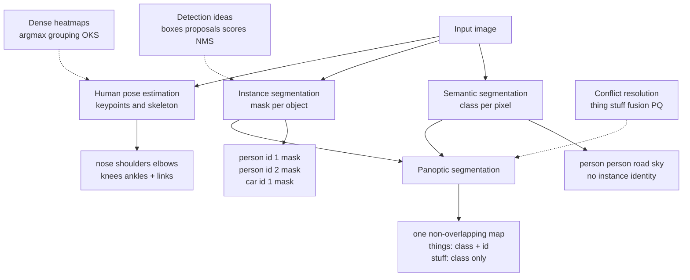

# Instance Panoptic Segmentation and Pose

Source: `DL_exam.pdf`, Question 18

Original question:

> Instance, panoptic segmentation и human pose estimation. Чем эти задачи отличаются от semantic segmentation, какие идеи используются.

## Интуиция

`Semantic segmentation` отвечает на вопрос: "какой класс у каждого пикселя?". Если на изображении три человека, все пиксели всех людей получают один класс `person`, но модель не обязана сказать, где первый человек, где второй и где третий.

`Instance segmentation` добавляет к semantic segmentation идентичность объекта: нужно не только сказать `person`, но и разделить разные экземпляры одного класса. Поэтому выход - не одна карта классов, а набор объектов вида "класс + маска + confidence".

`Panoptic segmentation` объединяет semantic и instance segmentation в одну согласованную разметку всей сцены. Для countable objects, то есть `things` вроде людей и машин, нужно выделять отдельные экземпляры. Для amorphous regions, то есть `stuff` вроде неба, дороги и травы, достаточно семантического класса. Важное требование: каждый пиксель получает ровно одну метку, а маски не должны конфликтовать.

`Human pose estimation` решает другую dense/localization задачу: вместо маски объекта нужно найти ключевые точки тела человека, например плечи, локти, колени, и связать их в скелет. Она может быть top-down: сначала найти человека, потом ключевые точки внутри box; или bottom-up: сначала найти все keypoints на изображении, затем собрать их в людей.

## Что нужно сказать на экзамене

- `Semantic segmentation`: выход $Y \in \{1,\dots,K\}^{H \times W}$, один class label на пиксель, без различения экземпляров.
- `Instance segmentation`: выход - множество предсказаний $\{(c_n, s_n, M_n)\}_{n=1}^N$, где $c_n$ - класс, $s_n$ - score, $M_n \in \{0,1\}^{H \times W}$ - маска конкретного объекта.
- Главное отличие instance от semantic: два объекта одного класса должны получить разные instance IDs; обычно рассматриваются только `thing` classes.
- Типовые идеи instance segmentation: detection backbone, region proposals, `RoIAlign`, mask head, `Mask R-CNN`, или one-stage/prototype-based masks; losses для classification, box regression и mask prediction.
- `Panoptic segmentation`: для каждого пикселя предсказать пару $(class, instance\ id)$; для `stuff` instance id обычно не нужен или равен void, для `things` нужен.
- Главное отличие panoptic: покрывает всю сцену и объединяет `things` + `stuff`, при этом итоговые сегменты не перекрываются.
- Типовые идеи panoptic: объединить semantic head и instance head; разрешить конфликты между масками; использовать panoptic head или unified segmentation model.
- Метрика panoptic: `PQ` (`Panoptic Quality`), совмещает качество распознавания сегментов и средний IoU matched сегментов.
- `Human pose estimation`: выход - координаты keypoints и skeleton; это не pixel-wise class map, а задача локализации частей тела.
- Типовые идеи pose estimation: heatmaps для keypoints, top-down pipeline `person detector -> keypoint network`, bottom-up pipeline `all keypoints -> grouping`, `Part Affinity Fields`, `OKS` для оценки.
- Основные трудности: перекрытия объектов, crowded scenes, small objects, occlusion, неоднозначные границы, невидимые keypoints, конфликт instance masks в panoptic segmentation.

## Подробный ответ

### Сравнение задач

Пусть входное изображение $X \in \mathbb{R}^{H \times W \times C}$.

| Задача | Что предсказываем | Различает экземпляры? | Покрывает весь кадр? | Типичный выход |
|---|---|---:|---:|---|
| Semantic segmentation | класс каждого пикселя | нет | да | $Y_{ij}=class$ |
| Instance segmentation | маску каждого объекта | да | обычно нет, только `things` | набор masks + classes + scores |
| Panoptic segmentation | класс и instance id каждого пикселя | да для `things` | да | $Y_{ij}=(class, instance\ id)$ |
| Human pose estimation | keypoints человека | да, если multi-person | нет, ищет структуру тела | координаты joints + skeleton |

Ключевое различие с semantic segmentation - наличие объектной идентичности. В semantic segmentation пиксели двух машин имеют один label `car`. В instance segmentation эти машины должны стать двумя разными масками. В panoptic segmentation эти две машины тоже должны быть разными экземплярами, а дорога, небо и здания должны быть размечены как `stuff`-области.

### Instance segmentation

В instance segmentation требуется найти все объекты некоторых классов и для каждого объекта построить точную pixel mask. Формально модель предсказывает множество:

$$
\hat{S} = \{(\hat{c}_n, \hat{s}_n, \hat{B}_n, \hat{M}_n)\}_{n=1}^{\hat{N}},
$$

где $\hat{c}_n$ - класс объекта, $\hat{s}_n$ - confidence score, $\hat{B}_n$ - bounding box, $\hat{M}_n$ - binary mask конкретного экземпляра.

Классический и важный пример - `Mask R-CNN`. Он расширяет `Faster R-CNN` дополнительной веткой для маски:

1. `Backbone` и часто `FPN` строят multi-scale feature maps.
2. `RPN` предлагает candidate regions, то есть boxes с objectness score.
3. `RoIAlign` извлекает fixed-size признаки для каждой области без грубого округления координат.
4. `Box/class head` уточняет class label и bounding box.
5. `Mask head` предсказывает binary mask внутри RoI, обычно отдельно для каждого класса.
6. Предсказанные маски переносятся обратно в координаты изображения, затем фильтруются по score и `NMS`.

Loss в Mask R-CNN обычно складывается из нескольких частей:

$$
\mathcal{L}
= \mathcal{L}_{cls}
+ \mathcal{L}_{box}
+ \mathcal{L}_{mask}.
$$

Для mask head часто используют pixel-wise binary cross-entropy только для истинного класса объекта:

$$
\mathcal{L}_{mask}
= -\frac{1}{m^2}\sum_{u,v}
\left[
M_{uv}\log \hat{p}_{uv}
+ (1-M_{uv})\log(1-\hat{p}_{uv})
\right],
$$

где $m \times m$ - разрешение предсказанной RoI mask, $M_{uv}$ - ground truth mask внутри RoI, $\hat{p}_{uv}$ - вероятность принадлежности пикселя объекту.

В отличие от semantic segmentation, здесь нельзя просто взять $\arg\max$ по классам для каждого пикселя: один и тот же класс может встречаться много раз, а предсказания имеют set-структуру. Поэтому используются идеи из object detection: proposals, anchor boxes или anchor-free centers, scores, matching ground truth объектов с предсказаниями, `NMS` или другие способы убрать дубли.

Есть и one-stage подходы. Они могут сразу предсказывать объекты и маски без отдельного proposal stage: например, через prototype masks и коэффициенты для их линейной комбинации, через center-based representation или через transformer-style queries. Общая идея остается той же: каждому найденному объекту соответствует отдельная маска.

### Panoptic segmentation

Panoptic segmentation предложена как единая постановка для полной разметки сцены. В ней классы делят на:

- `things`: счетные объекты с индивидуальностью, например `person`, `car`, `dog`;
- `stuff`: фоновые или аморфные области без естественного подсчета экземпляров, например `sky`, `road`, `grass`.

Выход можно записать как карту:

$$
\hat{Y}_{ij} = (\hat{c}_{ij}, \hat{z}_{ij}),
$$

где $\hat{c}_{ij}$ - semantic class пикселя, а $\hat{z}_{ij}$ - instance id. Для `stuff` instance id обычно отсутствует или задается специальным значением. Для `things` разные объекты одного класса должны иметь разные id.

Panoptic segmentation отличается от instance segmentation тем, что должна покрыть все пиксели, включая `stuff`. Она отличается от semantic segmentation тем, что для `things` требуется разделить экземпляры. Еще одно важное отличие: итоговая panoptic-разметка является partition изображения, то есть сегменты не должны перекрываться. Если две instance masks пересекаются, алгоритм обязан выбрать одну метку для каждого пикселя.

Типовой pipeline:

1. Semantic branch предсказывает dense class logits для всех пикселей.
2. Instance branch предсказывает masks, boxes и scores для `things`.
3. Masks сортируются по confidence, отбрасываются слабые и слишком сильно перекрывающиеся.
4. Conflicts между instance masks и semantic stuff разрешаются правилами или learned fusion.
5. Оставшиеся не занятые пиксели размечаются semantic classes, маленькие stuff regions могут удаляться или объединяться.

Современная идея - не обязательно иметь две независимые ветки. Unified segmentation models могут представлять сегменты через queries: каждая query предсказывает mask и class, а результат интерпретируется как semantic, instance или panoptic output. Но для экзамена важно понимать базовую суть: panoptic = instance segmentation для `things` + semantic segmentation для `stuff` + согласование в одну неперекрывающуюся карту.

### Human pose estimation

Human pose estimation обычно предсказывает скелет человека. Для каждого человека нужно найти набор keypoints:

$$
P_n = \{(x_{nk}, y_{nk}, v_{nk})\}_{k=1}^{K},
$$

где $K$ - число joints, например nose, eyes, shoulders, elbows, wrists, hips, knees, ankles; $v_{nk}$ может обозначать видимость или наличие keypoint. Дополнительно задан skeleton graph: какие keypoints соединяются костями.

Есть две основные стратегии.

`Top-down pose estimation`:

1. Детектор находит bounding boxes людей.
2. Для каждого box crop/feature region подается в keypoint model.
3. Модель предсказывает heatmap для каждого keypoint.
4. Координата keypoint берется как максимум heatmap или уточняется sub-pixel процедурой.

Плюсы: обычно высокая точность для каждого человека, проще использовать сильные person detectors. Минусы: скорость зависит от числа людей; если детектор пропустил человека, pose model его уже не восстановит.

`Bottom-up pose estimation`:

1. Модель сразу на всем изображении предсказывает heatmaps всех keypoints.
2. Дополнительная структура группирует keypoints в отдельных людей.
3. Используются идеи вроде `Part Affinity Fields`, associative embeddings или graph matching.

Плюсы: вычисления меньше зависят от числа людей. Минусы: сложнее группировать keypoints в crowded scenes и при occlusion.

Heatmap-подход заменяет прямую регрессию координат на dense prediction. Для keypoint $k$ ground truth heatmap часто задают гауссианой около истинной точки:

$$
H_k(u,v)
= \exp\left(
-\frac{(u-x_k)^2 + (v-y_k)^2}{2\sigma^2}
\right).
$$

Модель предсказывает $\hat{H}_k(u,v)$, а loss может быть MSE:

$$
\mathcal{L}_{heatmap}
= \sum_{k=1}^{K}\sum_{u,v}
w_k\left(\hat{H}_k(u,v)-H_k(u,v)\right)^2,
$$

где $w_k$ может занулять loss для отсутствующих или неразмеченных keypoints.

Pose estimation не является segmentation в строгом смысле: она не обязана классифицировать каждый пиксель. Но архитектурно она похожа на dense prediction: используются CNN/Transformer backbones, feature pyramids, deconvolution/upsampling, heatmaps, multi-scale features и losses на пространственных картах.

### Метрики и практические детали

Для instance segmentation часто используют `AP` по маскам: предсказание считается true positive, если class совпал, score достаточно высок, а mask IoU с ground truth выше порога. Обычно считают AP по нескольким IoU thresholds.

Mask IoU:

$$
IoU(M, \hat{M})
= \frac{|M \cap \hat{M}|}{|M \cup \hat{M}|}.
$$

Для panoptic segmentation используют `PQ`:

$$
PQ
= \frac{\sum_{(p,g)\in TP} IoU(p,g)}
{|TP| + \frac{1}{2}|FP| + \frac{1}{2}|FN|}.
$$

Здесь $p$ - predicted segment, $g$ - ground truth segment, а matched пары обычно требуют $IoU(p,g)>0.5$ и одинаковый class. `PQ` можно понимать как произведение segmentation quality и recognition quality:

$$
PQ = SQ \cdot RQ,
$$

где $SQ$ примерно отвечает за средний IoU найденных сегментов, а $RQ$ - за precision/recall по сегментам.

Для pose estimation часто используют `OKS` (`Object Keypoint Similarity`), аналог IoU для keypoints:

$$
OKS
= \frac{\sum_k \exp\left(-\frac{d_k^2}{2s^2\kappa_k^2}\right)\mathbf{1}[v_k=1]}
{\sum_k \mathbf{1}[v_k=1]},
$$

где $d_k$ - расстояние между predicted и ground truth keypoint, $s$ - scale объекта, $\kappa_k$ - допуск для данного keypoint, $v_k$ - признак размеченной видимой или учитываемой точки. Затем считают AP по OKS thresholds.

## Формулы / алгоритмы

### Instance segmentation через Mask R-CNN

Вход: изображение $X$.  
Выход: набор instance masks $\{(\hat{c}_n,\hat{s}_n,\hat{M}_n)\}$.

1. Построить feature maps: $F = backbone(X)$.
2. Сгенерировать region proposals через `RPN`.
3. Для каждого proposal извлечь признаки с помощью `RoIAlign`.
4. Предсказать class logits и box refinement.
5. Предсказать binary mask в RoI для каждого объекта.
6. Отфильтровать низкие scores, применить `NMS`, перенести masks в координаты изображения.

Практические caveats: качество зависит от detector; маленькие объекты и перекрытия ухудшают mask AP; `RoIAlign` важен, потому что грубое quantization в RoI pooling портит pixel-level alignment.

### Panoptic fusion

Вход: semantic logits $Z^{sem}$, instance predictions $\{(\hat{c}_n,\hat{s}_n,\hat{M}_n)\}$.  
Выход: panoptic map $\hat{Y}_{ij}=(class, instance\ id)$.

1. Получить semantic prediction $\hat{C}_{ij}=\arg\max_k softmax(Z^{sem}_{ijk})$.
2. Отсортировать instance masks по score.
3. Последовательно записывать masks в итоговую карту, пропуская слишком слабые или слишком перекрытые masks.
4. Незаполненные пиксели заполнить semantic classes для `stuff`.
5. Удалить слишком маленькие stuff regions или regions с низкой уверенностью.

Главная caveat: нужно явно разрешать конфликты, потому что instance masks могут перекрываться, а panoptic output требует единственной метки на пиксель.

### Top-down human pose estimation

Вход: изображение $X$.  
Выход: набор skeletons $\{\hat{P}_n\}$.

1. Найти people boxes через detector.
2. Для каждого person box получить crop или RoI features.
3. Предсказать $K$ heatmaps: $\hat{H}_1,\dots,\hat{H}_K$.
4. Для каждого keypoint взять координату максимума:

$$
(\hat{x}_k,\hat{y}_k)=\arg\max_{u,v}\hat{H}_k(u,v).
$$

5. Преобразовать координаты из crop обратно в координаты исходного изображения.

Практические caveats: detector recall критичен; при occlusion heatmap может иметь несколько plausible peaks; для crowded scenes нужно аккуратно отделять близких людей.

### Bottom-up human pose estimation

Вход: изображение $X$.  
Выход: набор skeletons $\{\hat{P}_n\}$.

1. Предсказать heatmaps всех keypoint types на всем изображении.
2. Найти local maxima как candidate keypoints.
3. Предсказать связи между частями тела, например `Part Affinity Fields`, или embedding для группировки.
4. Собрать keypoints в людей с помощью matching/grouping.

Главная caveat: модель может найти правильные точки, но неправильно связать их между людьми.

## Диаграмма или изображение

Внешние изображения не использовались.

## Быстрая устная версия

Semantic segmentation дает класс каждого пикселя, но не различает разные объекты одного класса. Instance segmentation добавляет объектную идентичность: выходом становится набор масок отдельных объектов с class и score, типичный пример - Mask R-CNN с detector, RoIAlign и mask head.

Panoptic segmentation объединяет semantic и instance segmentation: `things` вроде людей и машин размечаются по экземплярам, а `stuff` вроде неба и дороги - как семантические области. Итоговая карта должна покрывать все изображение и не иметь перекрывающихся сегментов.

Human pose estimation не строит маску объекта, а ищет keypoints тела и skeleton. Top-down подход сначала детектирует человека, потом предсказывает keypoint heatmaps внутри box. Bottom-up подход сначала находит все keypoints на изображении, а затем группирует их в отдельных людей.

## Возможные уточняющие вопросы

- Чем instance segmentation отличается от object detection?  
  Detection дает bounding boxes, а instance segmentation дополнительно дает pixel mask каждого объекта.

- Почему semantic segmentation не решает instance segmentation?  
  Потому что semantic label не хранит identity. Два пикселя класса `person` могут принадлежать разным людям, но semantic mask этого не показывает.

- Что такое `things` и `stuff`?  
  `Things` - счетные объекты с экземплярами, например person/car. `Stuff` - аморфные области без естественных экземпляров, например sky/road/grass.

- Почему panoptic masks не должны перекрываться?  
  Panoptic output - это единая разметка изображения: каждый пиксель должен иметь ровно одну пару `(class, instance id)`.

- Зачем в Mask R-CNN нужен `RoIAlign`?  
  Он извлекает признаки из proposal без грубого округления координат, что важно для точного pixel-level mask prediction.

- Что делает mask head в Mask R-CNN?  
  Он предсказывает binary mask объекта внутри RoI, обычно в небольшом разрешении, затем маска масштабируется обратно на изображение.

- Чем top-down pose отличается от bottom-up pose?  
  Top-down сначала находит людей и оценивает pose для каждого отдельно. Bottom-up сначала находит все keypoints и затем группирует их в людей.

- Почему heatmaps часто лучше прямой регрессии координат keypoints?  
  Heatmap сохраняет spatial uncertainty и превращает задачу в dense localization; это обычно устойчивее, чем сразу регрессировать $(x,y)$.

- Что такое `Part Affinity Fields`?  
  Это поля направлений/связей между keypoints, которые помогают в bottom-up pose estimation понять, какие точки принадлежат одному человеку.

- Что измеряет `PQ`?  
  `PQ` учитывает и качество масок matched сегментов через IoU, и ошибки распознавания сегментов через FP/FN.

- Что измеряет `OKS`?  
  `OKS` оценивает близость predicted keypoints к ground truth с учетом масштаба человека и допустимой ошибки для разных joints.

## Частые ошибки

- Называть instance segmentation просто semantic segmentation с большим числом классов. Instance IDs не равны semantic classes.
- Забывать, что instance segmentation обычно работает с `things`, а не обязана размечать все пиксели изображения.
- Путать panoptic segmentation с простым наложением semantic и instance masks. В panoptic нужно получить единую неперекрывающуюся partition-карту.
- Не упоминать различие `things` и `stuff`, хотя оно центрально для panoptic segmentation.
- Считать, что `NMS` решает все конфликты в panoptic segmentation. NMS помогает убрать дубли, но еще нужно согласовать masks со stuff-разметкой и перекрытиями.
- Описывать pose estimation как сегментацию человека. Pose ищет keypoints и связи, а не обязательно маску тела.
- В top-down pose забывать зависимость от качества person detector.
- В bottom-up pose забывать проблему grouping: найти keypoints недостаточно, их нужно правильно связать в отдельных людей.
- Для keypoint heatmaps брать loss по неразмеченным или невидимым точкам без mask/visibility handling.
- Путать mask IoU, `PQ` и `OKS`: это метрики для разных типов выходов.
