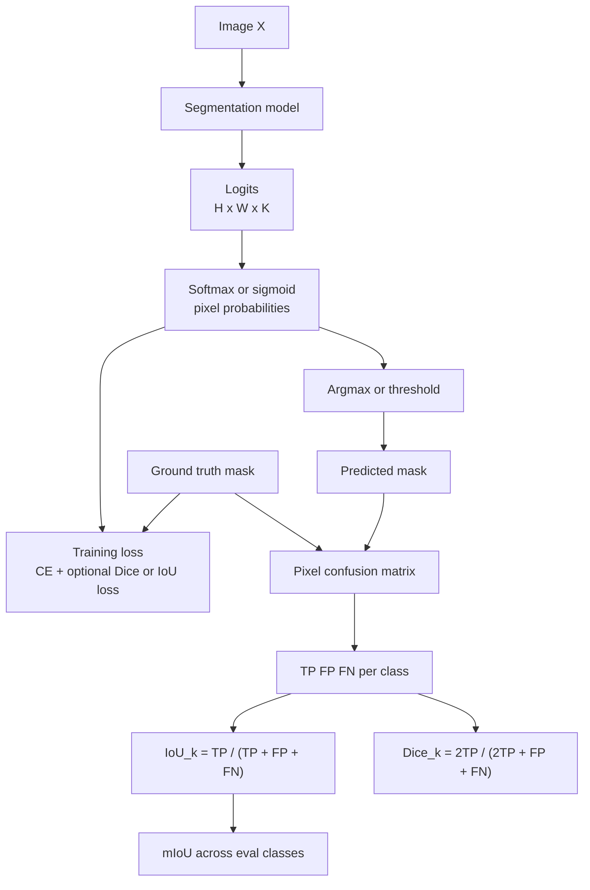

# Segmentation Metrics and Losses

Source: `DL_exam.pdf`, Question 19

Original question:

> Метрики и функции потерь в сегментации. Pixel-wise cross-entropy, IoU/mIoU, Dice/F1, особенности оценки качества.

## Интуиция

В сегментации модель предсказывает класс для каждого пикселя, поэтому обучение и оценка качества строятся вокруг сравнения двух масок: истинной $Y$ и предсказанной $\hat{Y}$. Наивная `pixel accuracy` часто обманчива: если фон занимает 95% изображения, модель может хорошо выглядеть по accuracy, но почти не находить маленькие объекты.

`Pixel-wise cross-entropy` удобна для обучения, потому что она дифференцируема и наказывает неверную вероятность правильного класса в каждом пикселе. Но она смотрит на пиксели независимо и не напрямую оптимизирует пересечение масок.

`IoU` и `Dice/F1` оценивают уже форму и overlap областей. Они отвечают на вопрос: насколько предсказанная область совпадает с истинной? `mIoU` усредняет IoU по классам и поэтому лучше показывает качество на всех классах, включая редкие, чем простая pixel accuracy.

## Что нужно сказать на экзамене

- В semantic segmentation модель выдает logits $Z \in \mathbb{R}^{H \times W \times K}$, после softmax получается вероятность класса для каждого пикселя.
- `Pixel-wise cross-entropy`:

$$
\mathcal{L}_{CE}
= -\frac{1}{|\Omega|}
\sum_{i \in \Omega}
\log p_\theta(y_i \mid X),
$$

где $i$ - индекс пикселя, $\Omega$ - размеченные пиксели без `ignore index`.

- Для class imbalance используют веса классов, `focal loss`, Dice loss, IoU/Jaccard loss или их комбинации с cross-entropy.
- Для одного класса:

$$
IoU = \frac{TP}{TP + FP + FN},
\qquad
Dice = F1 = \frac{2TP}{2TP + FP + FN}.
$$

- `mIoU` - среднее IoU по классам, обычно без `ignore`/void класса:

$$
mIoU = \frac{1}{K}\sum_{k=1}^{K} IoU_k.
$$

- `Dice` сильнее акцентирует overlap и часто используется в медицинской сегментации и при маленьких объектах.
- Метрики считаются по confusion matrix на пикселях, но нужно аккуратно выбирать averaging: по классам, по изображениям или глобально по датасету.
- Особенности оценки: class imbalance, фон, маленькие объекты, тонкие границы, `ignore index`, разные разрешения, threshold для binary/multilabel, void labels, annotation noise, boundary quality.

## Подробный ответ

Пусть изображение имеет $N = H \cdot W$ пикселей, а задача имеет $K$ классов. Для удобства пиксель обозначается индексом $i$. Модель сегментации возвращает logits $z_{ik}$ для каждого пикселя и класса. Вероятность класса после softmax:

$$
p_{ik}
= p_\theta(y_i = k \mid X)
= \frac{\exp z_{ik}}{\sum_{c=1}^{K}\exp z_{ic}}.
$$

Истинная маска $Y$ задает label $y_i \in \{1,\dots,K\}$ для каждого размеченного пикселя. Если часть пикселей не размечена или помечена как `void`, их исключают из обучения и оценки через множество $\Omega$.

### Pixel-wise cross-entropy

`Pixel-wise cross-entropy` рассматривает segmentation как независимую классификацию каждого пикселя при условии изображения:

$$
\mathcal{L}_{CE}
= -\frac{1}{|\Omega|}
\sum_{i \in \Omega}
\sum_{k=1}^{K}
\mathbf{1}[y_i=k]\log p_{ik}
= -\frac{1}{|\Omega|}
\sum_{i \in \Omega}
\log p_{i,y_i}.
$$

Если классы несбалансированы, вводят веса:

$$
\mathcal{L}_{WCE}
= -\frac{1}{|\Omega|}
\sum_{i \in \Omega}
w_{y_i}\log p_{i,y_i}.
$$

Вес $w_k$ обычно больше для редких классов. Это помогает не игнорировать маленькие объекты, но слишком большие веса могут ухудшить calibration вероятностей и дать много false positives.

Плюсы cross-entropy:

- проста, стабильна и хорошо сочетается с `backpropagation`;
- дает градиент даже когда предсказанная маска почти не пересекается с истинной;
- естественно работает с многоклассовым softmax.

Минусы:

- каждый пиксель вносит вклад отдельно, поэтому loss не оптимизирует напрямую форму маски или overlap;
- фон и большие классы могут доминировать;
- качество границ и связность объектов явно не учитываются.

Для binary segmentation часто используют sigmoid и binary cross-entropy:

$$
\mathcal{L}_{BCE}
= -\frac{1}{|\Omega|}
\sum_{i \in \Omega}
\left[
y_i \log p_i + (1-y_i)\log(1-p_i)
\right].
$$

Для multilabel segmentation, где один пиксель может иметь несколько независимых labels, также используют sigmoid по каждому классу, а не softmax.

### Confusion matrix на пикселях

Метрики overlap удобно выражать через $TP$, $FP$, $FN$, $TN$. Для класса $k$:

- $TP_k$: пиксели, где $y_i=k$ и $\hat{y}_i=k$;
- $FP_k$: пиксели, где $y_i\neq k$, но $\hat{y}_i=k$;
- $FN_k$: пиксели, где $y_i=k$, но $\hat{y}_i\neq k$;
- $TN_k$: пиксели, где $y_i\neq k$ и $\hat{y}_i\neq k$.

Для semantic segmentation эти величины обычно считаются one-vs-rest для каждого класса. Предсказание берется как $\hat{y}_i=\arg\max_k p_{ik}$, если задача многоклассовая. В binary segmentation может потребоваться threshold: $\hat{y}_i=\mathbf{1}[p_i \ge \tau]$.

### IoU и mIoU

`IoU` (`Intersection over Union`, также `Jaccard index`) измеряет отношение пересечения предсказанной и истинной области к их объединению:

$$
IoU_k
= \frac{|P_k \cap G_k|}{|P_k \cup G_k|}
= \frac{TP_k}{TP_k + FP_k + FN_k}.
$$

Здесь $P_k$ - множество пикселей, предсказанных как класс $k$, а $G_k$ - множество истинных пикселей класса $k$. $TN$ не входит в IoU, поэтому метрика не раздувается большим количеством фоновых пикселей, которые правильно не попали в класс.

`mIoU` (`mean IoU`) усредняет IoU по классам:

$$
mIoU = \frac{1}{|\mathcal{K}_{eval}|}
\sum_{k \in \mathcal{K}_{eval}} IoU_k,
$$

где $\mathcal{K}_{eval}$ - классы, участвующие в оценке. Обычно из него исключают `ignore`, `void` и иногда фон, если протокол датасета так определен. Важно явно сказать, какие классы усредняются.

Если класс отсутствует и в prediction, и в ground truth на конкретном изображении, знаменатель $TP_k+FP_k+FN_k=0$. В таком случае нужно следовать протоколу: пропустить этот класс для данного изображения или считать метрику глобально по всему датасету. Поэтому mIoU чаще надежнее считать по accumulated confusion matrix всего validation set, а не как простое среднее per-image IoU.

### Dice / F1

`Dice coefficient` для класса $k$:

$$
Dice_k
= \frac{2|P_k \cap G_k|}{|P_k| + |G_k|}
= \frac{2TP_k}{2TP_k + FP_k + FN_k}.
$$

Это то же выражение, что и $F1$ для one-vs-rest pixel classification:

$$
Precision_k = \frac{TP_k}{TP_k + FP_k},
\qquad
Recall_k = \frac{TP_k}{TP_k + FN_k},
$$

$$
F1_k
= \frac{2Precision_k \cdot Recall_k}{Precision_k + Recall_k}
= \frac{2TP_k}{2TP_k + FP_k + FN_k}.
$$

Связь между Dice и IoU для одного класса:

$$
Dice = \frac{2IoU}{1 + IoU},
\qquad
IoU = \frac{Dice}{2 - Dice}.
$$

Они монотонно связаны, но численно Dice обычно больше IoU. Например, при $IoU=0.5$ получаем $Dice=\frac{2}{3}$. Поэтому нельзя напрямую сравнивать числа Dice и IoU без указания метрики.

### Dice loss и soft IoU loss

Так как `argmax` и дискретные множества пикселей недифференцируемы, для обучения используют "soft" версии overlap losses. Для binary segmentation:

$$
\mathcal{L}_{Dice}
= 1 -
\frac{2\sum_{i \in \Omega} p_i y_i + \epsilon}
{\sum_{i \in \Omega} p_i + \sum_{i \in \Omega} y_i + \epsilon}.
$$

Для класса $k$ в multiclass случае:

$$
SoftDice_k
=
\frac{2\sum_{i \in \Omega} p_{ik}\mathbf{1}[y_i=k] + \epsilon}
{\sum_{i \in \Omega} p_{ik} + \sum_{i \in \Omega}\mathbf{1}[y_i=k] + \epsilon}.
$$

Затем усредняют по классам. $\epsilon$ нужен для численной устойчивости, особенно если класс редкий или отсутствует в batch.

`Soft IoU` или `Jaccard loss`:

$$
SoftIoU_k
=
\frac{\sum_{i \in \Omega} p_{ik}\mathbf{1}[y_i=k] + \epsilon}
{\sum_{i \in \Omega} p_{ik}
+ \sum_{i \in \Omega}\mathbf{1}[y_i=k]
- \sum_{i \in \Omega} p_{ik}\mathbf{1}[y_i=k]
+ \epsilon},
$$

$$
\mathcal{L}_{IoU} = 1 - \frac{1}{|\mathcal{K}_{train}|}\sum_{k \in \mathcal{K}_{train}} SoftIoU_k.
$$

На практике часто используют комбинированную loss:

$$
\mathcal{L}
= \mathcal{L}_{CE} + \lambda \mathcal{L}_{Dice},
$$

потому что cross-entropy дает устойчивые локальные градиенты, а Dice/IoU-like loss лучше согласуется с итоговой overlap-метрикой.

### Сравнение основных метрик

| Метрика | Формула для класса $k$ | Что хорошо показывает | Главный риск |
|---|---:|---|---|
| Pixel accuracy | $\frac{TP+TN}{TP+FP+FN+TN}$ | долю правильно классифицированных пикселей | доминирует фон и большие классы |
| Mean pixel accuracy | $\frac{1}{K}\sum_k \frac{TP_k}{TP_k+FN_k}$ | средний recall по классам | не учитывает false positives так же строго, как IoU |
| IoU | $\frac{TP_k}{TP_k+FP_k+FN_k}$ | overlap масок без учета $TN$ | строгая к ошибкам на малых объектах |
| mIoU | $\frac{1}{K}\sum_k IoU_k$ | качество по классам | зависит от правил усреднения и absent classes |
| Dice/F1 | $\frac{2TP_k}{2TP_k+FP_k+FN_k}$ | overlap, баланс precision/recall | численно выше IoU, может скрывать часть ошибок при сравнении |

### Особенности оценки качества

1. **Дисбаланс классов.** Фон и большие области могут занимать большую часть изображения. Поэтому pixel accuracy обычно недостаточна; нужны mIoU, Dice или class-balanced metrics.

2. **Маленькие объекты.** Один и тот же сдвиг границы может почти не менять метрику для большого объекта, но сильно портить IoU маленького объекта.

3. **Границы.** IoU и Dice считают пиксельный overlap, но не всегда хорошо отражают качество контура. Для задач, где важна точная граница, дополнительно используют boundary IoU, contour F-score или Hausdorff distance.

4. **Ignore/void labels.** Неразмеченные или неоднозначные пиксели нужно исключать и из loss, и из confusion matrix. Иначе модель будет наказана за области, где ground truth не определен.

5. **Разрешение и resizing.** Если logits или маски меняют размер через interpolation, важно не испортить labels: для ground truth masks используют nearest-neighbor interpolation, а не bilinear.

6. **Binary, multiclass, multilabel.** В multiclass segmentation классы взаимоисключающие и используют softmax. В multilabel segmentation классы независимы и используют sigmoid с отдельным threshold для каждого класса.

7. **Усреднение.** `Macro` averaging по классам лучше видит редкие классы, `micro` averaging по пикселям сильнее зависит от частых классов. Нужно знать протокол датасета.

8. **Threshold и calibration.** В binary segmentation значение threshold $\tau$ влияет на precision/recall, Dice и IoU. Иногда threshold подбирают на validation set, но test protocol должен быть честным.

9. **Annotation noise.** В segmentation разметка границ часто субъективна. Слишком строгая пиксельная метрика может наказывать визуально приемлемые предсказания около границы.

## Формулы / алгоритмы

### Алгоритм подсчета mIoU

Вход: предсказанные logits или маски, ground truth masks, список оцениваемых классов $\mathcal{K}_{eval}$, `ignore index`.  
Выход: $IoU_k$ для классов и $mIoU$.

1. Для каждого изображения получить labels:

$$
\hat{y}_i = \arg\max_k p_{ik}.
$$

2. Исключить пиксели с `ignore index` из ground truth.
3. Накопить pixel confusion matrix $C \in \mathbb{N}^{K \times K}$, где $C_{ab}$ - число пикселей с истинным классом $a$ и предсказанным классом $b$.
4. Для каждого класса $k$:

$$
TP_k = C_{kk},
$$

$$
FP_k = \sum_{a \neq k} C_{ak},
$$

$$
FN_k = \sum_{b \neq k} C_{kb}.
$$

5. Посчитать:

$$
IoU_k = \frac{TP_k}{TP_k + FP_k + FN_k}.
$$

6. Усреднить по классам из $\mathcal{K}_{eval}$, соблюдая правило обработки отсутствующих классов:

$$
mIoU = \frac{1}{|\mathcal{K}_{eval}|}\sum_{k \in \mathcal{K}_{eval}} IoU_k.
$$

Практическая сложность подсчета метрик линейна по числу оцениваемых пикселей: $O(N)$ для прохода по маскам, плюс $O(K^2)$ памяти на confusion matrix. Обычно $K$ мало по сравнению с $N$.

### Типичный training objective

Для multiclass segmentation:

$$
Z = f_\theta(X), \qquad p_{ik} = softmax(Z_i)_k.
$$

$$
\mathcal{L}
=
-\frac{1}{|\Omega|}\sum_{i \in \Omega} w_{y_i}\log p_{i,y_i}
+ \lambda
\left(
1 - \frac{1}{|\mathcal{K}_{train}|}
\sum_{k \in \mathcal{K}_{train}} SoftDice_k
\right).
$$

Pipeline:

1. Сеть предсказывает logits размера $H \times W \times K$ или меньшего размера с последующим upsampling.
2. Для loss ground truth и logits приводят к совместимому разрешению.
3. Пиксели `ignore index` маскируют.
4. Считают cross-entropy по пикселям.
5. При необходимости добавляют Dice/IoU-like term для борьбы с дисбалансом и улучшения overlap.
6. На validation set считают дискретные метрики после `argmax` или threshold, а не только training loss.

## Диаграмма или изображение

Внешние изображения не использовались.

## Быстрая устная версия

В сегментации loss обычно считается по пикселям: модель выдает logits для каждого пикселя, softmax дает вероятности классов, а `pixel-wise cross-entropy` штрафует низкую вероятность правильного класса. Это удобно для обучения, но из-за дисбаланса фона и объектов часто добавляют веса классов, Dice loss или IoU-like loss.

Для оценки качества важнее overlap масок. Для класса $k$ $IoU_k=\frac{TP_k}{TP_k+FP_k+FN_k}$, а $Dice_k=F1_k=\frac{2TP_k}{2TP_k+FP_k+FN_k}$. `mIoU` - средний IoU по оцениваемым классам, обычно считается по накопленной confusion matrix на всем validation set. Нужно помнить про `ignore index`, фон, маленькие объекты, правила усреднения, threshold в binary segmentation и то, что pixel accuracy может быть misleading.

## Возможные уточняющие вопросы

- Почему pixel accuracy плоха для сегментации?  
  Потому что большие классы и фон могут доминировать. Модель, которая почти всегда предсказывает фон, может иметь высокую accuracy, но плохой IoU для объектов.

- Чем IoU отличается от Dice?  
  $IoU=\frac{TP}{TP+FP+FN}$, а $Dice=\frac{2TP}{2TP+FP+FN}$. Dice монотонно связан с IoU и обычно численно выше.

- Почему $TN$ не входит в IoU и Dice?  
  Для класса в segmentation true negatives часто огромны, особенно для маленьких объектов. Если учитывать $TN$, метрика может выглядеть хорошей даже при плохом выделении объекта.

- Что такое mIoU?  
  Это средний IoU по классам: сначала считают IoU каждого класса one-vs-rest, затем усредняют по классам из evaluation protocol.

- Как считать метрики при `ignore index`?  
  Такие пиксели исключают из loss и из confusion matrix, чтобы не наказывать модель за неопределенную или отсутствующую разметку.

- Почему Dice loss полезна при маленьких объектах?  
  Она нормирует ошибку на размер предсказанной и истинной области, поэтому редкий класс не так легко потерять на фоне большого числа фоновых пикселей.

- Можно ли напрямую оптимизировать mIoU?  
  Дискретный mIoU после `argmax` недифференцируем. Поэтому используют soft IoU/Jaccard loss, Lovasz-type surrogates или комбинируют CE с overlap loss.

- Как выбирать threshold в binary segmentation?  
  Threshold влияет на precision, recall, Dice и IoU. Его можно подобрать на validation set, но нельзя подгонять по test set.

## Частые ошибки

- Называть pixel-wise cross-entropy метрикой качества. Это training loss; для оценки обычно используют IoU, mIoU, Dice/F1 и похожие метрики.
- Считать, что высокая pixel accuracy всегда означает хорошую сегментацию. При большом фоне это часто неверно.
- Путать IoU с Dice и сравнивать их численные значения напрямую.
- Забывать, что IoU и Dice для multiclass segmentation считаются по классам one-vs-rest, а затем усредняются.
- Включать `ignore` или `void` класс в mIoU без проверки протокола.
- Усреднять per-image IoU без понимания, что absent classes могут исказить результат.
- Использовать bilinear interpolation для resizing ground truth masks: это создает невалидные labels; нужен nearest-neighbor.
- Считать loss на logits меньшего разрешения, не проверив корректное соответствие с ground truth.
- Не различать multiclass softmax segmentation и multilabel sigmoid segmentation.
- Забывать, что boundary quality может быть плохой даже при приемлемом глобальном IoU, особенно для тонких структур.
