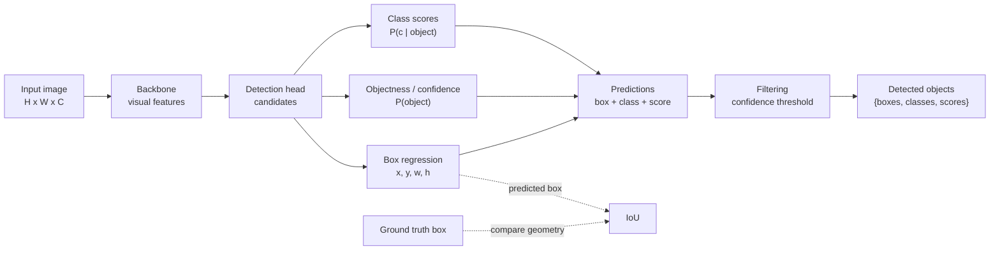

# Object Detection Basics

Source: `DL_exam.pdf`, Question 20

Original question:

> Object detection. Постановка задачи, bounding boxes, confidence, IoU, отличие detection от classification и segmentation.

## Интуиция

`Object detection` отвечает сразу на два вопроса: **что** находится на изображении и **где** это находится. В отличие от обычной классификации, модель не ограничивается одним label для всей картинки: на изображении может быть несколько объектов разных классов, несколько объектов одного класса и фон.

Главный компромисс детекции: вместо точной пиксельной маски, как в segmentation, объект описывается прямоугольником `bounding box`. Это грубее, чем маска, но проще размечать, быстрее предсказывать и удобно для многих задач: найти людей, машины, дефекты, лица, товары на полке.

Каждое предсказание обычно имеет вид: класс объекта, координаты box и confidence score. `Confidence` показывает, насколько модель уверена, что в этом месте действительно есть объект нужного класса. Качество локализации сравнивают через `IoU` - насколько сильно пересекаются предсказанный и истинный прямоугольники.

## Что нужно сказать на экзамене

- Вход: изображение $X \in \mathbb{R}^{H \times W \times C}$.
- Выход: множество объектов переменного размера:

$$
\hat{Y} = \{(\hat{b}_i, \hat{c}_i, \hat{s}_i)\}_{i=1}^{N},
$$

где $\hat{b}_i$ - bounding box, $\hat{c}_i$ - class label, $\hat{s}_i$ - confidence score.

- `Bounding box` - прямоугольная область вокруг объекта. Частые форматы: $(x_{\min}, y_{\min}, x_{\max}, y_{\max})$ или $(x_c, y_c, w, h)$.
- `Confidence` может означать objectness $P(\text{object})$, class probability $P(c \mid \text{object})$ или их произведение $P(\text{object})P(c \mid \text{object})$; точный смысл зависит от архитектуры.
- `IoU` (`Intersection over Union`) измеряет overlap двух boxes:

$$
\operatorname{IoU}(A,B)=\frac{|A \cap B|}{|A \cup B|}.
$$

- Detection отличается от classification тем, что нужно не только определить класс, но и локализовать каждый объект; выход имеет переменное число элементов.
- Detection отличается от semantic segmentation тем, что дает прямоугольники объектов, а segmentation дает класс каждому пикселю.
- Detection отличается от instance segmentation тем, что instance segmentation дает отдельную маску для каждого экземпляра, а detection обычно ограничивается box.
- Типичная модель решает две подзадачи: classification/objectness для кандидатов и box regression для координат.
- Основные сложности: несколько объектов, фон, перекрытия, разные масштабы, маленькие объекты, дубликаты предсказаний, class imbalance между фоном и объектами.

## Подробный ответ

В задаче object detection дана обучающая выборка изображений с разметкой объектов:

$$
Y = \{(b_j, c_j)\}_{j=1}^{M},
$$

где $M$ может быть разным для разных изображений, $b_j$ - координаты bounding box, а $c_j \in \{1,\dots,K\}$ - класс объекта. Важная особенность: результат не является фиксированным вектором, как в classification. Модель должна вернуть множество предсказаний, потому что объектов может быть ноль, один или много.

### Bounding boxes

`Bounding box` - прямоугольник, который ограничивает видимую область объекта. На практике используются несколько параметризаций.

| Формат | Значение | Где удобен |
|---|---|---|
| $(x_{\min}, y_{\min}, x_{\max}, y_{\max})$ | левый верхний и правый нижний углы | вычисление площади, пересечения и IoU |
| $(x_c, y_c, w, h)$ | центр, ширина и высота | regression относительно anchors или grid cells |
| normalized coordinates | координаты делятся на $W$ и $H$ | независимость от размера изображения |

Для формата $(x_{\min}, y_{\min}, x_{\max}, y_{\max})$ обычно требуется:

$$
x_{\min} < x_{\max}, \quad y_{\min} < y_{\max}.
$$

Площадь box:

$$
|b| = (x_{\max}-x_{\min})(y_{\max}-y_{\min}).
$$

Если координаты нормализованы, то $x \in [0,1]$ и $y \in [0,1]$. Если координаты заданы в пикселях, нужно явно помнить систему координат изображения: ось $x$ направлена вправо, ось $y$ - вниз.

### Confidence

`Confidence score` нужен, чтобы ранжировать предсказания и отделять реальные объекты от фона. В разных семействах детекторов score может трактоваться по-разному:

- objectness: вероятность того, что candidate region содержит какой-либо объект;
- class probability: вероятность конкретного класса;
- class-specific confidence: совместная уверенность в наличии объекта и его классе.

Типичная запись:

$$
s_i(c) = P_\theta(\text{object} \mid r_i, X) \cdot P_\theta(c \mid \text{object}, r_i, X),
$$

где $r_i$ - candidate region, anchor или позиция сетки. В некоторых архитектурах score сразу предсказывается как class-specific logit без явного разделения objectness и class probability.

Confidence не равен IoU. Confidence - оценка уверенности модели, а IoU - геометрическое сравнение двух boxes. Хороший confidence при плохой локализации означает, что модель поняла класс, но неточно поставила box.

### IoU

`IoU` (`Intersection over Union`) показывает, насколько предсказанный box совпадает с ground truth box. Для boxes $A$ и $B$:

$$
\operatorname{IoU}(A,B)=\frac{|A \cap B|}{|A \cup B|}
= \frac{|A \cap B|}{|A| + |B| - |A \cap B|}.
$$

Значения:

- $\operatorname{IoU}=1$ - boxes полностью совпадают;
- $\operatorname{IoU}=0$ - boxes не пересекаются;
- промежуточные значения показывают долю overlap относительно объединения.

Для boxes в формате углов пересечение вычисляется так:

$$
x_I^{\min}=\max(x_A^{\min},x_B^{\min}), \quad
y_I^{\min}=\max(y_A^{\min},y_B^{\min}),
$$

$$
x_I^{\max}=\min(x_A^{\max},x_B^{\max}), \quad
y_I^{\max}=\min(y_A^{\max},y_B^{\max}).
$$

Ширина и высота пересечения:

$$
w_I = \max(0, x_I^{\max}-x_I^{\min}), \quad
h_I = \max(0, y_I^{\max}-y_I^{\min}).
$$

Тогда:

$$
|A \cap B| = w_I h_I.
$$

IoU используют для назначения предсказаний ground truth объектам, для определения true positive при оценке качества и как часть loss или ее модификаций в современных детекторах. На базовом уровне важно понимать: IoU оценивает именно локализацию, а не правильность класса.

### Чем detection отличается от classification

В image classification модель получает изображение и выдает один label или вектор вероятностей:

$$
f_\theta(X) \rightarrow p(y \mid X).
$$

В object detection модель выдает множество объектов:

$$
f_\theta(X) \rightarrow \{(b_i, c_i, s_i)\}_{i=1}^{N}.
$$

Отличия:

| Свойство | Classification | Object detection |
|---|---|---|
| Что предсказываем | класс изображения | классы и boxes объектов |
| Число выходов | фиксированное | переменное |
| Локализация | нет | да |
| Несколько объектов | обычно не различаются | отдельные предсказания |
| Фон | неявный контекст | явный источник negative candidates |

Если на изображении есть две машины и один человек, classification может сказать "car" или "person" или multi-label набор классов, но не скажет, где находятся объекты и сколько их экземпляров. Detection должна вернуть отдельные boxes.

### Чем detection отличается от segmentation

Segmentation решает более плотную задачу: каждому пикселю ставится в соответствие class label или instance mask.

| Задача | Выход | Что локализует |
|---|---|---|
| Object detection | boxes + classes + scores | прямоугольные области объектов |
| Semantic segmentation | class map $H \times W$ | класс каждого пикселя, без identity экземпляров |
| Instance segmentation | masks per instance | форму каждого отдельного объекта |
| Panoptic segmentation | semantic + instance masks | фоновые классы и отдельные объекты |

Detection проще и дешевле, чем segmentation, но box может включать фон и плохо описывать форму вытянутых, тонких или сильно перекрытых объектов. Segmentation точнее описывает границы, но требует более дорогой разметки и более плотного выхода.

### Типовая структура решения

Большинство detector architectures можно понимать как комбинацию трех идей:

1. `Backbone` извлекает visual features из изображения.
2. `Detection head` для множества candidate locations/regions предсказывает class scores, objectness и box offsets.
3. Предсказания фильтруются по confidence и качеству локализации; дубликаты обычно подавляются post-processing, например `NMS`.

На уровне обучения часто есть две части objective:

$$
\mathcal{L} = \mathcal{L}_{cls} + \lambda \mathcal{L}_{box},
$$

где $\mathcal{L}_{cls}$ обучает class/objectness prediction, а $\mathcal{L}_{box}$ обучает координаты. Для box regression используют $L_1$, smooth $L_1$, IoU-based losses и их варианты. Для классификации используют cross-entropy, binary cross-entropy или focal loss, особенно при сильном дисбалансе между фоном и объектами.

## Формулы / алгоритмы

### IoU для двух boxes

Вход: $A=(x_A^{\min},y_A^{\min},x_A^{\max},y_A^{\max})$, $B=(x_B^{\min},y_B^{\min},x_B^{\max},y_B^{\max})$.  
Выход: $\operatorname{IoU}(A,B)$.

1. Найти координаты пересечения:

$$
x_I^{\min}=\max(x_A^{\min},x_B^{\min}), \quad
y_I^{\min}=\max(y_A^{\min},y_B^{\min}),
$$

$$
x_I^{\max}=\min(x_A^{\max},x_B^{\max}), \quad
y_I^{\max}=\min(y_A^{\max},y_B^{\max}).
$$

2. Посчитать размеры пересечения:

$$
w_I=\max(0,x_I^{\max}-x_I^{\min}), \quad
h_I=\max(0,y_I^{\max}-y_I^{\min}).
$$

3. Посчитать площади:

$$
I=w_Ih_I,
$$

$$
|A|=(x_A^{\max}-x_A^{\min})(y_A^{\max}-y_A^{\min}),
$$

$$
|B|=(x_B^{\max}-x_B^{\min})(y_B^{\max}-y_B^{\min}).
$$

4. Посчитать объединение и IoU:

$$
U=|A|+|B|-I,
$$

$$
\operatorname{IoU}(A,B)=\frac{I}{U}.
$$

Если $U=0$, значит boxes некорректны или имеют нулевую площадь; в корректной разметке такого быть не должно.

### Упрощенный detection pipeline

Вход: изображение $X$.  
Выход: множество detected objects $\{(\hat{b}_i,\hat{c}_i,\hat{s}_i)\}$.

1. Извлечь признаки: $F = \operatorname{backbone}(X)$.
2. Сгенерировать candidates: anchors, grid cells, proposals или query-представления.
3. Для каждого candidate предсказать:
   - objectness или confidence;
   - распределение по классам;
   - offsets для bounding box.
4. Преобразовать offsets в boxes в координатах изображения.
5. Оставить предсказания с достаточно высоким confidence.
6. При необходимости удалить дубликаты post-processing-ом.
7. Вернуть boxes, classes и scores.

Практические caveats: модель должна различать объект и фон, правильно обрабатывать разные масштабы, не терять маленькие объекты и не выдавать много почти одинаковых boxes на один объект.

## Диаграмма или изображение

Внешние изображения не использовались.

## Быстрая устная версия

Object detection - это задача найти на изображении все объекты интересующих классов и для каждого выдать bounding box, class label и confidence. В отличие от classification, здесь нужно не только сказать, что объект есть, но и локализовать его, причем объектов может быть несколько. В отличие от segmentation, detection обычно не предсказывает пиксельную маску, а описывает объект прямоугольником.

Bounding box задается координатами углов или центром, шириной и высотой. Confidence - это уверенность модели в наличии объекта и/или его классе. IoU равен площади пересечения двух boxes, деленной на площадь их объединения, и используется для оценки качества локализации и сопоставления predictions с ground truth.

## Возможные уточняющие вопросы

- Что именно означает confidence?  
  Зависит от модели: это может быть objectness, вероятность класса или произведение objectness и class probability.

- Почему confidence и IoU нельзя считать одним и тем же?  
  Confidence - предсказанная моделью уверенность, а IoU - геометрическая мера совпадения predicted box и ground truth box.

- Какие есть форматы bounding box?  
  Часто используют $(x_{\min}, y_{\min}, x_{\max}, y_{\max})$ или $(x_c, y_c, w, h)$; координаты могут быть пиксельными или нормализованными.

- Что означает IoU threshold, например 0.5?  
  Обычно prediction считается достаточно хорошо локализованным, если его IoU с ground truth не меньше порога; точные правила оценки зависят от benchmark.

- Почему detection сложнее classification?  
  Нужно решать classification и localization одновременно, работать с переменным числом объектов, фоном, масштабами и перекрытиями.

- Почему detection не заменяет segmentation?  
  Box дает только прямоугольную область и может включать фон; segmentation нужна, когда важна точная форма объекта на уровне пикселей.

- Может ли detection находить несколько объектов одного класса?  
  Да, каждый экземпляр должен получить отдельный predicted box, например три boxes для трех машин.

- Что такое background в detection?  
  Это области или candidates, которые не соответствуют объектам интересующих классов; их нужно подавлять, иначе будет много false positives.

## Частые ошибки

- Путать confidence с IoU: первое является score модели, второе - геометрическая мера overlap.
- Говорить, что object detection выдает только класс изображения. Это classification.
- Говорить, что detection всегда дает точную форму объекта. Обычно он дает bounding box, а точная форма относится к segmentation.
- Забывать, что число объектов на изображении переменное.
- Не различать objectness и class probability.
- Считать, что высокий confidence гарантирует правильную локализацию. Box может быть сдвинут, даже если класс угадан.
- Неправильно считать IoU: union - это $|A|+|B|-|A \cap B|$, а не просто сумма площадей.
- Игнорировать случаи непересекающихся boxes: тогда ширина или высота пересечения должна быть обрезана через $\max(0,\cdot)$.
- Смешивать semantic segmentation и instance segmentation при сравнении с detection.
