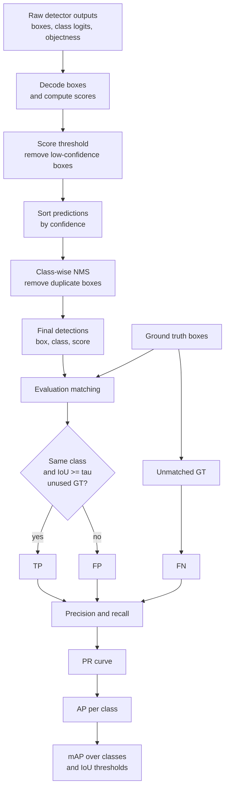

# Detection Metrics and Postprocessing

Source: `DL_exam.pdf`, Question 21

Original question:

> Метрики и post-processing в детекции. Precision/recall, AP/mAP, Non-Maximum Suppression.

## Интуиция

В object detection модель обычно выдает много кандидатов: часть из них попадает в реальные объекты, часть является фоном, а часть дублирует один и тот же объект несколькими похожими boxes. Поэтому качество детектора нельзя оценивать только accuracy: нужно одновременно учитывать правильность класса, точность локализации и способность не пропускать объекты.

`Precision` отвечает на вопрос: среди найденных моделью объектов сколько действительно верные? `Recall` отвечает на другой вопрос: сколько объектов из разметки модель смогла найти? Между ними есть компромисс: если оставить только предсказания с очень высоким confidence, precision обычно растет, но recall падает; если снизить threshold, recall растет, но появляется больше false positives.

`AP` (`Average Precision`) суммирует этот компромисс по всем confidence thresholds для одного класса. `mAP` (`mean Average Precision`) усредняет AP по классам, а в современных протоколах часто еще и по нескольким IoU thresholds. `NMS` (`Non-Maximum Suppression`) - основной post-processing: он оставляет самый уверенный box среди сильно перекрывающихся предсказаний и подавляет дубликаты.

## Что нужно сказать на экзамене

- Детектор выдает набор предсказаний $(\hat{b}_i, \hat{c}_i, \hat{s}_i)$: box, class, confidence score.
- Для оценки нужно сопоставить предсказания с ground truth objects того же класса через IoU threshold $\tau$, например $\tau=0.5$.
- `True positive` (`TP`) - предсказание правильного класса, которое имеет $\operatorname{IoU} \ge \tau$ с еще не использованным ground truth.
- `False positive` (`FP`) - лишнее предсказание: фон, неправильный класс, плохая локализация или дубликат уже найденного объекта.
- `False negative` (`FN`) - ground truth объект, который не был найден.
- Precision и recall:

$$
\operatorname{Precision}=\frac{TP}{TP+FP}, \quad
\operatorname{Recall}=\frac{TP}{TP+FN}.
$$

- Precision-recall curve строится сортировкой предсказаний по confidence score и постепенным добавлением предсказаний от самых уверенных к менее уверенным.
- `AP` - площадь под precision-recall curve для одного класса:

$$
\operatorname{AP}=\int_0^1 p(r)\,dr
$$

или дискретная аппроксимация по точкам recall.

- `mAP` - среднее AP по классам:

$$
\operatorname{mAP}=\frac{1}{K}\sum_{k=1}^{K}\operatorname{AP}_k.
$$

- В PASCAL VOC часто говорят про $\operatorname{AP}@0.5$; в COCO стандартно используют $\operatorname{mAP}@[.5:.95]$, то есть усреднение по IoU thresholds от $0.50$ до $0.95$ с шагом $0.05$.
- `NMS` нужен, потому что детектор часто предсказывает несколько boxes вокруг одного объекта.
- Greedy NMS: отсортировать boxes по score, взять самый уверенный, удалить все boxes того же класса с IoU выше threshold $\theta$, повторять.
- Важные ограничения NMS: может удалить близкие разные объекты, чувствителен к thresholds, обычно не дифференцируем, добавляет post-processing к end-to-end модели.

## Подробный ответ

### Matching предсказаний и ground truth

Пусть для одного изображения есть ground truth разметка:

$$
Y=\{(b_j,c_j)\}_{j=1}^{M},
$$

а модель выдала предсказания:

$$
\hat{Y}=\{(\hat{b}_i,\hat{c}_i,\hat{s}_i)\}_{i=1}^{N}.
$$

Чтобы определить $TP$, $FP$ и $FN$, нужно выбрать IoU threshold $\tau$ и правило matching. Обычно оценка делается отдельно для каждого класса $k$:

1. Берутся только ground truth objects класса $k$.
2. Берутся только predictions класса $k$.
3. Predictions сортируются по убыванию confidence $\hat{s}_i$.
4. Каждое prediction сопоставляется с еще не занятым ground truth, с которым IoU максимален.
5. Если максимальный IoU $\ge \tau$, prediction считается $TP$, а ground truth помечается как использованный.
6. Иначе prediction считается $FP$.
7. Все неиспользованные ground truth objects после прохода дают $FN$.

Ключевая деталь: один ground truth объект может быть сопоставлен только с одним prediction. Если модель нарисовала пять почти одинаковых boxes вокруг одного объекта, первый самый уверенный box может стать $TP$, а остальные будут $FP$ как дубликаты.

### Precision и recall

Precision измеряет чистоту предсказаний:

$$
\operatorname{Precision}=\frac{TP}{TP+FP}.
$$

Высокий precision означает, что если модель что-то нашла, этому можно доверять. Но модель может иметь высокий precision и плохой recall, если она находит только самые простые объекты.

Recall измеряет полноту нахождения объектов:

$$
\operatorname{Recall}=\frac{TP}{TP+FN}.
$$

Высокий recall означает, что модель пропускает мало объектов. Но recall может быть высоким при низком precision, если модель выдает слишком много boxes и среди них много ложных.

Для oral exam полезно помнить смысл ошибок:

| Случай | Тип ошибки | Почему |
|---|---|---|
| Правильный класс, IoU $\ge \tau$, ground truth свободен | $TP$ | объект найден и локализован достаточно хорошо |
| Правильный класс, IoU $< \tau$ | $FP$ | локализация недостаточно точная |
| Неправильный класс | $FP$ для предсказанного класса и часто $FN$ для истинного класса | class error |
| Дубликат уже найденного объекта | $FP$ | один ground truth нельзя засчитать несколько раз |
| Ground truth без matching prediction | $FN$ | объект пропущен |

### Precision-recall curve

В detection confidence score используется не только для пороговой фильтрации, но и для ранжирования. Если взять высокий score threshold, останется мало предсказаний: обычно precision высокий, recall низкий. Если threshold снижать, добавляются менее уверенные predictions: recall может расти, но precision часто падает.

Практически PR curve строится так:

1. Для класса $k$ собрать predictions по всем изображениям датасета.
2. Отсортировать predictions по убыванию score.
3. Идти по списку и после каждого prediction обновлять накопленные $TP(t)$ и $FP(t)$.
4. Считать:

$$
p(t)=\frac{TP(t)}{TP(t)+FP(t)}, \quad
r(t)=\frac{TP(t)}{N_{gt}},
$$

где $N_{gt}$ - число ground truth objects класса $k$ во всем датасете.

Получается набор точек $(r(t),p(t))$. Хороший детектор ставит правильным predictions высокие scores, поэтому кривая держится ближе к верхнему правому углу: высокий recall достигается без сильного падения precision.

### AP

`Average Precision` - численное качество для одного класса при фиксированном IoU threshold. Интуитивно AP - площадь под precision-recall curve:

$$
\operatorname{AP}=\int_0^1 p(r)\,dr.
$$

Так как predictions конечны, на практике используется дискретная аппроксимация. Часто precision делают монотонной envelope-функцией, чтобы precision при большем recall не был ниже лучшего precision, достижимого при еще большем recall:

$$
p_{\text{interp}}(r)=\max_{\tilde{r}\ge r} p(\tilde{r}).
$$

Тогда AP можно считать как сумму по интервалам recall:

$$
\operatorname{AP}=\sum_n (r_n-r_{n-1})p_{\text{interp}}(r_n).
$$

Исторически в PASCAL VOC 2007 использовалась 11-point interpolation:

$$
\operatorname{AP}_{11}=\frac{1}{11}\sum_{r\in\{0,0.1,\dots,1.0\}} \max_{\tilde{r}\ge r} p(\tilde{r}).
$$

В более современных протоколах AP считают по всем точкам PR curve или по более плотной сетке recall. На экзамене важно не привязываться только к одной численной реализации, а объяснить общий смысл: AP измеряет качество ранжированного списка detections для одного класса.

### mAP

`mean Average Precision` усредняет AP по классам:

$$
\operatorname{mAP}=\frac{1}{K}\sum_{k=1}^{K}\operatorname{AP}_k.
$$

Если пишут $\operatorname{mAP}@0.5$, значит $TP$ определяются при IoU threshold $\tau=0.5$. Это сравнительно мягкая оценка: box может быть неидеальным, но если overlap достаточный, объект засчитывается.

Если пишут $\operatorname{mAP}@[.5:.95]$, как в COCO-style evaluation, AP считается для нескольких thresholds:

$$
\tau \in \{0.50,0.55,0.60,\dots,0.95\},
$$

а затем усредняется по thresholds и классам:

$$
\operatorname{mAP}_{.5:.95}
=\frac{1}{K|\mathcal{T}|}\sum_{k=1}^{K}\sum_{\tau\in\mathcal{T}}\operatorname{AP}_{k,\tau}.
$$

Такой показатель строже, потому что требует не только найти объект, но и точно локализовать его. Детектор может иметь высокий $\operatorname{mAP}@0.5$, но заметно ниже $\operatorname{mAP}@0.75$ или $\operatorname{mAP}@[.5:.95]$, если boxes грубые.

### Почему accuracy не подходит

В detection нет фиксированного числа независимых примеров на изображение: модель возвращает множество boxes переменного размера. Большая часть возможных regions является фоном, поэтому простая accuracy могла бы быть бессмысленно высокой при модели, которая почти всегда говорит "фон". Кроме того, нужно оценивать не только class label, но и геометрию box. Поэтому используются matching через IoU, PR curve, AP и mAP.

### Post-processing

Post-processing преобразует сырые выходы detector head в финальный список объектов. Типичный pipeline:

1. Decode box offsets в координаты изображения.
2. Преобразовать logits в class scores и objectness scores.
3. Отфильтровать predictions с score ниже threshold.
4. Оставить top-$N$ candidates, чтобы ограничить вычисления.
5. Применить NMS class-wise или class-agnostic.
6. Вернуть финальные boxes, classes и scores.

Score threshold влияет на precision/recall: высокий threshold уменьшает число $FP$, но может увеличить $FN$. NMS threshold влияет на дубликаты и на способность сохранить близко расположенные объекты.

### Non-Maximum Suppression

`NMS` решает проблему дубликатов. Многие детекторы генерируют несколько predictions для одного объекта: anchors разных размеров, соседние grid cells или overlapping proposals. Если их все оставить, пользователь увидит несколько boxes вокруг одного объекта, а evaluation засчитает лишние boxes как $FP$.

Greedy NMS для одного класса:

1. Отсортировать boxes по confidence score.
2. Взять box с максимальным score и добавить его в результат.
3. Удалить из оставшихся boxes те, у которых IoU с выбранным box больше threshold $\theta_{\text{NMS}}$.
4. Повторять, пока candidates не закончатся.

Формально, если выбран box $b^*$, то подавляются boxes $b_i$, для которых:

$$
\operatorname{IoU}(b^*,b_i)>\theta_{\text{NMS}}.
$$

Часто NMS делают separately per class: boxes разных классов не подавляют друг друга. В class-agnostic NMS class label игнорируется, и это может быть полезно, если модель часто предсказывает разные классы для одного и того же объекта, но опасно для перекрывающихся объектов разных классов.

### Ограничения и варианты NMS

Главная проблема greedy NMS: локальное решение может удалить правильный box для другого близкого объекта. Например, два человека стоят рядом и их boxes сильно пересекаются; если $\theta_{\text{NMS}}$ слишком низкий, один объект может пропасть. Если threshold слишком высокий, дубликаты останутся.

Распространенные варианты:

| Метод | Идея | Когда полезен |
|---|---|---|
| Greedy NMS | удалить boxes с IoU выше threshold | стандартный быстрый post-processing |
| Soft-NMS | не удалять box, а уменьшать его score в зависимости от IoU | плотные сцены, перекрывающиеся объекты |
| Class-wise NMS | применять NMS отдельно для каждого класса | обычная multi-class detection |
| Class-agnostic NMS | подавлять boxes независимо от класса | уменьшение дублей между классами |
| Weighted Boxes Fusion | объединять координаты похожих boxes взвешенно по scores | ensembles и test-time augmentation |

NMS обычно не является частью training objective и не дифференцируется в стандартном pipeline. Современные end-to-end detectors могут уменьшать потребность в NMS, если обучаются выдавать неповторяющийся набор объектов, но для классических one-stage и two-stage detectors NMS остается важной частью inference.

## Формулы / алгоритмы

### Precision, recall, AP, mAP

Исходные данные для класса $k$:

- ground truth objects класса $k$ во всем датасете: $N_{gt}$;
- predictions класса $k$: $(\hat{b}_i,\hat{s}_i)$;
- IoU threshold для засчитывания detection: $\tau$.

Алгоритм оценки AP:

1. Отсортировать predictions по убыванию $\hat{s}_i$.
2. Для каждого prediction найти неиспользованный ground truth того же класса с максимальным IoU.
3. Если IoU $\ge \tau$, пометить prediction как $TP$, иначе как $FP$.
4. Посчитать накопленные суммы:

$$
TP_n=\sum_{i=1}^{n}\mathbf{1}_i^{TP}, \quad
FP_n=\sum_{i=1}^{n}\mathbf{1}_i^{FP}.
$$

5. Построить точки precision и recall:

$$
p_n=\frac{TP_n}{TP_n+FP_n}, \quad
r_n=\frac{TP_n}{N_{gt}}.
$$

6. Аппроксимировать площадь под PR curve:

$$
\operatorname{AP}_{k,\tau}=\sum_n (r_n-r_{n-1})p_{\text{interp}}(r_n).
$$

7. Усреднить по классам и, если нужно, IoU thresholds:

$$
\operatorname{mAP}=\frac{1}{K|\mathcal{T}|}
\sum_{k=1}^{K}\sum_{\tau\in\mathcal{T}}\operatorname{AP}_{k,\tau}.
$$

Практические caveats:

- AP зависит от ranking по score: calibration scores важна, но AP прежде всего награждает правильный порядок detections.
- Для классов с малым числом объектов AP может быть шумным.
- При сравнении моделей нужно указывать протокол: dataset, IoU thresholds, max detections per image, class averaging, treatment of difficult/crowd annotations.

### Greedy NMS

Вход: boxes $B=\{b_i\}$, scores $S=\{s_i\}$, threshold $\theta_{\text{NMS}}$, опционально classes $C=\{c_i\}$.  
Выход: подмножество boxes $K$.

Для class-wise NMS:

1. Для каждого класса $c$ отдельно взять $B_c=\{b_i: c_i=c\}$.
2. Отсортировать $B_c$ по score по убыванию.
3. Пока список не пуст:
   - взять box $b^*$ с максимальным score;
   - добавить $b^*$ в $K$;
   - удалить из списка все $b_i$, для которых $\operatorname{IoU}(b^*,b_i)>\theta_{\text{NMS}}$.
4. Объединить результаты по всем классам.

Сложность naive NMS для $N$ boxes - $O(N^2)$ из-за попарных IoU comparisons. На практике число candidates ограничивают score threshold и top-$N$ фильтрацией, а реализации в PyTorch/Detectron/MMDetection используют optimized kernels.

## Диаграмма или изображение

Внешние изображения не использовались.

## Быстрая устная версия

В детекции качество считают через сопоставление predictions с ground truth по классу и IoU threshold. Если prediction правильного класса имеет IoU выше порога с еще не использованным ground truth, это true positive; иначе false positive. Ненайденные ground truth объекты - false negatives. Precision равен $TP/(TP+FP)$ и показывает чистоту detections, recall равен $TP/(TP+FN)$ и показывает полноту.

Так как у каждого prediction есть confidence, predictions сортируют по score и строят precision-recall curve при постепенном добавлении менее уверенных boxes. AP - площадь под этой кривой для одного класса, mAP - среднее AP по классам, а в COCO-style evaluation еще и по IoU thresholds от $0.5$ до $0.95$.

Post-processing нужен, потому что детектор часто выдает много дублей. В NMS boxes сортируются по score: берется самый уверенный box, а сильно пересекающиеся с ним boxes подавляются, если их IoU больше threshold. Это убирает дубликаты, но может ошибочно удалить близко расположенные реальные объекты.

## Возможные уточняющие вопросы

- Чем precision отличается от recall?  
  Precision отвечает "сколько найденных объектов верные", recall - "сколько истинных объектов найдено".

- Почему дубликат правильного объекта считается false positive?  
  Потому что один ground truth объект можно сопоставить только с одним prediction; остальные boxes вокруг него являются лишними detections.

- Что означает $\operatorname{AP}@0.5$?  
  AP считается при правиле, что prediction засчитывается как $TP$, если IoU с ground truth не меньше $0.5$.

- Почему $\operatorname{mAP}@[.5:.95]$ строже, чем $\operatorname{mAP}@0.5$?  
  Потому что усреднение включает высокие IoU thresholds, например $0.75$, $0.90$, $0.95$, где требуется гораздо более точная локализация.

- Что произойдет, если score threshold слишком высокий?  
  Модель оставит только самые уверенные predictions: false positives может стать меньше, но часть объектов пропадет, поэтому recall снизится.

- Что произойдет, если NMS threshold слишком низкий?  
  NMS станет агрессивным и может подавить boxes разных близких объектов.

- Что произойдет, если NMS threshold слишком высокий?  
  Подавление будет слабым, и вокруг одного объекта могут остаться дубликаты, увеличивая $FP$.

- Чем Soft-NMS отличается от обычного NMS?  
  Обычный NMS удаляет boxes, а Soft-NMS снижает их scores в зависимости от overlap, что может помочь при перекрывающихся объектах.

- Нужно ли применять NMS отдельно по классам?  
  В классическом multi-class detection обычно да; class-agnostic NMS используют, когда хотят подавлять межклассовые дубликаты, но он может удалить корректные перекрывающиеся объекты разных классов.

## Частые ошибки

- Путать confidence и IoU: confidence - score модели, IoU - геометрическое overlap с ground truth или другим box.
- Считать AP обычным средним precision при одном fixed threshold; AP оценивает всю precision-recall curve по confidence ranking.
- Не указывать IoU threshold при обсуждении AP/mAP: $\operatorname{mAP}@0.5$ и $\operatorname{mAP}@[.5:.95]$ - разные метрики.
- Засчитывать несколько predictions для одного ground truth как несколько $TP$; корректно только одно сопоставление, остальные дубликаты - $FP$.
- Думать, что высокий recall всегда означает хорошую модель; можно получить высокий recall ценой огромного числа false positives.
- Думать, что NMS улучшает локализацию boxes; NMS в основном удаляет дубликаты, а не исправляет координаты.
- Забывать, что NMS threshold и score threshold влияют на precision/recall trade-off.
- Сравнивать mAP разных работ без проверки protocol: dataset, IoU thresholds, max detections, class averaging и обработка crowd/difficult объектов могут отличаться.
