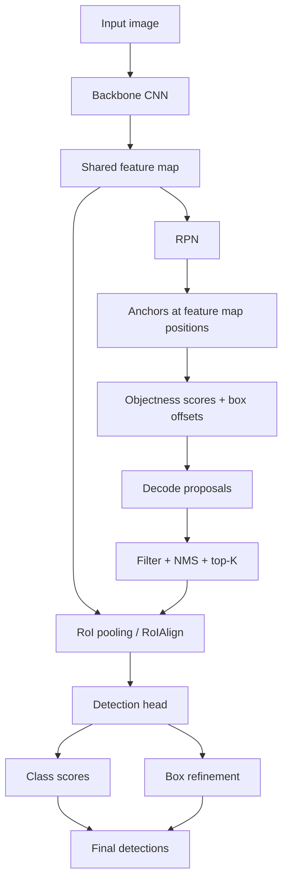

# Two Stage Object Detection

Source: `DL_exam.pdf`, Question 22

Original question:

> Two-stage object detection. Sliding window, R-CNN, Fast R-CNN, Faster R-CNN, Region Proposal Network.

## Интуиция

`Two-stage object detection` разделяет задачу детекции на два этапа. Сначала модель ищет небольшое число областей-кандидатов, где, вероятно, есть объект (`region proposals`). Затем для каждой области уточняет класс и координаты bounding box. Идея в том, чтобы не классифицировать все возможные прямоугольники на изображении, а сначала резко сузить пространство поиска.

Исторически путь шел от простого `sliding window`: прогнать классификатор по множеству окон разных размеров и позиций. Это понятно, но очень дорого, потому что окон огромное число. `R-CNN` заменил полный перебор окнами на region proposals, но все еще считал CNN features отдельно для каждого proposal. `Fast R-CNN` стал считать feature map один раз для всего изображения и вырезать из него признаки для proposals через `RoI pooling`. `Faster R-CNN` сделал следующий шаг: proposals генерируются не внешним алгоритмом, а нейронной сетью `Region Proposal Network` (`RPN`), которая обучается совместно с detector head.

Главная мысль для экзамена: two-stage detector обычно точнее и лучше локализует объекты, чем простые one-stage подходы старого поколения, потому что явно уточняет candidate regions, но платит за это скоростью и сложностью pipeline.

## Что нужно сказать на экзамене

- `Sliding window` перебирает окна разных размеров, aspect ratios и позиций, применяет классификатор к каждому окну и затем подавляет дубликаты через `NMS`; проблема - огромная вычислительная стоимость.
- `R-CNN`:
  - получает proposals внешним методом, например `Selective Search`;
  - вырезает каждый proposal из изображения;
  - прогоняет каждый crop через CNN;
  - классифицирует proposal и обучает отдельный box regressor;
  - минусы: медленно, много стадий, features не переиспользуются между proposals.
- `Fast R-CNN`:
  - один раз считает convolutional feature map для всего изображения;
  - проецирует proposals на feature map;
  - использует `RoI pooling`, чтобы получить fixed-size feature для каждого proposal;
  - одной сетью предсказывает class scores и box offsets;
  - быстрее R-CNN, но proposals все еще внешние.
- `Faster R-CNN`:
  - добавляет `Region Proposal Network`;
  - RPN скользит по shared feature map, использует anchors и предсказывает `objectness` + box offsets;
  - detector head классифицирует RPN proposals и уточняет boxes;
  - backbone, RPN и head могут обучаться end-to-end.
- Типичная loss:

$$
\mathcal{L} = \mathcal{L}_{cls} + \lambda \mathcal{L}_{box},
$$

а для Faster R-CNN суммируются RPN loss и Fast R-CNN head loss.

- `RPN` решает class-agnostic задачу: есть ли объект в anchor/proposal, а не какой именно класс.
- Важные понятия: `region proposals`, `anchors`, `IoU matching`, `objectness`, `RoI pooling`/`RoIAlign`, `box regression`, `NMS`.

## Подробный ответ

### От sliding window к region proposals

В наивной постановке можно считать, что detector - это классификатор, примененный ко всем возможным прямоугольным областям изображения. Для каждого окна $w$ модель оценивает:

$$
s_c(w) = P_\theta(c \mid X_w),
$$

где $X_w$ - crop изображения внутри окна, а $c$ - класс объекта. Чтобы найти объекты разных размеров, используют несколько масштабов и aspect ratios.

Проблема: число окон примерно пропорционально числу позиций, масштабов и форм:

$$
N_{windows} \approx H'W' \cdot S \cdot R,
$$

где $H'W'$ - число позиций сетки, $S$ - число масштабов, $R$ - число aspect ratios. Если для каждого окна заново запускать CNN, стоимость становится непрактичной. Кроме того, большинство окон - фон, поэтому возникает сильный class imbalance.

Region proposal подход меняет задачу: сначала найти относительно малое множество кандидатов

$$
R = \{r_i\}_{i=1}^{N}, \quad N \ll N_{windows},
$$

а затем классифицировать и уточнять только эти области. Кандидаты должны иметь высокий recall: лучше предложить лишние фоновые области, чем пропустить настоящий объект.

### R-CNN

`R-CNN` (`Regions with CNN features`) - ранний two-stage detector.

Pipeline:

1. Внешний алгоритм, например `Selective Search`, генерирует около нескольких тысяч region proposals.
2. Каждый proposal вырезается из исходного изображения и приводится к фиксированному размеру.
3. Каждый crop независимо прогоняется через CNN.
4. Полученные features классифицируются, например линейным classifier/SVM.
5. Для positive proposals обучается box regressor, который уточняет координаты.

Плюс R-CNN: сеть использует сильные CNN features вместо ручных признаков. Минусы:

- CNN forward выполняется отдельно для каждого proposal, поэтому inference медленный;
- обучение многоступенчатое: CNN, classifier и regressor обучаются не как единая система;
- хранение features для всех proposals дорого;
- fixed-size warping может искажать объект.

### Fast R-CNN

`Fast R-CNN` устраняет главный вычислительный недостаток R-CNN: CNN features считаются один раз для всего изображения.

Пусть backbone строит feature map:

$$
F = \operatorname{CNN}_\theta(X).
$$

External proposals $r_i$ проецируются из координат изображения в координаты feature map. Затем `RoI pooling` преобразует признаки внутри каждой области в fixed-size tensor, например $7 \times 7 \times C$, чтобы дальше применить fully connected layers и heads.

Для каждого RoI модель выдает:

$$
p_i = \operatorname{softmax}(z_i), \quad t_i = (t_x,t_y,t_w,t_h),
$$

где $p_i$ - распределение по классам, включая background, а $t_i$ - offsets для уточнения box.

Multi-task loss для одного RoI:

$$
\mathcal{L}(p,u,t,v) =
\mathcal{L}_{cls}(p,u) + \lambda \mathbf{1}[u \ge 1]\mathcal{L}_{box}(t^u,v),
$$

где $u$ - истинный класс RoI, $u=0$ означает background, $v$ - target offsets для ground truth box, $t^u$ - offsets для класса $u$. Индикатор важен: box regression считают только для foreground RoI.

`Fast R-CNN` намного быстрее R-CNN, потому что переиспользует shared feature map. Но bottleneck остается: proposals генерируются внешним алгоритмом, не обучаются вместе с detector и могут быть медленными.

### Faster R-CNN и Region Proposal Network

`Faster R-CNN` добавляет `Region Proposal Network` (`RPN`) и делает генерацию proposals нейросетевой. Backbone один раз строит feature map $F$. RPN применяет small convolutional head к каждой позиции feature map. В каждой позиции рассматривается набор `anchors` - заранее заданных boxes разных масштабов и aspect ratios.

Для каждого anchor $a$ RPN предсказывает:

- `objectness`: вероятность, что anchor соответствует любому объекту;
- box offsets: как сдвинуть и изменить anchor, чтобы получить proposal.

RPN не предсказывает класс объекта: человек это, машина или собака решает второй stage. RPN отвечает только на вопрос "похоже ли это на объект?".

Anchors получают labels по IoU с ground truth boxes:

- positive anchor: высокий IoU с некоторым ground truth, например $\operatorname{IoU} \ge 0.7$, или лучший anchor для данного объекта;
- negative anchor: низкий IoU, например $\operatorname{IoU} \le 0.3$;
- остальные anchors часто игнорируются в RPN loss.

RPN loss:

$$
\mathcal{L}_{RPN} =
\frac{1}{N_{cls}}\sum_i \mathcal{L}_{obj}(p_i,p_i^*)
+ \lambda \frac{1}{N_{reg}}\sum_i p_i^* \mathcal{L}_{reg}(t_i,t_i^*),
$$

где $p_i$ - predicted objectness, $p_i^* \in \{0,1\}$ - label anchor, $t_i$ - predicted offsets, $t_i^*$ - regression target. Множитель $p_i^*$ означает, что regression считается только для positive anchors.

После RPN:

1. offsets применяются к anchors;
2. proposals сортируются по objectness;
3. слишком маленькие или выходящие за границы boxes фильтруются;
4. применяется `NMS`;
5. top-$K$ proposals передаются во второй stage.

Второй stage похож на Fast R-CNN: `RoI pooling` или более точный `RoIAlign` извлекает признаки для proposals, затем head предсказывает class probabilities и class-specific или class-agnostic box refinement.

### Box regression

Для anchor/proposal $a=(x_a,y_a,w_a,h_a)$ и ground truth box $b=(x,y,w,h)$ часто используют параметризацию:

$$
t_x^* = \frac{x - x_a}{w_a}, \quad
t_y^* = \frac{y - y_a}{h_a},
$$

$$
t_w^* = \log \frac{w}{w_a}, \quad
t_h^* = \log \frac{h}{h_a}.
$$

Модель предсказывает offsets $t=(t_x,t_y,t_w,t_h)$, а на inference box восстанавливается так:

$$
\hat{x} = t_x w_a + x_a, \quad
\hat{y} = t_y h_a + y_a,
$$

$$
\hat{w} = \exp(t_w)w_a, \quad
\hat{h} = \exp(t_h)h_a.
$$

Для regression часто используют `smooth L1 loss`:

$$
\operatorname{smooth}_{L1}(d)=
\begin{cases}
0.5d^2, & |d| < 1,\\
|d| - 0.5, & \text{otherwise}.
\end{cases}
$$

Она менее чувствительна к выбросам, чем $L_2$, и стабильнее обычной $L_1$ около нуля.

### Сравнение методов

| Метод | Proposals | Где считается CNN | Главный плюс | Главный минус |
|---|---|---|---|---|
| Sliding window | все окна сетки | для каждого окна или dense features | простая идея | слишком много окон |
| R-CNN | внешние region proposals | отдельно для каждого proposal | сильные CNN features | очень медленно, много стадий |
| Fast R-CNN | внешние region proposals | один раз на изображение | shared computation, multi-task head | внешний proposal bottleneck |
| Faster R-CNN | RPN | shared backbone для RPN и detector | end-to-end proposals, высокая точность | сложнее и обычно медленнее one-stage detectors |

### Почему это two-stage

В Faster R-CNN два этапа не означают две независимые модели. Они могут разделять backbone и обучаться совместно, но концептуально роли разные:

1. Stage 1: RPN генерирует class-agnostic candidate regions.
2. Stage 2: detection head классифицирует proposals и уточняет boxes.

Это отличает Faster R-CNN от one-stage detectors, где dense head сразу предсказывает классы и boxes для множества anchors/grid positions без отдельного этапа proposal refinement.

## Формулы / алгоритмы

### Sliding window detector

Цель: найти объекты перебором окон.

Вход: изображение $X$, набор масштабов $S$, aspect ratios $R$, stride $q$, classifier $f_\theta$.  
Выход: boxes, classes, scores.

1. Для каждого масштаба $s \in S$ и aspect ratio $r \in R$ построить окна на сетке со stride $q$.
2. Для каждого окна $w$ получить crop $X_w$.
3. Посчитать class scores $f_\theta(X_w)$.
4. Оставить окна со score выше threshold.
5. Применить `NMS`, чтобы убрать дубликаты.

Практическая проблема: сложность растет как $O(N_{windows} \cdot C_{CNN})$, если CNN считается для каждого окна.

### Faster R-CNN training/inference pipeline

Цель: обучить detector, который сначала предлагает candidate regions, затем классифицирует и уточняет их.

Вход при обучении: изображение $X$, ground truth boxes/classes $\{(b_j,c_j)\}_{j=1}^{M}$.  
Выход при inference: $\{(\hat{b}_i,\hat{c}_i,\hat{s}_i)\}_{i=1}^{N}$.

1. Backbone:

$$
F = \operatorname{Backbone}_\theta(X).
$$

2. RPN строит anchors на feature map и для каждого anchor предсказывает objectness $p_i$ и offsets $t_i$.
3. Anchors сопоставляются с ground truth по IoU, чтобы получить $p_i^*$ и $t_i^*$.
4. Оптимизируется RPN loss:

$$
\mathcal{L}_{RPN} =
\frac{1}{N_{cls}}\sum_i \mathcal{L}_{obj}(p_i,p_i^*)
+ \lambda \frac{1}{N_{reg}}\sum_i p_i^* \mathcal{L}_{reg}(t_i,t_i^*).
$$

5. RPN proposals фильтруются, сортируются и проходят `NMS`.
6. Для top proposals выполняется `RoI pooling`/`RoIAlign`.
7. Detection head предсказывает class distribution $p$ и box offsets $t$.
8. Оптимизируется Fast R-CNN head loss:

$$
\mathcal{L}_{head}(p,u,t,v) =
\mathcal{L}_{cls}(p,u) + \lambda \mathbf{1}[u \ge 1]\mathcal{L}_{box}(t^u,v).
$$

9. Общая loss:

$$
\mathcal{L}_{total} = \mathcal{L}_{RPN} + \mathcal{L}_{head}.
$$

10. На inference применяются box decoding, score thresholding и final class-wise `NMS`.

Сходимость в строгом математическом смысле для deep networks не гарантируется: обучение идет stochastic gradient descent variants, качество зависит от initialization, learning rate, anchor matching, sampling positive/negative examples и качества разметки.

## Диаграмма или изображение

Внешние изображения не использовались.

## Быстрая устная версия

Two-stage object detection сначала генерирует candidate regions, а потом классифицирует их и уточняет координаты. Sliding window перебирает много окон и поэтому слишком дорогой. R-CNN использует внешние proposals, но прогоняет каждый proposal через CNN отдельно, поэтому медленный. Fast R-CNN считает feature map один раз для изображения и через RoI pooling извлекает fixed-size признаки для каждого proposal; head предсказывает класс и box regression. Faster R-CNN добавляет Region Proposal Network: RPN на shared feature map генерирует proposals с objectness и box offsets для anchors. Затем второй stage классифицирует proposals по классам и уточняет boxes. Главный плюс Faster R-CNN - обучаемые proposals и хорошая точность; минус - более сложный и обычно менее быстрый pipeline, чем у one-stage detectors.

## Возможные уточняющие вопросы

- Чем `RPN` отличается от detection head?  
  RPN class-agnostic: предсказывает objectness и proposals. Detection head class-specific: предсказывает конкретный класс объекта и окончательное уточнение box.

- Зачем нужны anchors?  
  Anchors задают начальные boxes разных масштабов и aspect ratios в каждой позиции feature map. Модель не предсказывает box с нуля, а учит offsets относительно anchor.

- Как anchor становится positive или negative?  
  Обычно по IoU с ground truth: high IoU anchors считаются positive, low IoU - negative, промежуточные игнорируются или обрабатываются по правилам конкретной реализации.

- Почему Fast R-CNN быстрее R-CNN?  
  В R-CNN CNN запускается отдельно для каждого proposal. В Fast R-CNN backbone запускается один раз на все изображение, а proposals берут признаки из общей feature map.

- Почему Faster R-CNN быстрее Fast R-CNN, хотя архитектура сложнее?  
  Он убирает медленный внешний proposal method и заменяет его RPN, который работает на shared feature map.

- Что делает `RoI pooling`?  
  Преобразует признаки области произвольного размера в fixed-size tensor, чтобы дальше использовать общий classifier/regressor head.

- Что такое `RoIAlign` и почему он лучше RoI pooling?  
  `RoIAlign` избегает грубого quantization координат и использует интерполяцию, поэтому точнее сохраняет spatial alignment, особенно для segmentation и точной локализации.

- Почему box regression считают только для foreground RoI?  
  Для background нет ground truth box, к которому можно было бы регрессировать координаты.

- Где используется `NMS`?  
  Обычно после RPN для отбора proposals и в конце detector pipeline для удаления дублирующих final detections.

## Частые ошибки

- Говорить, что RPN предсказывает классы объектов. RPN предсказывает objectness, а классы предсказывает второй stage.
- Путать R-CNN и Fast R-CNN: в R-CNN каждый proposal отдельно проходит CNN, в Fast R-CNN CNN считается один раз для всего изображения.
- Забывать, что Fast R-CNN все еще зависит от external proposals, а Faster R-CNN заменяет их RPN.
- Считать anchors готовыми предсказаниями. Anchors - это reference boxes; реальные proposals получаются после box regression offsets.
- Применять box regression loss к background examples. Для background нет целевого box.
- Описывать two-stage detector как обязательно две полностью отдельные сети. В Faster R-CNN backbone может быть shared, а stages различаются функционально.
- Не упоминать trade-off: two-stage detectors обычно точнее и лучше локализуют, но сложнее и часто медленнее one-stage detectors.
- Смешивать `confidence`, `objectness` и class probability без пояснения. В RPN score - objectness; во втором stage score относится к классам.
