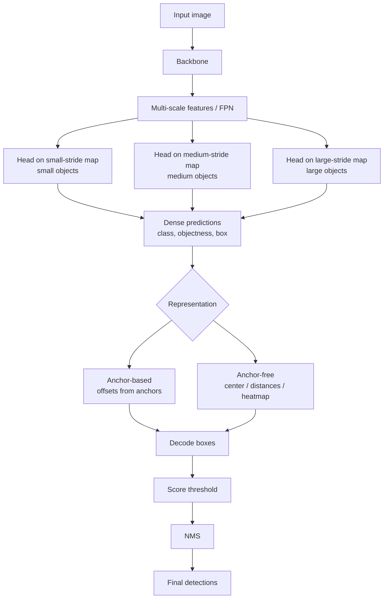

# One Stage Object Detection

Source: `DL_exam.pdf`, Question 23

Original question:

> One-stage object detection. YOLO, SSD, RetinaNet, anchors, anchor-free идеи, trade-off скорости и качества.

## Интуиция

`One-stage object detection` пытается решить detection как прямое плотное предсказание по изображению: за один проход через сеть модель сразу выдает много candidate boxes, class scores и objectness/confidence. В отличие от `two-stage` подходов, здесь нет отдельного этапа proposal generation и последующей классификации каждого proposal. Поэтому one-stage детекторы обычно быстрее и проще для real-time inference.

Главная идея: разбить изображение или feature maps на множество позиций, а для каждой позиции предсказать, есть ли там объект, какого он класса и где находится box. В anchor-based варианте каждая позиция имеет заранее заданные `anchors` разных размеров и aspect ratios; модель не предсказывает box с нуля, а корректирует anchor. В anchor-free варианте модель предсказывает объекты через центры, keypoints, heatmaps или расстояния от точки до сторон box.

Основная трудность one-stage detection - огромный дисбаланс между фоном и объектами. Большинство позиций и anchors являются negative examples, поэтому обычная classification loss может быть доминирована легкими фоновыми примерами. YOLO решает задачу через grid и objectness, SSD использует multi-scale feature maps и anchors, RetinaNet показывает, что one-stage детектор может быть точным, если использовать `Focal Loss`, которая уменьшает вклад легких negative examples.

## Что нужно сказать на экзамене

- One-stage detector предсказывает boxes и classes напрямую за один forward pass, без отдельного proposal stage.
- Типичный pipeline: `backbone` извлекает признаки, `neck` объединяет multi-scale features, `detection head` на dense positions предсказывает class/objectness и box regression, затем применяются thresholding и `NMS`.
- YOLO: делит изображение на grid, каждая cell/anchor предсказывает box, objectness и class probabilities; сильная сторона - скорость.
- SSD: использует несколько feature maps разных разрешений и `default boxes`/anchors, что помогает находить объекты разных масштабов.
- RetinaNet: one-stage detector с `FPN` и `Focal Loss`; решает class imbalance между фоном и объектами.
- Anchors - заранее заданные boxes с разными scales/aspect ratios; модель предсказывает offsets относительно них.
- Anchor matching: positive anchors назначаются ground truth объектам по IoU, negative anchors - фону.
- Anchor-free идеи: не задавать заранее anchor boxes, а предсказывать center heatmap, class score и geometry box напрямую, например расстояния до сторон.
- Loss обычно состоит из classification/objectness loss и localization loss:

$$
\mathcal{L} = \mathcal{L}_{cls} + \lambda_{obj}\mathcal{L}_{obj} + \lambda_{box}\mathcal{L}_{box}.
$$

- Speed-quality trade-off: one-stage быстрее из-за отсутствия proposal stage, но может терять качество на маленьких, перекрытых и редких объектах; современные one-stage модели часто закрывают этот разрыв за счет FPN, better losses, strong backbones и качественного matching.

## Подробный ответ

В object detection модель должна вернуть множество предсказаний:

$$
\hat{Y} = \{(\hat{b}_i, \hat{c}_i, \hat{s}_i)\}_{i=1}^{N},
$$

где $\hat{b}_i$ - predicted bounding box, $\hat{c}_i$ - class label, $\hat{s}_i$ - confidence score. One-stage подход строит это множество напрямую из dense predictions на feature maps:

$$
f_\theta(X) \rightarrow \{(\hat{b}_{u,a}, \hat{p}_{u,a}, \hat{o}_{u,a})\}_{u,a},
$$

где $u$ - spatial position на feature map, $a$ - anchor или candidate на этой позиции, $\hat{o}$ - objectness, $\hat{p}$ - class probabilities/logits.

### One-stage против two-stage

Two-stage detector сначала генерирует небольшое число region proposals, а потом уточняет и классифицирует каждый proposal. One-stage detector не выделяет такой отдельный список proposals: он делает dense prediction по сетке позиций. Поэтому:

| Свойство | One-stage | Two-stage |
|---|---|---|
| Основной принцип | dense prediction сразу по feature maps | proposals, затем classification/regression |
| Скорость | обычно выше | обычно ниже |
| Число кандидатов | очень большое до фильтрации | меньше после proposal stage |
| Главная проблема | class imbalance, много background candidates | качество и стоимость proposals |
| Типичные примеры | YOLO, SSD, RetinaNet, FCOS | R-CNN, Fast R-CNN, Faster R-CNN |

Исторически two-stage методы часто давали лучшее качество, особенно на маленьких и сложных объектах. Но one-stage подходы стали конкурентоспособными благодаря multi-scale features, `Focal Loss`, улучшенным backbone/neck, IoU-based losses и более аккуратному label assignment.

### Общая архитектура one-stage detector

Обычно модель состоит из нескольких частей:

1. `Backbone`: CNN или Transformer-like сеть, например ResNet, CSPDarknet, ConvNeXt, Swin, извлекает признаки.
2. `Neck`: объединяет признаки разных масштабов, например `FPN`, PAN/FPN-подобные блоки.
3. `Detection head`: на каждой spatial position предсказывает classification logits, objectness и box parameters.
4. `Post-processing`: confidence thresholding, декодирование boxes, `NMS` или его варианты.

Для one-stage моделей особенно важны multi-scale признаки: большие feature maps нужны для маленьких объектов, маленькие feature maps - для крупных объектов. Если использовать только грубую последнюю feature map, маленькие объекты могут исчезнуть из-за downsampling.

### Anchors

`Anchor` - заранее заданный reference box на определенной позиции feature map. Anchors задаются набором scales и aspect ratios. Например, в точке $u$ могут быть anchors:

$$
a \in \{(w_1,h_1), (w_2,h_2), \dots, (w_A,h_A)\}.
$$

Модель предсказывает не абсолютные координаты box напрямую, а offsets относительно anchor. Пусть anchor имеет центр $(x_a,y_a)$, ширину $w_a$, высоту $h_a$, а ground truth box имеет $(x^*,y^*,w^*,h^*)$. Стандартная параметризация target offsets:

$$
t_x^* = \frac{x^* - x_a}{w_a}, \quad
t_y^* = \frac{y^* - y_a}{h_a},
$$

$$
t_w^* = \log\frac{w^*}{w_a}, \quad
t_h^* = \log\frac{h^*}{h_a}.
$$

Модель предсказывает $(\hat{t}_x,\hat{t}_y,\hat{t}_w,\hat{t}_h)$, после чего box декодируется:

$$
\hat{x} = x_a + \hat{t}_x w_a, \quad
\hat{y} = y_a + \hat{t}_y h_a,
$$

$$
\hat{w} = w_a \exp(\hat{t}_w), \quad
\hat{h} = h_a \exp(\hat{t}_h).
$$

Anchors упрощают regression: модели легче уточнить хороший reference box, чем предсказывать произвольный box с нуля. Но anchors добавляют гиперпараметры: число anchors, sizes, aspect ratios, thresholds для matching. Если anchors плохо подходят к dataset, качество падает.

### Anchor matching

Во время обучения нужно назначить dense candidates ground truth объектам. Обычно это делается через IoU:

- positive: anchor имеет высокий IoU с некоторым ground truth box, например $\operatorname{IoU} \ge \tau_{pos}$;
- negative: anchor имеет низкий IoU со всеми ground truth boxes, например $\operatorname{IoU} < \tau_{neg}$;
- ignored: anchor между порогами не участвует в loss или участвует частично.

Для positive anchors считают classification/objectness loss и box regression loss. Для negative anchors считают только background/objectness/classification loss. Проблема: negative anchors на порядки больше positive anchors, поэтому нужен hard negative mining, focal loss или другой механизм балансировки.

### YOLO

`YOLO` расшифровывается как `You Only Look Once`: изображение обрабатывается одним forward pass. В классической идее YOLO изображение делится на grid, и каждая grid cell отвечает за объекты, центр которых попал в эту cell. Cell предсказывает несколько boxes, confidence/objectness и class probabilities.

Типичная схема score:

$$
s(c) = P(\text{object}) \cdot P(c \mid \text{object}).
$$

В ранних YOLO box prediction был сильно привязан к grid cells, что давало высокую скорость, но могло ухудшать локализацию маленьких и близко расположенных объектов. Более современные YOLO-подобные модели используют anchors или anchor-free heads, multi-scale prediction, сильные neck-модули и IoU-based losses.

Сильные стороны YOLO:

- высокая скорость и пригодность для real-time inference;
- простая end-to-end схема;
- хорошая практическая инженерная оптимизация.

Ограничения:

- dense grid может хуже разделять близкие объекты, особенно если они попадают в одну область ответственности;
- качество сильно зависит от resolution, feature pyramid и matching;
- для максимального качества часто нужны аккуратные augmentation, training recipe и post-processing.

### SSD

`SSD` - `Single Shot MultiBox Detector`. Его ключевая идея: делать predictions не на одной feature map, а на нескольких feature maps разного масштаба. На ранних feature maps выше пространственное разрешение, поэтому они подходят для маленьких объектов. На глубоких feature maps больше receptive field, поэтому они подходят для больших объектов.

SSD использует `default boxes`, то есть anchors разных scales и aspect ratios. Для каждого default box модель предсказывает:

- class scores для $K$ классов и background;
- offsets для уточнения box.

Для борьбы с class imbalance SSD использует `hard negative mining`: после вычисления loss выбираются наиболее трудные negative examples, а не все background anchors. Часто поддерживают отношение negative:positive около $3:1$.

Плюсы SSD:

- one-shot inference;
- multi-scale detection встроена в архитектуру;
- проще, чем two-stage pipeline.

Минусы:

- маленькие объекты могут оставаться сложными, если shallow features недостаточно семантические;
- качество чувствительно к выбору default boxes и feature layers;
- без FPN-подобного объединения семантики качество может уступать более новым моделям.

### RetinaNet

`RetinaNet` важен потому, что показал: one-stage detector может быть не только быстрым, но и точным. Архитектура использует `Feature Pyramid Network` для multi-scale features и две subnetworks-heads:

- classification subnet для class probabilities;
- box regression subnet для координат.

Главный вклад RetinaNet - `Focal Loss`, решающая проблему extreme foreground-background imbalance. Для binary classification обычная cross-entropy:

$$
\operatorname{CE}(p_t) = -\log(p_t),
$$

где $p_t$ - вероятность правильного класса:

$$
p_t =
\begin{cases}
p, & y=1, \\
1-p, & y=0.
\end{cases}
$$

Focal Loss добавляет фактор, уменьшающий вклад легких примеров:

$$
\operatorname{FL}(p_t) = -\alpha_t(1-p_t)^\gamma \log(p_t).
$$

Если пример уже классифицирован уверенно, $p_t$ близко к $1$, тогда $(1-p_t)^\gamma$ мал и loss почти не влияет на gradient. Если пример трудный, $p_t$ мал, фактор остается большим. Параметр $\gamma \ge 0$ управляет фокусировкой на hard examples, $\alpha_t$ балансирует классы.

RetinaNet обычно использует anchors на уровнях FPN, например разные scales и aspect ratios на каждом уровне pyramid. Box regression считается только для positive anchors, classification - для positive и negative anchors.

### Anchor-free идеи

Anchor-free detectors убирают заранее заданные anchor boxes. Вместо этого модель может предсказывать:

- center heatmap: вероятность, что точка является центром объекта;
- class score в каждой точке feature map;
- box geometry как расстояния от точки до сторон box: $(l,t,r,d)$, где $d$ - расстояние вниз до нижней стороны;
- keypoints, corners или object center + size.

Например, если точка $(x,y)$ внутри объекта, модель может предсказать:

$$
l = x - x_{\min}, \quad
t = y - y_{\min}, \quad
r = x_{\max} - x, \quad
d = y_{\max} - y.
$$

Тогда box восстанавливается как:

$$
\hat{b}_{box} = (x-\hat{l}, y-\hat{t}, x+\hat{r}, y+\hat{d}).
$$

Преимущества anchor-free:

- меньше ручных гиперпараметров anchors;
- проще адаптироваться к dataset с необычными sizes/aspect ratios;
- меньше candidates по сравнению с большим набором anchors.

Недостатки:

- все равно нужен label assignment: какие точки считать positive;
- близкие объекты и неоднозначные центры могут создавать конфликты;
- качество зависит от выбора center sampling, radius, feature level assignment и loss.

Anchor-free не означает отсутствие post-processing или matching вообще. Это означает, что reference boxes не заданы заранее как anchors.

### Loss и post-processing

Общая training objective:

$$
\mathcal{L}
= \frac{1}{N_{pos}}
\sum_i \mathcal{L}_{cls}^{(i)}
+ \lambda_{box}\frac{1}{N_{pos}}\sum_{i \in Pos}\mathcal{L}_{box}^{(i)}
+ \lambda_{obj}\sum_i \mathcal{L}_{obj}^{(i)}.
$$

Точная форма зависит от detector family. Для classification используют cross-entropy, binary cross-entropy или focal loss. Для localization используют smooth $L_1$, $L_1$, GIoU/DIoU/CIoU loss или другие IoU-based losses. Box loss считают только для candidates, назначенных объектам.

После forward pass модель обычно дает много пересекающихся predictions. Поэтому на inference делают:

1. декодировать predicted boxes;
2. посчитать final scores;
3. отбросить boxes ниже confidence threshold;
4. применить `Non-Maximum Suppression`;
5. оставить top predictions.

Без NMS один объект может получить десятки почти одинаковых boxes. Некоторые современные детекторы стремятся уменьшить зависимость от NMS, но для классических YOLO/SSD/RetinaNet NMS является обычной частью pipeline.

### Trade-off скорости и качества

One-stage подход быстрее, потому что:

- один forward pass по dense feature maps;
- нет per-proposal feature extraction/classification stage;
- архитектуру проще оптимизировать на GPU/accelerator;
- можно выбирать input resolution, backbone size и число feature levels под latency budget.

Но качество может страдать из-за:

- сильного foreground-background imbalance;
- большого числа похожих дубликатов;
- сложности маленьких и перекрытых объектов;
- грубого stride feature maps;
- ошибок anchor matching или center assignment.

Практический trade-off:

| Решение | Влияние на скорость | Влияние на качество |
|---|---|---|
| Увеличить input resolution | медленнее | лучше маленькие объекты |
| Более сильный backbone | медленнее | лучше features и classification |
| Больше FPN levels/anchors | медленнее | лучше coverage масштабов |
| Focal Loss/hard negative mining | почти без inference cost | лучше обучение при imbalance |
| Более строгий NMS threshold | может быть чуть быстрее | меньше дубликатов, но риск удалить близкие объекты |
| Anchor-free head | может упростить head | меньше anchor tuning, но важен assignment |

В oral answer полезно сформулировать так: one-stage detector покупает скорость ценой более сложного dense training. Чтобы получить качество, нужны multi-scale features, правильное назначение positives/negatives и loss, которая не позволяет background examples подавить обучение.

## Формулы / алгоритмы

### Anchor-based one-stage inference

Вход: изображение $X$, anchors $\{a_i\}$, trained model $f_\theta$, thresholds $\tau_s$, $\tau_{nms}$.  
Выход: множество detections $\hat{Y}$.

1. Получить feature maps через backbone и neck:

$$
\{F_l\}_{l=1}^{L} = \operatorname{Neck}(\operatorname{Backbone}(X)).
$$

2. Для каждой позиции и anchor предсказать logits и box offsets:

$$
(\hat{p}_{i}, \hat{o}_{i}, \hat{t}_{i}) = \operatorname{Head}(F_l, u, a).
$$

3. Декодировать offsets в boxes:

$$
\hat{x}_i = x_{a_i} + \hat{t}_{x,i}w_{a_i}, \quad
\hat{y}_i = y_{a_i} + \hat{t}_{y,i}h_{a_i},
$$

$$
\hat{w}_i = w_{a_i}\exp(\hat{t}_{w,i}), \quad
\hat{h}_i = h_{a_i}\exp(\hat{t}_{h,i}).
$$

4. Посчитать score класса, например:

$$
\hat{s}_i(c) = \sigma(\hat{o}_i)\sigma(\hat{p}_i(c)).
$$

5. Отбросить predictions с $\hat{s}_i(c) < \tau_s$.
6. Применить NMS с порогом IoU $\tau_{nms}$.
7. Вернуть top detections.

Сложность до NMS пропорциональна числу dense candidates: $O(H'W'A)$ на feature level, где $A$ - число anchors на позицию. NMS может быть дорогим при большом числе оставшихся boxes, поэтому перед NMS обычно делают thresholding и top-$k$ filtering.

### Focal Loss

Предположение: $y \in \{0,1\}$, $p$ - предсказанная вероятность положительного класса. Тогда:

$$
p_t =
\begin{cases}
p, & y=1, \\
1-p, & y=0.
\end{cases}
$$

$$
\operatorname{FL}(p_t) = -\alpha_t(1-p_t)^\gamma \log(p_t).
$$

При $\gamma=0$ focal loss превращается в weighted cross-entropy. При $\gamma>0$ легкие примеры получают меньший вес, что особенно важно для one-stage detection с огромным числом background anchors.

### Anchor-free box decoding

Пусть точка feature map соответствует координате изображения $(x,y)$ и модель предсказывает расстояния до сторон:

$$
(\hat{l},\hat{t},\hat{r},\hat{d}).
$$

Тогда box:

$$
\hat{x}_{\min}=x-\hat{l}, \quad
\hat{y}_{\min}=y-\hat{t},
$$

$$
\hat{x}_{\max}=x+\hat{r}, \quad
\hat{y}_{\max}=y+\hat{d}.
$$

Обычно дополнительно предсказывают centerness или используют center sampling, чтобы точки далеко от центра объекта не давали низкокачественные boxes.

## Диаграмма или изображение

Внешние изображения не использовались.

## Быстрая устная версия

One-stage object detection - это семейство детекторов, которые за один forward pass сразу предсказывают множество boxes, class scores и objectness на dense positions feature maps. В отличие от two-stage методов, они не строят отдельные region proposals, поэтому обычно быстрее и лучше подходят для real-time.

YOLO формулирует detection как grid-based prediction: ячейки или anchors отвечают за объекты и предсказывают box, objectness и class probabilities. SSD добавляет multi-scale feature maps и default boxes, чтобы ловить объекты разных размеров. RetinaNet использует FPN и Focal Loss; focal loss уменьшает вклад легких фоновых examples и решает главный class imbalance one-stage подходов.

Anchors - это заранее заданные reference boxes, относительно которых сеть предсказывает offsets. Anchor-free подходы убирают такие boxes и предсказывают центры, heatmaps или расстояния до сторон box. Компромисс скорости и качества такой: one-stage быстрее за счет прямого dense prediction, но для высокого качества нужны multi-scale features, хорошее label assignment, loss против imbalance и аккуратный NMS.

## Возможные уточняющие вопросы

- Чем one-stage detector отличается от two-stage detector?  
  One-stage сразу делает dense predictions по feature maps; two-stage сначала генерирует region proposals, затем классифицирует и уточняет их.

- Почему one-stage detectors быстрые?  
  Нет отдельного proposal stage и per-proposal обработки; все candidates предсказываются параллельно в convolutional heads.

- Что такое anchor?  
  Заранее заданный reference box на позиции feature map; сеть предсказывает offsets и class/objectness относительно него.

- Зачем нужны anchors разных размеров и aspect ratios?  
  Чтобы покрыть объекты разных масштабов и форм, уменьшая сложность box regression.

- Какая главная проблема anchors?  
  Нужно подбирать sizes/aspect ratios и thresholds; плохой matching ухудшает обучение, а число negative anchors становится огромным.

- В чем идея anchor-free detection?  
  Предсказывать объект без заранее заданного reference box, например через center heatmap и расстояния до сторон bounding box.

- Почему RetinaNet использует Focal Loss?  
  Чтобы уменьшить вклад легких background examples и сфокусировать обучение на hard examples и объектах.

- Как YOLO считает confidence?  
  Часто score понимается как произведение objectness и class probability: $P(\text{object})P(c \mid \text{object})$, хотя детали зависят от версии.

- Почему SSD использует несколько feature maps?  
  Разные feature maps имеют разные strides и receptive fields, поэтому подходят для объектов разных размеров.

- Зачем нужен NMS в one-stage detection?  
  Dense predictions создают много дубликатов для одного объекта; NMS оставляет наиболее уверенные boxes и подавляет сильно пересекающиеся.

- Что улучшает качество маленьких объектов?  
  Более высокое input resolution, feature pyramid, small-stride feature maps, подходящие anchors/assignment и достаточная семантика на ранних features.

## Частые ошибки

- Говорить, что one-stage detector вообще не использует candidate boxes. Anchor-based one-stage модели используют много anchors, просто не имеют отдельного proposal stage.
- Путать anchor-free с отсутствием label assignment. Anchor-free все равно должен определить, какие точки отвечают за какие ground truth objects.
- Считать confidence и IoU одним и тем же. Confidence - score модели, IoU - геометрическое пересечение boxes.
- Забывать про class imbalance. В one-stage detection background candidates намного больше, чем object candidates.
- Описывать YOLO только как одну старую архитектуру. На экзамене лучше говорить о семействе YOLO-подобных one-stage real-time detectors и уточнять базовую идею grid/dense prediction.
- Думать, что SSD решает multi-scale detection только anchors. Важна именно комбинация default boxes и predictions с нескольких feature maps.
- Называть RetinaNet "еще одним быстрым YOLO". Его ключевые идеи - FPN plus Focal Loss для точного one-stage detection.
- Забывать, что box regression loss считается только для positive candidates, а classification/objectness loss - для positive и negative.
- Не упоминать post-processing. Для классических one-stage detectors thresholding и NMS являются существенной частью inference.
- Утверждать, что one-stage всегда хуже two-stage. Исторически так часто было, но современные one-stage detectors могут быть очень конкурентоспособны; правильнее говорить о trade-off и условиях.
