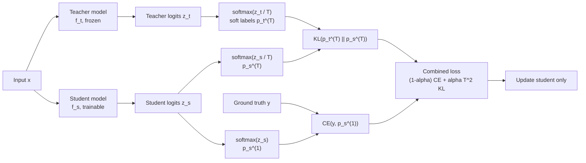

# Knowledge Distillation Basics

Source: `DL_exam.pdf`, Question 24

Original question:

> Knowledge distillation. Teacher-student схема, soft labels, temperature, KL-divergence, зачем нужна дистилляция.

## Интуиция

`Knowledge distillation` -- это способ перенести поведение большой или сильной модели `teacher` в меньшую модель `student`. Вместо того чтобы учить student только по жестким меткам класса вроде "это кошка", мы дополнительно показываем ему распределение вероятностей teacher: "скорее кошка, немного рысь, почти не собака". Такое распределение называют `soft labels`.

Главная идея: `soft labels` несут больше информации, чем one-hot метки. Они показывают относительную похожесть классов и неопределенность teacher. Например, если teacher дает вероятности `cat: 0.70`, `lynx: 0.25`, `car: 0.001`, student узнает не только правильный класс, но и структуру ошибок. Это особенно полезно, когда student меньше, быстрее и должен работать на устройстве с ограниченной памятью или latency.

`Temperature` делает распределение teacher более "мягким": при высокой температуре вероятности менее резкие, поэтому student видит больше отношений между классами. `KL-divergence` используется, чтобы приблизить распределение student к распределению teacher.

## Что нужно сказать на экзамене

- Дистилляция знаний обучает `student` имитировать `teacher`, обычно для сжатия модели или ускорения inference.
- В классической `teacher-student` схеме teacher уже обучен и заморожен, а student обучается на тех же входах.
- Помимо обычной `cross-entropy` с истинными метками используется distillation loss между распределениями teacher и student.
- `Soft labels` -- вероятности классов teacher, а не one-hot вектор. Они содержат "dark knowledge": информацию о сходстве классов и неуверенности модели.
- `Temperature` $T$ применяется в `softmax`:

$$
p_i^{(T)} = \frac{\exp(z_i / T)}{\sum_j \exp(z_j / T)}.
$$

- При $T = 1$ это обычный `softmax`; при $T > 1$ распределение сглаживается; при $T < 1$ становится более острым.
- Типичная функция потерь:

$$
\mathcal{L}
= (1 - \alpha)\operatorname{CE}(y, p_s^{(1)})
+ \alpha T^2 \operatorname{KL}(p_t^{(T)} \Vert p_s^{(T)}).
$$

- Множитель $T^2$ часто добавляют, чтобы компенсировать изменение масштаба градиентов при высокой temperature.
- Дистилляция нужна для model compression, ускорения inference, уменьшения памяти, передачи ансамбля в одну модель, иногда для регуляризации и повышения качества small model.
- Ограничение: student не может гарантированно превзойти информацию teacher, качество зависит от capacity student, данных, выбора $T$ и $\alpha$.

## Подробный ответ

Пусть есть обученная модель `teacher` $f_t$ и более компактная модель `student` $f_s$. Для входа $x$ обе модели выдают logits: $z_t = f_t(x)$ и $z_s = f_s(x)$. Logits превращаются в вероятности через `softmax`.

В обычном supervised learning классификатор учится по истинной метке $y$, обычно one-hot, минимизируя:

$$
\operatorname{CE}(y, p_s) = -\sum_i y_i \log p_{s,i}.
$$

Если $y$ -- one-hot, loss явно поощряет только правильный класс и почти не сообщает, какие неправильные классы похожи на правильный. В дистилляции teacher дает более информативную цель:

$$
p_t^{(T)} = \operatorname{softmax}(z_t / T).
$$

Student обучается приближать:

$$
p_s^{(T)} = \operatorname{softmax}(z_s / T)
$$

к распределению teacher. Для этого используют `KL-divergence`:

$$
\operatorname{KL}(p_t^{(T)} \Vert p_s^{(T)})
= \sum_i p_{t,i}^{(T)}
\log \frac{p_{t,i}^{(T)}}{p_{s,i}^{(T)}}.
$$

Так как $p_t^{(T)}$ фиксировано относительно параметров student, минимизация KL по student эквивалентна минимизации cross-entropy с soft target teacher с точностью до константы:

$$
\operatorname{KL}(p_t \Vert p_s)
= -\sum_i p_{t,i}\log p_{s,i} + \sum_i p_{t,i}\log p_{t,i}.
$$

Вторая сумма не зависит от student, поэтому градиенты идут через $-\sum_i p_{t,i}\log p_{s,i}$.

Обычно используют смесь двух целей. Истинная метка удерживает student от копирования ошибок teacher, а soft target передает дополнительную структуру:

$$
\mathcal{L}
= (1 - \alpha)\operatorname{CE}(y, p_s^{(1)})
+ \alpha T^2 \operatorname{KL}(p_t^{(T)} \Vert p_s^{(T)}),
$$

где $\alpha \in [0, 1]$ управляет вкладом distillation loss, а $T$ задает сглаживание распределений. На inference student обычно использует $T = 1$: temperature нужна в основном для обучения.

Teacher часто больше student: например, глубокая CNN, ансамбль моделей или large language model. Student может быть меньшей сетью, моделью с меньшим числом слоев, меньшей шириной, более простой архитектурой или моделью, адаптированной для конкретного hardware.

Почему soft labels полезны:

| Цель | Что получает student |
|---|---|
| Сходство классов | Видит, какие классы teacher считает близкими |
| Неопределенность | Учится не только правильному ответу, но и confidence |
| Регуляризация | Не переобучается так жестко на one-hot labels |
| Сжатие ансамбля | Имитирует усредненное поведение нескольких моделей |
| Экономия ресурсов | Сохраняет часть качества teacher при меньших latency и memory |

Важно понимать направление KL. В классической дистилляции минимизируют $\operatorname{KL}(p_t \Vert p_s)$: teacher задает целевое распределение, student подгоняется под него. Если перепутать направление, получится другая оптимизационная геометрия: $\operatorname{KL}(p_s \Vert p_t)$ сильнее штрафует student за массу там, где teacher дает почти ноль, и может вести себя менее стабильно при нулевых или очень малых вероятностях teacher.

## Формулы / алгоритмы

Обозначения:

- $x$ -- входной объект;
- $y$ -- истинная метка;
- $z_t, z_s$ -- logits teacher и student;
- $T$ -- temperature;
- $\alpha$ -- вес distillation loss.

Temperature softmax:

$$
p_i^{(T)} = \operatorname{softmax}(z/T)_i
= \frac{\exp(z_i / T)}{\sum_j \exp(z_j / T)}.
$$

KL-divergence для distillation:

$$
\operatorname{KL}(p_t^{(T)} \Vert p_s^{(T)})
= \sum_i p_{t,i}^{(T)}
\log \frac{p_{t,i}^{(T)}}{p_{s,i}^{(T)}}.
$$

Итоговый objective:

$$
\min_{\theta_s}
\mathbb{E}_{(x,y)}
\left[
(1 - \alpha)\operatorname{CE}(y, p_s^{(1)})
+ \alpha T^2 \operatorname{KL}(p_t^{(T)} \Vert p_s^{(T)})
\right].
$$

Алгоритм `offline knowledge distillation`:

1. Обучить teacher $f_t$ на train data или взять уже обученную сильную модель.
2. Заморозить параметры teacher.
3. Для mini-batch $(x, y)$ вычислить logits teacher $z_t = f_t(x)$ без `backpropagation`.
4. Вычислить logits student $z_s = f_s(x)$.
5. Получить $p_t^{(T)} = \operatorname{softmax}(z_t/T)$ и $p_s^{(T)} = \operatorname{softmax}(z_s/T)$.
6. Посчитать supervised loss с истинными метками и distillation loss с soft labels.
7. Обновить только параметры student через `backpropagation`.
8. На inference использовать student, обычно с обычным `softmax` при $T = 1$.

Практические caveats:

- Если $T$ слишком мал, soft labels почти превращаются в hard labels и теряют дополнительную информацию.
- Если $T$ слишком велик, распределение становится почти равномерным и сигнал может стать слабым.
- Если $\alpha$ слишком велик, student может копировать ошибки teacher и игнорировать ground truth.
- Если student слишком мал, он не сможет аппроксимировать teacher даже при хорошем objective.
- Стоимость training выше, потому что во время обучения нужно прогонять teacher, но inference дешевле, потому что используется только student.

## Диаграмма или изображение

Внешние изображения не использовались.

## Быстрая устная версия

Knowledge distillation -- это обучение маленькой модели student имитировать большую модель teacher. Teacher сначала обучают и замораживают, затем для каждого входа он выдает не только предсказанный класс, а распределение вероятностей по классам. Эти `soft labels` полезны, потому что показывают похожесть классов и уверенность teacher. Чтобы сделать распределение менее резким, logits делят на temperature $T$ перед `softmax`. Student обучают смесью обычной cross-entropy по ground truth и KL-divergence между распределением teacher и student при той же temperature. Это нужно для сжатия модели, ускорения inference, уменьшения памяти и переноса качества сильной модели или ансамбля в более дешевую модель.

## Возможные уточняющие вопросы

- Чем soft labels лучше hard labels?  
  Они содержат распределение по всем классам, поэтому передают относительную похожесть классов и неопределенность teacher.

- Зачем нужна temperature?  
  $T > 1$ сглаживает `softmax`, делает вероятности менее пиковыми и раскрывает информацию о вторичных классах.

- Почему используется KL-divergence?  
  Нужно сравнить два распределения вероятностей: целевое распределение teacher и распределение student.

- Почему в loss иногда стоит множитель $T^2$?  
  При высокой temperature градиенты distillation loss уменьшаются по масштабу; $T^2$ частично компенсирует это.

- Что используется на inference?  
  Только student. Teacher нужен при обучении; на inference обычно применяют обычный `softmax` с $T = 1$.

- Может ли student быть лучше teacher?  
  Иногда на тесте small student может обобщать лучше из-за регуляризации и ground truth loss, но цель дистилляции обычно не в гарантированном превосходстве, а в сохранении качества при меньшей стоимости.

- Что будет, если teacher ошибается?  
  Student может перенять ошибки, поэтому distillation loss часто смешивают с supervised loss по истинным меткам.

## Частые ошибки

- Говорить, что дистилляция -- это просто копирование predicted class. На самом деле важны распределения вероятностей и logits.
- Путать teacher и student: teacher обычно большой и замороженный, student маленький и обучаемый.
- Забывать, что на inference teacher не нужен.
- Использовать hard labels вместо soft labels и тем самым терять смысл distillation.
- Считать, что temperature меняет архитектуру модели. Она меняет только преобразование logits в вероятности при обучении.
- Путать направление KL: в базовой схеме student подгоняется под teacher через $\operatorname{KL}(p_t \Vert p_s)$.
- Забывать supervised CE с ground truth: без нее student может слишком сильно копировать ошибки teacher.
- Думать, что дистилляция всегда улучшает качество. Она зависит от teacher, данных, capacity student, $T$, $\alpha$ и режима обучения.
