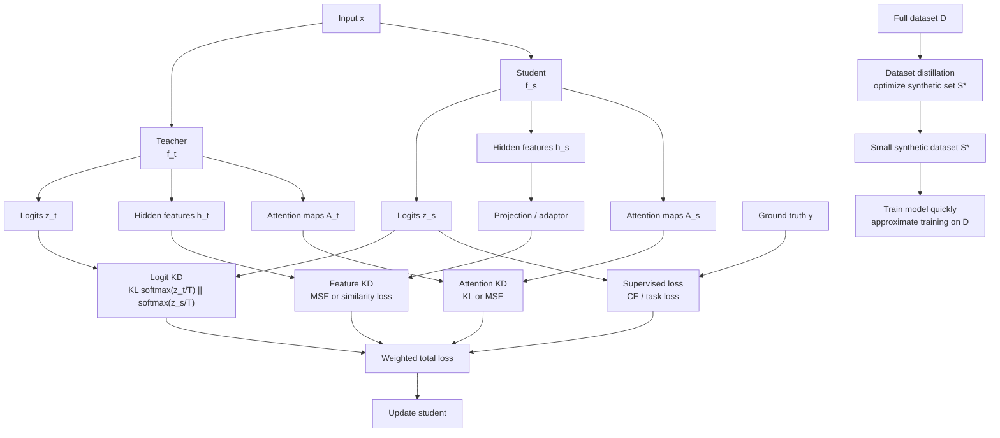

# Distillation Variants and Applications

Source: `DL_exam.pdf`, Question 25

Original question:

> Варианты и применения дистилляции. Дистилляция логитов, признаков и attention, online/offline/self-distillation, dataset distillation.

## Интуиция

`Knowledge distillation` можно понимать шире, чем просто "маленькая модель повторяет вероятности большой модели". Teacher может передавать student разные виды информации: итоговые `logits`, промежуточные `features`, карты `attention`, отношения между объектами или даже поведение ансамбля. Чем ближе сигнал к выходу модели, тем проще его использовать; чем глубже он внутри сети, тем больше структурной информации можно передать, но тем сильнее завязка на архитектуру.

Есть и разные режимы обучения. В `offline distillation` teacher уже обучен и заморожен. В `online distillation` несколько моделей учатся одновременно и обмениваются предсказаниями. В `self-distillation` teacher и student могут быть одной архитектурой, разными срезами одной сети или последовательными версиями одной модели. Поэтому дистилляция -- это не только compression, но и способ регуляризации, стабилизации обучения и переноса знаний между архитектурами.

`Dataset distillation` стоит отличать от model distillation. Здесь сжимают не модель, а обучающую выборку: строят маленький синтетический набор данных, на котором модель после нескольких шагов обучения должна получить поведение, близкое к обучению на полном датасете.

## Что нужно сказать на экзамене

- Основные варианты дистилляции удобно классифицировать по тому, что имитирует student:
  - `logit distillation`: имитация logits или softened probabilities teacher;
  - `feature distillation`: имитация промежуточных представлений;
  - `attention distillation`: имитация attention maps, attention distributions или пространственных карт важности;
  - иногда также `relation distillation`: имитация попарных расстояний, сходств или структуры embedding space.
- `Logit distillation` архитектурно проста: teacher и student должны решать одну задачу и иметь согласованные выходы.
- `Feature distillation` полезна, когда надо передать внутренние признаки, но часто требует projection layer, потому что размерности hidden states у teacher и student различаются.
- `Attention distillation` особенно естественна для Transformers и vision models: student учится смотреть на похожие tokens, pixels, patches или regions.
- По режиму обучения:
  - `offline distillation`: teacher обучен заранее и заморожен;
  - `online distillation`: teacher/student или несколько peers обучаются одновременно;
  - `self-distillation`: teacher получается из той же модели, той же архитектуры, EMA-копии, более глубокого выхода или предыдущего checkpoint.
- Основная функция потерь обычно является суммой supervised loss и distillation losses:

$$
\mathcal{L}
= \lambda_y \mathcal{L}_{\text{sup}}
+ \lambda_z \mathcal{L}_{\text{logits}}
+ \lambda_h \mathcal{L}_{\text{features}}
+ \lambda_a \mathcal{L}_{\text{attention}}.
$$

- Применения: model compression, ускорение inference, deployment на edge/mobile, перенос знаний от ансамбля, transfer между архитектурами, regularization, semi-supervised learning, domain adaptation, сжатие больших language/vision models.
- `Dataset distillation` оптимизирует маленький синтетический датасет $S$ так, чтобы обучение на $S$ приближало результат обучения на полном датасете $D$.
- Ограничения: student может копировать ошибки teacher, внутренние признаки не всегда совместимы, online/self схемы могут быть нестабильны, dataset distillation обычно дорогая в оптимизации и чувствительна к архитектуре/инициализации.

## Подробный ответ

### Дистилляция логитов

В `logit distillation` student имитирует выходы teacher. Пусть teacher выдает logits $z_t(x)$, student -- logits $z_s(x)$. При temperature $T$ получаем:

$$
p_t^{(T)} = \operatorname{softmax}(z_t / T),
\qquad
p_s^{(T)} = \operatorname{softmax}(z_s / T).
$$

Классический distillation loss:

$$
\mathcal{L}_{\text{logits}}
= T^2 \operatorname{KL}\left(p_t^{(T)} \Vert p_s^{(T)}\right).
$$

Часто его смешивают с supervised loss:

$$
\mathcal{L}
= (1 - \alpha)\operatorname{CE}(y, p_s^{(1)})
+ \alpha T^2 \operatorname{KL}\left(p_t^{(T)} \Vert p_s^{(T)}\right).
$$

Иногда дистиллируют не вероятности, а сами logits, например через MSE:

$$
\mathcal{L}_{\text{logits-MSE}}
= \left\|g_z(z_t) - z_s\right\|_2^2,
$$

где $g_z$ может быть простым преобразованием, если нужно согласовать размерности. Для классификации чаще используют KL между softened probabilities, потому что вероятности задают распределение по классам. Для regression, detection или language modeling могут сравнивать logits, distributions, token-level probabilities или task-specific outputs.

Плюсы logit distillation:

| Свойство | Комментарий |
|---|---|
| Простота | Не нужно знать внутреннюю структуру teacher |
| Архитектурная гибкость | Teacher и student могут иметь разные backbone |
| Хорошо для compression | Передается поведение сильной модели или ансамбля |
| Ограничение | Сигнал есть только на выходе, без явного контроля hidden representations |

### Дистилляция признаков

В `feature distillation` student имитирует промежуточные активации teacher. Пусть $h_t^\ell(x)$ -- hidden representation teacher на слое $\ell$, а $h_s^m(x)$ -- representation student на сопоставимом слое $m$. Если размерности различаются, используют projection/adaptor $g_m$:

$$
\mathcal{L}_{\text{features}}
= \sum_{(\ell,m)\in \mathcal{M}}
\left\| \phi_t(h_t^\ell(x)) - \phi_s(g_m(h_s^m(x))) \right\|_2^2.
$$

Здесь $\mathcal{M}$ -- соответствие слоев teacher и student, $\phi_t,\phi_s$ -- возможные нормализации или преобразования. Например, можно дистиллировать:

- feature maps в CNN;
- hidden states в Transformer;
- embeddings до classifier head;
- normalized representations;
- pairwise similarity matrix внутри batch.

Feature distillation полезна, если output-level signal слишком беден. Например, в detection/segmentation важна пространственная структура признаков, а в language models -- hidden states на token-level. Но этот вариант сложнее:

- нужно выбрать, какие слои сопоставлять;
- размерности hidden states могут не совпадать;
- teacher и student могут кодировать полезную информацию в разных базисах;
- слишком сильное принуждение к копированию features может мешать student находить собственное компактное представление.

Практически часто используют feature loss как дополнительный член, а не единственную цель. Он помогает student быстрее прийти к хорошим представлениям, но итоговую задачу все равно контролируют через supervised или logit loss.

### Дистилляция attention

В `attention distillation` student имитирует то, на какие части входа обращает внимание teacher. В Transformer attention для слоя $\ell$ и head $r$ можно записать как:

$$
A_{t}^{\ell,r}
= \operatorname{softmax}\left(\frac{Q_t^{\ell,r}(K_t^{\ell,r})^\top}{\sqrt{d_k}}\right),
\qquad
A_{s}^{m,r}
= \operatorname{softmax}\left(\frac{Q_s^{m,r}(K_s^{m,r})^\top}{\sqrt{d_k}}\right).
$$

Тогда attention loss может быть:

$$
\mathcal{L}_{\text{attention}}
= \sum_{(\ell,m)\in \mathcal{M}}\sum_r
\operatorname{KL}\left(A_t^{\ell,r} \Vert A_s^{m,r}\right)
$$

или

$$
\mathcal{L}_{\text{attention-MSE}}
= \sum_{(\ell,m)\in \mathcal{M}}
\left\|\bar A_t^\ell - \bar A_s^m\right\|_2^2,
$$

где $\bar A$ может быть attention, усредненным по heads.

В CNN и vision models под attention distillation часто понимают не Transformer attention, а spatial attention map, например карту важности, полученную из feature map:

$$
F \in \mathbb{R}^{C \times H \times W},
\qquad
A(F)_{h,w} = \sum_{c=1}^{C} |F_{c,h,w}|^2.
$$

Student затем учится воспроизводить нормализованную карту $A(F_t)$. Это помогает сохранить, какие области изображения модель считает важными.

Плюсы attention distillation:

- хорошо передает структуру обработки входа;
- полезна для Transformers, vision-language models, segmentation, detection;
- может повышать интерпретируемость поведения student.

Минусы:

- attention weights не всегда являются полным объяснением решения;
- число heads/layers может различаться;
- matching attention может быть дорогим по памяти, особенно при длинном context.

### Offline, online и self-distillation

| Режим | Как устроен | Плюсы | Минусы |
|---|---|---|---|
| `offline distillation` | Teacher заранее обучен и заморожен | Стабильная цель, просто реализовать | Нужно хранить/прогонять teacher, качество ограничено teacher |
| `online distillation` | Модели обучаются одновременно и обмениваются soft targets | Не нужен заранее обученный teacher, peers могут улучшать друг друга | Цель меняется во время обучения, возможна нестабильность |
| `self-distillation` | Teacher получается из той же модели, той же архитектуры или прошлой версии | Может работать как regularization, не требует внешнего teacher | Риск копировать собственные ошибки, важен дизайн teacher signal |

#### Offline distillation

Это базовая схема: сначала обучают teacher, затем замораживают его и обучают student:

$$
\theta_s^\star
= \arg\min_{\theta_s}
\mathbb{E}_{(x,y)\sim D}
\left[
\mathcal{L}_{\text{sup}}(y, f_s(x))
+ \lambda \mathcal{L}_{\text{distill}}(f_t(x), f_s(x))
\right].
$$

Teacher может быть одной большой моделью, ensemble, model averaging или специализированной моделью с большим compute budget. Offline distillation удобна для deployment: после обучения оставляют только student.

#### Online distillation

В online distillation teacher не фиксирован заранее. Возможны схемы:

- несколько peer networks учатся одновременно и используют среднее предсказание друг друга как soft target;
- одна сеть имеет auxiliary heads, которые дистиллируют друг друга;
- teacher является moving average / EMA версией student;
- ensemble prediction внутри mini-batch задает target для отдельных моделей.

Пример с двумя моделями $f_1$ и $f_2$:

$$
\mathcal{L}_1
= \operatorname{CE}(y, p_1)
+ \lambda \operatorname{KL}(\operatorname{stopgrad}(p_2^{(T)}) \Vert p_1^{(T)}),
$$

$$
\mathcal{L}_2
= \operatorname{CE}(y, p_2)
+ \lambda \operatorname{KL}(\operatorname{stopgrad}(p_1^{(T)}) \Vert p_2^{(T)}).
$$

`stopgrad` важен концептуально: целевое распределение в данном loss не должно одновременно двигаться тем же градиентом, иначе смысл "цель -> подгонка" размывается.

#### Self-distillation

В self-distillation teacher не является отдельной внешней сильной моделью. Типичные варианты:

- обучить модель, затем использовать ее как teacher для модели той же архитектуры;
- использовать более глубокий classifier head как teacher для ранних heads;
- использовать prediction предыдущего checkpoint;
- использовать EMA teacher, где параметры teacher являются сглаженной версией student:

$$
\theta_t \leftarrow \mu \theta_t + (1-\mu)\theta_s.
$$

Self-distillation часто объясняют как regularization: модель не только подгоняется под hard labels, но и сохраняет более гладкое распределение предсказаний. Это может улучшать generalization даже без уменьшения размера модели.

### Dataset distillation

`Dataset distillation` решает другую задачу: надо заменить большой датасет $D$ маленьким синтетическим набором $S = \{(\tilde x_i, \tilde y_i)\}_{i=1}^{M}$, где $M \ll |D|$, так чтобы модель, обученная на $S$, хорошо работала на настоящем распределении данных.

Идея похожа на "сжать информацию датасета в few synthetic examples". Эти примеры не обязаны выглядеть как реальные изображения или тексты; они оптимизируются как параметры.

Общий bi-level objective:

$$
S^\star
= \arg\min_S
\mathbb{E}_{\theta_0 \sim P(\theta)}
\left[
\mathcal{L}_{D_{\text{val}}}
\left(\theta_K(S, \theta_0)\right)
\right],
$$

где $\theta_K(S,\theta_0)$ -- параметры модели после $K$ шагов обучения на synthetic dataset $S$ из инициализации $\theta_0$:

$$
\theta_{k+1}
= \theta_k - \eta \nabla_{\theta_k}
\mathcal{L}_S(\theta_k).
$$

Здесь внешний цикл меняет сами synthetic examples $S$, а внутренний цикл имитирует обучение модели на $S$. В более практичных вариантах используют matching gradients, matching training trajectories или matching distributions:

$$
\mathcal{L}_{\text{grad-match}}
=
\left\|
\nabla_\theta \mathcal{L}_{D_b}(\theta)
-
\nabla_\theta \mathcal{L}_{S_b}(\theta)
\right\|_2^2.
$$

Смысл: маленький synthetic batch должен давать похожее направление обновления параметров, как настоящий batch.

Отличия от knowledge distillation:

| Вопрос | Knowledge distillation | Dataset distillation |
|---|---|---|
| Что сжимают | Модельное поведение teacher | Обучающий датасет |
| Что оптимизируют | Параметры student | Synthetic data и иногда synthetic labels |
| Нужен ли teacher | Часто да | Не обязательно |
| Главная цель | Дешевый inference или transfer | Быстрое обучение, хранение данных, data summarization |
| Типовая сложность | Один training loop student | Bi-level optimization или trajectory/gradient matching |

Dataset distillation применяют для ускорения experiments, continual learning, data compression, neural architecture search и приватности/хранения данных. Но у нее есть ограничения: синтетический набор может быть сильно привязан к архитектуре, initialization distribution и training recipe; оптимизация дорогая; перенос на другую модель не гарантирован.

### Применения дистилляции

Основные применения:

| Применение | Как помогает distillation |
|---|---|
| `Model compression` | Student меньше teacher по параметрам, памяти и latency |
| `Edge/mobile deployment` | Перенос качества в модель, пригодную для ограниченного hardware |
| `Ensemble compression` | Ансамбль teacher заменяется одной student model |
| `Transfer learning` | Teacher с одной архитектурой/модальностью передает знания другой |
| `Semi-supervised learning` | Teacher дает pseudo-labels или soft labels для unlabeled data |
| `Domain adaptation` | Teacher помогает сохранить поведение при переносе на новый домен |
| `Regularization` | Soft targets сглаживают обучение и уменьшают переобучение |
| `LLM compression` | Smaller language model имитирует token distributions, rationales или instruction behavior |
| `Vision tasks` | Передача feature maps, spatial attention, detection outputs, segmentation masks |

Важно подчеркнуть: дистилляция не гарантирует улучшение. Она полезна, когда teacher действительно несет более качественный или более стабильный сигнал, а student имеет достаточную capacity, чтобы этот сигнал усвоить.

## Формулы / алгоритмы

### Общий objective с несколькими distillation losses

Для batch $(x,y)$:

$$
\mathcal{L}
=
\lambda_y \operatorname{CE}(y, p_s)
+ \lambda_z T^2 \operatorname{KL}(p_t^{(T)} \Vert p_s^{(T)})
+ \lambda_h \sum_{(\ell,m)}
\left\| \phi_t(h_t^\ell) - \phi_s(g_m(h_s^m)) \right\|_2^2
+ \lambda_a \sum_{(\ell,m)}
D(A_t^\ell, A_s^m).
$$

Здесь $D$ может быть MSE или KL, $g_m$ -- projection/adaptor для согласования размерностей, а $\lambda_y,\lambda_z,\lambda_h,\lambda_a$ задают веса членов loss.

### Алгоритм offline distillation с logits, features и attention

Входы:

- обученный teacher $f_t$;
- train dataset $D$;
- student $f_s$;
- temperature $T$;
- веса loss $\lambda_y,\lambda_z,\lambda_h,\lambda_a$.

Выход:

- обученный student $f_s$.

Шаги:

1. Заморозить teacher: не обновлять его параметры.
2. Для mini-batch $(x,y)$ получить у teacher logits $z_t$, выбранные features $h_t^\ell$ и attention maps $A_t^\ell$.
3. Получить у student logits $z_s$, features $h_s^m$ и attention maps $A_s^m$.
4. Посчитать supervised loss по ground truth.
5. Посчитать logit distillation loss через KL при temperature $T$.
6. Посчитать feature loss после projection/adaptor, если размерности не совпадают.
7. Посчитать attention loss для выбранных слоев/heads/maps.
8. Сложить losses с весами и обновить только student через `backpropagation`.
9. На inference оставить только student.

Практические caveats:

- Features и attention лучше нормализовать, иначе scale teacher может доминировать loss.
- Нельзя бездумно дистиллировать все слои: это дорого и может переограничить student.
- Для online/self-distillation важно отделять target через `stopgrad` или EMA, чтобы избежать нестабильной взаимной подгонки.
- В LLM distillation полный vocabulary-level KL дорогой; часто используют top-k logits, sampled tokens или sequence-level objectives.
- В detection/segmentation нужны task-specific losses: boxes, masks, objectness, class distributions, feature pyramid maps.

### Алгоритм dataset distillation через gradient matching

Входы:

- полный dataset $D$;
- маленький synthetic dataset $S$ с обучаемыми $\tilde x_i, \tilde y_i$;
- модельная архитектура $f_\theta$;
- distribution инициализаций $P(\theta)$.

Выход:

- synthetic dataset $S^\star$.

Шаги:

1. Инициализировать synthetic examples $S$ случайно или реальными примерами.
2. Выбрать инициализацию $\theta \sim P(\theta)$.
3. Выбрать real batch $D_b$ и synthetic batch $S_b$.
4. Посчитать real gradient $\nabla_\theta \mathcal{L}_{D_b}(\theta)$.
5. Посчитать synthetic gradient $\nabla_\theta \mathcal{L}_{S_b}(\theta)$.
6. Обновить $S$, минимизируя различие градиентов:

$$
\min_S
\left\|
\nabla_\theta \mathcal{L}_{D_b}(\theta)
-
\nabla_\theta \mathcal{L}_{S_b}(\theta)
\right\|_2^2.
$$

7. Повторять по разным batches и initialization.
8. Для использования обучить новую модель на $S^\star$ и проверить качество на validation/test data.

Сложность: dataset distillation требует дифференцировать через шаги обучения или через градиенты, поэтому она заметно дороже обычного supervised training и чувствительна к training recipe.

## Диаграмма или изображение

Внешние изображения не использовались; локальные assets не создавались.

## Быстрая устная версия

Варианты дистилляции различаются по тому, какой сигнал teacher передается student. Самый простой вариант -- дистилляция logits: student повторяет softened probabilities teacher через KL-divergence при temperature $T$. Более сильный, но более архитектурно зависимый вариант -- feature distillation, где student копирует промежуточные hidden representations, часто через projection layer. В attention distillation копируют attention maps или spatial maps важности, что полезно для Transformers и vision tasks.

По режиму обучения бывает offline distillation, когда teacher заранее обучен и заморожен; online distillation, когда модели учатся одновременно и обмениваются soft targets; self-distillation, когда teacher получается из той же модели, например из EMA-копии, прошлого checkpoint или более глубокого head. Применяют дистилляцию для сжатия моделей, ускорения inference, edge deployment, переноса знаний от ансамблей, semi-supervised learning и регуляризации. Dataset distillation -- отдельная идея: сжимают не модель, а данные, оптимизируя маленький synthetic dataset так, чтобы обучение на нем имитировало обучение на полном датасете.

## Возможные уточняющие вопросы

- Чем дистилляция logits отличается от дистилляции features?  
  Logit distillation имитирует только выходное распределение teacher, а feature distillation дополнительно заставляет student воспроизводить промежуточные представления.

- Зачем нужен projection/adaptor в feature distillation?  
  У teacher и student часто разные размерности hidden states, число каналов или tokens; adaptor приводит representation student к сопоставимому виду.

- Почему attention distillation не всегда надежна как объяснение?  
  Attention weights показывают механизм взвешивания внутри модели, но не всегда полностью объясняют причинный вклад признаков в prediction.

- В чем главное отличие online distillation от offline distillation?  
  В offline teacher фиксирован заранее, а в online teacher signal меняется во время обучения, потому что модели обучаются совместно.

- Что такое self-distillation?  
  Это дистилляция без внешнего teacher: teacher берется из той же архитектуры, прошлой версии модели, EMA-копии или более глубокого выхода.

- Почему self-distillation может улучшать качество без уменьшения модели?  
  Soft targets действуют как regularization и могут сглаживать decision boundary, поэтому модель иногда лучше обобщает.

- Чем dataset distillation отличается от knowledge distillation?  
  Knowledge distillation сжимает поведение модели teacher в student, а dataset distillation сжимает обучающую выборку в маленький synthetic dataset.

- Что оптимизируется в dataset distillation?  
  Synthetic examples и иногда synthetic labels, learning rates или training trajectory, чтобы обучение на synthetic data приближало обучение на real data.

- Где дистилляция особенно полезна в LLM?  
  В compression, instruction tuning smaller models, переносе token distributions, sequence-level behavior и иногда reasoning traces, если они доступны и корректны.

- Почему нельзя всегда дистиллировать все внутренние слои?  
  Это дорого по памяти/compute и может переограничить student, особенно если его архитектура сильно отличается от teacher.

## Частые ошибки

- Сводить все варианты дистилляции только к soft labels на выходе.
- Путать `feature distillation` и `attention distillation`: attention может быть отдельной матрицей весов, а features -- векторы или feature maps.
- Забывать, что feature loss часто требует согласования размерностей через projection/adaptor.
- Считать attention weights полным объяснением решения модели.
- Называть online distillation обычной fine-tuning схемой с замороженным teacher. В online режиме teacher signal меняется во время обучения.
- Путать self-distillation с training from scratch: в self-distillation есть teacher signal, просто он получен из той же модели или ее версии.
- Думать, что dataset distillation -- это выбор маленького subset. Обычно речь об оптимизации synthetic examples, хотя subset selection является родственной задачей data condensation.
- Забывать supervised/task loss и обучать student только копировать teacher, из-за чего ошибки teacher могут переноситься без коррекции.
- Считать, что дистилляция всегда ускоряет training. Часто training дороже из-за teacher, зато inference дешевле.
- Игнорировать зависимость dataset distillation от архитектуры, initialization и training recipe.
