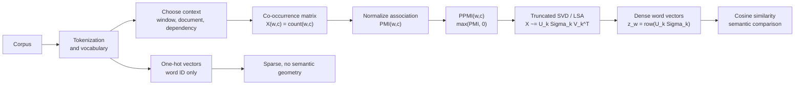

# Word Vector Representations

Source: `DL_exam.pdf`, Question 26

Original question:

> Векторные представления слов. One-hot, distributional hypothesis, count-based embeddings, co-occurrence matrix, PMI/PPMI, LSA.

## Интуиция

Векторное представление слова нужно, чтобы текст можно было подать в алгоритм машинного обучения. Слово как строка не имеет числовой геометрии: модель не знает, что `кошка` ближе к `собака`, чем к `интеграл`. Поэтому словам сопоставляют векторы.

Самый простой вариант - `one-hot`: каждому слову соответствует отдельная координата. Это удобно как идентификатор, но плохо как смысловое представление: все разные слова равноудалены, нет понятия похожести, размерность равна размеру словаря.

Более содержательная идея основана на `distributional hypothesis`: слова, встречающиеся в похожих контекстах, имеют похожие значения. Тогда слово описывают не номером в словаре, а статистикой его совместной встречаемости с другими словами или документами. Так появляются `count-based embeddings`: строим co-occurrence matrix, преобразуем частоты в PMI/PPMI, затем часто сжимаем матрицу через LSA/SVD, получая плотные низкоразмерные векторы.

## Что нужно сказать на экзамене

- Векторные представления слов превращают дискретные токены в числовые векторы, с которыми можно считать сходство и обучать модели.
- `One-hot` для словаря размера $|V|$: слово $w_i$ кодируется вектором $e_i \in \mathbb{R}^{|V|}$, где одна координата равна 1, остальные 0.
- Недостатки one-hot: высокая размерность, разреженность, отсутствие семантической близости, невозможность обобщать между похожими словами.
- `Distributional hypothesis`: значение слова можно приближенно описать распределением его контекстов.
- `Count-based embeddings` строятся из статистики корпуса: слово-контекстная матрица, co-occurrence counts, PMI/PPMI, затем при необходимости dimensionality reduction.
- Co-occurrence matrix $C$ хранит, сколько раз слово $w$ встретилось с контекстом $c$: $C_{w,c}$.
- Контекстом может быть окно вокруг слова, документ, предложение, синтаксическая зависимость или соседние слова с учетом позиции.
- PMI измеряет, насколько совместная встречаемость слова и контекста выше независимой случайной встречаемости:

$$
\operatorname{PMI}(w,c) = \log \frac{P(w,c)}{P(w)P(c)}.
$$

- PPMI обнуляет отрицательные значения:

$$
\operatorname{PPMI}(w,c) = \max(\operatorname{PMI}(w,c), 0).
$$

- `LSA` (`Latent Semantic Analysis`) применяет truncated SVD к term-document или word-context matrix и получает низкоранговое скрытое семантическое пространство.
- Главные trade-offs: count-based методы интерпретируемы и используют глобальную статистику, но зависят от корпуса, окна, частотной нормализации и плохо работают с редкими словами без сглаживания.

## Подробный ответ

Пусть задан корпус текста и словарь $V = \{w_1, \dots, w_{|V|}\}$. Векторное представление задает отображение:

$$
\phi: V \rightarrow \mathbb{R}^d.
$$

Размерность $d$ может быть равна $|V|$, как в one-hot, или быть намного меньше, как в LSA и dense embeddings.

### One-hot представление

Для слова $w_i$ one-hot вектор:

$$
\phi(w_i) = e_i =
(0, \dots, 0, 1, 0, \dots, 0) \in \mathbb{R}^{|V|}.
$$

Скалярное произведение двух one-hot векторов:

$$
e_i^\top e_j =
\begin{cases}
1, & i=j, \\
0, & i \ne j.
\end{cases}
$$

Это хорошо для индексации токенов, но плохо для семантики. Косинусная близость любых двух разных слов равна 0, поэтому `автомобиль` и `машина` так же непохожи, как `автомобиль` и `банан`. One-hot не использует корпусную статистику и не дает модели prior о сходстве слов.

### Distributional hypothesis

`Distributional hypothesis` формулируется так: слова с похожим значением встречаются в похожих контекстах. Например, слова `кошка` и `собака` часто встречаются рядом с `домашний`, `корм`, `животное`, `гулять`, поэтому их контекстные профили похожи.

Важно: гипотеза не говорит, что контексты полностью определяют значение. Она дает практическое приближение: семантическую близость можно оценивать по статистике употребления. Антонимы вроде `горячий` и `холодный` тоже могут иметь похожие контексты, поэтому distributional similarity не всегда равна логической или онтологической близости.

### Co-occurrence matrix

Для count-based подхода выбирают множество слов $W$ и множество контекстов $Ctxt$. Затем строят матрицу:

$$
X \in \mathbb{R}^{|W| \times |Ctxt|},
$$

где строка соответствует target word, а столбец - context feature.

Простейшая co-occurrence matrix хранит счетчики:

$$
X_{w,c} = \#(w,c),
$$

то есть сколько раз слово $w$ встретилось с контекстом $c$.

Варианты определения контекста:

| Контекст | Что означает | Где полезно |
|---|---|---|
| Окно размера $k$ | Слова слева и справа от target word | Общая лексическая семантика |
| Документ | Контекстом является документ | Information retrieval, LSA |
| Предложение | Все слова в одном предложении | Тематическая близость |
| Позиционный контекст | Например, `left:of`, `right:river` | Более точные синтаксические признаки |
| Dependency context | Слова, связанные синтаксическими зависимостями | Функциональная и синтаксическая близость |

Raw counts имеют проблему: частые слова вроде предлогов, союзов и общих терминов получают большие значения почти везде. Поэтому счетчики обычно нормализуют или преобразуют в меры ассоциации, например PMI/PPMI.

### PMI и PPMI

PMI (`Pointwise Mutual Information`) сравнивает реальную совместную вероятность слова и контекста с вероятностью, которая была бы при независимости:

$$
\operatorname{PMI}(w,c) = \log \frac{P(w,c)}{P(w)P(c)}.
$$

Если $\operatorname{PMI}(w,c) > 0$, пара встречается чаще, чем ожидалось при независимости. Если $\operatorname{PMI}(w,c) = 0$, совместная встречаемость примерно соответствует независимости. Если $\operatorname{PMI}(w,c) < 0$, пара встречается реже ожидаемого.

Вероятности оценивают по счетчикам. Пусть:

$$
N = \sum_{w,c} X_{w,c},
$$

тогда:

$$
P(w,c) = \frac{X_{w,c}}{N}, \quad
P(w) = \frac{\sum_c X_{w,c}}{N}, \quad
P(c) = \frac{\sum_w X_{w,c}}{N}.
$$

Подставляя в формулу PMI:

$$
\operatorname{PMI}(w,c)
= \log \frac{X_{w,c} \cdot N}
{\left(\sum_{c'} X_{w,c'}\right)\left(\sum_{w'} X_{w',c}\right)}.
$$

PPMI (`Positive PMI`) оставляет только положительную ассоциацию:

$$
\operatorname{PPMI}(w,c) = \max(\operatorname{PMI}(w,c), 0).
$$

Почему PPMI часто удобнее PMI:

- отрицательные значения плохо интерпретируются для невстречавшихся или редких пар;
- матрица становится неотрицательной и более устойчивой;
- нули означают "нет доказанной положительной ассоциации";
- сильные специфические связи выделяются лучше, чем в raw counts.

Практическая проблема PMI: он может завышать редкие пары. Если два редких слова встретились вместе один раз, PMI может быть большим, хотя статистика ненадежна. Поэтому используют минимальные пороги частоты, сглаживание, subsampling частых слов или варианты вроде shifted PPMI.

### Count-based embeddings

После построения матрицы каждая строка $X_{w,:}$ или $\operatorname{PPMI}_{w,:}$ может рассматриваться как embedding слова. Такое представление уже лучше one-hot, потому что слова с похожими строками имеют похожие контекстные профили.

Однако полная матрица обычно огромная и разреженная:

$$
d = |Ctxt| \gg 100.
$$

Поэтому часто применяют dimensionality reduction. Цель - заменить высокоразмерную строку более коротким dense vector, сохранив главную структуру совместной встречаемости.

### LSA

`LSA` (`Latent Semantic Analysis`) - классический count-based метод, который применяет `SVD` к term-document matrix или word-context matrix. Пусть $X$ - матрица статистик, например raw counts, TF-IDF или PPMI:

$$
X \in \mathbb{R}^{m \times n}.
$$

Сингулярное разложение:

$$
X = U \Sigma V^\top,
$$

где:

- $U \in \mathbb{R}^{m \times r}$ содержит левые сингулярные векторы;
- $V \in \mathbb{R}^{n \times r}$ содержит правые сингулярные векторы;
- $\Sigma = \operatorname{diag}(\sigma_1, \dots, \sigma_r)$, $\sigma_1 \ge \sigma_2 \ge \dots \ge 0$;
- $r = \operatorname{rank}(X)$.

Truncated SVD оставляет только $k$ крупнейших сингулярных значений:

$$
X \approx X_k = U_k \Sigma_k V_k^\top.
$$

По теореме Эккарта-Янга $X_k$ является лучшим rank-$k$ приближением $X$ по Frobenius norm и spectral norm:

$$
X_k = \arg\min_{\operatorname{rank}(Y) \le k} \|X - Y\|_F.
$$

Embedding строки, например слова или термина, обычно берут как:

$$
z_w = (U_k \Sigma_k)_{w,:}
$$

или иногда как:

$$
z_w = (U_k \Sigma_k^\alpha)_{w,:}, \quad 0 \le \alpha \le 1.
$$

Интуитивно LSA находит скрытые латентные измерения: темы, семантические факторы или направления совместной встречаемости. Сжатие через SVD также частично убирает шум: редкие случайные совпадения меньше влияют, если они не поддержаны глобальной структурой матрицы.

Сравнение:

| Метод | Представление | Плюсы | Минусы |
|---|---|---|---|
| One-hot | Индикатор слова | Простое, точное ID слова | Нет семантики, разреженное, $d=|V|$ |
| Raw counts | Строка co-occurrence matrix | Использует корпус | Доминируют частые слова, высокая размерность |
| PMI/PPMI | Ассоциация слово-контекст | Выделяет информативные контексты | Чувствительно к редким событиям |
| LSA | Dense vector после SVD | Снижает размерность, находит latent factors | Линейное разложение, зависит от матрицы и $k$ |

## Формулы / алгоритмы

Цель count-based embeddings: построить векторы слов так, чтобы близость векторов отражала похожесть контекстного употребления.

Входы:

- корпус токенов;
- словарь target words $W$;
- множество context features $Ctxt$;
- правило контекста, например окно размера $k$;
- функция взвешивания: counts, TF-IDF, PMI, PPMI;
- желаемая размерность $d$ для LSA.

Выход:

- embedding matrix $Z \in \mathbb{R}^{|W| \times d}$ или разреженная матрица признаков $X \in \mathbb{R}^{|W| \times |Ctxt|}$.

Алгоритм построения PPMI + LSA:

1. Токенизировать корпус и построить словарь $W$.
2. Выбрать определение контекста, например окно $\pm k$ слов.
3. Инициализировать co-occurrence matrix $X$ нулями.
4. Для каждого вхождения target word $w$ увеличить $X_{w,c}$ для контекстов $c$ вокруг него.
5. Оценить вероятности:

$$
P(w,c) = \frac{X_{w,c}}{N}, \quad
P(w) = \frac{\sum_c X_{w,c}}{N}, \quad
P(c) = \frac{\sum_w X_{w,c}}{N}.
$$

6. Построить PMI:

$$
\operatorname{PMI}(w,c) = \log \frac{P(w,c)}{P(w)P(c)}.
$$

7. Построить PPMI:

$$
\operatorname{PPMI}(w,c) = \max(\operatorname{PMI}(w,c), 0).
$$

8. Применить truncated SVD:

$$
\operatorname{PPMI} \approx U_d \Sigma_d V_d^\top.
$$

9. Взять embeddings слов:

$$
Z = U_d \Sigma_d
$$

или $Z = U_d \Sigma_d^\alpha$.

Практические замечания:

- Сложность хранения dense co-occurrence matrix порядка $O(|W||Ctxt|)$, поэтому на практике используют sparse matrices.
- Размер окна влияет на тип сходства: маленькое окно чаще ловит синтаксическую и функциональную близость, большое окно - тематическую близость.
- Stop words и очень частые слова могут ухудшать статистику; их удаляют, понижают вес или сглаживают.
- Редкие слова имеют ненадежные embeddings, потому что для них мало наблюдений.
- После получения dense embeddings сходство часто считают через cosine similarity:

$$
\cos(z_a,z_b) = \frac{z_a^\top z_b}{\|z_a\|_2\|z_b\|_2}.
$$

## Диаграмма или изображение

Внешние изображения не использовались; диаграмма воссоздана как Mermaid-схема.

## Быстрая устная версия

Векторные представления слов нужны, чтобы заменить дискретные слова числовыми объектами. One-hot кодирует слово как индикаторную координату в словаре, но такие векторы разреженные, большие и не отражают похожесть слов.

Distributional hypothesis говорит: слова с похожими контекстами имеют похожие значения. Поэтому в count-based подходах строят co-occurrence matrix слово-контекст. Raw counts затем часто преобразуют в PMI, чтобы измерить, насколько пара слово-контекст встречается чаще независимого ожидания, и в PPMI, чтобы оставить только положительные ассоциации. LSA применяет truncated SVD к такой матрице и получает низкоразмерные dense embeddings, где близость векторов отражает похожесть контекстного употребления.

## Возможные уточняющие вопросы

- Почему one-hot не является хорошим semantic embedding?  
  Потому что разные слова ортогональны: модель не видит, что некоторые слова близки по смыслу.

- Что именно утверждает distributional hypothesis?  
  Значение слова можно приближенно восстановить по его типичным контекстам употребления.

- Что хранится в co-occurrence matrix?  
  В строках target words, в столбцах context features, в ячейках счетчики совместных встреч или их веса.

- Чем PMI лучше raw counts?  
  PMI сравнивает совместную встречаемость с независимым ожиданием, поэтому уменьшает доминирование просто частых слов.

- Зачем нужен PPMI?  
  Он обнуляет отрицательные PMI и оставляет только положительную evidence ассоциации.

- Почему PMI может быть нестабильным?  
  Он может давать большие значения редким парам, если они случайно встретились вместе.

- Что делает LSA?  
  Применяет truncated SVD к term-document или word-context matrix и строит низкоранговое latent semantic space.

- Как выбрать размер окна контекста?  
  Малое окно лучше отражает синтаксическую/функциональную близость, большое окно - тематическую близость.

- Как измерять близость готовых word vectors?  
  Обычно cosine similarity, потому что важнее направление вектора, а не только его длина.

## Частые ошибки

- Называть one-hot семантическим embedding без оговорок. Это скорее идентификатор слова, а не смысловой вектор.
- Думать, что похожие one-hot векторы могут отражать похожие слова. Для разных слов они ортогональны.
- Путать co-occurrence matrix с embedding matrix после SVD: первая обычно большая и разреженная, вторая низкоразмерная и плотная.
- Считать, что PMI - это просто частота. PMI нормализует совместную вероятность на маргинальные вероятности.
- Забывать про проблему редких событий в PMI.
- Путать PMI и PPMI: PPMI не допускает отрицательных значений.
- Говорить, что LSA обязательно работает только с документами. Исторически часто term-document, но та же идея SVD применима к word-context matrices.
- Забывать, что выбор контекста задает тип получаемой семантики.
- Считать, что distributional similarity всегда означает синонимию: антонимы и тематически связанные слова тоже могут иметь похожие контексты.
