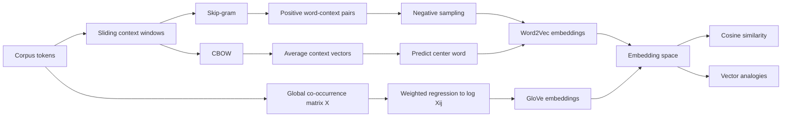

# Word2Vec and GloVe

Source: `DL_exam.pdf`, Question 27

Original question:

> Word2Vec и GloVe. Skip-gram, CBOW, negative sampling, интерпретация embedding space, аналогии и косинусная близость.

## Интуиция

`Word2Vec` и `GloVe` строят dense-векторы слов так, чтобы слова с похожими контекстами имели похожие представления. Вместо one-hot вектора размера словаря слово кодируется вектором небольшой размерности $d$, например 100--300. Такой вектор хранит не явный смысл слова, а статистический след его употреблений: какие слова часто встречаются рядом, в каких синтаксических и семантических окружениях оно появляется.

Главная идея `Word2Vec`: обучить простую нейросетевую задачу предсказания контекста по слову или слова по контексту, а затем использовать обученные веса как embeddings. Главная идея `GloVe`: напрямую аппроксимировать глобальную матрицу совместных встречаемостей слов так, чтобы скалярное произведение векторов объясняло логарифм co-occurrence count.

После обучения пространство embeddings часто обладает полезной геометрией: близкие по смыслу слова имеют высокий cosine similarity, а некоторые отношения приближенно выражаются векторными сдвигами, например `king - man + woman ≈ queen`. Это не строгая логика, а эмпирическое свойство, возникающее из регулярностей в корпусе.

## Что нужно сказать на экзамене

- `Word2Vec` обучает embeddings через предсказательную задачу на локальных окнах контекста.
- `Skip-gram`: по центральному слову $w_t$ предсказывает слова контекста $w_{t+j}$.
- `CBOW`: по словам контекста предсказывает центральное слово.
- Полный `softmax` по словарю дорогой: $O(|V|)$ на пример, поэтому используют `negative sampling` или hierarchical softmax.
- `Negative sampling` превращает задачу в бинарную классификацию: реальные пары `(center, context)` должны иметь высокий score, случайные отрицательные пары - низкий.
- `GloVe` использует глобальные co-occurrence counts $X_{ij}$ и минимизирует weighted least squares между $w_i^\top \tilde w_j + b_i + \tilde b_j$ и $\log X_{ij}$.
- Embedding space интерпретируют через близость, кластеры, направления и аналогии, но эта интерпретация приблизительна и зависит от корпуса, частот, размерности и способа обучения.
- Cosine similarity сравнивает направления векторов, а не их длины:
  $$\cos(u, v) = \frac{u^\top v}{\|u\|\|v\|}.$$
- Ограничения: статические embeddings дают один вектор на слово и плохо различают значения омонимов; частотные и социальные bias из корпуса переносятся в пространство.

## Подробный ответ

### Задача word embeddings

Пусть есть корпус токенов $w_1, \dots, w_T$ и словарь $V$. Нужно сопоставить каждому слову $i \in V$ плотный вектор $v_i \in \mathbb{R}^d$, где $d \ll |V|$. В отличие от one-hot кодирования, dense embeddings позволяют сравнивать слова геометрически и использовать их как входные признаки для NLP-моделей.

Основная гипотеза - distributional hypothesis: слова, встречающиеся в похожих контекстах, имеют похожие значения. `Word2Vec` и `GloVe` реализуют эту гипотезу разными способами:

| Модель | Что использует | Что оптимизирует | Характер |
|---|---|---|---|
| `Word2Vec Skip-gram` | локальные пары слово-контекст | вероятность контекстов по центральному слову | predictive |
| `Word2Vec CBOW` | локальное окно контекста | вероятность центрального слова по контексту | predictive |
| `GloVe` | глобальные co-occurrence counts | аппроксимацию $\log X_{ij}$ | count-based |

### Skip-gram

В `Skip-gram` для позиции $t$ центральное слово $w_t$ используется для предсказания слов в окне контекста:

$$
\max_\theta \sum_{t=1}^{T} \sum_{-c \le j \le c,\ j \ne 0} \log p(w_{t+j} \mid w_t).
$$

У модели обычно есть две матрицы параметров: входные embeddings $W \in \mathbb{R}^{|V| \times d}$ и выходные context embeddings $\tilde W \in \mathbb{R}^{|V| \times d}$. Для центрального слова $i$ и контекстного слова $o$ полный softmax задает:

$$
p(o \mid i) =
\frac{\exp(\tilde v_o^\top v_i)}
{\sum_{k \in V} \exp(\tilde v_k^\top v_i)}.
$$

Проблема: знаменатель требует суммирования по всему словарю, поэтому стоимость одного обновления становится $O(|V|)$. При большом словаре это непрактично.

`Skip-gram` обычно лучше работает для редких слов, потому что каждое появление слова создает несколько обучающих пар с контекстом. Цена - больше обучающих примеров и более медленное обучение по сравнению с `CBOW`.

### CBOW

`CBOW` решает обратную задачу: по набору слов контекста предсказать центральное слово. Для позиции $t$ строится представление контекста, например среднее embeddings:

$$
h_t = \frac{1}{2c} \sum_{-c \le j \le c,\ j \ne 0} v_{w_{t+j}}.
$$

Затем модель максимизирует:

$$
\max_\theta \sum_{t=1}^{T} \log p(w_t \mid h_t).
$$

`CBOW` быстрее и устойчивее на частых словах, потому что агрегирует несколько контекстных слов в один сигнал. Но усреднение контекста может терять порядок слов и тонкие различия, поэтому для редких слов и отношений `Skip-gram` часто оказывается выразительнее.

### Negative sampling

`Negative sampling` заменяет полный softmax набором бинарных классификационных задач. Для реальной пары `(center word i, context word o)` модель повышает $\sigma(\tilde v_o^\top v_i)$, а для $K$ случайных отрицательных слов $n_1, \dots, n_K$ понижает $\sigma(\tilde v_{n_k}^\top v_i)$:

$$
\mathcal{L}_{i,o}
=
-\log \sigma(\tilde v_o^\top v_i)
- \sum_{k=1}^{K} \log \sigma(-\tilde v_{n_k}^\top v_i).
$$

Здесь $\sigma(x) = \frac{1}{1 + \exp(-x)}$. Отрицательные слова обычно выбирают из сглаженного unigram distribution:

$$
P_n(w) = \frac{U(w)^{3/4}}{\sum_{w' \in V} U(w')^{3/4}},
$$

где $U(w)$ - частота слова в корпусе. Степень $3/4$ уменьшает доминирование самых частотных слов, но сохраняет их вероятность выше, чем у редких.

Интуиция: вместо вопроса "какое именно слово из всего словаря является контекстом?" модель учится отвечать "является ли эта пара слово-контекст настоящей или случайной?". Стоимость обновления становится $O(K)$ вместо $O(|V|)$.

`Negative sampling` связано с матричной факторизацией: при определенных предположениях `Skip-gram with negative sampling` неявно факторизует сдвинутую матрицу `PMI` между словами и контекстами:

$$
PMI(i,o) = \log \frac{P(i,o)}{P(i)P(o)}.
$$

Грубо говоря, высокий скалярный score получают пары, которые встречаются вместе чаще, чем ожидалось бы из независимых частот.

### GloVe

`GloVe` означает `Global Vectors`. Модель начинается с матрицы совместных встречаемостей $X$, где $X_{ij}$ - сколько раз слово $j$ встретилось в контексте слова $i$. Вместо предсказания каждого окна отдельно `GloVe` использует глобальную статистику корпуса.

Целевая функция:

$$
J =
\sum_{i,j=1}^{|V|}
f(X_{ij})
\left(
w_i^\top \tilde w_j + b_i + \tilde b_j - \log X_{ij}
\right)^2.
$$

Здесь $w_i$ и $\tilde w_j$ - два набора embeddings, $b_i$ и $\tilde b_j$ - biases, а $f(X_{ij})$ - весовая функция. Обычно она уменьшает влияние нулевых и очень редких co-occurrences, но не дает сверхчастым парам полностью доминировать:

$$
f(x) =
\begin{cases}
(x / x_{\max})^\alpha, & x < x_{\max}, \\
1, & x \ge x_{\max}.
\end{cases}
$$

После обучения часто используют $w_i$, $\tilde w_i$ или их сумму $w_i + \tilde w_i$ как итоговый embedding слова.

Интуитивное отличие от `Word2Vec`: `Word2Vec` учится на локальных обучающих примерах и через stochastic updates восстанавливает полезную статистику совместных встречаемостей; `GloVe` явно строит objective вокруг глобальной co-occurrence matrix.

### Интерпретация embedding space

Embedding space интерпретируется через геометрию:

- близкие направления соответствуют похожим контекстам;
- кластеры могут отражать темы, части речи, домены или частотные группы;
- отдельные направления иногда соответствуют отношениям: род, число, столица-страна, профессия, время глагола;
- векторы несут статистические bias корпуса, поэтому геометрия не является нейтральной "семантической истиной".

Важно различать похожесть и связанность. Например, `coffee` и `cup` могут быть близки из-за частой совместной встречаемости, хотя это не синонимы. Также частотные слова могут иметь устойчивые, но менее интерпретируемые направления, потому что появляются в очень разных контекстах.

### Косинусная близость

Для сравнения embeddings обычно используют cosine similarity:

$$
\operatorname{cosine}(u,v) =
\frac{u^\top v}{\|u\|_2 \|v\|_2}.
$$

Она зависит от угла между векторами и игнорирует масштаб. Это удобно, потому что длина embedding может отражать частотность, уверенность или особенности оптимизации, а не только смысл. На практике часто нормализуют embeddings и ищут nearest neighbors по cosine similarity.

Cosine distance иногда определяют как:

$$
d_{\cos}(u,v) = 1 - \operatorname{cosine}(u,v).
$$

### Аналогии

Классический тест:

$$
v_{\text{king}} - v_{\text{man}} + v_{\text{woman}} \approx v_{\text{queen}}.
$$

Для поиска ответа используют nearest neighbor:

$$
\arg\max_{w \in V \setminus \{a,b,c\}}
\cos(v_w,\ v_b - v_a + v_c).
$$

Для аналогии "a относится к b так же, как c относится к ?" часто считают $v_b - v_a + v_c$. Работает это потому, что регулярные отношения в корпусе могут проявляться как похожие линейные смещения. Но аналогии не гарантированы: они чувствительны к корпусу, предобработке, частотам, размерности, метрике и набору кандидатов. Нельзя трактовать их как строгие логические операции над значениями.

## Формулы / алгоритмы

### Skip-gram with negative sampling

Objective для одной положительной пары $(i,o)$:

$$
\min
-\log \sigma(\tilde v_o^\top v_i)
- \sum_{k=1}^{K} \log \sigma(-\tilde v_{n_k}^\top v_i),
\quad n_k \sim P_n(w).
$$

Вход:

- корпус токенов $w_1,\dots,w_T$;
- словарь $V$;
- размер окна $c$;
- размерность embedding $d$;
- число negative samples $K$.

Выход:

- матрица embeddings $W$ и, при необходимости, context embeddings $\tilde W$.

Процедура:

1. Инициализировать $W$ и $\tilde W$ малыми случайными значениями.
2. Для каждой позиции $t$ выбрать центральное слово $w_t$.
3. Для каждого слова контекста $w_{t+j}$, где $j \in [-c,c]$ и $j \ne 0$, создать положительную пару.
4. Для этой пары выбрать $K$ отрицательных слов из $P_n(w)$.
5. Обновить только embeddings центрального, положительного контекстного и отрицательных слов через `SGD`/`Adam`.
6. Повторять несколько эпох; затем использовать $W$, $\tilde W$ или их комбинацию.

Практические caveats:

- большие окна дают больше тематической семантики, маленькие окна - больше синтаксической похожести;
- subsampling частых слов вроде "и", "в", "the" уменьшает шум и ускоряет обучение;
- редкие слова дают нестабильные vectors, поэтому используют `min_count`;
- итоговая интерпретация зависит от токенизации и нормализации текста.

### CBOW

$$
h_t = \frac{1}{|C_t|} \sum_{w \in C_t} v_w,
\quad
\max \log p(w_t \mid h_t).
$$

С `negative sampling` положительным примером становится `(context representation, center word)`, а отрицательные слова выбираются из noise distribution.

### GloVe

$$
J =
\sum_{i,j}
f(X_{ij})
\left(
w_i^\top \tilde w_j + b_i + \tilde b_j - \log X_{ij}
\right)^2.
$$

Где:

- $X_{ij}$ - число совместных встреч слова $i$ с контекстным словом $j$;
- $w_i^\top \tilde w_j$ - модельная оценка совместимости пары;
- biases компенсируют общие частоты слов;
- $f(X_{ij})$ контролирует вклад редких и частых пар.

## Диаграмма или изображение

Внешние изображения не использовались.

## Быстрая устная версия

`Word2Vec` - это способ обучить dense word embeddings через предсказание контекста. В `Skip-gram` центральное слово предсказывает соседние слова, в `CBOW` наоборот: контекст предсказывает центральное слово. Полный softmax по словарю дорогой, поэтому используют `negative sampling`: реальные пары слово-контекст классифицируются как положительные, случайные пары - как отрицательные.

`GloVe` отличается тем, что явно использует глобальную матрицу совместных встречаемостей и обучает векторы так, чтобы $w_i^\top \tilde w_j + b_i + \tilde b_j$ приближало $\log X_{ij}$. После обучения слова сравнивают по cosine similarity. Аналогии вроде `king - man + woman ≈ queen` возникают потому, что некоторые отношения представлены похожими векторными сдвигами, но это эмпирическое, а не строго логическое свойство.

## Возможные уточняющие вопросы

**Почему нужен `negative sampling`?**  
Чтобы избежать полного softmax по всему словарю. Вместо $O(|V|)$ модель обновляет положительную пару и несколько отрицательных примеров, то есть примерно $O(K)$.

**Чем `Skip-gram` отличается от `CBOW`?**  
`Skip-gram` предсказывает контекст по центральному слову и часто лучше для редких слов. `CBOW` предсказывает центральное слово по усредненному контексту, обычно быстрее и стабильнее на больших корпусах.

**Почему в `GloVe` используется $\log X_{ij}$, а не $X_{ij}$?**  
Raw counts имеют очень большой динамический диапазон. Логарифм делает шкалу мягче и связывает скалярные произведения с относительными co-occurrence statistics.

**Что означает близость embeddings?**  
Обычно это похожесть распределений контекстов. Она может отражать семантическое сходство, синтаксическую роль или тематическую связанность, но не обязана означать синонимию.

**Почему cosine similarity предпочтительнее евклидова расстояния?**  
Cosine сравнивает направление векторов и меньше зависит от их нормы. Норма может быть связана с частотностью или особенностями обучения.

**Почему работают аналогии?**  
Если отношение между парами слов регулярно встречается в корпусе, оно может кодироваться похожим линейным смещением в embedding space. Но это приближение, чувствительное к данным и методу обучения.

**Что делать с двумя матрицами embeddings в `Word2Vec` или `GloVe`?**  
Можно использовать input vectors, output/context vectors или их сумму/среднее. Важно явно сказать, какой вариант используется в downstream задаче.

## Частые ошибки

- Говорить, что embedding vector напрямую хранит "значение" слова. Он хранит параметры, обученные из статистики контекстов.
- Путать `Skip-gram` и `CBOW`: в `Skip-gram` направление предсказания от центра к контексту, в `CBOW` - от контекста к центру.
- Забывать, что полный softmax дорогой, и не объяснять роль `negative sampling`.
- Считать отрицательные примеры "неправильными словами" в абсолютном смысле. Это слова, случайно выбранные из noise distribution для данной пары.
- Интерпретировать аналогии как гарантированную алгебру смысла. Это эмпирическая геометрическая регулярность.
- Сравнивать embeddings по dot product без учета нормы, когда задача требует именно semantic similarity.
- Не упоминать, что `Word2Vec` и `GloVe` дают static embeddings: одно слово получает один вектор независимо от контекста.
- Игнорировать влияние корпуса, токенизации, частотных слов, `min_count`, размера окна и размерности embedding.
