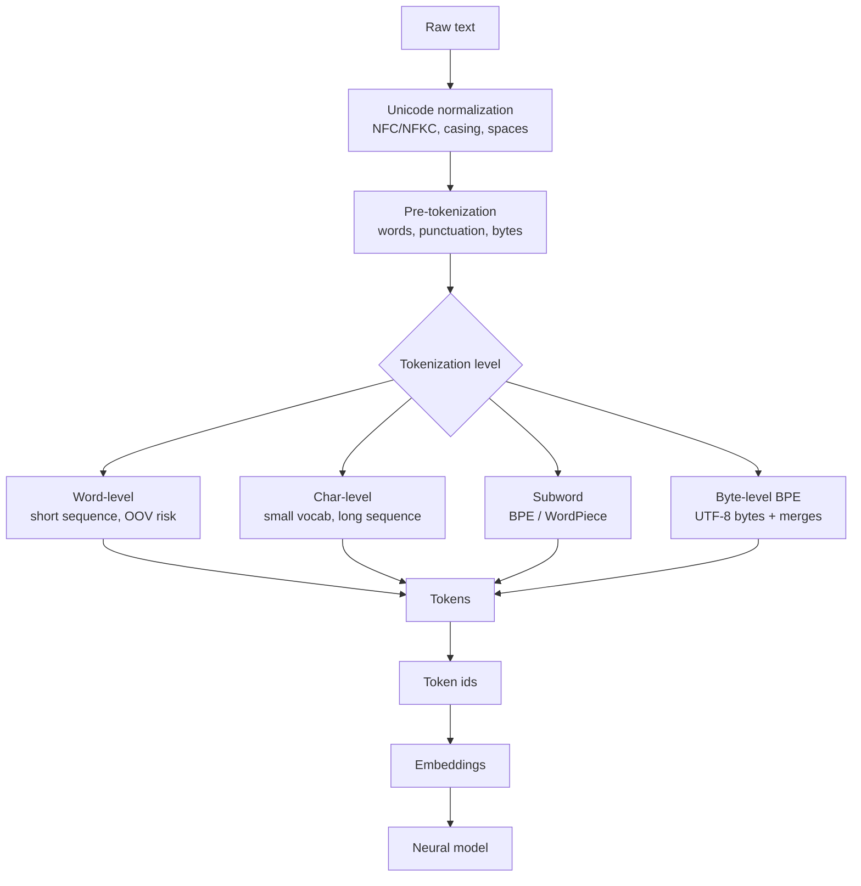

# Text Tokenization

Source: `DL_exam.pdf`, Question 31

Original question:

> Токенизация текста. Word-level, char-level, subword, BPE, WordPiece, byte-level BPE, Unicode/UTF-8.

## Интуиция

Токенизация - это преобразование сырого текста в последовательность дискретных единиц, с которыми может работать модель. Нейросеть не видит "слова" напрямую: обычно она получает индексы токенов, затем переводит их в embedding vectors. Поэтому tokenizer фактически задает, из каких атомов модель будет строить смысл: из слов, символов, частей слов или байтов.

Главный компромисс токенизации: чем крупнее токены, тем короче последовательность, но тем хуже покрытие редких и новых слов; чем мельче токены, тем лучше покрытие, но тем длиннее последовательность и сложнее моделировать дальние зависимости. Subword-токенизация, например `BPE`, `WordPiece` и `byte-level BPE`, стала стандартом, потому что она обычно дает хороший баланс: частые слова хранятся целиком, редкие слова раскладываются на осмысленные или хотя бы воспроизводимые части.

Важно помнить, что tokenizer - часть модели. Если изменить правила нормализации, словарь или способ разбиения текста, то индексы токенов изменятся, а pretrained embeddings и language model уже не будут соответствовать входу.

## Что нужно сказать на экзамене

- `Tokenization` отображает строку $s$ в последовательность токенов $t_1,\dots,t_n$, затем токены отображаются в ids $i_1,\dots,i_n$ из словаря $V$.
- `Word-level` tokenizer делит текст на слова. Плюсы: короткие последовательности и понятные токены. Минусы: огромный словарь, проблема `OOV` (`out-of-vocabulary`), плохая работа с опечатками и морфологией.
- `Char-level` tokenizer использует символы/code points. Плюсы: почти нет `OOV`, малый словарь. Минусы: длинные последовательности, сложнее учить семантику слов и дальний контекст.
- `Subword` tokenizer использует части слов. Частые слова могут быть одним токеном, редкие слова разбиваются на части. Это компромисс между word-level и char-level.
- `BPE` (`Byte Pair Encoding`) итеративно объединяет наиболее частые соседние пары символов/subwords в корпусе, пока не достигнут размер словаря или число merge operations.
- `WordPiece` похож на BPE, но обучает словарь по критерию улучшения likelihood/score корпуса, а при токенизации обычно применяет greedy longest-match разбиение; продолжения слова часто помечаются префиксом `##`.
- `byte-level BPE` применяет BPE к последовательности байтов UTF-8. Базовый словарь содержит все 256 байтов, поэтому любая строка в UTF-8 представима без `UNK`.
- `Unicode` - стандарт символов и code points, а `UTF-8` - переменная байтовая кодировка Unicode code points длиной 1-4 байта.
- До токенизации часто есть normalization: lowercasing, Unicode normalization (`NFC`, `NFKC`), удаление/сохранение пробелов, обработка punctuation. Эти решения меняют результат.
- Токенизация влияет на длину контекста, стоимость attention $O(n^2)$, качество на редких словах, мультиязычность, устойчивость к опечаткам и fairness между языками.

## Подробный ответ

### Базовая постановка

Пусть есть строка текста $s$. Tokenizer задает отображение:

$$
T(s) = (t_1, t_2, \dots, t_n),
$$

где каждый $t_i \in V$, а $V$ - словарь токенов. Затем каждый токен заменяется индексом:

$$
\operatorname{id}(T(s)) = (i_1, i_2, \dots, i_n), \quad i_k \in \{0,\dots,|V|-1\}.
$$

Модель обычно получает не сами строки, а ids. Первый слой language model или NLP-модели превращает ids в embeddings:

$$
x_k = E[i_k], \quad E \in \mathbb{R}^{|V| \times d}.
$$

Отсюда видно, почему размер словаря важен. Большой $|V|$ увеличивает embedding matrix и output projection, а слишком маленький словарь увеличивает длину последовательности $n$. Для Transformer это особенно критично, потому что self-attention имеет стоимость примерно $O(n^2 d)$ по длине последовательности.

### Word-level tokenization

`Word-level` tokenizer делит текст на слова и знаки пунктуации, часто по пробелам и регулярным правилам. Например:

```text
"unbelievable results!" -> ["unbelievable", "results", "!"]
```

Преимущество: токены интерпретируемы, последовательность короткая, модель сразу получает единицы, близкие к словам. Это удобно для простых моделей, classical NLP pipelines и задач, где словарь небольшой.

Главная проблема - `OOV`. Если в test set встречается слово, которого не было в словаре, tokenizer должен заменить его на специальный токен вроде `[UNK]`. Тогда разные неизвестные слова становятся одинаковыми для модели. Word-level также плохо масштабируется для языков с богатой морфологией: формы одного слова могут занимать много отдельных entries в словаре.

### Char-level tokenization

`Char-level` tokenizer разбивает текст на символы или Unicode code points:

```text
"cat" -> ["c", "a", "t"]
```

Плюсы: словарь маленький, редкие слова, новые имена и опечатки можно представить без `[UNK]`. Это полезно для задач, где важны орфография, морфология, spelling correction или обработка noisy text.

Минусы: последовательность становится намного длиннее. Модели приходится из символов заново учить, что такое слово и какие сочетания символов значимы. Для Transformer это дорого из-за квадратичной стоимости attention. Кроме того, "символ" не всегда равен тому, что человек воспринимает как один знак: некоторые видимые символы состоят из нескольких Unicode code points, например буква с combining accent или emoji sequence.

### Subword tokenization

`Subword` tokenization использует единицы между символом и словом. Пример:

```text
"unbelievable" -> ["un", "believ", "able"]
```

Идея: частые слова и частые морфемы выгодно хранить как отдельные токены, а редкие слова можно разложить на известные части. Поэтому subword-подход уменьшает `OOV`, контролирует размер словаря и держит последовательность короче, чем char-level.

Сравнение уровней:

| Уровень | Размер словаря | Длина последовательности | OOV | Типичные проблемы |
|---|---:|---:|---:|---|
| Word-level | большой | малая | высокий риск | редкие слова, морфология, имена |
| Char-level | малый | большая | почти нет | длинный контекст, сложная семантика |
| Subword | средний | средняя | низкий риск | не всегда лингвистические границы |
| Byte-level | минимум 256 base units плюс merges | часто средняя | практически нет для UTF-8 | токены могут быть неинтуитивными |

### BPE

`BPE` (`Byte Pair Encoding`) в NLP обучает словарь через повторяющиеся merge operations. Начальное представление обычно строится из символов внутри слов, часто с маркером конца слова. Затем алгоритм считает частоты соседних пар и объединяет самую частую пару в новый токен.

Упрощенный пример:

```text
low   -> l o w
lower -> l o w e r
lowest-> l o w e s t
```

Если пара `l o` самая частая, добавляем merge `l o -> lo`. Потом может появиться `lo w -> low`, затем `low er -> lower` или `e s -> es`, в зависимости от частот. После обучения tokenizer применяет выученные merges в фиксированном порядке.

BPE не знает лингвистику напрямую: он выбирает частотные пары, а не обязательно морфемы. Но на практике частые части слов часто совпадают с полезными units. Недостаток BPE - частотный критерий может создавать странные токены, особенно при смешении языков, punctuation, пробелов и разных Unicode forms.

### WordPiece

`WordPiece` тоже строит subword vocabulary, но отличается критерием выбора новых токенов. В классическом описании WordPiece выбирает добавления в словарь так, чтобы сильнее улучшать likelihood/score корпуса, а не просто объединять самую частую пару, как BPE. В учебном ответе важно разделять две вещи:

- training vocabulary: выбираем subwords по критерию полезности для корпуса;
- tokenization/inference: обычно применяем greedy longest-match, то есть берем самый длинный токен из словаря, который подходит к текущей позиции.

В BERT-like tokenizer продолжение слова часто помечается `##`:

```text
"playing" -> ["play", "##ing"]
"unaffable" -> ["una", "##ffa", "##ble"]  # пример формы, не обязательная реальная сегментация
```

Префикс `##` означает, что subword не может начинать новое слово. Если слово нельзя разложить на известные WordPiece-токены, старые реализации могли возвращать `[UNK]`; это одна из причин популярности byte-level подходов.

### Byte-level BPE

`byte-level BPE` сначала кодирует строку в UTF-8 bytes, затем применяет BPE к байтовым единицам. Базовый словарь содержит все 256 возможных байтов:

$$
V_0 = \{0,1,\dots,255\}.
$$

Поскольку любая корректная Unicode-строка может быть представлена как последовательность UTF-8 bytes, tokenizer может закодировать любой текст без `[UNK]`. Далее частые последовательности байтов объединяются BPE merges в более крупные токены. Этот подход используется в GPT-like tokenizer families, потому что он хорошо работает с multilingual text, emoji, редкими символами, кодом и произвольной пунктуацией.

Цена byte-level BPE: токены иногда хуже совпадают с человеческими символами и морфемами. Один Unicode character может занимать несколько UTF-8 bytes, а BPE merges могут объединять байты и части слов неинтуитивно. Тем не менее практическое покрытие и отсутствие `OOV` обычно важнее.

### Unicode и UTF-8

`Unicode` - это стандарт, который назначает символам абстрактные code points, например `U+0041` для `A`. `UTF-8` - способ кодировать эти code points в байты. В UTF-8 длина кодировки переменная:

| Диапазон code point | Длина UTF-8 |
|---|---:|
| ASCII `U+0000`-`U+007F` | 1 byte |
| Многие европейские, кириллические, греческие символы | 2 bytes |
| Многие азиатские символы | 3 bytes |
| Emoji и часть редких символов | 4 bytes |

Есть три разных уровня, которые нельзя путать:

- byte: число от 0 до 255 в конкретной кодировке;
- Unicode code point: абстрактный символ вроде `U+0430`;
- grapheme cluster: видимый пользователю "один символ", который может состоять из нескольких code points.

Например, буква `é` может быть представлена как один code point `U+00E9` или как `e` плюс combining acute accent. Визуально строки могут выглядеть одинаково, но токенизироваться по-разному, если не применить Unicode normalization. Поэтому tokenizer часто включает normalization stage: `NFC` склеивает canonical forms, `NFKC` еще и приводит compatibility forms, но может менять смысл в некоторых доменах.

### Специальные токены и практические детали

Кроме обычных текстовых токенов, tokenizer часто содержит special tokens:

- `[PAD]` или `<pad>` - padding до общей длины batch;
- `[UNK]` или `<unk>` - неизвестный токен, если tokenizer допускает OOV;
- `[CLS]`, `[SEP]` - служебные токены BERT-like моделей;
- `<bos>`, `<eos>` - начало и конец последовательности;
- chat/control tokens - маркеры ролей, инструментов или формата диалога.

Практический pipeline зависит от модели:

1. Text normalization: Unicode normalization, lowercasing, обработка пробелов.
2. Pre-tokenization: первичное разбиение по пробелам, punctuation или байтам.
3. Subword segmentation: BPE, WordPiece или другой алгоритм.
4. Добавление special tokens.
5. Mapping tokens to ids.
6. Padding/truncation и создание attention mask.

Ошибки в любом шаге могут ломать модель. Например, если pretrained BERT обучался с lowercasing, а на inference использовать другой tokenizer, ids будут несовместимы с обученными embeddings.

## Формулы / алгоритмы

### BPE training

Вход:

- корпус слов или pre-tokenized текста $C$;
- начальный словарь $V_0$ из символов, байтов или начальных units;
- желаемый размер словаря $K$ или число merges $M$.

Выход:

- словарь $V$;
- упорядоченный список merge rules.

Алгоритм:

1. Представить каждое слово как последовательность начальных units.
2. Посчитать частоты всех соседних пар $(a,b)$ в корпусе:

$$
\operatorname{freq}(a,b)=\sum_{x \in C}\operatorname{count}_{x}(a,b).
$$

3. Выбрать самую частую пару:

$$
(a^*,b^*)=\arg\max_{(a,b)} \operatorname{freq}(a,b).
$$

4. Добавить новый токен $c=a^*b^*$ в словарь.
5. Заменить все вхождения пары $(a^*,b^*)$ на $c$.
6. Повторять шаги 2-5, пока $|V|=K$ или выполнено $M$ merges.

Практические caveats:

- обучение BPE greedy, поэтому ранние merges влияют на все последующие;
- частотные merges не гарантируют лингвистически правильные морфемы;
- качество зависит от normalization, pre-tokenization и состава корпуса;
- при inference важно применять merges в том же порядке, в котором они были обучены.

### WordPiece tokenization by longest match

Вход:

- слово или pre-tokenized fragment $w$;
- WordPiece vocabulary $V$;
- маркер continuation, например `##`;
- максимальная длина слова или fallback `[UNK]`, если используется.

Выход:

- последовательность WordPiece tokens или `[UNK]`.

Алгоритм greedy longest-match:

1. Поставить позицию $p=0$.
2. Пока $p < |w|$, найти самый длинный substring $w[p:q]$, который есть в $V$.
3. Если $p>0$, искать continuation form, например `##` + $w[p:q]$.
4. Если подходящий токен найден, добавить его в результат и сдвинуть $p=q$.
5. Если не найден ни один токен, вернуть `[UNK]` или применить fallback, если он предусмотрен реализацией.

Этот алгоритм быстрый и детерминированный, но он greedy: локально самый длинный match не обязательно является глобально оптимальной сегментацией по вероятности.

### UTF-8 encoding idea

Для byte-level tokenizer строка сначала кодируется:

$$
s \xrightarrow{\text{UTF-8}} (b_1,b_2,\dots,b_m), \quad b_i \in \{0,\dots,255\}.
$$

Затем применяется BPE:

$$
(b_1,\dots,b_m) \xrightarrow{\text{BPE merges}} (t_1,\dots,t_n).
$$

Главное свойство: если входная строка корректно кодируется в UTF-8, то byte-level tokenizer может ее представить, потому что все отдельные bytes уже есть в базовом словаре.

## Диаграмма или изображение



Внешние изображения не использовались.

## Быстрая устная версия

Токенизация переводит текст в последовательность дискретных токенов, а затем в ids для embedding layer. Word-level токенизация дает понятные и короткие последовательности, но страдает от огромного словаря и OOV. Char-level почти убирает OOV и имеет маленький словарь, но сильно увеличивает длину последовательности.

На практике чаще используют subword-токенизацию. BPE начинает с символов или байтов и жадно объединяет самые частые соседние пары. WordPiece похож, но выбирает subwords по критерию полезности для likelihood/score корпуса, а при применении обычно делает greedy longest-match; в BERT continuation-токены часто имеют `##`. Byte-level BPE работает по UTF-8 bytes, имеет все 256 байтов в базовом словаре и поэтому может представить почти любой текст без `[UNK]`. Unicode - это code points, UTF-8 - байтовая кодировка этих code points; normalization важна, потому что визуально одинаковые строки могут иметь разные byte/code point representations.

## Возможные уточняющие вопросы

- Почему word-level tokenizer плохо подходит для больших LLM?  
  Из-за огромного словаря, OOV, плохой обработки редких слов, имен, опечаток и морфологии.

- Почему char-level tokenizer не всегда лучше, если у него нет OOV?  
  Он делает последовательности длинными, повышает стоимость attention и заставляет модель учить слова и морфемы из слишком мелких единиц.

- В чем отличие BPE от WordPiece?  
  BPE обычно выбирает самую частую соседнюю пару для merge. WordPiece выбирает subwords по критерию улучшения likelihood/score корпуса, а на inference часто использует greedy longest-match.

- Зачем нужен byte-level BPE?  
  Чтобы любой UTF-8 текст можно было представить через базовые 256 bytes без `[UNK]`, включая редкие символы, emoji, код и multilingual input.

- Что такое Unicode normalization и зачем она нужна?  
  Это приведение разных эквивалентных представлений символов к стандартной форме. Без normalization визуально одинаковые строки могут токенизироваться по-разному.

- Почему токенизация влияет на стоимость Transformer?  
  Она задает длину последовательности $n$, а self-attention обычно стоит $O(n^2)$ по длине.

- Что такое special tokens?  
  Служебные токены вроде `[PAD]`, `[UNK]`, `[CLS]`, `[SEP]`, `<bos>`, `<eos>`, которые задают формат входа, padding, начало/конец или структуру задачи.

## Частые ошибки

- Путать token, word, character, byte, Unicode code point и grapheme cluster.
- Говорить, что BPE всегда находит морфемы. На самом деле BPE оптимизирует частотные merges, а не лингвистическую правильность.
- Считать, что WordPiece на inference "обучается" заново. Словарь уже фиксирован; tokenizer только применяет правила к новому тексту.
- Забывать про `OOV` и `[UNK]` в word-level и некоторых WordPiece реализациях.
- Игнорировать normalization: регистр, пробелы, Unicode forms и punctuation могут полностью изменить ids.
- Думать, что byte-level BPE работает с Unicode characters напрямую. Он работает с UTF-8 bytes, а BPE merges уже строят более крупные токены.
- Менять tokenizer у pretrained model без переобучения embeddings. Это ломает соответствие между token ids и выученными параметрами.
- Оценивать tokenizer только по размеру словаря, забывая про длину последовательности, стоимость attention и покрытие разных языков.
