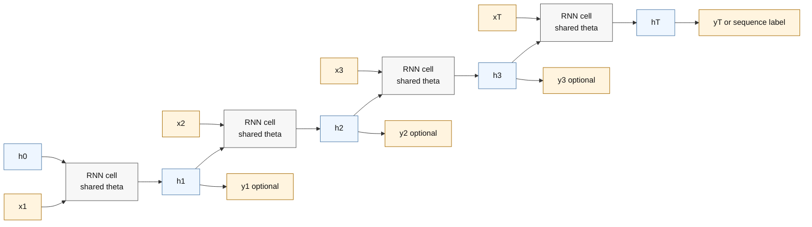

# Recurrent Neural Networks

Source: `DL_exam.pdf`, Question 28

Original question:

> Рекуррентные нейронные сети. Последовательные данные, hidden state, parameter sharing, BPTT, many-to-one/many-to-many задачи.

## Интуиция

Рекуррентная нейронная сеть (`RNN`) нужна, когда вход является последовательностью: текст, аудио, временной ряд, траектория, последовательность событий. В таких данных порядок важен: одно и то же значение может значить разное в зависимости от предыдущего контекста.

Главная идея `RNN`: обрабатывать элементы последовательности по одному и хранить сжатую память о прошлом в скрытом состоянии `hidden state` $h_t$. На шаге $t$ сеть получает текущий вход $x_t$ и предыдущее состояние $h_{t-1}$, затем строит новое состояние $h_t$. Одни и те же параметры применяются на каждом временном шаге, поэтому модель может работать с последовательностями разной длины и учить общие правила перехода во времени.

Если обычная feed-forward сеть видит фиксированный вектор, то `RNN` видит поток данных и обновляет внутреннее состояние. Развернутая во времени `RNN` выглядит как глубокая сеть, где глубина равна длине последовательности, но веса между шагами общие.

## Что нужно сказать на экзамене

- Последовательные данные: объекты вида $(x_1, \dots, x_T)$, где порядок и зависимости между шагами существенны.
- `Hidden state` $h_t$ является векторной памятью о префиксе последовательности $x_{1:t}$.
- Базовая `RNN`:

$$
h_t = \phi(W_{xh}x_t + W_{hh}h_{t-1} + b_h),
$$

$$
\hat{y}_t = g(W_{hy}h_t + b_y).
$$

- `Parameter sharing`: матрицы $W_{xh}$, $W_{hh}$, $W_{hy}$ и bias-параметры одинаковы для всех $t$.
- Обучение выполняется через `BPTT` (`backpropagation through time`): сеть разворачивается по времени, loss суммируется по нужным шагам, градиенты проходят назад через все копии одного и того же рекуррентного блока.
- Основные типы задач:

| Тип | Вход | Выход | Примеры |
|---|---:|---:|---|
| one-to-many | один объект | последовательность | генерация подписи к изображению с декодером |
| many-to-one | последовательность | один ответ | классификация текста, sentiment analysis |
| many-to-many aligned | последовательность | последовательность той же длины | POS-tagging, frame-level labeling |
| many-to-many unaligned | последовательность | последовательность другой длины | машинный перевод, ASR; обычно `seq2seq` |

- Важное ограничение простой `RNN`: из-за многократного умножения на $W_{hh}$ возникают `vanishing gradients` и `exploding gradients`, поэтому на практике часто используют `LSTM`, `GRU`, `gradient clipping` и усеченный `BPTT`.

## Подробный ответ

Пусть дана последовательность входов:

$$
X = (x_1, x_2, \dots, x_T), \quad x_t \in \mathbb{R}^{d_x}.
$$

Задача модели зависит от постановки: предсказать один класс для всей последовательности, метку для каждого шага, следующий токен, продолжение временного ряда или другую последовательность. В отличие от MLP, где вход обычно фиксированной размерности, `RNN` обрабатывает последовательность итеративно.

На каждом шаге используется одна и та же функция перехода:

$$
h_t = f_\theta(x_t, h_{t-1}),
$$

где $h_t \in \mathbb{R}^{d_h}$ -- скрытое состояние, а $\theta$ -- общие параметры. Для простой `Elman RNN`:

$$
a_t = W_{xh}x_t + W_{hh}h_{t-1} + b_h,
$$

$$
h_t = \phi(a_t),
$$

где $\phi$ часто выбирают как $\tanh$ или `ReLU`. Начальное состояние $h_0$ обычно задают нулевым вектором, обучаемым параметром или функцией от контекста.

Выход можно строить на каждом шаге:

$$
o_t = W_{hy}h_t + b_y,
$$

$$
\hat{y}_t = g(o_t),
$$

где $g$ зависит от задачи: `softmax` для классификации, линейная функция для регрессии, sigmoid для multilabel-задачи.

`Hidden state` можно понимать как сжатое представление уже прочитанного префикса:

$$
h_t \approx \text{summary}(x_1, \dots, x_t).
$$

Это не вся история входа, а вектор фиксированной размерности. Поэтому простая `RNN` вынуждена сжимать длинный контекст, что ограничивает способность хранить дальние зависимости.

`Parameter sharing` означает, что один и тот же рекуррентный блок применяется ко всем временным шагам. Это дает три преимущества:

- модель не зависит жестко от длины $T$;
- число параметров не растет с длиной последовательности;
- модель учит общую динамику: "как обновлять состояние при следующем элементе".

Развертывание во времени показывает, что `RNN` эквивалентна глубокой вычислительной граф-сети:

$$
h_1 = f_\theta(x_1, h_0), \quad
h_2 = f_\theta(x_2, h_1), \quad \dots, \quad
h_T = f_\theta(x_T, h_{T-1}).
$$

Копии блока на схеме разные по времени, но параметры у них одни и те же. Поэтому при обучении вклад в градиент по $W_{hh}$ суммируется по всем временным шагам, где эта матрица участвовала.

Для `many-to-one` loss обычно считается только по последнему состоянию:

$$
\hat{y} = g(W_{hy}h_T + b_y),
$$

$$
\mathcal{L} = \ell(\hat{y}, y).
$$

Так решают, например, классификацию текста: все токены прочитаны, $h_T$ содержит представление всей последовательности, затем классификатор выдает класс.

Для `many-to-many aligned` выход есть на каждом шаге:

$$
\mathcal{L} = \sum_{t=1}^{T} \ell(\hat{y}_t, y_t).
$$

Так можно делать разметку каждого токена или каждого временного кадра. Для генерации следующего токена часто используют сдвинутую цель: по $x_{1:t}$ предсказывать $x_{t+1}$.

Для `many-to-many unaligned` входная и выходная длины могут различаться. Классический подход -- `encoder-decoder` или `seq2seq`: encoder-RNN читает вход и формирует контекст, decoder-RNN генерирует выход по одному токену. Без attention весь вход сжимается в один вектор, что плохо работает для длинных последовательностей; поэтому далее появились attention-механизмы и затем Transformers.

### BPTT

`BPTT` -- это применение обычного `backpropagation` к вычислительному графу `RNN`, развернутому во времени. Если loss зависит от нескольких шагов,

$$
\mathcal{L} = \sum_{t=1}^{T} \mathcal{L}_t,
$$

то градиент по общим параметрам рекуррентного перехода равен сумме вкладов со всех временных шагов:

$$
\frac{\partial \mathcal{L}}{\partial \theta}
= \sum_{t=1}^{T} \frac{\partial \mathcal{L}}{\partial \theta}\Big|_t.
$$

Для состояния градиент распространяется назад через цепочку зависимостей:

$$
\frac{\partial \mathcal{L}}{\partial h_t}
=
\frac{\partial \mathcal{L}_t}{\partial h_t}
+
\frac{\partial \mathcal{L}}{\partial h_{t+1}}
\frac{\partial h_{t+1}}{\partial h_t}.
$$

Если рассмотреть влияние раннего состояния $h_k$ на позднее $h_t$, появляется произведение якобианов:

$$
\frac{\partial h_t}{\partial h_k}
=
\prod_{i=k+1}^{t}
\frac{\partial h_i}{\partial h_{i-1}}.
$$

В простой `RNN`:

$$
\frac{\partial h_i}{\partial h_{i-1}}
=
\operatorname{diag}(\phi'(a_i)) W_{hh}.
$$

Поэтому при длинных последовательностях норма градиента может экспоненциально уменьшаться или расти. Это причина `vanishing gradient` и `exploding gradient`. Практические меры:

- `gradient clipping` ограничивает норму градиента при взрыве;
- `truncated BPTT` обучает на окнах длины $K$, а не на всей истории;
- `LSTM` и `GRU` вводят gates, чтобы лучше контролировать поток информации и градиентов;
- нормализация, аккуратная инициализация и регуляризация помогают стабилизировать обучение.

## Формулы / алгоритмы

**Forward pass простой RNN**

Вход: последовательность $x_1, \dots, x_T$, начальное состояние $h_0$, параметры $W_{xh}, W_{hh}, W_{hy}, b_h, b_y$.

Выход: скрытые состояния $h_1, \dots, h_T$ и предсказания $\hat{y}_t$ или $\hat{y}$.

1. Инициализировать $h_0 = 0$ или обучаемым состоянием.
2. Для $t = 1, \dots, T$ вычислить:

$$
a_t = W_{xh}x_t + W_{hh}h_{t-1} + b_h,
$$

$$
h_t = \phi(a_t),
$$

$$
\hat{y}_t = g(W_{hy}h_t + b_y).
$$

3. Выбрать loss:
   - `many-to-one`: использовать $\ell(\hat{y}_T, y)$;
   - `many-to-many`: использовать $\sum_t \ell(\hat{y}_t, y_t)$.
4. Применить `BPTT`: пройти назад от loss к поздним и ранним состояниям, суммируя градиенты по общим параметрам.
5. Обновить параметры оптимизатором, например `SGD`, `Adam`.

**Усеченный BPTT**

Идея: вместо полного прохода назад через $T$ шагов ограничить глубину градиента окном $K$.

1. Разбить длинную последовательность на фрагменты длины $K$.
2. Передавать последнее состояние предыдущего фрагмента как начальное состояние следующего.
3. Останавливать градиент на границе фрагмента (`detach` в PyTorch).
4. Делать `backpropagation` только внутри текущего окна.

Это снижает память и время обучения, но ухудшает прямое обучение очень дальних зависимостей.

**Сложность**

Для одного слоя простой `RNN` на последовательности длины $T$:

- вычисления порядка $O(T(d_xd_h + d_h^2 + d_hd_y))$;
- память при полном `BPTT` порядка $O(Td_h)$ для хранения состояний и активаций;
- рекуррентная зависимость по времени мешает полной параллелизации по $t$.

## Диаграмма или изображение

Схема показывает `unrolled RNN`: блоки выглядят как разные узлы графа, но используют одни и те же параметры $\theta$.

## Быстрая устная версия

`RNN` -- это нейросеть для последовательностей. На каждом шаге она берет текущий элемент $x_t$ и предыдущее скрытое состояние $h_{t-1}$, после чего строит новое состояние $h_t = \phi(W_{xh}x_t + W_{hh}h_{t-1} + b_h)$. Состояние $h_t$ является сжатой памятью о префиксе последовательности.

Ключевая особенность -- `parameter sharing`: одни и те же веса применяются на всех временных шагах, поэтому число параметров не зависит от длины последовательности. Обучение делается через `BPTT`: сеть разворачивают во времени и запускают обычный `backpropagation`, суммируя градиенты по общим весам. Есть постановки `many-to-one`, например классификация текста, и `many-to-many`, например разметка каждого токена или seq2seq-генерация. Главная проблема простой `RNN` -- исчезающие и взрывающиеся градиенты на длинных зависимостях; поэтому используют `gradient clipping`, `truncated BPTT`, `LSTM` и `GRU`.

## Возможные уточняющие вопросы

**Что именно хранит hidden state?**  
Сжатое представление префикса $x_{1:t}$. Это не явное хранилище всех входов, а вектор фиксированной размерности, который модель учится обновлять.

**Почему веса общие для всех шагов?**  
Потому что один и тот же закон обработки применяется к каждому элементу последовательности. Это уменьшает число параметров и позволяет применять модель к разным длинам.

**Чем RNN отличается от обычной MLP?**  
MLP обрабатывает фиксированный вход без внутренней памяти. `RNN` имеет рекуррентную связь через $h_{t-1}$ и может обрабатывать последовательность пошагово.

**Что такое BPTT?**  
Это `backpropagation` по развернутой во времени RNN. Градиенты идут от поздних шагов к ранним через скрытые состояния, а градиенты по общим весам суммируются по всем временным шагам.

**Почему возникают vanishing и exploding gradients?**  
Потому что при обратном проходе многократно перемножаются якобианы $\frac{\partial h_i}{\partial h_{i-1}}$. Если их нормы меньше единицы, градиент исчезает; если больше единицы, взрывается.

**Что такое truncated BPTT?**  
Это приближение, при котором обратный проход ограничивают последними $K$ шагами. Оно экономит память и стабилизирует обучение, но хуже обучает очень дальние зависимости.

**В чем разница между many-to-one и many-to-many?**  
В `many-to-one` вся последовательность сводится к одному ответу, например класс текста. В `many-to-many` модель выдает последовательность ответов: по одному на каждый шаг или новую последовательность другой длины.

**Почему LSTM и GRU обычно лучше простой RNN?**  
Они используют gating-механизмы, которые помогают сохранять информацию и управлять потоком градиентов на длинных последовательностях.

## Частые ошибки

- Говорить, что `RNN` имеет разные веса на разных временных шагах. В базовой `RNN` веса общие.
- Путать $h_t$ и выход $\hat{y}_t$: hidden state -- внутреннее состояние, output -- предсказание, построенное из состояния.
- Считать, что $h_T$ всегда достаточно хорошо хранит всю длинную последовательность. На практике это сильное сжатие, особенно проблемное без gates или attention.
- Объяснять `BPTT` как отдельный оптимизатор. Это не оптимизатор, а способ вычислить градиенты; параметры обновляет `SGD`, `Adam` или другой optimizer.
- Забывать, что `many-to-many` бывает aligned и unaligned: разметка токенов и машинный перевод имеют разные требования к архитектуре.
- Игнорировать проблему исчезающих и взрывающихся градиентов при длинных последовательностях.
- Использовать полную историю в `truncated BPTT` при объяснении: при усечении градиент на границе окна останавливается, хотя значение hidden state может передаваться дальше.
- Писать формулы без bias или activation и не объяснять, что это упрощение.
