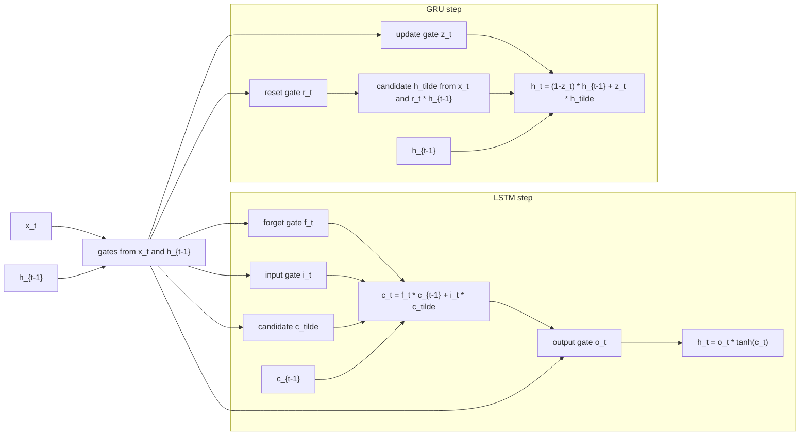

# Gated RNN Architectures

Source: `DL_exam.pdf`, Question 29

Original question:

> Проблемы RNN и gated-архитектуры. Vanishing/exploding gradients, LSTM, GRU, teacher forcing, scheduled sampling.

## Интуиция

Обычная RNN читает последовательность слева направо и на каждом шаге обновляет скрытое состояние $h_t$. Идея красивая: одно и то же правило применяется ко всем позициям, поэтому сеть может обрабатывать последовательности разной длины. Проблема в том, что при обучении через `BPTT` градиент должен пройти через длинную цепочку одинаковых переходов. Если произведение производных по шагам времени имеет нормы меньше 1, дальние сигналы почти исчезают (`vanishing gradients`); если больше 1, градиенты растут взрывно (`exploding gradients`).

`Gated`-архитектуры добавляют управляемые пути памяти. Вместо того чтобы на каждом шаге полностью перезаписывать состояние, модель учится решать: что забыть, что записать, что оставить без изменений и что показать наружу. В LSTM для этого есть отдельная `cell state` $c_t$ и ворота `forget`, `input`, `output`. В GRU устройство проще: отдельной ячейки $c_t$ нет, а память управляется `update` и `reset` gates. Эти механизмы не полностью отменяют проблему длинных зависимостей, но делают путь градиента более прямым и управляемым.

`Teacher forcing` и `scheduled sampling` относятся в основном к autoregressive many-to-many и seq2seq обучению. При `teacher forcing` декодер на шаге $t$ получает правильный предыдущий токен из обучающих данных, а не собственный предсказанный токен. Это стабилизирует и ускоряет обучение, но создает разрыв между train и inference. `Scheduled sampling` постепенно подмешивает собственные предсказания модели во время обучения, чтобы уменьшить этот разрыв.

## Что нужно сказать на экзамене

- Простая RNN:
  $$h_t = \phi(W_x x_t + W_h h_{t-1} + b), \quad y_t = g(W_y h_t).$$
- При `BPTT` градиент к ранним состояниям содержит произведение якобианов:
  $$\frac{\partial L}{\partial h_k} = \sum_{t \ge k} \frac{\partial L_t}{\partial h_t}\prod_{i=k+1}^{t}\frac{\partial h_i}{\partial h_{i-1}}.$$
- Если спектральные нормы якобианов долго меньше 1, возникает `vanishing gradient`; если больше 1, `exploding gradient`.
- `Exploding gradients` обычно лечат `gradient clipping`; `vanishing gradients` требуют архитектурных изменений, например LSTM/GRU, residual-связей, нормализации, хорошей инициализации, более короткого `truncated BPTT`.
- LSTM имеет память $c_t$ и ворота:
  `forget gate` $f_t$, `input gate` $i_t$, кандидат $\tilde c_t$, `output gate` $o_t$.
- Ключевой путь LSTM:
  $$c_t = f_t \odot c_{t-1} + i_t \odot \tilde c_t.$$
  Если $f_t \approx 1$, память и градиент могут проходить через много шагов.
- GRU проще LSTM: использует `update gate` $z_t$ и `reset gate` $r_t$:
  $$h_t = (1 - z_t)\odot h_{t-1} + z_t\odot \tilde h_t.$$
- `Teacher forcing`: на вход декодеру во время обучения подается истинный предыдущий токен $y_{t-1}^{*}$.
- Недостаток `teacher forcing`: `exposure bias`, потому что на inference модель видит свои ошибки, а не всегда правильный контекст.
- `Scheduled sampling`: с некоторой вероятностью подаем истинный предыдущий токен, а с другой вероятностью - токен, предсказанный моделью; вероятность teacher forcing обычно уменьшают по расписанию.

## Подробный ответ

### Обычная RNN и источник проблемы

Для последовательности $x_1,\dots,x_T$ простая RNN поддерживает скрытое состояние:

$$
h_t = \phi(a_t), \quad a_t = W_x x_t + W_h h_{t-1} + b,
$$

где $\phi$ обычно `tanh` или `ReLU`. Одни и те же параметры $W_x, W_h, b$ используются на всех шагах времени, то есть есть `parameter sharing`. Потери могут быть на последнем шаге (`many-to-one`) или на каждом шаге (`many-to-many`):

$$
L = \sum_{t=1}^{T} L_t(y_t, y_t^*).
$$

При `backpropagation through time` рекуррентная сеть разворачивается в вычислительный граф длины $T$. Градиент к раннему состоянию проходит через цепочку переходов:

$$
\frac{\partial h_i}{\partial h_{i-1}}
= \operatorname{diag}(\phi'(a_i)) W_h.
$$

Тогда вклад потери на шаге $t$ в градиент по состоянию $h_k$ содержит произведение:

$$
\frac{\partial L_t}{\partial h_k}
= \frac{\partial L_t}{\partial h_t}
\prod_{i=k+1}^{t}
\frac{\partial h_i}{\partial h_{i-1}}.
$$

По норме это можно оценить как:

$$
\left\|\frac{\partial L_t}{\partial h_k}\right\|
\le
\left\|\frac{\partial L_t}{\partial h_t}\right\|
\prod_{i=k+1}^{t}
\left\|\operatorname{diag}(\phi'(a_i)) W_h\right\|.
$$

Если типичная норма множителя меньше 1, произведение убывает экспоненциально с расстоянием $t-k$: ранние шаги почти не получают обучающего сигнала. Это `vanishing gradients`. Если типичная норма больше 1, произведение растет экспоненциально: обновления становятся нестабильными, появляются `NaN`, резкие скачки loss. Это `exploding gradients`.

Важно: проблема не только в численной оптимизации. Она означает, что простой RNN трудно выучить зависимости вида "сигнал в начале последовательности нужен через сотни шагов", потому что этот сигнал плохо доходит до ранних параметров при обучении.

### Vanishing и exploding gradients

`Vanishing gradients` проявляются так:

- модель хорошо ловит короткие зависимости, но игнорирует дальний контекст;
- hidden state постепенно забывает раннюю информацию;
- увеличение длины `BPTT` не дает ожидаемого улучшения;
- градиенты по ранним шагам и рекуррентным весам очень малы.

`Exploding gradients` проявляются так:

- loss резко возрастает;
- нормы градиентов становятся очень большими;
- параметры делают слишком крупные шаги;
- обучение может стать численно неустойчивым.

Типичные меры:

| Проблема | Что помогает | Ограничение |
|---|---|---|
| `Exploding gradients` | `gradient clipping`, меньший learning rate, нормализация | Не решает исчезновение дальнего сигнала |
| `Vanishing gradients` | LSTM/GRU, residual/skip paths, orthogonal initialization, нормализация, attention | Длинные зависимости все равно могут быть трудны |
| Длинные последовательности | `truncated BPTT`, batching по окнам, attention/Transformer | `truncated BPTT` ограничивает дальность градиента |

`Gradient clipping` часто формулируют как ограничение глобальной нормы:

$$
g \leftarrow g \cdot \min\left(1, \frac{\tau}{\|g\|_2}\right),
$$

где $g$ - вектор всех градиентов, $\tau$ - порог. Если $\|g\|_2 \le \tau$, градиент не меняется; если больше, он масштабируется до нормы $\tau$.

### LSTM

LSTM (`Long Short-Term Memory`) вводит отдельную память $c_t$ и скрытое состояние $h_t$. Память обновляется аддитивно, поэтому у нее есть более прямой путь во времени:

$$
c_t = f_t \odot c_{t-1} + i_t \odot \tilde c_t.
$$

Здесь $f_t$ решает, сколько старой памяти сохранить, $i_t$ - сколько новой информации записать, $\tilde c_t$ - кандидат новой памяти, $o_t$ - что вывести в hidden state.

Стандартные формулы LSTM:

$$
f_t = \sigma(W_f x_t + U_f h_{t-1} + b_f),
$$

$$
i_t = \sigma(W_i x_t + U_i h_{t-1} + b_i),
$$

$$
\tilde c_t = \tanh(W_c x_t + U_c h_{t-1} + b_c),
$$

$$
c_t = f_t \odot c_{t-1} + i_t \odot \tilde c_t,
$$

$$
o_t = \sigma(W_o x_t + U_o h_{t-1} + b_o),
$$

$$
h_t = o_t \odot \tanh(c_t).
$$

Интерпретация ворот:

- `forget gate` $f_t$: какие компоненты $c_{t-1}$ сохранить или забыть;
- `input gate` $i_t$: какие компоненты кандидата $\tilde c_t$ записать;
- `output gate` $o_t$: какую часть памяти показать как $h_t$;
- $\sigma(\cdot)$ дает значения от 0 до 1, поэтому ворота работают как мягкие маски;
- $\odot$ означает покомпонентное умножение.

Главная причина устойчивости LSTM: производная по памяти имеет простой компонент

$$
\frac{\partial c_t}{\partial c_{t-1}} \approx f_t.
$$

Если для нужных координат $f_t$ близко к 1, градиент по $c_t$ может проходить назад без сильного затухания. Если $f_t$ близко к 0, модель намеренно забывает эту часть памяти. Поэтому LSTM не просто "помнит все", а учится управлять временем хранения информации.

Практические детали:

- часто инициализируют bias `forget gate` положительным значением, чтобы в начале обучения модель была склонна сохранять память;
- LSTM имеет больше параметров, чем простая RNN, потому что считает четыре аффинных преобразования;
- LSTM хорошо работает на задачах с долгими зависимостями, но хуже параллелится по времени, чем Transformer, потому что шаг $t$ зависит от $t-1$.

### GRU

GRU (`Gated Recurrent Unit`) упрощает LSTM. В нем нет отдельной `cell state`; состояние $h_t$ одновременно является памятью и выходом. Основные ворота:

- `update gate` $z_t$: насколько заменить старое состояние новым;
- `reset gate` $r_t$: сколько прошлого использовать при построении кандидата.

Стандартные формулы GRU:

$$
z_t = \sigma(W_z x_t + U_z h_{t-1} + b_z),
$$

$$
r_t = \sigma(W_r x_t + U_r h_{t-1} + b_r),
$$

$$
\tilde h_t =
\tanh(W_h x_t + U_h(r_t \odot h_{t-1}) + b_h),
$$

$$
h_t = (1 - z_t)\odot h_{t-1} + z_t\odot \tilde h_t.
$$

Если $z_t \approx 0$, состояние почти копируется: $h_t \approx h_{t-1}$. Если $z_t \approx 1$, состояние заменяется кандидатом: $h_t \approx \tilde h_t$. Это дает аддитивный путь, похожий по смыслу на LSTM:

$$
h_t = \text{copy part} + \text{update part}.
$$

Сравнение LSTM и GRU:

| Свойство | LSTM | GRU |
|---|---|---|
| Состояния | $h_t$ и $c_t$ | только $h_t$ |
| Ворота | forget, input, output | update, reset |
| Параметры | больше | меньше |
| Выразительность | более гибкое разделение памяти и выхода | проще и часто достаточно |
| Практика | хорош для сложных long-term dependencies | быстрее, меньше риск переобучения на малых данных |

Нельзя утверждать, что LSTM всегда лучше GRU или наоборот. Выбор зависит от данных, длины последовательностей, размера датасета и бюджета вычислений.

### Teacher forcing

В autoregressive декодере вероятность последовательности обычно раскладывают так:

$$
p(y_1,\dots,y_T \mid x)
= \prod_{t=1}^{T} p(y_t \mid y_{<t}, x).
$$

При обучении с `teacher forcing` модель на шаге $t$ получает правильный предыдущий токен $y_{t-1}^{*}$:

$$
p_\theta(y_t \mid y_1^*,\dots,y_{t-1}^*, x).
$$

Оптимизируется обычный `cross-entropy` / negative log-likelihood:

$$
L(\theta) = -\sum_{t=1}^{T}\log p_\theta(y_t^* \mid y_{<t}^*, x).
$$

Плюсы:

- обучение стабильнее, потому что входной контекст корректный;
- легче распараллеливать вычисление loss по позициям;
- ошибки модели на ранних шагах не портят все последующие входы во время обучения.

Минусы:

- на inference правильных прошлых токенов нет;
- модель должна условиться на собственные предсказания $\hat y_{t-1}$;
- возникает `exposure bias`: модель обучалась на распределении контекстов из данных, а используется на распределении контекстов, созданных самой моделью.

Пример: если декодер машинного перевода ошибся в одном слове, следующий шаг получает уже ошибочный контекст. При чистом `teacher forcing` модель могла почти не видеть таких ситуаций во время обучения.

### Scheduled sampling

`Scheduled sampling` пытается уменьшить разрыв между обучением и inference. На каждом шаге декодеру выбирают предыдущий вход:

$$
\bar y_{t-1} =
\begin{cases}
y_{t-1}^{*}, & \text{с вероятностью } \epsilon_t, \\
\hat y_{t-1}, & \text{с вероятностью } 1-\epsilon_t.
\end{cases}
$$

Здесь $\epsilon_t$ - вероятность использовать `teacher forcing`. В начале обучения $\epsilon_t$ обычно близка к 1, затем ее уменьшают: линейно, экспоненциально или по inverse sigmoid schedule. Цель - сначала дать модели устойчивое обучение, а потом научить ее восстанавливаться после собственных ошибок.

Важно понимать компромисс. Если слишком рано подавать собственные предсказания, модель получает шумный контекст и обучение ухудшается. Если всегда подавать правильные токены, сохраняется `exposure bias`. Кроме того, scheduled sampling не является идеальным статистическим решением: выбор дискретных предсказанных токенов может вносить смещение в обучающий objective. Но как практическая эвристика он часто полезен для seq2seq/RNN-декодеров.

## Формулы / алгоритмы

### BPTT и градиенты

Для простой RNN:

$$
h_t = \phi(W_x x_t + W_h h_{t-1} + b).
$$

Якобиан перехода:

$$
J_t = \frac{\partial h_t}{\partial h_{t-1}}
= \operatorname{diag}(\phi'(a_t)) W_h.
$$

Градиент через много шагов:

$$
\frac{\partial L_t}{\partial h_k}
=
\frac{\partial L_t}{\partial h_t}
J_t J_{t-1}\dots J_{k+1}.
$$

Если $\|J_i\| \approx \rho < 1$, то $\|J_t\dots J_{k+1}\| \approx \rho^{t-k}$ и градиент исчезает. Если $\rho > 1$, он может взрываться.

### LSTM pipeline

Входы: $x_t$, прошлые состояния $h_{t-1}, c_{t-1}$.

Выходы: новые состояния $h_t, c_t$.

Шаги:

1. Посчитать $f_t$, чтобы выбрать, какую память сохранить.
2. Посчитать $i_t$ и кандидата $\tilde c_t$, чтобы выбрать, что записать.
3. Обновить память: $c_t = f_t \odot c_{t-1} + i_t \odot \tilde c_t$.
4. Посчитать $o_t$, чтобы выбрать видимую часть памяти.
5. Выдать $h_t = o_t \odot \tanh(c_t)$.

Сложность одного шага: $O(d_h d_x + d_h^2)$ на каждое из четырех преобразований, где $d_x$ - размер входа, $d_h$ - размер hidden state. По времени последовательность остается последовательной: нельзя полностью параллелить шаги $t$ без изменения модели.

### GRU pipeline

Входы: $x_t$, прошлое состояние $h_{t-1}$.

Выход: $h_t$.

Шаги:

1. Посчитать `update gate` $z_t$.
2. Посчитать `reset gate` $r_t$.
3. Построить кандидата $\tilde h_t$ из $x_t$ и сброшенной версии прошлого $r_t \odot h_{t-1}$.
4. Смешать старое состояние и кандидата:
   $$h_t = (1 - z_t)\odot h_{t-1} + z_t\odot \tilde h_t.$$

GRU обычно дешевле LSTM, потому что использует три основных преобразования вместо четырех и не хранит отдельную $c_t$.

### Training autoregressive decoder

Objective:

$$
L(\theta) = -\sum_{t=1}^{T}\log p_\theta(y_t^* \mid \bar y_{<t}, x),
$$

где $\bar y_{<t}$ зависит от режима обучения.

Алгоритм `teacher forcing`:

1. Подать в декодер стартовый токен `<bos>`.
2. На каждом шаге $t$ предсказывать распределение $p_\theta(y_t \mid y_{<t}^*, x)$.
3. Считать loss по правильному токену $y_t^*$.
4. Следующим входом подавать $y_t^*$ независимо от ошибки модели.

Алгоритм `scheduled sampling`:

1. Выбрать расписание $\epsilon_t$ или $\epsilon_e$ по эпохам.
2. На шаге $t$ с вероятностью $\epsilon$ подать правильный токен $y_{t-1}^*$.
3. С вероятностью $1-\epsilon$ подать предсказанный токен $\hat y_{t-1}$, например `argmax` или sampled token.
4. Считать loss по правильному $y_t^*$.
5. Постепенно уменьшать $\epsilon$, чтобы обучение становилось ближе к inference.

Практические caveats:

- для `exploding gradients` почти всегда проверяют `gradient norm` и применяют clipping;
- для LSTM/GRU важно следить за длиной `BPTT`, masking padding tokens и корректным hidden state между батчами;
- в seq2seq надо различать train-time входы декодера и inference-time autoregressive generation;
- scheduled sampling может ухудшить обучение, если расписание слишком агрессивное.

## Диаграмма или изображение

Диаграмма встроенная, внешние изображения и local assets не использовались.

## Быстрая устная версия

Обычная RNN обучается через `BPTT`, и градиент к ранним шагам содержит произведение якобианов переходов по времени. Поэтому при нормах меньше единицы градиент экспоненциально исчезает, а при нормах больше единицы взрывается. `Exploding gradients` обычно лечатся `gradient clipping`, но `vanishing gradients` требуют архитектур, где есть более прямой путь памяти.

LSTM решает это через `cell state` $c_t$ и ворота: `forget`, `input`, `output`. Главное обновление: $c_t = f_t \odot c_{t-1} + i_t \odot \tilde c_t$. Если $f_t$ близко к 1, память и градиент могут проходить через много шагов. GRU проще: нет отдельной $c_t$, есть `update gate` и `reset gate`, а новое состояние смешивает старое и кандидата: $h_t = (1-z_t)\odot h_{t-1}+z_t\odot\tilde h_t$.

В seq2seq `teacher forcing` означает, что во время обучения декодеру дают правильный предыдущий токен. Это стабильно, но создает `exposure bias`, потому что на inference модель получает свои предсказания. `Scheduled sampling` постепенно заменяет часть правильных предыдущих токенов на предсказанные моделью, чтобы приблизить обучение к inference.

## Возможные уточняющие вопросы

- Почему именно произведение матриц вызывает vanishing/exploding gradients?
  - Потому что при `BPTT` градиент проходит через цепочку переходов $h_{i-1}\to h_i$; нормы или собственные значения этих якобианов многократно перемножаются.

- Почему LSTM лучше сохраняет дальнюю информацию?
  - В LSTM память $c_t$ обновляется аддитивно, а не только через нелинейное преобразование. Компонента $f_t \odot c_{t-1}$ создает почти прямой путь для памяти и градиента.

- Зачем нужен `forget gate`?
  - Он управляет тем, какие координаты старой памяти сохранить. Без забывания память могла бы накапливать устаревшую или шумную информацию.

- Чем GRU отличается от LSTM?
  - GRU не имеет отдельной `cell state`, использует меньше ворот и параметров. `Update gate` управляет копированием/обновлением состояния, `reset gate` управляет использованием прошлого при построении кандидата.

- Что такое `exposure bias`?
  - Несовпадение train и inference: при обучении модель видит правильные прошлые токены, а при генерации - собственные предсказания, включая ошибки.

- Почему scheduled sampling не всегда улучшает качество?
  - Предсказанные токены в начале обучения шумные; кроме того, дискретное подмешивание собственных предсказаний меняет обучающий objective и может вносить смещение.

- Что делать с exploding gradients в RNN на практике?
  - Использовать `gradient clipping`, уменьшить learning rate, проверить нормализацию, инициализацию, длину `BPTT` и численную стабильность loss.

- Решают ли LSTM/GRU проблему long-range dependencies полностью?
  - Нет. Они сильно улучшают обучение по сравнению с простой RNN, но очень длинные зависимости все равно трудны; поэтому для многих задач позже стали использовать attention и Transformer.

## Частые ошибки

- Говорить, что LSTM "устраняет" vanishing gradients полностью. Правильнее: LSTM уменьшает проблему за счет управляемого аддитивного пути памяти.
- Путать hidden state $h_t$ и cell state $c_t$ в LSTM. $c_t$ - внутренняя память, $h_t$ - видимый выход шага.
- Забывать `output gate` в LSTM и считать, что $h_t$ всегда равен $c_t$.
- Путать смысл GRU gates: `update gate` отвечает за смешивание старого состояния и кандидата, `reset gate` влияет на построение кандидата.
- Считать `gradient clipping` решением vanishing gradients. Оно ограничивает большие градиенты, но не усиливает исчезающие.
- Описывать `teacher forcing` как метод регуляризации. Это режим подачи входов декодеру при обучении autoregressive модели.
- Не упоминать `exposure bias` при обсуждении teacher forcing.
- Считать scheduled sampling обязательным и всегда полезным. Это эвристика с компромиссом между стабильностью обучения и близостью к inference.
- Использовать не-Obsidian delimiters для формул вместо `$...$`.
