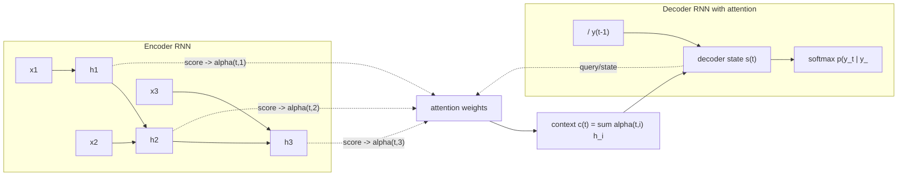

# Seq2Seq and Pre-Transformer Attention

Source: `DL_exam.pdf`, Question 30

Original question:

> Seq2seq и attention до трансформеров. Encoder-decoder, bottleneck одного вектора, attention для машинного перевода.

## Интуиция

`Seq2seq` решает задачи, где вход и выход являются последовательностями разной длины: машинный перевод, summarization, диалог, распознавание речи в текст. До трансформеров типичная архитектура была `encoder-decoder` на RNN/LSTM/GRU: encoder читает исходную фразу и сжимает ее в скрытое состояние, decoder по этому состоянию генерирует выходные токены один за другим.

Главная проблема раннего `encoder-decoder` в том, что вся информация о входе должна пройти через один вектор фиксированной размерности. Для длинных предложений это становится `bottleneck`: теряются детали, ухудшается перевод дальних слов, decoder не знает, на какую часть исходной фразы смотреть в текущий момент.

`Attention` до трансформеров был добавлен как динамическая память над состояниями encoder. Вместо одного вектора decoder на каждом шаге вычисляет веса важности по всем позициям входа и берет взвешенную сумму encoder states. Поэтому при генерации каждого слова модель может "сфокусироваться" на релевантных словах исходного предложения. Это резко улучшило neural machine translation и подготовило идею внимания, но еще не заменяло RNN полностью.

## Что нужно сказать на экзамене

- `Seq2seq`: модель условного распределения $p(y_{1:T_y} \mid x_{1:T_x})$ для отображения одной последовательности в другую.
- Классический `encoder-decoder`: encoder RNN читает $x_1,\dots,x_{T_x}$, decoder RNN генерирует $y_1,\dots,y_{T_y}$ autoregressive.
- Без attention весь вход кодируется одним вектором $c$, обычно последним hidden state encoder: $c=h_{T_x}$.
- Вероятность выхода факторизуется как:

$$
p(y_{1:T_y}\mid x_{1:T_x})=\prod_{t=1}^{T_y}p(y_t\mid y_{<t}, x_{1:T_x}).
$$

- В простом `encoder-decoder` decoder использует $c$ на каждом шаге:

$$
s_t=f_{\text{dec}}(s_{t-1}, E_y(y_{t-1}), c).
$$

- `Bottleneck одного вектора`: фиксированный $c$ плохо хранит длинный вход, порядок, редкие слова и alignment между входом и выходом.
- Attention хранит все encoder states $h_1,\dots,h_{T_x}$ и на каждом шаге decoder вычисляет:

$$
e_{t,i}=\operatorname{score}(s_{t-1}, h_i),\quad
\alpha_{t,i}=\operatorname{softmax}_i(e_{t,i}),\quad
c_t=\sum_i \alpha_{t,i}h_i.
$$

- $c_t$ зависит от шага $t$, поэтому это не один общий bottleneck, а динамический context vector.
- Для машинного перевода attention можно интерпретировать как soft alignment: какие исходные слова важны для текущего целевого слова.
- Отличие от Transformer attention: pre-transformer attention обычно работает поверх RNN encoder/decoder; Transformer делает attention основным механизмом обработки последовательности и отказывается от recurrent state.

## Подробный ответ

### Задача seq2seq

Пусть входная последовательность $x=(x_1,\dots,x_{T_x})$, выходная последовательность $y=(y_1,\dots,y_{T_y})$. Длины $T_x$ и $T_y$ могут быть разными. В машинном переводе $x$ - предложение на исходном языке, $y$ - перевод.

Модель учит условное распределение:

$$
p_\theta(y\mid x)=\prod_{t=1}^{T_y}p_\theta(y_t\mid y_1,\dots,y_{t-1},x).
$$

Так как выход генерируется слева направо, decoder является autoregressive: предсказание текущего токена зависит от уже сгенерированных или известных предыдущих токенов.

### Encoder-decoder без attention

В классической схеме encoder - это RNN, LSTM или GRU:

$$
h_i=f_{\text{enc}}(h_{i-1}, E_x(x_i)).
$$

После чтения всей входной фразы берется один context vector:

$$
c=h_{T_x}.
$$

Decoder инициализируется этим вектором или получает его как дополнительный вход:

$$
s_0=g(c),
$$

$$
s_t=f_{\text{dec}}(s_{t-1}, E_y(y_{t-1}), c),
$$

$$
p(y_t\mid y_{<t},x)=\operatorname{softmax}(W_o s_t+b_o).
$$

На обучении обычно используют `teacher forcing`: в decoder подают настоящий предыдущий токен $y_{t-1}$, а не токен, который модель сама сгенерировала. Целевая функция - минимизация negative log-likelihood:

$$
\mathcal{L}(\theta)=-\sum_{t=1}^{T_y}\log p_\theta(y_t^\ast\mid y_{<t}^\ast,x).
$$

На inference настоящих будущих токенов нет, поэтому модель начинает с `<bos>`, затем генерирует следующий токен, подает его обратно в decoder и продолжает до `<eos>` или лимита длины. Для поиска используют greedy decoding или beam search.

### Bottleneck одного вектора

Один вектор $c$ фиксированной размерности должен одновременно хранить:

- все слова исходной фразы;
- порядок слов и синтаксис;
- значения редких или числовых токенов;
- информацию о том, какие входные позиции соответствуют будущим выходным словам.

Это особенно плохо для длинных предложений: ранние hidden states могут быть забыты, gradient при обучении проходит через длинную цепочку RNN, а decoder не получает явного механизма выбора нужной позиции входа. Поэтому качество перевода часто падает с ростом длины входа.

### Attention до трансформеров

Идея attention: не сжимать вход только в $h_{T_x}$, а оставить всю последовательность encoder states:

$$
H=(h_1,\dots,h_{T_x}).
$$

На каждом шаге $t$ decoder сравнивает свое предыдущее состояние $s_{t-1}$ с каждым encoder state $h_i$ и получает score:

$$
e_{t,i}=\operatorname{score}(s_{t-1},h_i).
$$

Затем scores нормируются softmax по входным позициям:

$$
\alpha_{t,i}=\frac{\exp(e_{t,i})}{\sum_{j=1}^{T_x}\exp(e_{t,j})}.
$$

Веса $\alpha_{t,i}$ неотрицательны и суммируются в 1, поэтому их можно читать как soft alignment: насколько входная позиция $i$ важна для генерации токена $y_t$.

Context vector для текущего шага:

$$
c_t=\sum_{i=1}^{T_x}\alpha_{t,i}h_i.
$$

Дальше decoder использует $c_t$ при обновлении состояния или при вычислении logits:

$$
s_t=f_{\text{dec}}(s_{t-1},E_y(y_{t-1}),c_t),
$$

$$
p(y_t\mid y_{<t},x)=\operatorname{softmax}(W_o [s_t;c_t]+b_o).
$$

Практически часто применялся bidirectional encoder: прямой RNN читает предложение слева направо, обратный - справа налево, а состояние позиции задается как $h_i=[\overrightarrow{h_i};\overleftarrow{h_i}]$. Это дает attention доступ к левому и правому контексту каждого исходного слова.

### Варианты score function

| Вариант | Формула | Комментарий |
|---|---|---|
| Dot | $e_{t,i}=s_{t-1}^\top h_i$ | Просто, требует одинаковых размерностей. |
| General / multiplicative | $e_{t,i}=s_{t-1}^\top W_a h_i$ | Есть обучаемая матрица совместимости. |
| Additive / Bahdanau | $e_{t,i}=v_a^\top \tanh(W_s s_{t-1}+W_h h_i)$ | Гибкая MLP-совместимость, классический вариант для NMT. |

Термины `Bahdanau attention` и `additive attention` обычно связывают с ранним neural machine translation. `Luong attention` часто описывает multiplicative/dot варианты и разные способы подключения context vector к decoder.

### Почему attention помогает машинному переводу

В переводе порядок и длина предложений могут сильно отличаться. Одно слово исходного языка может соответствовать нескольким словам целевого языка, и наоборот. Attention дает decoder явный механизм alignment:

- при генерации существительного можно смотреть на исходное существительное;
- при генерации окончания или согласования можно учитывать соседние слова;
- при длинном предложении не нужно хранить все детали в последнем hidden state;
- веса attention можно визуализировать как матрицу $T_y \times T_x$.

Важно: attention не гарантирует идеальное дискретное выравнивание. Это дифференцируемое soft-распределение, обучаемое через loss перевода без явной разметки alignment.

### Ограничения pre-transformer seq2seq attention

Хотя attention снимает bottleneck одного вектора, RNN-часть остается последовательной:

- encoder и decoder плохо параллелятся по времени;
- длинные зависимости все еще сложны из-за recurrent dynamics;
- inference autoregressive и медленный: токены генерируются последовательно;
- сложность attention на один пример порядка $O(T_xT_yd)$ для сравнения каждого decoder step со всеми encoder states.

Transformer позже заменил recurrent encoder/decoder на `self-attention`, где связи между позициями строятся напрямую и хорошо параллелятся на GPU.

## Формулы / алгоритмы

### Обучение seq2seq с attention

**Objective:** максимизировать likelihood правильного перевода или минимизировать cross-entropy.

**Inputs:** исходные токены $x_{1:T_x}$, целевые токены $y^\ast_{1:T_y}$, параметры encoder, decoder, attention и output layer.

**Output:** обученные параметры $\theta$.

1. Преобразовать входные токены в embeddings $E_x(x_i)$.
2. Прогнать encoder и получить states $h_1,\dots,h_{T_x}$.
3. Инициализировать decoder state $s_0$.
4. Для каждого шага $t=1,\dots,T_y$:
   - подать в decoder предыдущий правильный токен $y^\ast_{t-1}$ (`teacher forcing`);
   - вычислить scores $e_{t,i}=\operatorname{score}(s_{t-1},h_i)$;
   - получить attention weights $\alpha_{t,i}=\operatorname{softmax}_i(e_{t,i})$;
   - вычислить context $c_t=\sum_i\alpha_{t,i}h_i$;
   - обновить decoder state $s_t$;
   - получить распределение $p_\theta(y_t\mid y^\ast_{<t},x)$.
5. Посчитать loss:

$$
\mathcal{L}(\theta)=-\sum_{t=1}^{T_y}\log p_\theta(y_t^\ast\mid y^\ast_{<t},x).
$$

6. Обновить параметры через `backpropagation through time` и optimizer, например SGD/Adam.

**Практические caveats:** используют padding masks, чтобы attention не смотрел на `<pad>`; gradient clipping для RNN; dropout; beam search на inference; иногда scheduled sampling для уменьшения разрыва между training и inference.

### Inference

1. Encoder читает $x_{1:T_x}$ и сохраняет $h_1,\dots,h_{T_x}$.
2. Decoder стартует с `<bos>`.
3. На каждом шаге вычисляются attention weights, context vector и распределение следующего токена.
4. Выбирается токен greedy или через beam search.
5. Генерация заканчивается при `<eos>` или достижении максимальной длины.

## Диаграмма или изображение

Диаграмма показывает pre-transformer attention: encoder остается recurrent, decoder тоже recurrent, а attention на каждом шаге decoder выбирает релевантные encoder states.

## Быстрая устная версия

`Seq2seq` - это encoder-decoder модель для преобразования последовательности в последовательность, например для машинного перевода. Encoder RNN читает исходное предложение и в простом варианте сжимает его в один вектор $c=h_{T_x}$, а decoder RNN autoregressive генерирует перевод по одному токену. Проблема в том, что один фиксированный вектор становится bottleneck, особенно для длинных предложений.

Attention решает это тем, что decoder на каждом шаге смотрит не только на последний encoder state, а на все $h_i$. Он считает scores между своим состоянием и каждым $h_i$, нормирует их через softmax в веса $\alpha_{t,i}$ и строит context $c_t=\sum_i\alpha_{t,i}h_i$. В машинном переводе это работает как soft alignment между текущим целевым словом и словами исходной фразы. До трансформеров attention был добавкой к RNN encoder-decoder, а не полной заменой recurrent обработки.

## Возможные уточняющие вопросы

- **Почему seq2seq нужен для перевода, а не обычная many-to-many RNN?** Потому что длины входа и выхода различаются, а выходная последовательность должна зависеть от всего входного предложения.
- **Что такое bottleneck одного вектора?** Это ограничение, при котором весь вход кодируется в один fixed-size vector $c$, из-за чего длинные и сложные предложения плохо сохраняются.
- **Что означают attention weights?** Это soft-распределение по позициям входа, показывающее, какие encoder states важны для текущего шага decoder.
- **Чем additive attention отличается от dot attention?** Dot attention использует скалярное произведение, а additive attention обучает MLP-совместимость $v_a^\top\tanh(W_s s+W_h h_i)$.
- **Зачем bidirectional encoder?** Он дает каждому $h_i$ контекст слева и справа, что полезно для перевода и alignment.
- **Что такое teacher forcing?** На обучении decoder получает настоящий предыдущий токен, что стабилизирует обучение, но создает mismatch с inference.
- **Почему inference медленный?** Decoder autoregressive: следующий токен нельзя полностью вычислить до выбора предыдущего.
- **Чем pre-transformer attention отличается от self-attention в Transformer?** Здесь attention выбирает encoder states для RNN decoder, а в Transformer attention является основным механизмом взаимодействия позиций внутри encoder/decoder без RNN.

## Частые ошибки

- Говорить, что attention полностью убирает autoregressive генерацию. Нет: decoder все еще генерирует токены последовательно.
- Путать context vector без attention $c=h_{T_x}$ и context vector с attention $c_t$, который меняется на каждом decoder step.
- Называть attention weights жестким alignment. Обычно это soft alignment, обучаемый через translation loss.
- Забывать softmax по входным позициям $i$, а не по словарю. Softmax по словарю применяется позже для $p(y_t)$.
- Считать, что attention до трансформеров уже является Transformer. В классическом NMT attention встроен в RNN/LSTM/GRU encoder-decoder.
- Не упоминать `teacher forcing` и разницу между training и inference.
- Игнорировать padding mask: без нее модель может распределять attention на `<pad>` токены.
- Утверждать, что один вектор всегда бесполезен. Для коротких последовательностей простой encoder-decoder может работать, но масштабируется хуже на длинные входы.
