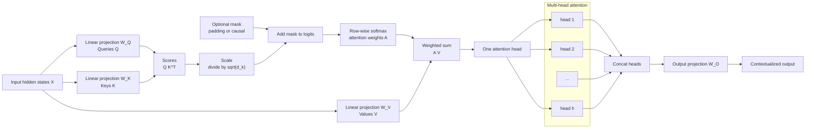

# Attention Mechanism

Source: `DL_exam.pdf`, Question 32

Original question:

> Механизм внимания. Query, Key, Value, scaled dot-product attention, multi-head attention.

## Интуиция

`Attention` -- это дифференцируемый механизм выбора информации из набора векторов. Вместо того чтобы заранее сжимать всю последовательность в один hidden state, модель для каждой позиции спрашивает: "какие другие позиции сейчас важны?" Ответ получается через веса внимания, а итоговый вектор является взвешенной суммой содержимого этих позиций.

Роли `Query`, `Key`, `Value` удобно понимать как поиск в памяти. `Query` -- запрос текущей позиции: что я ищу. `Key` -- адрес или описание каждой доступной позиции: по чему искать. `Value` -- содержимое, которое нужно извлечь, если позиция оказалась релевантной. Сначала `Query` сравнивается с `Keys`, затем similarity превращается в вероятности через `softmax`, потом эти вероятности усредняют `Values`.

`Scaled dot-product attention` использует скалярное произведение как меру совместимости. Деление на $\sqrt{d_k}$ нужно, чтобы logits не становились слишком большими при большой размерности ключей: иначе `softmax` насыщается, веса становятся почти one-hot, а градиенты ухудшаются.

`Multi-head attention` запускает несколько attention-механизмов параллельно в разных обучаемых подпространствах. Один head может смотреть на локальный контекст, другой -- на дальнюю зависимость, третий -- на синтаксическую или семантическую связь. Затем результаты head'ов конкатенируются и смешиваются линейным слоем.

## Что нужно сказать на экзамене

- `Attention` строит для каждого запроса взвешенную сумму `Value`-векторов, где веса зависят от совместимости `Query` и `Key`.
- Для матриц $Q \in \mathbb{R}^{n_q \times d_k}$, $K \in \mathbb{R}^{n_k \times d_k}$, $V \in \mathbb{R}^{n_k \times d_v}$:

$$
\operatorname{Attention}(Q,K,V)
= \operatorname{softmax}\left(\frac{QK^\top}{\sqrt{d_k}}\right)V.
$$

- В строках $QK^\top$ находятся queries, в столбцах -- keys. `Softmax` применяется по ключам, то есть по каждой строке.
- С маской:

$$
A = \operatorname{softmax}\left(\frac{QK^\top}{\sqrt{d_k}} + M\right),
\quad O = AV,
$$

где $M_{ij}=0$ для разрешенных связей и большое отрицательное число для запрещенных.

- `Padding mask` запрещает смотреть на `<pad>`. `Causal mask` запрещает смотреть в будущие токены при autoregressive generation.
- В `self-attention` $Q$, $K$, $V$ получаются из одной последовательности $X$: $Q=XW_Q$, $K=XW_K$, $V=XW_V$.
- В `cross-attention` queries обычно идут из decoder states, а keys и values -- из encoder outputs.
- `Multi-head attention`:

$$
\operatorname{head}_i
= \operatorname{Attention}(QW_i^Q, KW_i^K, VW_i^V),
$$

$$
\operatorname{MHA}(Q,K,V)
= \operatorname{Concat}(\operatorname{head}_1,\dots,\operatorname{head}_h)W^O.
$$

- Обычно $d_k=d_v=d_{\text{model}}/h$, чтобы после конкатенации получить размерность $d_{\text{model}}$.
- Сложность self-attention по длине $n$: время примерно $O(n^2 d_{\text{model}})$, память для attention matrix $O(n^2)$.
- Attention сам по себе не знает порядок токенов, поэтому Transformer добавляет positional encoding или positional embeddings.
- Веса attention не всегда являются надежным объяснением решения модели: это полезная диагностика, но не строгая интерпретация причинности.

## Подробный ответ

### Query, Key, Value

Пусть есть набор векторов-представлений. В Transformer это обычно hidden states токенов. Attention превращает их в три типа векторов:

- `Query` $q_i$ -- запрос позиции $i$;
- `Key` $k_j$ -- вектор, с которым сравнивается запрос;
- `Value` $v_j$ -- информация, которая будет добавлена в результат, если позиция $j$ важна для запроса.

Для одного query $q_i$ scores по всем ключам:

$$
s_{ij} = q_i^\top k_j.
$$

После нормировки:

$$
\alpha_{ij}
= \frac{\exp(s_{ij}/\sqrt{d_k})}
{\sum_{j'=1}^{n_k}\exp(s_{ij'}/\sqrt{d_k})}.
$$

Выход для query $i$:

$$
o_i = \sum_{j=1}^{n_k}\alpha_{ij}v_j.
$$

Если используется `softmax`, веса $\alpha_{ij}$ неотрицательны и суммируются в 1 по $j$. Поэтому $o_i$ является взвешенным средним `Value`-векторов. Важно: сам выходной вектор не является вероятностью, потому что компоненты $v_j$ могут быть любыми вещественными числами.

### Матричная форма scaled dot-product attention

Для всех queries сразу:

$$
Q =
\begin{bmatrix}
q_1^\top \\
\dots \\
q_{n_q}^\top
\end{bmatrix},
\quad
K =
\begin{bmatrix}
k_1^\top \\
\dots \\
k_{n_k}^\top
\end{bmatrix},
\quad
V =
\begin{bmatrix}
v_1^\top \\
\dots \\
v_{n_k}^\top
\end{bmatrix}.
$$

Размерности:

$$
Q \in \mathbb{R}^{n_q \times d_k}, \quad
K \in \mathbb{R}^{n_k \times d_k}, \quad
V \in \mathbb{R}^{n_k \times d_v}.
$$

Тогда:

$$
S = \frac{QK^\top}{\sqrt{d_k}}
\in \mathbb{R}^{n_q \times n_k},
$$

$$
A = \operatorname{softmax}_{\text{row}}(S)
\in \mathbb{R}^{n_q \times n_k},
$$

$$
O = AV \in \mathbb{R}^{n_q \times d_v}.
$$

Матрица $A$ содержит attention weights. Строка $i$ показывает, на какие key/value позиции смотрит query $i$.

### Зачем нужно деление на $\sqrt{d_k}$

Предположим для интуиции, что компоненты $q$ и $k$ независимы, имеют среднее 0 и дисперсию 1. Тогда скалярное произведение:

$$
q^\top k = \sum_{\ell=1}^{d_k} q_\ell k_\ell
$$

имеет дисперсию порядка $d_k$. При большой $d_k$ значения logits становятся большими по модулю. `Softmax` на больших logits насыщается: одна позиция получает почти весь вес, остальные почти ноль. Это ухудшает обучение, потому что градиенты через `softmax` становятся менее информативными.

Деление на $\sqrt{d_k}$ нормирует масштаб:

$$
\operatorname{Var}\left(\frac{q^\top k}{\sqrt{d_k}}\right) \approx 1.
$$

Поэтому scaled dot-product attention стабильнее обычного dot-product attention при больших размерностях.

### Маски в attention

Маска добавляется к logits до `softmax`:

$$
A = \operatorname{softmax}\left(\frac{QK^\top}{\sqrt{d_k}} + M\right).
$$

Типично:

$$
M_{ij} =
\begin{cases}
0, & \text{если query } i \text{ может смотреть на key } j, \\
-\infty, & \text{если связь запрещена.}
\end{cases}
$$

На практике вместо $-\infty$ используют большое отрицательное число, например $-10^9$, чтобы после `softmax` вес стал практически нулевым.

Основные виды масок:

| Маска | Где используется | Что запрещает |
|---|---|---|
| `Padding mask` | Encoder, decoder, cross-attention | Смотреть на `<pad>` токены |
| `Causal mask` / `look-ahead mask` | Autoregressive decoder | Смотреть на будущие позиции $j>i$ |
| Combined mask | Decoder self-attention | И `<pad>`, и будущие токены |

Без causal mask языковая модель при обучении могла бы видеть правильные будущие токены, что разрушает autoregressive постановку.

### Self-attention и cross-attention

В `self-attention` одна и та же последовательность является источником queries, keys и values. Для входа $X \in \mathbb{R}^{n \times d_{\text{model}}}$:

$$
Q=XW_Q,\quad K=XW_K,\quad V=XW_V.
$$

Каждый токен получает новое представление как смесь представлений других токенов этой же последовательности. Если нет маски, каждый токен может смотреть на все токены. Если есть causal mask, токен может смотреть только на себя и прошлые токены.

В `cross-attention` источники различаются. Например, в encoder-decoder Transformer:

$$
Q = YW_Q,\quad K = X_{\text{enc}}W_K,\quad V = X_{\text{enc}}W_V,
$$

где $Y$ -- состояния decoder, а $X_{\text{enc}}$ -- выход encoder. Так decoder выбирает релевантные части входной последовательности.

### Multi-head attention

Один attention head вычисляет один набор similarities и одну матрицу весов. Это ограничивает модель: все связи должны быть выражены в одном подпространстве. `Multi-head attention` использует $h$ независимых проекций:

$$
Q_i = QW_i^Q,\quad K_i = KW_i^K,\quad V_i = VW_i^V.
$$

Для каждого head:

$$
\operatorname{head}_i
= \operatorname{Attention}(Q_i,K_i,V_i).
$$

Затем:

$$
\operatorname{MHA}(Q,K,V)
= \operatorname{Concat}(\operatorname{head}_1,\dots,\operatorname{head}_h)W^O.
$$

Если $Q,K,V$ имеют модельную размерность $d_{\text{model}}$, часто выбирают:

$$
d_k=d_v=\frac{d_{\text{model}}}{h}.
$$

Тогда каждый head дешевле, а конкатенация $h$ head'ов снова имеет размерность $d_{\text{model}}$. Финальная матрица $W^O$ смешивает информацию между head'ами.

Почему несколько head'ов полезны:

- разные head'ы могут фокусироваться на разных типах связей;
- часть head'ов может быть локальной, часть -- глобальной;
- модель может одновременно учитывать несколько релевантных позиций;
- разные обучаемые проекции позволяют сравнивать токены по разным признакам.

При этом нельзя считать, что каждый head обязательно получает легко интерпретируемую лингвистическую роль. В реальных моделях head'ы могут быть избыточными, коррелированными или специализированными только частично.

### Свойства и ограничения

`Attention` хорошо передает дальние зависимости: путь между двумя позициями в self-attention имеет длину один слой, а не $O(n)$ шагов, как в RNN. Кроме того, вычисления для всех позиций хорошо параллелятся на GPU.

Главное ограничение -- квадратичная сложность по длине последовательности. Для self-attention при $n_q=n_k=n$ нужно хранить и обрабатывать матрицу $n \times n$. Поэтому длинные контексты требуют много памяти и вычислений.

Еще одно важное свойство: без positional information self-attention перестановочно-эквивариантен. Если одинаково переставить входные токены, выходы переставятся так же, но модель сама не узнает, какой токен был первым, вторым и так далее. Поэтому Transformer добавляет positional encoding, learned positional embeddings или относительные позиционные смещения.

## Формулы / алгоритмы

### Scaled dot-product attention

**Objective:** для каждого query получить контекстный вектор как взвешенную сумму values.

**Inputs:**

- $Q \in \mathbb{R}^{n_q \times d_k}$ -- queries;
- $K \in \mathbb{R}^{n_k \times d_k}$ -- keys;
- $V \in \mathbb{R}^{n_k \times d_v}$ -- values;
- optional mask $M \in \mathbb{R}^{n_q \times n_k}$.

**Output:** $O \in \mathbb{R}^{n_q \times d_v}$.

1. Вычислить score matrix:

$$
S = QK^\top.
$$

2. Нормировать масштаб:

$$
\tilde{S} = \frac{S}{\sqrt{d_k}}.
$$

3. Если нужна маска, добавить ее до `softmax`:

$$
\tilde{S} \leftarrow \tilde{S} + M.
$$

4. Применить `softmax` по измерению keys:

$$
A_{ij} =
\frac{\exp(\tilde{S}_{ij})}
{\sum_{j'=1}^{n_k}\exp(\tilde{S}_{ij'})}.
$$

5. Получить выход:

$$
O = AV.
$$

**Complexity:** для self-attention с длиной $n$ и модельной размерностью $d_{\text{model}}$ время порядка $O(n^2d_{\text{model}})$, память для attention weights $O(n^2)$.

### Multi-head attention

**Inputs:** $Q,K,V$ в модельной размерности $d_{\text{model}}$, число head'ов $h$.

1. Для каждого head $i=1,\dots,h$ спроецировать:

$$
Q_i=QW_i^Q,\quad K_i=KW_i^K,\quad V_i=VW_i^V.
$$

2. Посчитать attention независимо:

$$
H_i=\operatorname{Attention}(Q_i,K_i,V_i).
$$

3. Склеить результаты:

$$
H=\operatorname{Concat}(H_1,\dots,H_h).
$$

4. Применить выходную проекцию:

$$
O=HW^O.
$$

**Практические caveats:**

- $d_{\text{model}}$ обычно должен делиться на $h$.
- Слишком много head'ов при фиксированном $d_{\text{model}}$ уменьшает размерность каждого head и может ослабить отдельные head'ы.
- Attention logits считают до `softmax`; dropout часто применяют к attention weights или к выходу attention.
- Маски должны иметь корректную broadcast-форму по batch и head dimensions.

## Диаграмма или изображение

Внешние изображения не использовались.

## Быстрая устная версия

Attention -- это механизм, который для каждого токена строит контекстное представление как взвешенную сумму других токенов. `Query` текущей позиции сравнивается с `Keys` всех доступных позиций, scores нормируются через `softmax`, и полученные веса применяются к `Values`.

Главная формула:

$$
\operatorname{Attention}(Q,K,V)
= \operatorname{softmax}\left(\frac{QK^\top}{\sqrt{d_k}}\right)V.
$$

Деление на $\sqrt{d_k}$ стабилизирует масштаб dot-product logits. Маски запрещают смотреть на padding или будущие токены. `Multi-head attention` делает несколько таких attention в разных обучаемых подпространствах, конкатенирует результаты и применяет выходную проекцию. В self-attention $Q,K,V$ получаются из одной последовательности; в cross-attention queries идут из одной последовательности, а keys и values -- из другой.

## Возможные уточняющие вопросы

**Почему в attention нужны именно три сущности: Query, Key, Value?**  
`Query` задает, что ищет текущая позиция; `Key` используется для вычисления релевантности; `Value` содержит информацию, которая будет передана в выход. Key и Value могут быть получены из одного токена, но играют разные роли.

**По какой оси применяется softmax?**  
По оси keys для каждого query. Каждая строка attention matrix суммируется в 1.

**Что будет, если не делить на $\sqrt{d_k}$?**  
При большой $d_k$ dot products имеют большой разброс, `softmax` насыщается, веса становятся слишком резкими, а градиенты хуже.

**Чем self-attention отличается от cross-attention?**  
В self-attention queries, keys и values получаются из одной последовательности. В cross-attention queries идут из текущей последовательности, а keys и values -- из другой, например из encoder outputs.

**Зачем нужен causal mask?**  
Чтобы autoregressive decoder не видел будущие токены при предсказании текущего токена.

**Почему attention требует positional encoding?**  
Сама операция attention сравнивает содержимое векторов, но не содержит информации о порядке позиций. Порядок добавляют через positional encodings или embeddings.

**Что означает attention weight $\alpha_{ij}$?**  
Это доля веса, с которой value позиции $j$ участвует в выходе для query позиции $i$. Это не всегда строгое объяснение решения модели.

**Какая сложность self-attention?**  
Для длины $n$ матрица внимания имеет размер $n \times n$, поэтому память $O(n^2)$, а время обычно $O(n^2d_{\text{model}})$.

## Частые ошибки

- Путать оси: `softmax` должен нормировать keys для каждого query, а не queries для каждого key.
- Забывать множитель $\sqrt{d_k}$ или делить на $\sqrt{d_{\text{model}}}$ вместо размерности key в одном head.
- Считать, что attention weights и output attention -- одно и то же. Weights -- матрица $A$, output -- $AV$.
- Называть `Value` вероятностями. `Value` -- обычные векторы признаков, вероятностными являются только веса после `softmax`.
- Забывать causal mask в decoder self-attention и тем самым допускать утечку будущих токенов.
- Считать, что self-attention сам кодирует порядок слов. Без positional information порядок не задан.
- Думать, что multi-head attention просто повторяет один и тот же attention. Head'ы имеют разные обучаемые проекции.
- Интерпретировать каждый head как надежное человеческое объяснение. Иногда это полезно, но не является строгим доказательством причинности.
- Путать $d_k$, $d_v$, $d_{\text{model}}$ и число head'ов $h$ при проверке размерностей.
