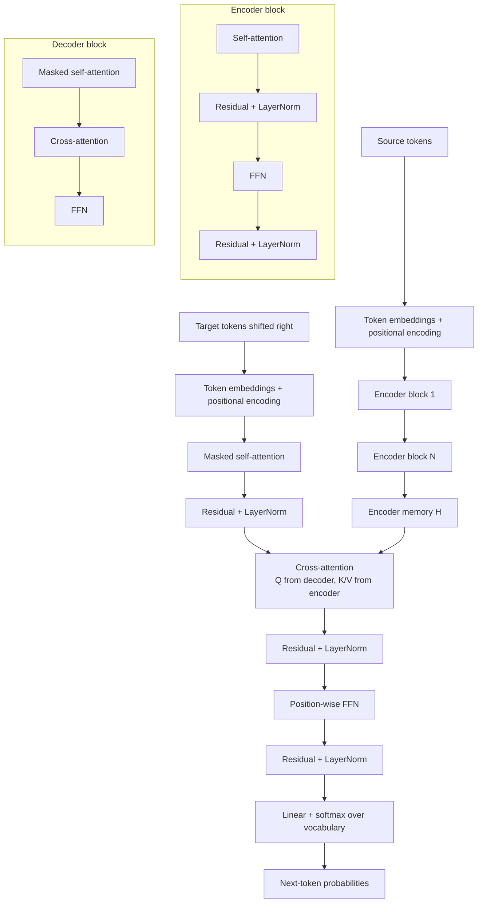

# Transformer Architecture

Source: `DL_exam.pdf`, Question 33

Original question:

> Архитектура Transformer. Self-attention, masked attention, cross-attention, FFN, residual connections, LayerNorm, positional encoding.

## Интуиция

`Transformer` - архитектура для обработки последовательностей, в которой главным механизмом связи между токенами является `attention`, а не рекуррентное состояние. Каждый токен представлен вектором, и на каждом слое он обновляется как взвешенная комбинация других токенов плюс нелинейное преобразование через `FFN`.

Главная идея: вместо того чтобы читать последовательность строго слева направо, как RNN, модель строит прямые связи между любыми позициями. Если слову нужно учитывать далекое слово, путь между ними имеет длину один attention layer, а не десятки recurrent steps. Это лучше параллелится на GPU и проще масштабируется.

В `encoder` self-attention обычно двунаправленный: каждый токен может смотреть на все непаддинговые токены входа. В `decoder` используется `masked self-attention`: токен может смотреть только на себя и прошлые позиции, чтобы не подсмотреть будущие ответы. В `encoder-decoder Transformer` есть еще `cross-attention`: decoder делает queries из своих состояний, а keys/values берет из выхода encoder, то есть "смотрит" на исходную последовательность.

## Что нужно сказать на экзамене

- Transformer состоит из embeddings, positional encoding, стека encoder blocks, стека decoder blocks и output projection.
- Базовый блок encoder: `multi-head self-attention` -> residual connection + `LayerNorm` -> position-wise `FFN` -> residual connection + `LayerNorm`.
- Базовый блок decoder: `masked multi-head self-attention` -> residual + `LayerNorm` -> `cross-attention` к encoder outputs -> residual + `LayerNorm` -> `FFN` -> residual + `LayerNorm`.
- `Self-attention`: $Q$, $K$, $V$ получаются из одной и той же последовательности; токены взаимодействуют друг с другом.
- `Masked attention`: в causal decoder запрещает внимание к будущим позициям через mask с $-\infty$ перед softmax.
- `Cross-attention`: $Q$ берутся из decoder states, а $K,V$ - из encoder outputs.
- `FFN` применяется независимо к каждой позиции с общими весами:

$$
\operatorname{FFN}(x)=W_2\sigma(W_1x+b_1)+b_2.
$$

- `Residual connections` облегчают обучение глубоких сетей и сохраняют исходный сигнал: $x+\operatorname{Sublayer}(x)$.
- `LayerNorm` стабилизирует распределение активаций внутри каждого токена.
- `Positional encoding` нужен, потому что attention сам по себе не знает порядка токенов.
- Сложность self-attention по длине последовательности $n$: $O(n^2d)$ по вычислениям и $O(n^2)$ по attention matrix.
- Основные варианты: encoder-only для понимания текста, decoder-only для autoregressive generation, encoder-decoder для seq2seq.

## Подробный ответ

### Общая схема

Пусть входная последовательность имеет длину $n$, embedding dimension $d_{\text{model}}$. Токены сначала переводятся в embeddings:

$$
X = [e_1,\dots,e_n] \in \mathbb{R}^{n \times d_{\text{model}}}.
$$

Так как attention без дополнительных признаков инвариантен к перестановке позиций, к embeddings добавляют positional information:

$$
Z^{(0)} = X + P,
$$

где $P$ - sinusoidal positional encoding, learned positional embeddings или относительное позиционное представление. Далее $Z^{(0)}$ проходит через стек одинаковых по структуре слоев.

Классический Transformer из статьи "Attention Is All You Need" имеет encoder и decoder. Encoder кодирует входную последовательность в память $H$. Decoder autoregressive генерирует выход, используя уже известные предыдущие целевые токены и cross-attention к $H$.

### Scaled dot-product attention

Для одного attention head из входов строятся матрицы:

$$
Q=XW_Q,\quad K=XW_K,\quad V=XW_V.
$$

Здесь $Q$ - queries, $K$ - keys, $V$ - values. Attention вычисляет похожесть query каждой позиции с key каждой позиции:

$$
\operatorname{Attention}(Q,K,V)=\operatorname{softmax}\left(\frac{QK^\top}{\sqrt{d_k}}+M\right)V.
$$

Множитель $\sqrt{d_k}$ нужен для стабилизации: без него dot products при большой размерности имеют большую дисперсию, softmax становится слишком резким, а gradients хуже проходят.

Mask $M$ добавляется перед softmax. Разрешенные элементы имеют $0$, запрещенные - большое отрицательное число, концептуально $-\infty$. Поэтому после softmax запрещенные связи получают вероятность около нуля.

### Self-attention

В `self-attention` матрицы $Q,K,V$ строятся из одной последовательности. В encoder это означает, что каждый входной токен может учитывать все остальные входные токены:

$$
Q=ZW_Q,\quad K=ZW_K,\quad V=ZW_V.
$$

Например, местоимение может смотреть на существительное, слово может учитывать дальний контекст, а модель может строить синтаксические и семантические зависимости без явного recurrence.

Для batch с padding используют `padding mask`, чтобы реальные токены не обращали внимание на `<pad>`.

### Masked self-attention

В decoder при обучении известна вся правильная целевая последовательность, но модель должна учиться autoregressive факторизации:

$$
p(y_{1:T}\mid x)=\prod_{t=1}^{T}p(y_t\mid y_{<t},x).
$$

Поэтому в decoder self-attention применяют causal mask:

$$
M_{ij}=
\begin{cases}
0, & j \le i, \\
-\infty, & j > i.
\end{cases}
$$

Позиция $i$ может смотреть на позиции $1,\dots,i$, но не на будущие позиции $i+1,\dots,T$. Это позволяет параллельно обучать все позиции с teacher forcing и при этом не нарушать autoregressive условие.

### Cross-attention

`Cross-attention` используется в encoder-decoder архитектуре. Decoder имеет текущие hidden states $S$, encoder выдал память $H$. Тогда:

$$
Q=SW_Q,\quad K=HW_K,\quad V=HW_V.
$$

Queries задают, что decoder хочет найти на текущей целевой позиции, а keys/values представляют исходную последовательность. В машинном переводе это похоже на learned soft alignment: при генерации очередного слова decoder выбирает релевантные части исходного предложения.

Decoder-only модели, такие как GPT-подобные языковые модели, обычно не имеют cross-attention в базовом режиме: они используют только causal self-attention над префиксом. Encoder-only модели, такие как BERT-подобные модели, не имеют causal mask для обычного bidirectional encoding.

### Multi-head attention

Один attention head может выучить один тип связи, но последовательности требуют разных отношений: синтаксис, coreference, локальные шаблоны, дальний контекст. Поэтому используют $h$ голов:

$$
\operatorname{head}_i=\operatorname{Attention}(QW_i^Q,KW_i^K,VW_i^V),
$$

$$
\operatorname{MultiHead}(Q,K,V)=\operatorname{Concat}(\operatorname{head}_1,\dots,\operatorname{head}_h)W_O.
$$

Обычно $d_k=d_v=d_{\text{model}}/h$, поэтому суммарная размерность после concat снова равна $d_{\text{model}}$.

### Feed-forward network

После attention каждая позиция проходит через одинаковый `position-wise FFN`:

$$
\operatorname{FFN}(x)=W_2\sigma(W_1x+b_1)+b_2.
$$

FFN не смешивает позиции между собой. Смешивание по позициям делает attention, а FFN добавляет нелинейное преобразование признаков внутри каждого токена. В классическом Transformer $\sigma$ - ReLU, в современных моделях часто используют GELU или gated variants вроде SwiGLU.

### Residual connections и LayerNorm

Каждый sublayer оборачивается residual connection и нормализацией. В классическом описании используется `post-norm`:

$$
\operatorname{LayerNorm}(x+\operatorname{Sublayer}(x)).
$$

Во многих современных глубоких Transformer чаще используют `pre-norm`:

$$
x+\operatorname{Sublayer}(\operatorname{LayerNorm}(x)).
$$

На экзамене важно понимать роль, а не только порядок. Residual path дает короткий путь для сигнала и gradient, поэтому глубокую сеть легче оптимизировать. `LayerNorm` нормализует признаки внутри одного token representation:

$$
\operatorname{LayerNorm}(x)=\gamma \frac{x-\mu}{\sqrt{\sigma^2+\epsilon}}+\beta,
$$

где $\mu$ и $\sigma^2$ считаются по feature dimension данного токена, а $\gamma,\beta$ обучаются.

### Positional encoding

Self-attention использует попарные dot products между токенами и сам по себе не содержит информации о порядке. Если не добавить позиционный сигнал, модель не сможет надежно отличить последовательности с одинаковыми токенами в разном порядке.

В классическом Transformer применялось sinusoidal positional encoding:

$$
PE_{pos,2i}=\sin\left(\frac{pos}{10000^{2i/d_{\text{model}}}}\right),
$$

$$
PE_{pos,2i+1}=\cos\left(\frac{pos}{10000^{2i/d_{\text{model}}}}\right).
$$

Также часто используются learned absolute embeddings, relative positional encoding, rotary positional embeddings. Для устного ответа достаточно сказать: positional encoding добавляет информацию о позиции токена, а современные варианты часто кодируют относительные расстояния или повороты в пространстве attention.

### Encoder, decoder и типы Transformer

| Тип | Attention | Для чего используется |
|---|---|---|
| Encoder-only | Bidirectional self-attention | Классификация, извлечение признаков, masked language modeling. |
| Decoder-only | Causal masked self-attention | Language modeling, autoregressive generation. |
| Encoder-decoder | Encoder self-attention, decoder masked self-attention, cross-attention | Перевод, summarization, text-to-text seq2seq. |

Encoder-only модель получает весь вход сразу и строит контекстные представления токенов. Decoder-only модель предсказывает следующий токен по префиксу. Encoder-decoder модель сначала кодирует источник, затем decoder генерирует целевую последовательность, обращаясь к encoder memory.

### Преимущества и ограничения

Преимущества Transformer:

- хорошо параллелится при обучении, потому что нет последовательного recurrence по времени;
- строит прямые зависимости между далекими позициями;
- масштабируется по depth, width, data и compute;
- универсален для NLP, vision, audio и multimodal задач.

Ограничения:

- self-attention имеет квадратичную сложность по длине последовательности;
- positional encoding нужен явно и влияет на extrapolation к длинным контекстам;
- decoder inference остается autoregressive: токены генерируются последовательно;
- без масок можно получить leakage будущих токенов или attention к padding.

## Формулы / алгоритмы

### Encoder block

**Objective:** преобразовать последовательность токенов в контекстные representations, где каждая позиция учитывает другие позиции входа.

**Input:** $Z \in \mathbb{R}^{n \times d_{\text{model}}}$, padding mask.

**Output:** $Z' \in \mathbb{R}^{n \times d_{\text{model}}}$.

В post-norm записи:

1. Вычислить multi-head self-attention:

$$
A=\operatorname{MultiHeadSelfAttention}(Z,Z,Z;\ M_{\text{pad}}).
$$

2. Добавить residual и нормализацию:

$$
\tilde{Z}=\operatorname{LayerNorm}(Z+A).
$$

3. Применить position-wise FFN:

$$
F=\operatorname{FFN}(\tilde{Z}).
$$

4. Добавить residual и нормализацию:

$$
Z'=\operatorname{LayerNorm}(\tilde{Z}+F).
$$

### Decoder block

**Objective:** обновить состояния целевой последовательности так, чтобы каждая позиция видела прошлые целевые токены и исходную последовательность.

**Input:** decoder states $S$, encoder memory $H$, causal mask, padding masks.

**Output:** updated decoder states $S'$.

1. Masked self-attention по целевому префиксу:

$$
A_1=\operatorname{MultiHeadAttention}(S,S,S;\ M_{\text{causal}}+M_{\text{target pad}}).
$$

2. Residual + LayerNorm:

$$
\tilde{S}_1=\operatorname{LayerNorm}(S+A_1).
$$

3. Cross-attention к encoder memory:

$$
A_2=\operatorname{MultiHeadAttention}(\tilde{S}_1,H,H;\ M_{\text{source pad}}).
$$

4. Residual + LayerNorm:

$$
\tilde{S}_2=\operatorname{LayerNorm}(\tilde{S}_1+A_2).
$$

5. FFN, residual и LayerNorm:

$$
S'=\operatorname{LayerNorm}(\tilde{S}_2+\operatorname{FFN}(\tilde{S}_2)).
$$

### Обучение autoregressive decoder

**Objective:** минимизировать negative log-likelihood правильных токенов.

$$
\mathcal{L}(\theta)=-\sum_{t=1}^{T}\log p_\theta(y_t^\ast\mid y_{<t}^\ast,x).
$$

**Pipeline:**

1. Подать source tokens в encoder и получить memory $H$.
2. Подать target tokens, сдвинутые вправо, в decoder.
3. Использовать causal mask, чтобы позиция $t$ не видела $y_{>t}$.
4. Получить logits через linear projection:

$$
\operatorname{logits}_t = h_t W_{\text{vocab}} + b.
$$

5. Посчитать cross-entropy с правильным следующим токеном.
6. Обновить параметры через backpropagation и optimizer.

**Complexity caveat:** для длины $n$ attention matrix имеет размер $n \times n$, поэтому длинные контексты требуют много памяти. FFN обычно доминирует по параметрам, а attention часто доминирует по памяти при длинных последовательностях.

## Диаграмма или изображение

## Быстрая устная версия

Transformer - это архитектура без recurrence, где токены обмениваются информацией через multi-head attention. В encoder используется self-attention: каждый токен смотрит на все токены входа, кроме padding. В decoder используется masked self-attention, чтобы позиция не видела будущие токены, и cross-attention, где decoder queries обращаются к encoder keys и values.

Каждый блок состоит из attention sublayer, FFN, residual connections и LayerNorm. FFN применяется отдельно к каждой позиции, attention смешивает информацию между позициями. Positional encoding обязателен, потому что attention сам не знает порядка. Главный плюс Transformer - параллельное обучение и прямые дальние зависимости; главный минус - квадратичная сложность attention по длине.

## Возможные уточняющие вопросы

- Чем self-attention отличается от cross-attention?  
  В self-attention $Q,K,V$ берутся из одной последовательности; в cross-attention $Q$ берутся из decoder states, а $K,V$ - из encoder outputs.

- Зачем нужен causal mask?  
  Чтобы при обучении decoder не видел будущие target tokens и соблюдал факторизацию $p(y_t\mid y_{<t},x)$.

- Почему attention делят на $\sqrt{d_k}$?  
  Чтобы dot products не росли по дисперсии с размерностью и softmax не становился слишком насыщенным.

- Зачем multi-head attention, если есть один attention?  
  Разные heads могут кодировать разные типы связей и работать в разных подпространствах признаков.

- Что делает FFN в Transformer?  
  Нелинейно преобразует representation каждого токена независимо; позиции смешиваются не в FFN, а в attention.

- Чем LayerNorm отличается от BatchNorm в этом контексте?  
  LayerNorm нормализует признаки внутри одного токена и не зависит от batch statistics, что удобно для последовательностей и autoregressive inference.

- Что будет без positional encoding?  
  Модель потеряет явный сигнал порядка: self-attention будет видеть набор token embeddings без надежной информации о позициях.

- Почему decoder inference не полностью параллелен?  
  Следующий токен зависит от уже сгенерированных токенов, поэтому генерация идет autoregressive шаг за шагом, хотя вычисления внутри шага параллельны по слоям и heads.

## Частые ошибки

- Говорить, что Transformer вообще не использует порядок. Правильно: порядок не встроен в attention, поэтому его добавляют через positional encoding.
- Путать self-attention и cross-attention: в cross-attention queries и keys/values приходят из разных последовательностей.
- Забывать causal mask в decoder и тем самым допускать утечку будущих токенов при обучении.
- Считать, что FFN смешивает информацию между позициями. FFN применяется position-wise; межпозиционное взаимодействие делает attention.
- Называть residual connections просто "ускорением". Их важная роль - облегчить прохождение gradient и сохранить identity path.
- Думать, что LayerNorm нормализует по batch. В Transformer LayerNorm обычно нормализует feature dimension каждого токена.
- Не упоминать padding mask: без него модель может обращать attention на `<pad>`.
- Смешивать encoder-only, decoder-only и encoder-decoder Transformer как одну и ту же схему без различий в masks и cross-attention.
- Забывать квадратичную стоимость self-attention по длине последовательности.
