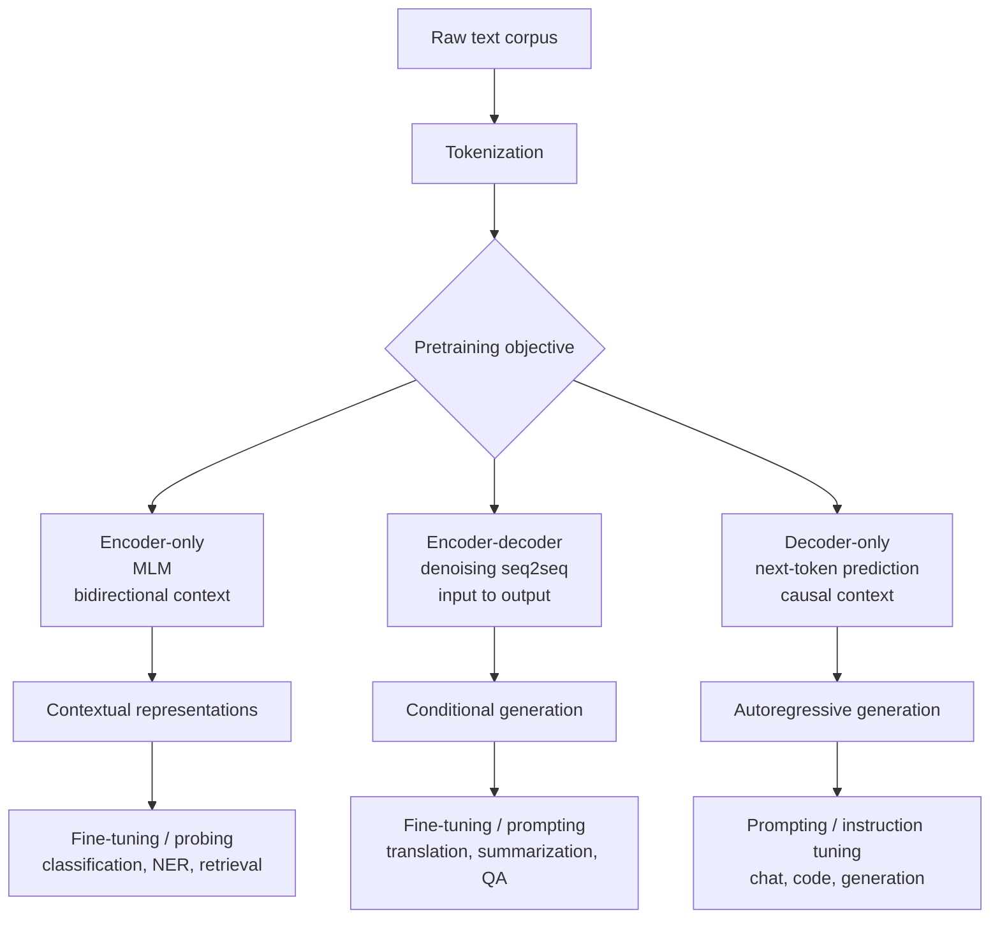

# NLP Pretraining

Source: `DL_exam.pdf`, Question 34

Original question:

> Pretraining в NLP. Зачем нужен self-supervised pretraining, encoder-only, encoder-decoder и decoder-only подходы.

## Интуиция

В NLP трудно собрать много размеченных данных для каждой задачи, но легко собрать огромные массивы сырого текста. `Self-supervised pretraining` использует сам текст как источник обучающего сигнала: модель учится восстанавливать скрытые токены, предсказывать следующий токен или преобразовывать поврежденный текст обратно в исходный. Так она заранее осваивает статистику языка, синтаксис, семантику, факты и типичные шаблоны рассуждения, а затем эти знания переносятся на конкретные задачи через `fine-tuning`, `prompting` или использование представлений.

Главное различие между подходами связано с тем, какой контекст видит модель и какую задачу она лучше решает. `Encoder-only` модели строят глубокое двунаправленное представление текста и удобны для понимания входа. `Decoder-only` модели авторегрессионно продолжают текст и удобны для генерации. `Encoder-decoder` модели отдельно кодируют вход и затем генерируют выход, поэтому естественны для задач "текст в текст": перевод, summarization, question answering, исправление текста.

## Что нужно сказать на экзамене

- `Pretraining` в NLP: сначала обучаем большую модель на общей задаче по сырому тексту, затем адаптируем к downstream-задаче.
- `Self-supervised learning`: разметка строится автоматически из данных, например маскируем токены или сдвигаем последовательность на один токен.
- Основные цели:
  - `masked language modeling` для `encoder-only`: предсказать скрытые токены по левому и правому контексту;
  - `denoising seq2seq` для `encoder-decoder`: восстановить исходный текст из поврежденного;
  - `causal language modeling` для `decoder-only`: предсказать следующий токен по предыдущим.
- `Encoder-only`: bidirectional self-attention, хорошие contextual embeddings, классификация, NER, retrieval/reranking, extractive QA.
- `Encoder-decoder`: encoder видит весь вход, decoder генерирует выход с causal self-attention и cross-attention; подходит для translation, summarization, text-to-text tasks.
- `Decoder-only`: causal mask, next-token prediction, in-context learning, генерация, чат, code generation; плохо подходит для чистого bidirectional понимания без специальных приемов.
- Преимущества pretraining: меньше размеченных данных, лучше обобщение, перенос между задачами, стабильная инициализация, масштабирование качества с данными и параметрами.
- Ограничения: высокая стоимость обучения, bias и утечки из корпуса, hallucinations у генеративных моделей, mismatch между pretraining objective и целевой задачей, ограничение контекстного окна.

## Подробный ответ

`Pretraining` -- это этап обучения параметров $\theta$ на большой общей задаче до решения конкретной downstream-задачи. В классическом supervised learning для каждой задачи нужны пары $(x, y)$, где $y$ размечен человеком. В NLP это дорого: для sentiment classification, NER, QA, summarization и диалогов нужны разные типы разметки. При этом сырой текст почти бесплатен. Поэтому в `self-supervised pretraining` модель сама получает псевдо-метки из текста.

Типичный pipeline:

1. Собрать большой корпус текста и применить tokenization.
2. Выбрать архитектуру и pretraining objective.
3. Обучить модель на self-supervised задаче.
4. Адаптировать к нужной задаче: `fine-tuning`, instruction tuning, prompting, linear probing или feature extraction.

### Зачем нужен self-supervised pretraining

Self-supervised pretraining решает проблему нехватки разметки. Модель не просто запоминает частоты слов, а учится строить контекстные представления: одно и то же слово получает разные embeddings в разных предложениях. Например, "ключ" в контексте двери и в контексте шифрования должен иметь разные представления.

Польза:

| Что дает pretraining | Почему это важно |
|---|---|
| Языковые представления | Модель знает синтаксис, морфологию, семантическую близость |
| Transfer learning | Меньше размеченных данных для downstream-задач |
| Улучшенная инициализация | Fine-tuning быстрее и устойчивее, чем обучение с нуля |
| Универсальность | Одна pretrained модель может адаптироваться к многим задачам |
| Масштабирование | Качество часто растет при увеличении данных, параметров и compute |

Важно не сказать, что self-supervised означает "без цели". Цель есть, но она создается автоматически из самих данных.

### Encoder-only подход

`Encoder-only` модели используют только encoder-блоки Transformer. Каждый токен может через self-attention смотреть и влево, и вправо, поэтому attention является двунаправленным. Пример семейства -- BERT-like модели.

Основная идея: получить сильное представление входной последовательности. Для токена $x_i$ модель использует контекст $x_{<i}$ и $x_{>i}$, поэтому хорошо понимает текст как целое. Стандартная pretraining-задача -- `masked language modeling` (`MLM`): часть токенов заменяется на `[MASK]`, случайный токен или остается прежней, а модель должна предсказать исходные токены.

Преимущества:

- сильные contextual embeddings;
- хорошо подходит для classification, NER, semantic similarity, retrieval, reranking;
- естественно использует весь контекст входа.

Недостатки:

- не является естественной генеративной моделью слева направо;
- `[MASK]` используется при pretraining, но обычно отсутствует при реальном inference, что создает небольшой pretrain-finetune mismatch;
- для генерации длинного текста нужна отдельная схема или другая архитектура.

### Encoder-decoder подход

`Encoder-decoder` модели имеют две части. Encoder двунаправленно кодирует вход, а decoder авторегрессионно генерирует выход. В decoder есть causal self-attention, чтобы текущая позиция не видела будущие выходные токены, и `cross-attention`, чтобы decoder обращался к encoder-представлениям входа. Примеры семейств -- T5-like и BART-like модели.

Такой подход особенно удобен, когда задача имеет вид:

$$
\text{input text} \rightarrow \text{output text}.
$$

Например: translation, summarization, grammar correction, text simplification, generative QA. Pretraining objective часто формулируется как `denoising`: испортить входной текст шумом и научить модель восстанавливать исходный текст.

Преимущества:

- хорошо моделирует условное распределение $p(y \mid x)$;
- естественно разделяет понимание входа и генерацию выхода;
- гибко сводит разные NLP-задачи к text-to-text формату.

Недостатки:

- при inference генерация autoregressive, поэтому медленная для длинных выходов;
- архитектура тяжелее decoder-only при одинаковом числе слоев в каждой части;
- для задач только на классификацию может быть избыточной.

### Decoder-only подход

`Decoder-only` модели используют только decoder-блоки Transformer с causal mask. На позиции $t$ модель видит только $x_1, \dots, x_{t-1}$ и предсказывает следующий токен $x_t$. Это `causal language modeling` или `next-token prediction`. Пример семейства -- GPT-like модели.

Такая модель оценивает вероятность последовательности через произведение условных вероятностей:

$$
p_\theta(x_1, \dots, x_T) = \prod_{t=1}^{T} p_\theta(x_t \mid x_{<t}).
$$

Decoder-only pretraining напрямую совпадает с генерацией: во время inference модель тоже порождает текст слева направо, выбирая следующий токен. Поэтому этот подход стал основой LLM для chat, code generation, reasoning-style prompting и in-context learning.

Преимущества:

- простая и масштабируемая pretraining-задача;
- pretraining objective совпадает с режимом генерации;
- хорошо работает с prompting и few-shot examples в контексте;
- одна модель может выполнять много задач без отдельной головы классификации.

Недостатки:

- нет полного bidirectional контекста для представления текущего токена;
- генерация последовательна и дорогая по времени;
- возможны hallucinations, exposure bias, чувствительность к prompt;
- для некоторых задач понимания encoder-only модель может быть эффективнее.

### Сравнение подходов

| Подход | Что видит self-attention | Типичная цель | Сильные задачи | Слабое место |
|---|---|---|---|---|
| `Encoder-only` | Левый и правый контекст | MLM | Понимание, классификация, NER, retrieval | Неестественная генерация |
| `Encoder-decoder` | Encoder: весь вход; decoder: прошлый выход + вход | Denoising / seq2seq | Translation, summarization, text-to-text QA | Более сложный inference |
| `Decoder-only` | Только предыдущие токены | Next-token prediction | Генерация, chat, code, prompting | Нет bidirectional token representation |

## Формулы / алгоритмы

### Masked Language Modeling

Пусть последовательность токенов $x = (x_1, \dots, x_T)$, а $M$ -- множество замаскированных позиций. Модель видит поврежденную последовательность $\tilde{x}$ и минимизирует negative log-likelihood исходных токенов:

$$
\mathcal{L}_{MLM}(\theta) = - \sum_{i \in M} \log p_\theta(x_i \mid \tilde{x}).
$$

Здесь условие включает левый и правый контекст, потому что encoder attention двунаправленный.

### Causal Language Modeling

Для decoder-only моделей:

$$
\mathcal{L}_{CLM}(\theta) = - \sum_{t=1}^{T} \log p_\theta(x_t \mid x_{<t}).
$$

Attention mask запрещает смотреть на будущие позиции:

$$
\text{attention}(i, j) =
\begin{cases}
\text{allowed}, & j \le i, \\
\text{blocked}, & j > i.
\end{cases}
$$

### Denoising Seq2Seq

Пусть $C(\cdot)$ -- функция повреждения текста: masking spans, deletion, permutation или noise. Encoder получает $\tilde{x} = C(x)$, decoder восстанавливает $x$:

$$
\mathcal{L}_{denoise}(\theta) = - \sum_{t=1}^{T} \log p_\theta(x_t \mid x_{<t}, \tilde{x}).
$$

### Общий алгоритм pretraining и адаптации

Вход: корпус сырого текста $D$, tokenizer, архитектура, objective.

Выход: pretrained параметры $\theta$, затем адаптированная модель для задачи.

1. Tokenize texts from $D$.
2. Build training examples according to objective: mask tokens, corrupt spans or shift sequence for next-token prediction.
3. Run forward pass.
4. Compute self-supervised loss.
5. Update parameters by backpropagation and optimizer, usually AdamW or its variants.
6. Repeat at scale; monitor validation loss and downstream metrics.
7. Adapt pretrained model: add task head, fine-tune all or part of parameters, or use prompting/in-context examples.

Практические caveats: качество корпуса и tokenization сильно влияют на результат; validation loss не всегда полностью предсказывает качество на downstream-задачах; слишком агрессивный fine-tuning может вызвать catastrophic forgetting.

## Диаграмма или изображение

Внешние изображения не использовались.

## Быстрая устная версия

Pretraining в NLP нужен, потому что размеченных данных мало и они дорогие, а сырого текста много. В self-supervised pretraining модель получает обучающий сигнал из самого текста: восстанавливает маскированные токены, исправляет поврежденный текст или предсказывает следующий токен. Так она учит языковые представления, которые потом переносятся на конкретные задачи.

Есть три основных Transformer-подхода. `Encoder-only` видит контекст в обе стороны и хорош для понимания текста: классификация, NER, retrieval. `Encoder-decoder` кодирует вход и авторегрессионно генерирует выход, поэтому хорош для translation и summarization. `Decoder-only` предсказывает следующий токен по предыдущим, хорошо масштабируется и естественно подходит для генерации, chat и prompting. Выбор архитектуры зависит от того, нужна ли нам в первую очередь интерпретация входа, преобразование входа в выход или свободная генерация.

## Возможные уточняющие вопросы

- Чем self-supervised отличается от supervised? В supervised метки дает внешний источник, а в self-supervised целевая переменная автоматически строится из самих данных.
- Почему MLM не подходит напрямую для генерации слева направо? Потому что encoder обучается с bidirectional контекстом и предсказывает скрытые токены, а не следующее продолжение последовательности.
- Почему decoder-only модели хорошо подходят для LLM? Их objective next-token prediction совпадает с autoregressive inference, хорошо масштабируется и позволяет решать задачи через prompt.
- Где используется cross-attention? В encoder-decoder decoder-блоках: decoder обращается к encoder-представлениям входной последовательности.
- Что такое pretrain-finetune mismatch? Различие между условиями pretraining и downstream inference, например `[MASK]` в BERT есть при pretraining, но обычно отсутствует в реальных текстах.
- Можно ли decoder-only использовать для классификации? Да, через prompt, специальный классификационный токен, pooling последнего состояния или генерацию label token, но encoder-only часто эффективнее для чистого понимания.
- Почему encoder-decoder удобен для summarization? Потому что входной документ полностью кодируется encoder, а decoder генерирует краткий выход, условный на этом входе.

## Частые ошибки

- Говорить, что self-supervised learning не требует loss function. Loss есть, просто метки создаются автоматически.
- Путать `encoder-only` и `decoder-only`: encoder обычно bidirectional, decoder-only использует causal mask.
- Называть BERT генеративной моделью в том же смысле, что GPT. BERT можно использовать в генеративных схемах, но его базовый objective -- MLM для понимания.
- Забывать про `cross-attention` в encoder-decoder архитектуре.
- Считать, что pretraining заменяет downstream adaptation. Часто все равно нужны fine-tuning, prompting, instruction tuning или task-specific head.
- Игнорировать ограничения корпуса: bias, загрязнение тестовых данных, токсичность, доменный mismatch.
- Смешивать `causal language modeling` и `masked language modeling`: первое предсказывает следующий токен по прошлым, второе восстанавливает скрытые токены по двунаправленному контексту.
