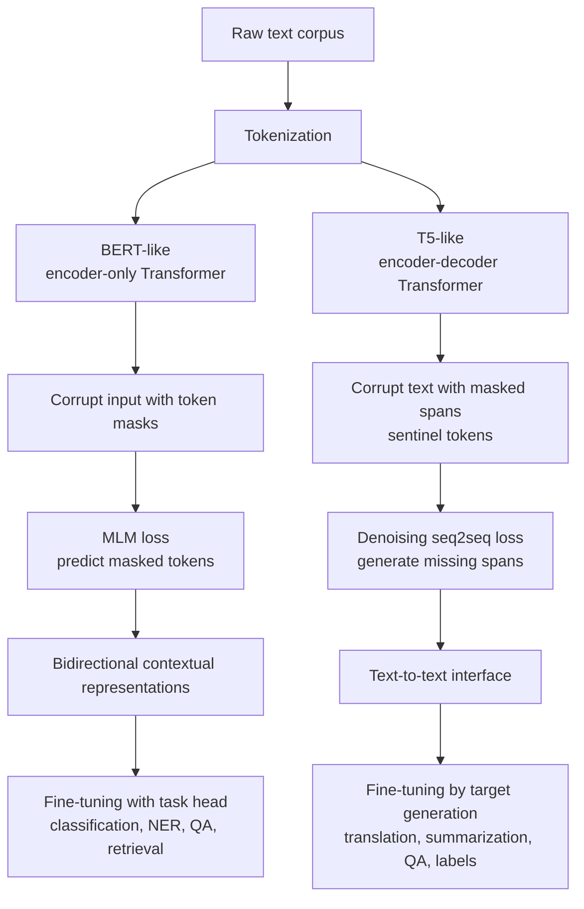

# BERT Like and T5 Like Models

Source: `DL_exam.pdf`, Question 35

Original question:

> BERT-подобные и T5-подобные модели. Masked language modeling, text-to-text постановка, fine-tuning под downstream tasks.

## Интуиция

BERT-like и T5-like модели решают одну общую задачу: как заранее обучить Transformer на большом корпусе текста так, чтобы потом быстро адаптировать его к конкретным NLP-задачам. Разница в том, какую архитектуру и какую self-supervised задачу мы выбираем.

BERT-like модель -- это в первую очередь модель понимания текста. Она использует `encoder-only` Transformer с двунаправленным `self-attention`: каждый токен может смотреть и налево, и направо. Поэтому модель хорошо строит contextual representations для классификации, NER, semantic similarity, retrieval и extractive QA. Предобучение обычно идет через `masked language modeling`: спрятать часть токенов и научить модель восстановить их по полному контексту.

T5-like модель формулирует почти все NLP-задачи как `text-to-text`: на вход подается текстовая строка, на выходе тоже генерируется текстовая строка. Архитектура обычно `encoder-decoder`: encoder понимает вход, decoder авторегрессионно порождает выход. Поэтому одна и та же модель может решать translation, summarization, question answering, classification и другие задачи, если правильно задать входной prefix и целевую строку.

## Что нужно сказать на экзамене

- BERT-like модели: `encoder-only` Transformer, bidirectional self-attention, основной objective -- `masked language modeling` (`MLM`).
- В MLM выбирается множество позиций $M$, вход повреждается масками, а loss считается только по исходным токенам на замаскированных позициях.
- BERT удобен для задач понимания: classification через `[CLS]`, token classification для NER, pair classification для NLI/semantic similarity, extractive QA через предсказание start/end span.
- Ограничение BERT: он не является естественной left-to-right генеративной моделью; есть mismatch из-за `[MASK]`, который обычно не встречается на downstream inference.
- T5-like модели: `encoder-decoder` Transformer, задачи приводятся к формату `input text -> target text`.
- T5 pretraining обычно задается как `denoising` / `span corruption`: повреждаем текст, заменяя spans специальными sentinel tokens, и decoder восстанавливает удаленные фрагменты.
- Fine-tuning:
  - для BERT добавляют task-specific head и оптимизируют supervised loss;
  - для T5 формируют текстовый prompt/prefix и обучают decoder генерировать целевую строку.
- Trade-off: BERT часто эффективнее для чистого понимания входа, T5 гибче для задач преобразования текста и генеративного ответа.

## Подробный ответ

### BERT-like модели

`BERT` означает `Bidirectional Encoder Representations from Transformers`. Это семейство моделей на основе encoder-блоков Transformer. На каждом слое каждый токен через self-attention может использовать весь входной контекст, кроме специальных ограничений маски padding. В отличие от decoder-only моделей, causal mask здесь не используется.

Вход BERT обычно строится так:

$$
x = [\text{[CLS]}, x_1, \dots, x_m, \text{[SEP]}, y_1, \dots, y_n, \text{[SEP]}].
$$

К токенам добавляются token embeddings, positional embeddings и segment/type embeddings, если нужно различать две части входа. Состояние токена `[CLS]` часто используется как агрегированное представление всей последовательности для классификации. Состояния обычных токенов используются для token-level задач, например NER.

Главный pretraining objective -- `masked language modeling`. Часть токенов выбирается для предсказания. В классическом BERT примерно 15% позиций становятся training targets: часть заменяется на `[MASK]`, часть на случайный токен, часть остается без изменения. Это сделано, чтобы модель не привыкала только к явному символу `[MASK]`.

MLM учит модель отвечать на вопрос: какой токен должен стоять в позиции $i$, если известен левый и правый контекст? Например, в предложении "кошка сидит на [MASK]" модель может использовать и предыдущие, и последующие слова. Это делает BERT сильным для понимания, но не делает его удобным генератором длинного текста.

В оригинальном BERT также использовался `next sentence prediction` (`NSP`): модель должна была определить, является ли вторая последовательность настоящим продолжением первой. В более поздних BERT-like моделях этот компонент часто меняли или убирали: например, RoBERTa показала, что сильное MLM-обучение на большем корпусе без NSP может быть эффективнее. Для экзамена важно понимать, что центральная идея BERT-like семейства -- bidirectional encoder и MLM, а не конкретно NSP.

Примеры BERT-like идей:

| Модель | Что важно помнить |
|---|---|
| BERT | Encoder-only, MLM, `[CLS]`, `[SEP]`, fine-tuning с task head |
| RoBERTa | Улучшенный режим обучения BERT, больше данных, dynamic masking, без NSP |
| ALBERT | Уменьшение числа параметров через factorized embeddings и parameter sharing |
| DeBERTa | Улучшенное моделирование content и position representations |

### Fine-tuning BERT под downstream tasks

После pretraining параметры encoder $\theta$ используются как хорошая инициализация. Для downstream-задачи добавляют небольшую голову с параметрами $\phi$ и обучают на размеченных данных.

Для sequence classification берут скрытое состояние `[CLS]`:

$$
h_{\text{CLS}} = f_\theta(x)_{\text{CLS}},
$$

$$
p_\theta(y \mid x) = \operatorname{softmax}(W h_{\text{CLS}} + b).
$$

Для NER или POS tagging классификация применяется к каждому токену:

$$
p(y_i \mid x) = \operatorname{softmax}(W h_i + b).
$$

Для extractive QA модель предсказывает начало и конец ответа в контексте:

$$
p_s(i \mid x) = \operatorname{softmax}(w_s^\top h_i), \quad
p_e(i \mid x) = \operatorname{softmax}(w_e^\top h_i).
$$

Практически важно: при fine-tuning обычно обновляют все параметры модели, но при малых данных можно замораживать encoder, использовать smaller learning rate, early stopping, layer-wise learning rate decay или parameter-efficient methods. Риск -- переобучение и catastrophic forgetting, особенно на маленьком или доменно отличающемся датасете.

### T5-like модели

`T5` означает `Text-to-Text Transfer Transformer`. Главная идея: унифицировать NLP-задачи так, чтобы и вход, и выход всегда были текстом. Вместо разных heads для классификации, регрессии, summarization и translation модель всегда решает задачу условной генерации:

$$
x_{\text{text}} \rightarrow y_{\text{text}}.
$$

Примеры постановок:

| Задача | Вход | Выход |
|---|---|---|
| Translation | `translate English to German: ...` | немецкий перевод |
| Summarization | `summarize: ...` | краткое содержание |
| Sentiment classification | `sst2 sentence: ...` | `positive` или `negative` |
| Question answering | `question: ... context: ...` | текст ответа |

Архитектурно T5-like модель -- это encoder-decoder Transformer. Encoder двунаправленно кодирует входную строку. Decoder генерирует выход слева направо: на шаге $t$ он видит уже сгенерированные токены $y_{<t}$ и через `cross-attention` обращается к encoder-представлениям входа.

T5 pretraining обычно использует `span corruption`. Из исходного текста удаляются непрерывные spans, а на их место ставятся специальные sentinel tokens, например `<extra_id_0>`, `<extra_id_1>`. Encoder получает поврежденный текст, а decoder должен сгенерировать удаленные spans, тоже разделенные sentinel tokens.

Пример:

```text
Исходный текст:  Deep learning models learn representations from data.
Encoder input:   Deep learning <extra_id_0> representations <extra_id_1> data.
Decoder target:  <extra_id_0> models learn <extra_id_1> from <extra_id_2>
```

Такая задача является denoising seq2seq: модель учится понимать поврежденный вход и восстанавливать отсутствующую информацию. Это ближе к реальным seq2seq downstream-задачам, чем чистое MLM, потому что decoder всегда тренируется генерировать текст.

### Fine-tuning T5 под downstream tasks

Fine-tuning T5 обычно не требует новой классификационной головы. Нужно привести задачу к text-to-text формату: задать входной prefix и целевую строку. Затем модель оптимизирует teacher-forced negative log-likelihood правильного target text.

Например, для бинарной классификации:

```text
Input:  sentiment: The movie was surprisingly good.
Target: positive
```

Для summarization:

```text
Input:  summarize: <document>
Target: <summary>
```

Плюс такого подхода -- единый интерфейс для многих задач и естественная генерация. Минус -- даже классификация становится генерацией label tokens, поэтому inference может быть медленнее и требует аккуратного выбора verbalizers: например, модель должна генерировать именно `positive`/`negative`, а не произвольный похожий текст.

### Сравнение BERT-like и T5-like

| Свойство | BERT-like | T5-like |
|---|---|---|
| Архитектура | Encoder-only | Encoder-decoder |
| Основная цель pretraining | Masked language modeling | Denoising / span corruption |
| Контекст | Bidirectional context для входа | Encoder видит весь вход, decoder генерирует causal output |
| Downstream format | Task-specific heads или pooling | Любая задача как text-to-text |
| Сильные стороны | Понимание, классификация, NER, retrieval, reranking | Translation, summarization, generative QA, unified multitask learning |
| Слабые стороны | Неестественная генерация, `[MASK]` mismatch | Более дорогой autoregressive inference, label generation для классификации |

## Формулы / алгоритмы

### Masked Language Modeling для BERT

Пусть $x = (x_1, \dots, x_T)$ -- последовательность токенов, $M \subset \{1,\dots,T\}$ -- множество замаскированных позиций, а $\tilde{x}$ -- поврежденная последовательность. BERT минимизирует negative log-likelihood исходных токенов только на позициях $M$:

$$
\mathcal{L}_{MLM}(\theta) =
- \sum_{i \in M} \log p_\theta(x_i \mid \tilde{x}).
$$

Вероятность считается через hidden state $h_i$ encoder-а:

$$
p_\theta(x_i = v \mid \tilde{x}) =
\operatorname{softmax}(W h_i + b)_v.
$$

Важное отличие от causal LM: условие содержит информацию с обеих сторон от позиции $i$, поэтому это не факторизация вероятности всей последовательности слева направо.

### Text-to-text / seq2seq objective для T5

Для пары текстов $(x, y)$, где $y = (y_1,\dots,y_L)$, T5 моделирует:

$$
p_\theta(y \mid x) =
\prod_{t=1}^{L} p_\theta(y_t \mid y_{<t}, x).
$$

Loss:

$$
\mathcal{L}_{seq2seq}(\theta) =
- \sum_{t=1}^{L} \log p_\theta(y_t \mid y_{<t}, x).
$$

Для pretraining $x$ -- это corrupted text $C(z)$, а $y$ -- удаленные фрагменты исходного текста $z$:

$$
\mathcal{L}_{T5}(\theta) =
- \sum_{t=1}^{L} \log p_\theta(y_t \mid y_{<t}, C(z)).
$$

### Алгоритм fine-tuning BERT

Вход: pretrained BERT $f_\theta$, размеченный датасет $D = \{(x^{(k)}, y^{(k)})\}$, task head $g_\phi$.

Выход: параметры $\theta, \phi$, адаптированные к задаче.

1. Tokenize input and add special tokens: `[CLS]`, `[SEP]`, padding mask.
2. Compute hidden states $h = f_\theta(x)$.
3. Choose representation: `[CLS]` for sequence classification, $h_i$ for token classification, start/end logits for QA.
4. Compute supervised loss, usually cross-entropy.
5. Update $\theta$ and $\phi$ by backpropagation.
6. Validate on downstream metric: accuracy, F1, EM/F1 for QA, ranking metrics for retrieval.

Практические caveats: маленький learning rate, short training schedule, validation-based early stopping; несколько random seeds могут заметно менять качество на малых датасетах.

### Алгоритм fine-tuning T5

Вход: pretrained T5, датасет task examples, текстовый формат входа и выхода.

Выход: T5, генерирующий правильные target strings.

1. Convert each example to `input text` and `target text`.
2. Tokenize input for encoder and target for decoder.
3. Train with teacher forcing: decoder receives shifted target tokens.
4. Minimize seq2seq cross-entropy over target tokens.
5. At inference, decode target with greedy decoding, beam search or sampling depending on task.
6. Map generated text back to task label or answer format when needed.

Практические caveats: для классификации нужно ограничивать или нормализовать допустимые label strings; для генеративных задач важны decoding strategy, длина ответа и evaluation metric.

## Диаграмма или изображение



Внешние изображения не использовались.

## Быстрая устная версия

BERT-like модели -- это encoder-only Transformer для понимания текста. Они обучаются через masked language modeling: часть токенов скрывают, а модель восстанавливает их по левому и правому контексту. После pretraining BERT fine-tune-ят под задачу: для классификации используют `[CLS]`, для NER -- hidden states токенов, для extractive QA -- start/end позиции ответа. Главный плюс -- сильные bidirectional representations, главный минус -- BERT не является естественной авторегрессионной генеративной моделью.

T5-like модели -- это encoder-decoder Transformer с постановкой text-to-text. Любая задача записывается как преобразование входной строки в выходную строку: перевод, summary, ответ на вопрос или даже label классификации. Pretraining у T5 -- denoising/span corruption: encoder получает поврежденный текст, decoder генерирует удаленные фрагменты. Fine-tuning остается тем же seq2seq обучением, только на примерах downstream task.

## Возможные уточняющие вопросы

- Почему BERT называется bidirectional? Потому что encoder self-attention позволяет токену использовать и левый, и правый контекст.
- Почему MLM loss считается не по всем токенам? Если предсказывать все токены, модель видела бы сам токен во входе; поэтому targets выбирают только в замаскированных позициях.
- Зачем в BERT нужен `[CLS]`? Это специальный токен, hidden state которого часто используют как представление всей последовательности для sequence-level задач.
- Что такое `[MASK]` mismatch? На pretraining BERT видит искусственный токен `[MASK]`, а в обычных downstream входах его чаще всего нет.
- Чем T5 отличается от BERT архитектурно? BERT -- encoder-only, T5 -- encoder-decoder с autoregressive decoder и cross-attention.
- Как T5 делает классификацию? Он генерирует текстовую метку, например `positive` или `entailment`, вместо отдельной softmax head.
- Почему T5 удобен для multitask learning? Разные задачи имеют один интерфейс: input text и target text, поэтому их можно смешивать в одном обучении.
- Что такое span corruption? Повреждение текста, где удаляются целые фрагменты, заменяются sentinel tokens, а decoder восстанавливает удаленные spans.
- Когда выбрать BERT, а когда T5? BERT часто выбирают для компактного понимания и reranking; T5 -- когда нужен текстовый выход или единый seq2seq формат.

## Частые ошибки

- Называть BERT left-to-right language model. BERT использует bidirectional encoder и MLM, а не causal next-token prediction.
- Считать, что T5 -- это просто BERT с другой головой. T5 имеет encoder-decoder архитектуру и генерирует выход авторегрессионно.
- Забывать, что в MLM loss считается только по выбранным masked positions.
- Путать `[MASK]` tokens в BERT и sentinel tokens в T5: первые нужны для предсказания отдельных скрытых токенов, вторые обозначают удаленные spans в seq2seq denoising.
- Говорить, что text-to-text подходит только для генеративных задач. В T5 даже классификация записывается как генерация label string.
- Игнорировать стоимость inference у T5: decoder генерирует токены последовательно, что может быть дороже простой BERT-классификации.
- Считать fine-tuning одинаковым для всех моделей: у BERT часто добавляется task-specific head, у T5 обычно меняется текстовый формат входа и target.
- Забывать про domain mismatch: pretrained model может хуже работать на медицинском, юридическом или разговорном домене без адаптации.
