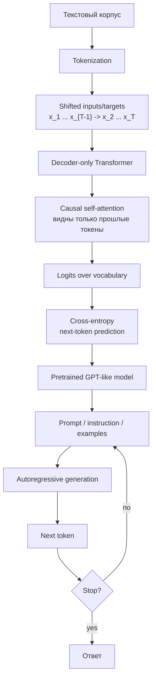

# GPT Like Models

Source: `DL_exam.pdf`, Question 36

Original question:

> GPT-подобные модели. Autoregressive generation, next-token prediction, decoder-only архитектура, in-context learning.

## Интуиция

GPT-подобная модель учится продолжать текст. Во время обучения ей дают последовательность токенов и просят на каждой позиции предсказать следующий токен. Это простая `self-supervised` задача: правильный ответ уже содержится в тексте, поэтому не нужна ручная разметка. Если модель хорошо предсказывает продолжение во многих контекстах, она постепенно учит грамматику, стиль, факты, шаблоны рассуждения, формат инструкций и связи между примерами.

Архитектурно GPT-like модели обычно являются `decoder-only Transformer`: это стек Transformer-блоков с `causal mask`, где токен может смотреть только на себя и предыдущие токены, но не на будущие. Такое ограничение делает обучение согласованным с генерацией: на inference модель тоже идет слева направо, каждый раз выбирает следующий токен и добавляет его в контекст.

`In-context learning` возникает из той же идеи продолжения текста. Если в prompt поместить инструкцию или несколько примеров "вход -> ответ", модель условно продолжает этот контекст в том же формате. Веса модели при этом не меняются: задача задается самим контекстом, а не отдельным `fine-tuning`.

## Что нужно сказать на экзамене

- GPT-like модели решают `causal language modeling`: оценивают $p_\theta(x_t \mid x_{<t})$ и раскладывают вероятность текста слева направо.
- Основная обучающая цель -- `next-token prediction` с `cross-entropy loss` по сдвинутым на один токен targets.
- Во время обучения используется `teacher forcing`: модель получает истинные предыдущие токены, а не свои сгенерированные ошибки.
- `Decoder-only` архитектура: token embeddings, positional information, стек блоков masked multi-head self-attention + FFN, residual connections, LayerNorm, output softmax over vocabulary.
- `Causal mask` запрещает attention к будущим позициям, поэтому модель не подглядывает в правильный ответ.
- `Autoregressive generation`: начать с prompt, многократно считать распределение следующего токена, выбрать токен decoding-стратегией, добавить его к контексту и повторить.
- `In-context learning`: модель решает задачу по инструкции и примерам внутри prompt без обновления параметров.
- Сильные стороны: простая масштабируемая цель, хороший режим генерации, универсальность через prompting, применимость к chat, code generation, summarization, QA.
- Ограничения: последовательная генерация медленная, возможны hallucinations, чувствительность к prompt, ограниченное context window, отсутствие полноценного bidirectional представления текущего токена.

## Подробный ответ

GPT-like модели -- это семейство языковых моделей, обучаемых предсказывать следующий токен по уже увиденным токенам. Пусть текст после tokenization представлен последовательностью

$$
x = (x_1, x_2, \dots, x_T),
$$

где $x_t$ -- дискретный токен из словаря $V$. Модель параметризует условное распределение следующего токена:

$$
p_\theta(x_t \mid x_1, \dots, x_{t-1}).
$$

По правилу цепочки вероятность всей последовательности можно записать как

$$
p_\theta(x_1, \dots, x_T) = \prod_{t=1}^{T} p_\theta(x_t \mid x_{<t}).
$$

Это называется `autoregressive` factorization. Слово autoregressive означает, что каждый следующий элемент генерируется на основе уже имеющихся предыдущих элементов.

### Next-token prediction

Обучение строится как задача классификации на каждом временном шаге. На вход подается последовательность токенов, а target -- та же последовательность, сдвинутая на один токен вперед:

| Input positions | $x_1$ | $x_2$ | $x_3$ | $\dots$ | $x_{T-1}$ |
|---|---|---|---|---|---|
| Targets | $x_2$ | $x_3$ | $x_4$ | $\dots$ | $x_T$ |

Модель на каждой позиции выдает logits размера $|V|$, затем `softmax` превращает их в распределение по словарю. Loss обычно является суммой или средним `negative log-likelihood` правильного следующего токена:

$$
\mathcal{L}_{CLM}(\theta) =
- \sum_{t=1}^{T} \log p_\theta(x_t \mid x_{<t}).
$$

На практике первый токен часто предсказывается из специального начала последовательности, а padding-токены исключаются из loss через mask.

Важное свойство: такая разметка получается автоматически из любого текста. Поэтому GPT-like модели можно pretrain на огромных корпусах без ручных labels. Это не supervised learning в обычном смысле, но цель обучения вполне конкретная: предсказать следующий токен.

### Teacher forcing и отличие training от generation

Во время обучения используется `teacher forcing`: для предсказания $x_t$ модель получает настоящий префикс $x_{<t}$ из обучающего текста. Она не обязана генерировать весь текст своими предыдущими решениями. Это делает обучение параллельным по позициям и стабильным.

Во время генерации ситуация другая. После prompt модель выбирает следующий токен $\hat{x}_{t}$, затем этот выбранный токен становится частью контекста:

$$
\hat{x}_{t} \sim p_\theta(\cdot \mid x_{prompt}, \hat{x}_{<t}).
$$

Если модель сделала ошибку, дальнейшая генерация уже условна на этой ошибке. Это связано с проблемой `exposure bias`: при training модель видит правильные префиксы, а при inference -- собственные сгенерированные префиксы.

### Decoder-only архитектура

GPT-like модель использует только decoder-блоки Transformer, но без encoder и без cross-attention. Каждый блок обычно содержит:

1. `Masked multi-head self-attention`.
2. Residual connection.
3. LayerNorm, часто в варианте `pre-LN` в современных больших моделях.
4. Position-wise feed-forward network или MLP block.
5. Еще одну residual connection и LayerNorm.

Общий pipeline:

1. Токены преобразуются в token embeddings.
2. Добавляется информация о позиции: learned positional embeddings, sinusoidal encoding, RoPE или другой positional mechanism.
3. Последовательность проходит через стек causal Transformer-блоков.
4. Последние hidden states проецируются в logits по словарю.
5. `softmax` дает распределение следующего токена.

Для позиции $i$ self-attention может использовать только позиции $j \le i$. Это реализуется `causal mask`:

$$
M_{ij} =
\begin{cases}
0, & j \le i, \\
-\infty, & j > i.
\end{cases}
$$

Маска добавляется к attention scores до softmax:

$$
\text{Attention}(Q,K,V) =
\text{softmax}\left(\frac{QK^\top}{\sqrt{d_k}} + M\right)V.
$$

Если $j > i$, score получает $-\infty$, и после softmax attention weight становится нулевым. Поэтому модель не может посмотреть на будущие токены.

### Почему decoder-only хорошо подходит для генерации

У decoder-only модели pretraining objective совпадает с inference-процедурой: и там, и там требуется предсказывать следующий токен по префиксу. Это отличие от BERT-like encoder-only моделей, которые обучаются восстанавливать masked токены по левому и правому контексту, но не являются естественными left-to-right генераторами.

Генерация выполняется итеративно:

1. Дать модели prompt $c = (x_1, \dots, x_m)$.
2. Посчитать $p_\theta(x_{m+1} \mid c)$.
3. Выбрать следующий токен: greedy, sampling, top-k, nucleus sampling или beam search.
4. Добавить выбранный токен в контекст.
5. Повторять до stop token, лимита длины или другого stopping criterion.

Такой процесс называется `autoregressive generation`. Главный минус -- последовательность нельзя сгенерировать целиком за один forward pass: токен $t+1$ зависит от уже выбранного токена $t$. Для ускорения inference используют `KV cache`: ключи и значения attention для предыдущих токенов сохраняются, чтобы не пересчитывать весь префикс заново.

### In-context learning

`In-context learning` -- это способность модели выполнять новую задачу, когда описание задачи и примеры даны прямо в prompt. Параметры $\theta$ не обновляются. Модель просто условно продолжает последовательность:

$$
p_\theta(y \mid \text{instruction}, \text{examples}, x).
$$

Типичные варианты:

| Режим | Что находится в prompt | Пример задачи |
|---|---|---|
| `Zero-shot` | Только инструкция | "Translate this sentence into English" |
| `One-shot` | Инструкция и один пример | Один пример перевода, затем новый вход |
| `Few-shot` | Несколько демонстраций | Несколько пар question-answer, затем новый question |

Интуитивно модель видит паттерн в контексте и продолжает его. Например, если prompt содержит несколько пар "русское предложение -> английский перевод", то наиболее вероятным продолжением после нового русского предложения становится английский перевод в том же формате.

Важно: in-context learning не равен обычному обучению с backpropagation. Веса не меняются, optimizer не запускается. "Обучение" происходит только в смысле условного поведения модели внутри текущего context window. После очистки контекста эта конкретная задача не сохраняется как новая настройка параметров.

### Сравнение с BERT-like и T5-like подходами

| Семейство | Архитектура | Attention | Objective | Типичные сильные задачи |
|---|---|---|---|---|
| BERT-like | Encoder-only | Bidirectional self-attention | Masked language modeling | Classification, NER, retrieval, reranking |
| T5-like | Encoder-decoder | Encoder bidirectional, decoder causal + cross-attention | Denoising / text-to-text | Translation, summarization, conditional generation |
| GPT-like | Decoder-only | Causal self-attention | Next-token prediction | Open-ended generation, chat, code, prompting |

GPT-like модели можно использовать и для задач понимания текста, например классификации. Для этого задачу формулируют как генерацию label token или используют hidden state последнего токена. Но если нужна только компактная двунаправленная репрезентация входа, encoder-only модель может быть эффективнее.

### Практические свойства и ограничения

Сильные стороны GPT-like подхода:

- простая self-supervised цель, применимая почти к любому тексту;
- хорошая масштабируемость по данным, параметрам и compute;
- естественная генерация длинных ответов;
- возможность решать разные задачи через instructions и examples;
- единый интерфейс "текст на вход, текст на выход".

Ограничения:

- генерация последовательна, поэтому latency растет с длиной ответа;
- self-attention имеет квадратичную сложность по длине контекста при полном attention;
- модель может генерировать правдоподобный, но неверный текст (`hallucination`);
- качество сильно зависит от prompt, decoding-стратегии и обучающего корпуса;
- context window ограничен, а информация вне окна напрямую недоступна;
- модель обучена предсказывать вероятное продолжение, а не гарантированно проверять истинность утверждений.

## Формулы / алгоритмы

### Causal language modeling objective

Дано: корпус токенизированных последовательностей $D$, модель $p_\theta$, длина последовательности $T$.

Цель: максимизировать likelihood текста или минимизировать negative log-likelihood:

$$
\theta^\* =
\arg\max_\theta \sum_{x \in D} \sum_{t=1}^{T}
\log p_\theta(x_t \mid x_{<t}).
$$

Эквивалентная loss:

$$
\mathcal{L}(\theta) =
- \frac{1}{N} \sum_{x \in D} \sum_{t=1}^{T}
\log p_\theta(x_t \mid x_{<t}),
$$

где $N$ -- число непустых target-позиций.

Если logits на позиции $t$ равны $z_t \in \mathbb{R}^{|V|}$, то

$$
p_\theta(x_t = v \mid x_{<t}) =
\frac{\exp z_{t,v}}{\sum_{u \in V} \exp z_{t,u}}.
$$

Loss для правильного токена $x_t$:

$$
\ell_t = -\log p_\theta(x_t \mid x_{<t}).
$$

### Causal mask

Для attention на позициях $1, \dots, T$:

$$
M_{ij} =
\begin{cases}
0, & j \le i, \\
-\infty, & j > i.
\end{cases}
$$

Тогда

$$
a_{ij} =
\text{softmax}_j\left(\frac{q_i^\top k_j}{\sqrt{d_k}} + M_{ij}\right).
$$

Из-за маски $a_{ij}=0$ для всех будущих позиций $j>i$.

### Training algorithm

Вход: корпус текстов $D$, tokenizer, decoder-only Transformer, optimizer.

Выход: pretrained параметры $\theta$.

1. Tokenize texts and pack them into sequences of length up to $T$.
2. Build input tokens and shifted target tokens.
3. Run decoder-only Transformer with causal attention mask.
4. Compute logits for every position.
5. Compute cross-entropy against next-token targets, ignoring padding.
6. Update $\theta$ using backpropagation and optimizer, often AdamW or a related variant.
7. Repeat over many batches; monitor validation perplexity/loss and downstream behavior.

Практические caveats: training параллелен по позициям внутри sequence, но требует causal mask; слишком короткие sequence плохо учат long-range dependencies; качество данных и tokenizer сильно влияют на итоговую модель.

### Autoregressive generation algorithm

Вход: prompt $c$, model $p_\theta$, maximum length $L$, decoding rule.

Выход: generated continuation.

1. Tokenize prompt.
2. Пока не достигнут stop token или лимит $L$:
   - вычислить logits для следующего токена;
   - применить temperature, top-k/top-p или другую decoding rule, если она используется;
   - выбрать токен $\hat{x}$;
   - добавить $\hat{x}$ к текущему контексту;
   - обновить `KV cache`, если он используется.
3. Detokenize generated tokens.

Сложность: full self-attention по контексту длины $T$ требует $O(T^2)$ attention-операций на один полный forward pass. При incremental decoding `KV cache` избегает пересчета старых keys/values, но каждый новый токен все равно attending к уже сгенерированному префиксу.

## Диаграмма или изображение

Внешние изображения не использовались.

## Быстрая устная версия

GPT-подобные модели -- это decoder-only Transformer, обученный на causal language modeling. Модель получает префикс текста и предсказывает следующий токен, поэтому вероятность последовательности раскладывается как произведение $p(x_t \mid x_{<t})$. Чтобы модель не подглядывала в будущее, в self-attention используется causal mask.

При генерации модель работает autoregressive: по prompt выбирает следующий токен, добавляет его в контекст и повторяет. Это хорошо совпадает с обучающей задачей next-token prediction. In-context learning означает, что задача задается инструкцией и примерами прямо в prompt: веса не обновляются, но модель продолжает контекст так, как будто следует показанному формату. Главные плюсы -- масштабируемость и универсальность генерации; главные минусы -- последовательный inference, hallucinations, чувствительность к prompt и ограниченное context window.

## Возможные уточняющие вопросы

- Чем GPT-like модель отличается от BERT-like? GPT-like использует causal decoder-only attention и предсказывает следующий токен; BERT-like использует bidirectional encoder attention и восстанавливает masked токены.
- Почему causal mask обязателен? Без него позиция могла бы смотреть на будущий правильный токен, и next-token prediction стала бы утечкой ответа.
- Что такое teacher forcing? На training модель получает истинные предыдущие токены, а не свои сгенерированные токены.
- Почему generation нельзя полностью параллелить по времени? Токен $t+1$ зависит от выбранного токена $t$, поэтому шаги generation идут последовательно.
- Что такое perplexity? Это экспонента средней negative log-likelihood; чем ниже perplexity, тем лучше модель предсказывает следующий токен на данном распределении данных.
- Почему in-context learning не является fine-tuning? При in-context learning параметры не обновляются; меняется только условный контекст, на котором модель делает prediction.
- Как few-shot prompting работает в GPT-like модели? В prompt помещают несколько демонстраций формата задачи, и модель продолжает последовательность новым ответом в том же паттерне.
- Зачем нужен KV cache? Он сохраняет keys и values для прошлых токенов при autoregressive decoding, уменьшая повторные вычисления на каждом шаге.
- Почему GPT-like модели могут hallucinate? Objective учит генерировать вероятное продолжение текста, а не проверять факты внешним источником истины.

## Частые ошибки

- Говорить, что GPT "понимает задачу" через обновление весов в prompt. При in-context learning веса не меняются.
- Путать decoder-only Transformer с decoder из encoder-decoder Transformer: у GPT-like моделей обычно нет cross-attention к encoder.
- Забывать causal mask и тем самым допускать утечку будущих токенов при training.
- Считать next-token prediction слишком простой и поэтому бесполезной. Простота цели компенсируется масштабом данных, модели и compute.
- Называть autoregressive generation полностью параллельной. Training по позициям параллелится, но generation идет последовательно.
- Смешивать greedy decoding и саму модель. Модель задает распределение, а greedy, sampling, top-k или top-p -- это разные способы выбирать токен из него.
- Утверждать, что низкая perplexity гарантирует фактическую правильность. Она измеряет предсказание текста на распределении, а не истинность ответа.
- Забывать про context window: модель не может напрямую использовать токены, которые не помещены в текущий контекст.
