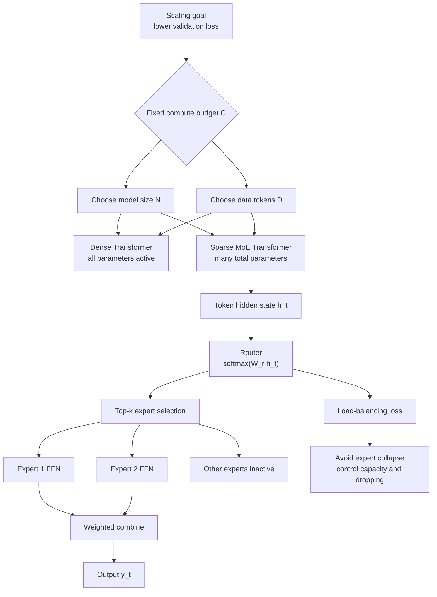

# Transformer Scaling and MoE

Source: `DL_exam.pdf`, Question 37

Original question:

> Масштабирование трансформеров и MoE. Scaling laws, compute/data/model size, sparse experts, router, балансировка экспертов.

## Интуиция

Масштабирование трансформеров отвечает на вопрос: что выгоднее увеличивать, если у нас есть ограниченный бюджет вычислений, -- число параметров, объем данных, длину контекста, batch size или время обучения. Эмпирически для language models качество часто улучшается плавно и предсказуемо при росте `compute`, `data` и `model size`: validation loss убывает по степенным законам, пока не упирается в качество данных, архитектурные ограничения или переобучение.

Главная идея `scaling laws`: большая модель сама по себе не гарантирует лучший результат. Если параметров много, а токенов мало, модель недообучена по данным или переобучается на корпус. Если токенов много, а модель слишком маленькая, она не имеет достаточной емкости. Поэтому для фиксированного `compute budget` нужно искать compute-optimal баланс между параметрами $N$ и числом training tokens $D$.

`Mixture of Experts` (`MoE`) -- способ увеличить число параметров без пропорционального увеличения вычислений на каждый токен. Вместо одного dense feed-forward блока модель содержит много экспертов, но для каждого токена `router` выбирает только $k$ экспертов, обычно $k=1$ или $k=2$. Поэтому общее число параметров большое, а active parameters per token остаются сравнительно малыми. Проблема MoE в том, что router может отправлять почти все токены к нескольким экспертам, поэтому нужны loss для балансировки, capacity limits и аккуратная distributed implementation.

## Что нужно сказать на экзамене

- `Scaling laws` -- эмпирические зависимости loss от размера модели $N$, числа обучающих токенов $D$ и compute $C$.
- Для dense Transformer часто используют приближение training compute $C \approx 6ND$ FLOPs для autoregressive LM, если внимание и служебные расходы не доминируют.
- Типичная форма закона: $\mathcal{L}(N,D) = \mathcal{L}_\infty + aN^{-\alpha} + bD^{-\beta}$; это не строгая теорема, а эмпирическая модель.
- Compute-optimal scaling: при фиксированном $C$ надо одновременно увеличивать и параметры, и данные; слишком большая модель на малом корпусе -- не оптимальна.
- `Model size`: число параметров, depth, width, число attention heads, размер FFN, vocabulary embeddings, context length. Рост контекста также увеличивает стоимость attention.
- `Data size`: число уникальных и качественных tokens; важны deduplication, mixture данных, contamination, curriculum и повторение данных.
- Dense Transformer активирует почти все параметры на каждый токен; MoE активирует только выбранных экспертов.
- В Transformer MoE обычно заменяет dense FFN/SwiGLU блок на набор expert FFN.
- `Router` получает hidden state токена, вычисляет scores по экспертам, выбирает top-$k$, dispatches токены к экспертам и смешивает outputs с routing weights.
- `Sparse experts`: много параметров хранится в экспертных FFN, но на токен работает только малая часть.
- Балансировка экспертов нужна, чтобы избежать `expert collapse`, перегрузки отдельных экспертов, token dropping и плохого использования capacity.
- Основные механизмы балансировки: auxiliary load-balancing loss, capacity factor, router noise, ограничения на число токенов на эксперта, expert parallelism.
- Trade-off MoE: лучшее качество при фиксированном active compute, но сложнее обучение, коммуникация между устройствами, нестабильный router и неравномерная нагрузка.

## Подробный ответ

### Что масштабируется в Transformer

При pretraining Transformer language model обычно масштабируют несколько величин:

| Величина | Обозначение | Что означает | Главный риск |
|---|---:|---|---|
| Model size | $N$ | число trainable parameters | слишком большая модель без достаточных данных |
| Data size | $D$ | число training tokens | низкое качество, повторения, contamination |
| Compute | $C$ | FLOPs или accelerator time | неэффективный баланс $N$ и $D$ |
| Context length | $T$ | число токенов в окне | quadratic attention cost |
| Batch size | $B$ | tokens или sequences per update | плохая оптимизация при слишком малом или большом batch |

Для decoder-only Transformer основные параметры находятся в attention projections, MLP/FFN блоках, embeddings и output head. В современных LLM большая часть параметров слоя часто находится именно в FFN/SwiGLU части, поэтому MoE обычно заменяет dense FFN на несколько expert FFN.

Для sequence length $T$, hidden size $d$, числа слоев $L$ и batch size $B$ грубая стоимость dense слоя:

- linear projections и FFN: примерно $O(BT d^2)$;
- self-attention scores: примерно $O(BT^2 d)$;
- при очень длинном контексте attention term начинает доминировать.

Поэтому "увеличить модель" -- не одно действие. Можно увеличить width $d$, depth $L$, FFN expansion, число heads, vocabulary, context length или число experts. Эти варианты по-разному влияют на compute, memory, latency и качество.

### Scaling laws

`Scaling laws` -- это эмпирические зависимости, показывающие, что loss языковой модели часто убывает примерно как power law при увеличении масштаба. Удобная модель:

$$
\mathcal{L}(N,D) = \mathcal{L}_\infty + aN^{-\alpha} + bD^{-\beta},
$$

где:

- $\mathcal{L}_\infty$ -- irreducible loss, связанный с неоднозначностью языка и шумом данных;
- $N$ -- число параметров;
- $D$ -- число токенов;
- $a,b,\alpha,\beta$ -- эмпирически подбираемые константы.

Смысл формулы: вклад ошибки от недостаточной емкости модели убывает с ростом $N$, а вклад ошибки от недостатка данных убывает с ростом $D$. Если одна величина сильно меньше compute-optimal уровня, она становится bottleneck.

Для autoregressive dense LM часто используют приближение:

$$
C \approx 6ND,
$$

где $C$ -- training compute в FLOPs, $N$ -- число non-embedding или всех параметров в зависимости от оценки, $D$ -- число tokens. Коэффициент $6$ отражает forward и backward pass для dense матричных умножений и является приближением: attention, optimizer overhead, embeddings, sequence length и hardware efficiency могут менять реальную стоимость.

При фиксированном compute:

$$
D \approx \frac{C}{6N}.
$$

Если выбрать слишком большое $N$, то $D$ станет малым: модель будет недотренирована по токенам. Если выбрать слишком малое $N$, то данных будет много, но модель не сможет выразить сложное распределение. Compute-optimal scaling ищет пару $(N^*,D^*)$, минимизирующую validation loss при заданном $C$:

$$
(N^*,D^*) = \arg\min_{N,D} \mathcal{L}(N,D)
\quad \text{subject to} \quad 6ND \le C.
$$

Практический вывод: при росте бюджета нужно увеличивать и модель, и данные. Известное правило из compute-optimal dense LM: training tokens должны расти вместе с parameters; в ряде экспериментов для dense autoregressive моделей хороший порядок -- десятки токенов на параметр, но это не универсальная константа, потому что зависит от данных, архитектуры, tokenizer, objective и оценки качества.

### Compute, data и model size: типичные режимы

Есть три важных режима:

| Режим | Симптом | Что делать |
|---|---|---|
| Model-limited | loss перестает улучшаться, модель слишком мала | увеличить $N$, depth/width/FFN или использовать MoE |
| Data-limited | train loss падает, validation хуже; много повторов | добавить качественные данные, deduplication, меньше epochs |
| Compute-limited | есть данные и архитектура, но мало FLOPs | искать compute-optimal $N,D$, mixed precision, parallelism |

Качество данных часто важнее простого числа токенов. Низкокачественные, дублированные или contaminated данные могут ухудшить generalization и исказить оценку. Для экзамена важно сказать, что scaling laws работают на устойчивых распределениях и сопоставимых training setups; они плохо переносятся буквально между разными tokenizer, corpus mixture, architecture, optimizer и eval set.

### Dense Transformer против Sparse MoE

В dense Transformer каждый токен проходит через одни и те же блоки. Если модель имеет $N$ параметров, то большая доля этих параметров активируется для каждого токена. Это просто, стабильно и хорошо нагружает hardware, но рост $N$ почти прямо увеличивает compute и memory bandwidth.

В `Mixture of Experts` есть $E$ экспертов, обычно каждый эксперт -- отдельный FFN/SwiGLU:

$$
\operatorname{Expert}_i(h) = W_{2,i}\,\sigma(W_{1,i}h),
$$

или gated вариант вроде SwiGLU. Для каждого токена hidden state $h_t$ router выбирает только $k$ экспертов. Если $k \ll E$, то active compute на токен близок к compute $k$ FFN, а total parameters включают параметры всех $E$ экспертов.

Сравнение:

| Свойство | Dense FFN | MoE FFN |
|---|---|---|
| Параметры | один общий FFN | много expert FFN |
| Active experts per token | все dense параметры блока | top-$k$ экспертов |
| Compute per token | растет с размером FFN | растет с $k$, а не напрямую с $E$ |
| Capacity | ограничена dense параметрами | больше total parameters |
| Стабильность | проще | сложнее из-за router и load balancing |
| Distributed cost | предсказуемее | нужен dispatch, all-to-all communication |

MoE полезен, когда хотим увеличить capacity модели без пропорционального роста inference/training FLOPs на токен. Но "sparse" не означает бесплатно: хранение параметров, коммуникация, routing, неравномерные нагрузки и batch fragmentation становятся серьезными инженерными ограничениями.

### Router

`Router` или `gating network` решает, к каким экспертам отправить каждый токен. Пусть $h_t \in \mathbb{R}^d$ -- hidden state токена, $E$ -- число экспертов. Router вычисляет logits:

$$
z_t = W_r h_t,
$$

а затем вероятности:

$$
p_{t,i} = \operatorname{softmax}(z_t)_i.
$$

Для top-$k$ routing выбирается множество:

$$
S_t = \operatorname{TopK}(p_t, k).
$$

Выход MoE-слоя:

$$
y_t = \sum_{i \in S_t} g_{t,i}\operatorname{Expert}_i(h_t),
$$

где $g_{t,i}$ -- нормированные routing weights, например softmax probabilities только по выбранным экспертам.

Типичный pipeline MoE layer:

1. Для каждого токена получить hidden state $h_t$.
2. Router считает scores по всем $E$ экспертам.
3. Выбрать top-$k$ experts.
4. Dispatch: сгруппировать токены по выбранным экспертам.
5. Каждый эксперт обрабатывает свою группу токенов.
6. Combine: вернуть outputs на исходные позиции и взвесить routing weights.
7. Добавить auxiliary losses для balanced routing.

Router обучается через общий task loss, потому что выбор экспертов влияет на output модели. Но hard top-$k$ дискретен, поэтому на практике используют differentiable gating weights, straight-through-like поведение top-k selection и auxiliary objectives. При top-1 routing проще compute, но выше риск token dropping и expert collapse; при top-2 routing выше compute, зато обычно устойчивее обучение и лучше mixing.

### Балансировка экспертов

Без специальных мер router может выбрать несколько популярных экспертов для большинства токенов. Это плохо по нескольким причинам:

- часть experts почти не обучается;
- перегруженные experts превышают capacity;
- появляются dropped tokens или padding waste;
- distributed devices простаивают неравномерно;
- модель теряет смысл sparse capacity.

Балансировка стремится сделать так, чтобы все эксперты получали примерно сопоставимое число токенов, но без полного запрета specialization. Эксперты могут специализироваться на типах токенов, языках, доменах или синтаксических паттернах, но routing не должен коллапсировать.

Один распространенный auxiliary loss использует две величины:

- $f_i$ -- доля токенов batch, реально назначенных эксперту $i$;
- $P_i$ -- средняя router probability для эксперта $i$ по batch.

Тогда load-balancing loss можно записать как:

$$
\mathcal{L}_{balance} = \lambda E \sum_{i=1}^{E} f_i P_i.
$$

При равномерном использовании $f_i \approx \frac{1}{E}$ и $P_i \approx \frac{1}{E}$. Множитель $E$ или $E^2$ зависит от конкретной нормировки; смысл не в коэффициенте, а в штрафе за несогласованное и неравномерное использование experts. Общая функция потерь:

$$
\mathcal{L} = \mathcal{L}_{LM} + \mathcal{L}_{balance} + \mathcal{L}_{router},
$$

где $\mathcal{L}_{router}$ может включать z-loss, entropy regularization или другие стабилизирующие члены.

`Capacity factor` ограничивает число токенов, которые эксперт может обработать в batch:

$$
\text{capacity} = \left\lceil \frac{\text{tokens per batch}}{E} \cdot \text{capacity factor} \right\rceil.
$$

Если эксперт получает больше токенов, лишние токены могут быть dropped, отправлены к следующему эксперту или обработаны fallback-механизмом. Большой capacity factor уменьшает dropping, но увеличивает padding и compute waste; маленький capacity factor улучшает эффективность, но повышает риск потери токенов.

### Практические сложности MoE

MoE добавляет несколько нестабильностей:

- `expert collapse`: router выбирает малое число experts;
- `routing instability`: небольшие изменения router logits резко меняют assignment;
- `communication overhead`: при expert parallelism токены пересылаются между devices через all-to-all;
- `memory pressure`: total parameters велики, даже если active compute мал;
- `batch size sensitivity`: для балансировки нужен достаточно большой batch tokens;
- `fine-tuning difficulty`: на малых данных router может переобучаться или деградировать.

Чтобы MoE работал, обычно используют:

- auxiliary load-balancing loss;
- router noise или jitter во время обучения;
- top-1/top-2 routing с capacity limits;
- expert parallelism и efficient all-to-all;
- mixed precision, но router иногда считают в более стабильной точности;
- gradient clipping и аккуратный learning rate schedule.

Важно различать `total parameters` и `active parameters`. MoE может иметь триллион total parameters, но для одного токена активировать только малую долю. Поэтому сравнивать dense и MoE модели нужно по нескольким осям: качество, active FLOPs, total memory, latency, throughput, batch size и hardware utilization.

## Формулы / алгоритмы

### Scaling laws и compute-optimal выбор

Эмпирическая loss model:

$$
\mathcal{L}(N,D) = \mathcal{L}_\infty + aN^{-\alpha} + bD^{-\beta}.
$$

Dense LM training compute:

$$
C \approx 6ND.
$$

Compute-optimal задача:

$$
\min_{N,D} \mathcal{L}(N,D)
\quad \text{при условии} \quad 6ND \le C.
$$

Интерпретация:

- если $aN^{-\alpha}$ велик, model capacity недостаточна;
- если $bD^{-\beta}$ велик, данных недостаточно;
- оптимальное масштабирование уменьшает оба слагаемых вместе.

### Top-k MoE routing

Вход: hidden states $H = (h_1,\dots,h_T)$, experts $\operatorname{Expert}_1,\dots,\operatorname{Expert}_E$, router matrix $W_r$, число active experts $k$, capacity per expert.

Выход: transformed states $Y = (y_1,\dots,y_T)$.

1. Для каждого токена $t$ вычислить router logits:

$$
z_t = W_rh_t.
$$

2. Получить probabilities:

$$
p_t = \operatorname{softmax}(z_t).
$$

3. Выбрать experts:

$$
S_t = \operatorname{TopK}(p_t,k).
$$

4. Dispatch токен $h_t$ к экспертам из $S_t$, если capacity не превышена.
5. Каждый эксперт применяет свой FFN:

$$
u_{t,i} = \operatorname{Expert}_i(h_t).
$$

6. Combine:

$$
y_t = \sum_{i \in S_t} g_{t,i}u_{t,i}.
$$

7. Оптимизировать:

$$
\mathcal{L} = -\sum_t \log p_\theta(x_t \mid x_{<t}) + \lambda E \sum_{i=1}^{E} f_iP_i.
$$

### Complexity caveat

Для dense FFN с hidden size $d$ и expansion $m$ стоимость на токен примерно:

$$
O(dm + md) = O(dm).
$$

Для MoE с $E$ экспертами и top-$k$ routing:

$$
\text{active FFN compute per token} \approx O(kdm),
$$

но total FFN parameters:

$$
\text{total expert params} \approx E \cdot O(dm).
$$

То есть MoE увеличивает parameter capacity примерно пропорционально $E$, а compute на токен -- пропорционально $k$, плюс routing и communication overhead.

## Диаграмма или изображение

Внешние изображения не использовались.

## Быстрая устная версия

Масштабирование трансформеров изучает, как качество зависит от числа параметров, данных и compute. Эмпирически validation loss часто убывает по power law: $\mathcal{L}(N,D)=\mathcal{L}_\infty+aN^{-\alpha}+bD^{-\beta}$. Для dense autoregressive LM грубо $C \approx 6ND$, поэтому при фиксированном compute нельзя просто делать модель максимально большой: ей не хватит токенов. Compute-optimal подход увеличивает модель и данные вместе.

MoE -- это sparse способ увеличить capacity. Вместо одного FFN в слое есть много expert FFN, но router для каждого токена выбирает только top-$k$ экспертов. Поэтому total parameters большие, а active compute на токен умеренный. Главная трудность -- балансировка: router может перегрузить несколько экспертов. Поэтому используют load-balancing loss, capacity factor, router noise и expert parallelism. На экзамене важно различать total parameters, active parameters и реальный hardware cost.

## Возможные уточняющие вопросы

- Почему $C \approx 6ND$ только приближение? Потому что оно учитывает основные dense forward/backward FLOPs, но не полностью отражает attention overhead, sequence length, optimizer, embeddings, communication и hardware efficiency.
- Что значит compute-optimal model? Это модель, у которой при заданном бюджете FLOPs параметры и число токенов выбраны так, чтобы минимизировать validation loss.
- Почему нельзя просто увеличить число параметров? При фиксированном compute увеличение $N$ уменьшает доступное число training tokens $D$, и модель может стать data-limited или undertrained.
- Чем MoE отличается от ensemble? В ensemble несколько моделей обычно дают несколько полных predictions, а MoE внутри одного слоя маршрутизирует каждый токен к малому числу экспертов и обучается end-to-end.
- Где в Transformer обычно ставят MoE? Обычно вместо dense FFN/SwiGLU блока в некоторых или всех слоях, а attention часто остается dense.
- Что такое router? Небольшая gating network, которая по hidden state токена выбирает top-$k$ экспертов и задает веса их outputs.
- Что такое expert collapse? Ситуация, когда router отправляет большинство токенов к нескольким экспертам, а остальные почти не используются.
- Зачем нужен load-balancing loss? Чтобы эксперты получали сопоставимую нагрузку, лучше обучались и не возникали перегрузка capacity и token dropping.
- Что такое capacity factor? Коэффициент, задающий максимальное число токенов на эксперта относительно равномерного распределения.
- Почему MoE может быть медленнее dense модели при похожих FLOPs? Из-за all-to-all communication, неравномерной нагрузки, padding, routing overhead и плохого hardware utilization.
- Что сравнивать у dense и MoE моделей? Validation loss, downstream quality, active FLOPs, total parameters, memory, latency, throughput и стабильность обучения.

## Частые ошибки

- Говорить, что scaling laws -- строгий математический закон. Это эмпирическая аппроксимация для конкретных распределений данных и training setup.
- Сравнивать модели только по числу параметров. Для MoE особенно важно различать total parameters и active parameters per token.
- Игнорировать данные: большая модель на малом или плохом корпусе не является compute-optimal.
- Считать, что больше epochs всегда полезно. Повторение одних и тех же токенов может привести к переобучению и хуже заменить новые качественные данные.
- Забывать про quadratic cost attention по длине контекста $T$.
- Называть MoE бесплатным способом масштабирования. Он экономит active compute, но добавляет memory, routing и communication overhead.
- Думать, что router выбирает одного эксперта для всей последовательности. Обычно routing делается per token.
- Не упоминать балансировку экспертов. Без нее MoE часто коллапсирует в несколько перегруженных experts.
- Путать load-balancing loss и основной LM loss. Первый стабилизирует routing, второй обучает языковую задачу.
- Считать равномерную загрузку полной противоположностью specialization. Хороший MoE допускает специализацию, но не допускает разрушительную неравномерность.
- Забывать про capacity limits и token dropping при перегрузке экспертов.
- Сравнивать dense и MoE только по theoretical FLOPs, не учитывая real hardware throughput.
