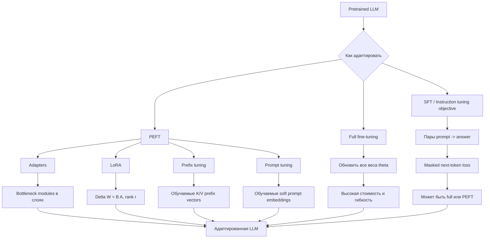

# LLM Fine Tuning

Source: `DL_exam.pdf`, Question 38

Original question:

> Дообучение LLM. Full fine-tuning, supervised fine-tuning, instruction tuning, PEFT, adapters, LoRA, prefix/prompt tuning.

## Интуиция

Базовая LLM после pretraining хорошо продолжает текст, потому что училась предсказывать следующий токен на большом корпусе. Но для практического использования часто нужно не просто продолжение текста, а поведение в конкретном формате: отвечать на инструкции, писать код в нужном стиле, извлекать данные, следовать доменной терминологии, решать диалоги или пользоваться ограниченным набором шаблонов.

Fine-tuning - это этап адаптации уже обученной модели к новой задаче или новому распределению данных. Идея проста: не учить языковую модель с нуля, а взять знания из pretraining и немного изменить параметры или добавить небольшие обучаемые модули. Чем больше параметров меняем, тем больше гибкость, но выше стоимость, риск overfitting и риск забыть старые способности. Чем меньше параметров меняем, тем дешевле обучение и хранение адаптаций, но ниже предельная выразительность.

В oral exam важно разделять несколько уровней: `full fine-tuning` обновляет все веса модели; `supervised fine-tuning` задает supervised objective на парах input-output; `instruction tuning` является частным случаем SFT на инструкциях и диалогах; `PEFT` обновляет только небольшую часть параметров; `adapters`, `LoRA`, `prefix tuning` и `prompt tuning` - разные способы сделать PEFT.

## Что нужно сказать на экзамене

- Fine-tuning LLM - адаптация pretrained модели $p_{\theta_0}$ к данным задачи $D$ с помощью дальнейшего обучения.
- Основной objective для causal LLM обычно остается next-token cross-entropy, но считается только по нужным output-токенам:

$$
\mathcal{L}_{\text{SFT}}(\theta) =
- \sum_{(x,y)\in D}\sum_{t=1}^{|y|}
\log p_\theta(y_t \mid x, y_{<t})
$$

- `Full fine-tuning`: обновляются все параметры $\theta$ модели. Максимальная гибкость, но высокая память, compute, риск catastrophic forgetting, нужен аккуратный learning rate.
- `Supervised fine-tuning` (`SFT`): обучение на размеченных примерах "вход -> правильный ответ"; может быть полным или parameter-efficient.
- `Instruction tuning`: SFT на данных с инструкциями, часто в формате prompt/response или chat; улучшает следование пользовательским командам и форматам.
- `PEFT` (`parameter-efficient fine-tuning`): большая модель заморожена, обучается малая доля параметров $\phi$, например adapters, LoRA, prefix/prompt vectors.
- `Adapters`: небольшие bottleneck MLP-модули вставляются в слои Transformer; обучаются только они.
- `LoRA`: низкоранговое обновление весовой матрицы: вместо обучения полного $\Delta W$ учим $\Delta W = BA$, где $r \ll \min(d_{\text{in}}, d_{\text{out}})$.
- `Prefix tuning`: к hidden states/key-value attention добавляются обучаемые virtual prefix vectors для каждого слоя.
- `Prompt tuning`: обучаются только soft prompt embeddings во входной последовательности, веса модели заморожены.
- Практические риски: переобучение на маленьком датасете, деградация общих способностей, data leakage, плохой формат данных, несогласованность chat template, forgetting, hallucination, токсичность и несоблюдение safety policy.

## Подробный ответ

### Общая постановка

Пусть есть pretrained LLM с параметрами $\theta_0$ и распределением:

$$
p_{\theta_0}(x_1,\ldots,x_T)=\prod_{t=1}^{T}p_{\theta_0}(x_t \mid x_{<t})
$$

Во время fine-tuning мы берем датасет $D=\{(x^{(i)}, y^{(i)})\}_{i=1}^{N}$, где $x$ - prompt, инструкция, контекст или диалоговая история, а $y$ - целевой ответ. Цель - получить модель $p_\theta(y \mid x)$, которая лучше работает на целевом распределении.

Для autoregressive decoder-only LLM обучение обычно делается через teacher forcing: на шаге $t$ модель получает правильные предыдущие токены $y_{<t}$ и предсказывает следующий токен $y_t$. Если prompt-токены не должны оптимизироваться, их маскируют в loss.

Важно: fine-tuning не "добавляет знания гарантированно". Он меняет вероятностное поведение модели. Если требуется надежное добавление фактов, часто лучше использовать RAG или внешний инструмент, а fine-tuning применять для стиля, формата, доменной терминологии, классификационных схем и процедур ответа.

### Full fine-tuning

`Full fine-tuning` означает, что все параметры Transformer обновляются через backpropagation:

$$
\theta^\* = \arg\min_\theta \mathcal{L}_{D}(\theta)
$$

Преимущества:

- максимальная выразительность: можно сильно адаптировать модель к домену или задаче;
- подходит, когда данных много и задача существенно отличается от pretraining/instruction data;
- не требует специальных inference-модулей, потому что все изменения уже в основных весах.

Недостатки:

- высокая стоимость: надо хранить optimizer states и gradients для всех параметров;
- для Adam память на training может быть во много раз больше размера модели;
- риск `catastrophic forgetting`: модель теряет часть прежних навыков;
- сложнее поддерживать много доменных версий: каждая версия - отдельная копия всех весов;
- нужен careful tuning learning rate, batch size, schedule, weight decay, gradient clipping.

На практике full fine-tuning чаще применяют для моделей умеренного размера, при большом качественном датасете или когда PEFT недостаточно.

### Supervised fine-tuning

`Supervised fine-tuning` (`SFT`) - это обучение на размеченных примерах правильного поведения. Для LLM это обычно пары:

```text
instruction/context -> target answer
```

или chat-формат:

```text
system message + user message + assistant answer
```

Objective:

$$
\mathcal{L}_{\text{SFT}}(\theta) =
- \frac{1}{N}\sum_{i=1}^{N}
\sum_{t=1}^{|y^{(i)}|}
\log p_\theta\left(y_t^{(i)} \mid x^{(i)}, y_{<t}^{(i)}\right)
$$

Если используется mask, то loss считается только на assistant/output-токенах:

$$
\mathcal{L}_{\text{masked}}(\theta) =
- \sum_{t=1}^{T} m_t \log p_\theta(z_t \mid z_{<t}),
\quad m_t \in \{0,1\}
$$

где $z$ - вся chat-последовательность, а $m_t=1$ только для токенов целевого ответа.

SFT улучшает имитацию целевых ответов, но не обязательно делает модель aligned с человеческими предпочтениями. Если в данных есть один "правильный" ответ, модель учится воспроизводить его. Если важно предпочитать один стиль ответа другому, далее применяют preference tuning, например RLHF, DPO или похожие методы.

### Instruction tuning

`Instruction tuning` - это SFT на большом наборе инструкций и ответов. Его цель - научить модель понимать, что пользовательская фраза является командой, и следовать ей в нужном формате.

Примеры инструкций:

- "Суммируй текст в трех пунктах";
- "Переведи на английский";
- "Извлеки JSON с полями...";
- "Реши задачу и объясни шаги";
- "Ответь как ассистент в диалоге".

Instruction tuning обычно использует смесь задач, чтобы модель не переобучалась на один шаблон. Часто задаются роли через `system`, `user`, `assistant`, поэтому важно использовать тот же chat template при inference, что и при обучении.

Отличие от обычного task-specific SFT: task-specific SFT оптимизирует конкретную задачу, например классификацию отзывов или генерацию SQL. Instruction tuning учит общей способности следовать инструкциям разных типов.

### PEFT

`PEFT` (`parameter-efficient fine-tuning`) - семейство методов, где базовые параметры $\theta_0$ обычно заморожены, а обучается небольшой набор параметров $\phi$:

$$
\theta = \theta_0 \quad \text{frozen}, \qquad
\phi^\* = \arg\min_\phi \mathcal{L}_{D}(\theta_0, \phi)
$$

Идея: большая LLM уже содержит много полезных представлений, поэтому для адаптации часто достаточно изменить малое подпространство вычислений. Это снижает стоимость training и позволяет хранить много адаптеров для одной базовой модели.

Плюсы PEFT:

- меньше trainable parameters;
- меньше GPU memory для gradients и optimizer states;
- можно хранить отдельные адаптации для разных задач;
- ниже риск разрушить базовую модель;
- часто быстро сходится на небольших датасетах.

Минусы:

- ограниченная выразительность по сравнению с full fine-tuning;
- качество зависит от места вставки параметров и rank/размера prefix;
- иногда требуется правильная комбинация с quantization, learning rate и target modules;
- не все PEFT-методы одинаково удобны для inference.

### Adapters

`Adapters` - небольшие обучаемые модули, вставленные внутрь каждого или некоторых Transformer layers. Обычно это bottleneck MLP:

$$
\operatorname{Adapter}(h) = h + W_{\text{up}} f(W_{\text{down}} h)
$$

где $W_{\text{down}}\in \mathbb{R}^{r\times d}$, $W_{\text{up}}\in \mathbb{R}^{d\times r}$, $r \ll d$, $f$ - нелинейность. Residual connection сохраняет исходное представление, а bottleneck ограничивает число параметров.

Adapters могут вставляться после self-attention, после feed-forward block или в оба места. Базовые веса Transformer заморожены, обучаются только adapter parameters, иногда вместе с layer norm или output head.

Плюс adapters - модульность: можно подключать разные adapters к одной модели. Минус - они добавляют операции в forward pass и могут немного увеличить latency.

### LoRA

`LoRA` (`Low-Rank Adaptation`) исходит из предположения, что полезное изменение весов при fine-tuning имеет низкий ранг. Для линейного слоя:

$$
y = Wx
$$

вместо обучения полной матрицы $W+\Delta W$ замораживают $W$ и учат:

$$
y = Wx + \Delta W x, \qquad \Delta W = BA
$$

где:

$$
A \in \mathbb{R}^{r \times d_{\text{in}}}, \quad
B \in \mathbb{R}^{d_{\text{out}} \times r}, \quad
r \ll \min(d_{\text{in}}, d_{\text{out}})
$$

Часто используется масштабирование:

$$
y = Wx + \frac{\alpha}{r}BAx
$$

В начале обучения обычно $B$ инициализируют нулями, чтобы $\Delta W=0$ и модель стартовала с поведения pretrained модели. LoRA часто применяют к матрицам attention: $W_q$, $W_k$, $W_v$, $W_o$, а иногда и к MLP projections.

Количество параметров для полного обновления матрицы:

$$
d_{\text{out}}d_{\text{in}}
$$

Количество LoRA-параметров:

$$
r(d_{\text{in}} + d_{\text{out}})
$$

Если $r$ мал, экономия большая. После обучения LoRA-обновление можно merge into weights:

$$
W' = W + \frac{\alpha}{r}BA
$$

Это удобно для inference, потому что можно не добавлять отдельную ветку вычислений.

### Prefix tuning и prompt tuning

`Prompt tuning` обучает набор непрерывных embeddings, которые добавляются в начало входа. Эти векторы не являются обычными словами; это `soft prompts`. Модель заморожена, обучаются только embeddings:

$$
\tilde{x} = [p_1,\ldots,p_k, x_1,\ldots,x_n]
$$

где $p_1,\ldots,p_k$ - обучаемые prompt embeddings.

`Prefix tuning` похож, но обычно добавляет обучаемые prefix vectors глубже в Transformer, чаще как дополнительные key/value vectors в attention для каждого слоя:

$$
\operatorname{Attention}(Q, [K_p;K], [V_p;V])
$$

где $K_p,V_p$ - обучаемые prefix key/value. Это влияет на attention во всех позициях и слоях, не меняя основных весов модели.

Различие:

- prompt tuning действует в основном на входном embedding-уровне;
- prefix tuning добавляет управляемый контекст в hidden states или attention key/value на слоях;
- prefix tuning обычно выразительнее, но имеет больше параметров и может быть сложнее в реализации.

### Сравнение методов

| Метод | Что обучается | Стоимость | Выразительность | Inference |
|---|---|---:|---:|---|
| Full fine-tuning | Все веса модели | Очень высокая | Максимальная | Обычный forward |
| SFT | Objective и данные; параметры могут быть full или PEFT | Зависит от реализации | Зависит от реализации | Зависит от реализации |
| Instruction tuning | Модель на instruction/chat данных | Зависит от реализации | Улучшает следование инструкциям | Важен chat template |
| Adapters | Bottleneck-модули в слоях | Низкая/средняя | Средняя | Добавляют модули и latency |
| LoRA | Low-rank матрицы $A,B$ | Низкая | Часто высокая для малой цены | Можно merge |
| Prefix tuning | Prefix key/value или hidden vectors | Низкая | Средняя | Увеличивает эффективную длину контекста |
| Prompt tuning | Soft prompt embeddings | Очень низкая | Ниже, особенно для малых моделей | Уменьшает доступный context length |

### Когда какой метод выбирать

Full fine-tuning выбирают, если есть много качественных данных, достаточно compute, сильный domain shift и нужна максимальная адаптация.

SFT выбирают как базовый supervised этап, когда известны правильные ответы. Это основной способ научить модель формату, стилю, доменным процедурам и instruction following.

Instruction tuning нужен, когда модель должна быть ассистентом общего назначения или выполнять разные инструкции, а не одну узкую задачу.

PEFT выбирают, если модель большая, ресурсов мало, нужно много версий под разные задачи или хочется снизить риск забывания. В современных практических сценариях LoRA часто является первым разумным PEFT-бейзлайном.

Adapters удобны для модульной смены задач. Prefix/prompt tuning полезны, когда хочется минимально вмешиваться в модель, но они могут уступать LoRA по качеству на сложных задачах.

## Формулы / алгоритмы

### SFT training pipeline

Цель: адаптировать pretrained LLM к supervised examples.

Входы:

- pretrained модель $p_{\theta_0}$;
- tokenizer и chat template;
- датасет $D=\{(x,y)\}$;
- optimizer, learning rate schedule, batch size;
- mask для prompt/output tokens.

Выход:

- fine-tuned параметры $\theta^\*$ или PEFT-параметры $\phi^\*$.

Процедура:

1. Привести данные к единому формату: system/user/assistant или instruction/input/output.
2. Токенизировать последовательности с тем же tokenizer, что у базовой модели.
3. Построить labels: prompt-токены обычно получают label `ignore_index`, assistant-токены входят в loss.
4. Выполнить forward pass и посчитать masked next-token cross-entropy:

$$
\mathcal{L} =
- \frac{1}{\sum_t m_t}
\sum_{t=1}^{T}m_t \log p_\theta(z_t \mid z_{<t})
$$

5. Обновить параметры через backpropagation. Для full fine-tuning обновить $\theta$, для PEFT обновить только $\phi$.
6. Проверять validation loss и task metrics, а также ручные примеры на формат, hallucination и деградацию общих способностей.
7. Остановить обучение по validation performance или early stopping, выбрать checkpoint.

Практические caveats:

- слишком большой learning rate быстро портит pretrained модель;
- слишком маленький и однообразный датасет ведет к memorization;
- train/test contamination делает оценку бессмысленной;
- несоответствие train и inference templates может резко ухудшить качество.

### LoRA update

Для слоя с весом $W\in\mathbb{R}^{d_{\text{out}}\times d_{\text{in}}}$:

$$
h = Wx + \frac{\alpha}{r}BAx
$$

Trainable parameters:

$$
|\phi_{\text{LoRA}}| = r(d_{\text{in}} + d_{\text{out}})
$$

При $r \ll d$ это намного меньше полного обновления:

$$
|\Delta W_{\text{full}}| = d_{\text{in}}d_{\text{out}}
$$

После обучения:

$$
W_{\text{merged}} = W + \frac{\alpha}{r}BA
$$

### Adapter block

Для hidden state $h$:

$$
h' = h + W_{\text{up}}\sigma(W_{\text{down}}h)
$$

где $W_{\text{down}}$ сжимает размерность до $r$, а $W_{\text{up}}$ возвращает размерность $d$.

### Prefix attention

Обычный attention:

$$
\operatorname{Attn}(Q,K,V)=
\operatorname{softmax}\left(\frac{QK^\top}{\sqrt{d_k}}\right)V
$$

Prefix tuning:

$$
\operatorname{Attn}_{\text{prefix}} =
\operatorname{softmax}\left(
\frac{Q[K_p;K]^\top}{\sqrt{d_k}}
\right)[V_p;V]
$$

## Диаграмма или изображение



Внешние изображения не использовались.

## Быстрая устная версия

Дообучение LLM - это адаптация pretrained language model к нужному поведению. Обычно objective остается autoregressive cross-entropy: модель по prompt и предыдущим правильным токенам учится предсказывать следующий токен ответа. В SFT датасет состоит из пар input-output, а в instruction tuning это пары инструкций или диалогов с ответами, чтобы модель лучше следовала командам.

Full fine-tuning обновляет все веса модели, поэтому он самый гибкий, но дорогой и может вызвать catastrophic forgetting. PEFT замораживает базовую модель и обучает малое число параметров. Adapters добавляют bottleneck-модули в Transformer layers. LoRA учит low-rank добавку к матрицам: $\Delta W=BA$, что резко уменьшает число параметров и часто хорошо работает. Prefix tuning добавляет обучаемые key/value prefix vectors в attention, а prompt tuning учит soft prompt embeddings на входе. Выбор зависит от данных, бюджета, требуемого качества и необходимости хранить много адаптаций.

## Возможные уточняющие вопросы

**Чем SFT отличается от instruction tuning?**  
SFT - общий supervised objective на размеченных input-output примерах. Instruction tuning - частный случай SFT на разнообразных инструкциях и диалогах, чтобы модель следовала командам общего вида.

**Почему loss часто считают только на assistant-токенах?**  
Потому что prompt уже задан пользователем и не является целевым ответом. Модель должна учиться генерировать assistant response, а не максимизировать вероятность всей инструкции.

**Почему full fine-tuning может ухудшить модель?**  
Большое обновление всех весов на узком датасете может сместить модель от общего распределения pretraining и привести к catastrophic forgetting или overfitting.

**В чем основная идея LoRA?**  
Не обучать полную матрицу $\Delta W$, а представить изменение как low-rank произведение $BA$ с малым rank $r$. Это уменьшает trainable parameters и optimizer memory.

**Можно ли LoRA использовать при inference без дополнительных слоев?**  
Да, LoRA-обновление можно слить с базовым весом: $W' = W + \frac{\alpha}{r}BA$.

**Adapters и LoRA - это одно и то же?**  
Нет. Adapters добавляют отдельные bottleneck-модули в сеть. LoRA изменяет существующие linear layers через low-rank update.

**Prompt tuning и prefix tuning чем отличаются?**  
Prompt tuning обучает soft embeddings во входе. Prefix tuning обычно добавляет обучаемые prefix key/value vectors в attention на слоях, поэтому он глубже вмешивается в вычисления.

**Когда fine-tuning хуже RAG?**  
Если нужно регулярно обновлять факты или ссылаться на внешнюю базу знаний, RAG обычно надежнее. Fine-tuning лучше для поведения, формата, стиля, доменной процедуры и устойчивого шаблона ответа.

**Что такое QLoRA?**  
Это практическая комбинация quantized базовой модели и LoRA-обновлений: базовые веса хранятся в низкой точности, а обучаются low-rank adapters. На экзамене по этому вопросу достаточно понимать, что это вариант PEFT для экономии памяти.

## Частые ошибки

- Говорить, что fine-tuning всегда "добавляет знания". На самом деле он меняет распределение ответов; для актуальных фактов часто нужен retrieval.
- Смешивать SFT и RLHF. SFT имитирует правильные ответы из датасета, RLHF/preference tuning оптимизирует предпочтения между ответами.
- Считать instruction tuning отдельной архитектурой. Это тип supervised данных и training objective, а не новый Transformer block.
- Забывать про loss masking и обучать модель предсказывать user prompt как целевой ответ.
- Думать, что PEFT всегда хуже full fine-tuning. На малых данных PEFT может быть стабильнее и лучше из-за меньшего overfitting.
- Называть LoRA adapter'ом в смысле bottleneck adapter. LoRA является PEFT-методом, но его механизм - low-rank update весов.
- Путать hard prompt с soft prompt. Hard prompt - обычный текст, soft prompt - обучаемые непрерывные embeddings.
- Игнорировать chat template: несовпадение формата обучения и inference может испортить даже хорошо обученную модель.
- Не упоминать trade-off между стоимостью, числом trainable parameters, качеством и latency.
- Забывать, что prefix/prompt tuning занимает часть context length или добавляет extra key/value states.
