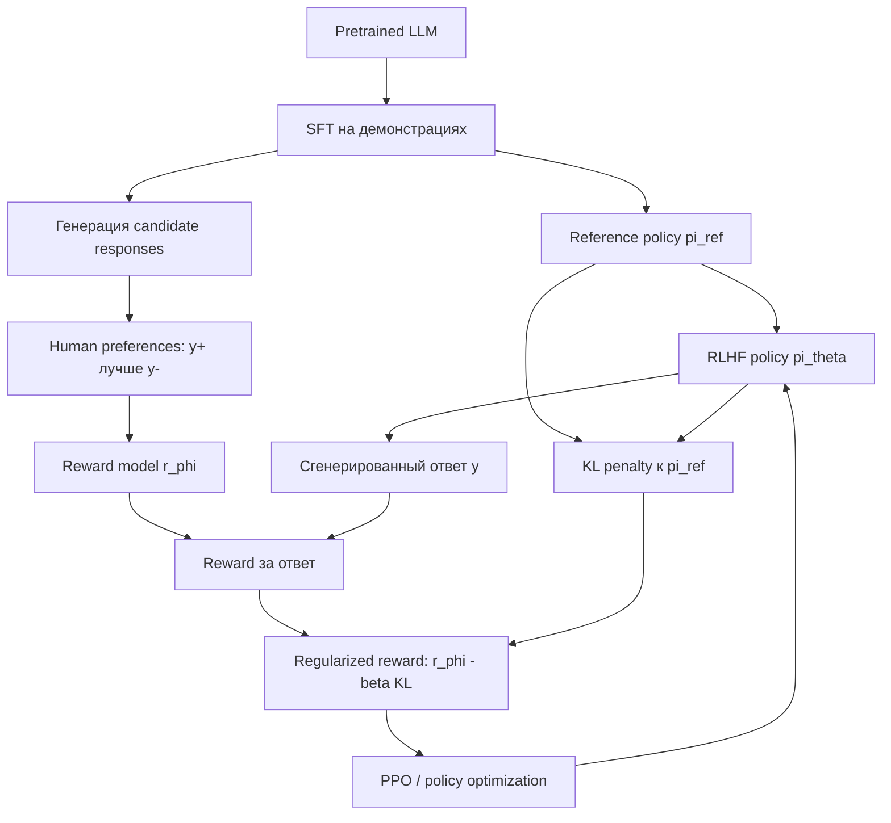

# Preference Tuning and RLHF

Source: `DL_exam.pdf`, Question 39

Original question:

> Preference tuning и RLHF. Reward model, человеческие предпочтения, отличие RLHF от SFT, роль KL-регуляризации.

## Интуиция

После pretraining и `supervised fine-tuning` LLM уже умеет продолжать текст и следовать примерам инструкций, но это еще не значит, что ее ответы удобны, безопасны и соответствуют человеческим ожиданиям. `SFT` учит модель имитировать эталонные ответы из датасета. `Preference tuning` добавляет другой сигнал: люди сравнивают несколько ответов модели и говорят, какой лучше. Это ближе к реальной цели chat-модели, потому что часто проще выбрать лучший ответ, чем написать идеальный ответ с нуля.

`RLHF` (`Reinforcement Learning from Human Feedback`) использует человеческие предпочтения как косвенную награду. Сначала по сравнениям ответов обучают `reward model`, которая предсказывает, насколько ответ предпочтителен. Затем основную LLM дообучают как policy: она генерирует ответы, получает reward от reward model и обновляется так, чтобы ответы становились более предпочтительными.

Главная опасность: если просто максимизировать learned reward, модель может уйти далеко от нормальной языковой модели, ухудшить связность или начать эксплуатировать ошибки reward model. Поэтому в RLHF почти всегда добавляют `KL-регуляризацию` к исходной SFT-модели: новая policy должна улучшать reward, но не слишком далеко отходить от надежного reference behavior.

## Что нужно сказать на экзамене

- `Preference tuning` -- адаптация LLM по предпочтениям: модель учится выбирать/генерировать ответы, которые люди или preference model считают лучше.
- Классический RLHF pipeline: pretrained LLM -> `SFT` на демонстрациях -> сбор human preference data -> обучение `reward model` -> RL-оптимизация policy с KL penalty.
- Человеческие предпочтения обычно собирают как pairwise comparisons или rankings: для prompt $x$ есть ответы $y^+$ и $y^-$, где $y^+$ предпочтительнее.
- `Reward model` $r_\phi(x,y)$ оценивает скалярную полезность ответа. Часто обучается через Bradley-Terry / logistic loss:
  $$
  P(y^+ \succ y^- \mid x) = \sigma(r_\phi(x,y^+) - r_\phi(x,y^-)).
  $$
- `SFT` минимизирует `cross-entropy` на правильных демонстрациях, то есть имитирует данные. `RLHF` оптимизирует expected reward от learned reward model, то есть прямо сдвигает распределение ответов к предпочтительным.
- RLHF objective часто записывают как:
  $$
  \max_\theta \mathbb{E}_{x, y \sim \pi_\theta(\cdot \mid x)}
  [r_\phi(x,y)] - \beta \, \mathbb{E}_{x}[D_{KL}(\pi_\theta(\cdot \mid x) \Vert \pi_{ref}(\cdot \mid x))].
  $$
- `KL-регуляризация` удерживает policy около reference model, снижает reward hacking, сохраняет fluency и задает trust region для обновлений.
- Ограничения: preference labels шумные и зависят от инструкций annotators; reward model может быть смещенной; RL-этап нестабилен; слишком маленький KL ведет к exploitation, слишком большой KL мешает улучшению.

## Подробный ответ

### Что такое preference tuning

`Preference tuning` -- общий класс методов, которые дообучают LLM не только на примерах "prompt -> правильный ответ", а на сигнале "этот ответ лучше другого". Пусть есть prompt $x$ и несколько candidate responses $y_1, \dots, y_k$. Человек или другая система ранжирует их по качеству: полезность, корректность, безопасность, полнота, стиль, отсутствие токсичности, следование инструкции.

Типовая разметка:

| Формат предпочтений | Пример данных | Что означает |
|---|---|---|
| Pairwise comparison | $(x, y^+, y^-)$ | $y^+$ лучше, чем $y^-$ |
| Ranking | $(x, y_1 \succ y_2 \succ y_3)$ | полный или частичный порядок ответов |
| Score labels | $(x, y, s)$ | ответу присвоена оценка качества |

Для oral exam важно отделять `preference tuning` как идею от конкретного алгоритма. RLHF -- классический способ использовать preferences через reward model и reinforcement learning. Есть и direct preference optimization методы, например `DPO`, которые обучают policy напрямую на парах предпочтений без отдельного online RL-шага. Но в вопросе центр тяжести -- RLHF, reward model и KL.

### Pipeline RLHF

Классический RLHF для LLM обычно состоит из четырех этапов.

1. `Pretraining`: модель учится next-token prediction на большом корпусе. Результат -- базовая language model.
2. `SFT`: модель дообучают на supervised demonstrations, где для instruction/prompt есть хороший ответ. Получается instruction-following policy $\pi_{SFT}$.
3. `Reward modeling`: для prompt $x$ генерируют несколько ответов, люди выбирают лучшие, затем обучают модель $r_\phi(x,y)$ предсказывать предпочтительность ответа.
4. `RL fine-tuning`: текущую policy $\pi_\theta$ оптимизируют так, чтобы она максимизировала reward model, но оставалась близкой к reference policy $\pi_{ref}$, обычно к SFT-модели.

В терминах reinforcement learning:

- `state` или context -- prompt и уже сгенерированный префикс;
- `action` -- следующий token;
- `policy` -- LLM $\pi_\theta(y \mid x)$;
- `trajectory` -- полный ответ $y = (y_1, \dots, y_T)$;
- `reward` -- скаляр $r_\phi(x,y)$, часто выдается за полный ответ;
- `reference policy` -- замороженная $\pi_{ref}$ для KL penalty.

На практике RL-этап часто реализуют через `PPO` или близкие policy optimization методы, потому что генерация дискретна, а reward поступает на уровне последовательности. Однако концептуально можно запомнить проще: policy генерирует ответы, reward model оценивает их, optimizer сдвигает вероятность хороших ответов вверх, а KL penalty ограничивает сдвиг.

### Reward model

`Reward model` -- отдельная модель или голова поверх LLM, которая получает prompt $x$ и response $y$ и возвращает скаляр:

$$
r_\phi(x,y) \in \mathbb{R}.
$$

Этот скаляр не является истинной человеческой полезностью. Это learned proxy, обученная по noisy human labels. Обычно абсолютные значения reward не интерпретируют напрямую; важнее разности reward между ответами.

Предположим, для prompt $x$ человек выбрал $y^+$ вместо $y^-$. Стандартная модель предпочтений задает вероятность через Bradley-Terry:

$$
P_\phi(y^+ \succ y^- \mid x)
=
\frac{\exp(r_\phi(x,y^+))}
{\exp(r_\phi(x,y^+)) + \exp(r_\phi(x,y^-))}
=
\sigma(r_\phi(x,y^+) - r_\phi(x,y^-)).
$$

Тогда loss reward model:

$$
\mathcal{L}_{RM}(\phi)
=
- \mathbb{E}_{(x,y^+,y^-) \sim D_{pref}}
\log \sigma(r_\phi(x,y^+) - r_\phi(x,y^-)).
$$

Если $r_\phi(x,y^+) > r_\phi(x,y^-)$, loss мал. Если reward model ставит худшему ответу больший score, loss растет. Это учит модель согласовывать относительный порядок ответов с человеческими предпочтениями.

### Отличие RLHF от SFT

`SFT` и `RLHF` решают разные задачи адаптации.

| Свойство | SFT | RLHF |
|---|---|---|
| Данные | Демонстрации $(x,y^*)$ | Предпочтения $(x,y^+,y^-)$ или rankings |
| Цель | Имитировать target answer | Максимизировать learned human preference reward |
| Loss | `Cross-entropy` / negative log-likelihood | Policy objective с reward и KL penalty |
| Что обновляется | Вероятность токенов из эталонного ответа | Вероятность целых ответов, которые reward model считает лучше |
| Сильная сторона | Стабильность, простота, обучение формату инструкций | Улучшает полезность, отказ от плохих ответов, стиль и safety по preferences |
| Риск | Копирование ошибок demonstrations, ограниченность форматов | Reward hacking, нестабильность RL, bias reward model |

SFT objective:

$$
\mathcal{L}_{SFT}(\theta)
=
-\mathbb{E}_{(x,y^*) \sim D_{SFT}}
\sum_{t=1}^{T} \log \pi_\theta(y_t^* \mid x, y_{<t}^*).
$$

Здесь модель получает конкретный правильный ответ $y^*$ и учится повышать likelihood его токенов.

RLHF objective:

$$
J(\theta)
=
\mathbb{E}_{x \sim D,\, y \sim \pi_\theta(\cdot \mid x)}
\left[
r_\phi(x,y)
- \beta D_{KL}(\pi_\theta(\cdot \mid x) \Vert \pi_{ref}(\cdot \mid x))
\right].
$$

Здесь нет одного фиксированного target answer. Модель сама сэмплирует ответ, получает reward и оптимизируется в сторону ответов с большим reward. Это может улучшить ответы относительно SFT, даже если идеальный ответ не был явно записан в supervised dataset.

### Роль KL-регуляризации

`KL-регуляризация` штрафует отклонение новой policy $\pi_\theta$ от reference policy $\pi_{ref}$:

$$
D_{KL}(\pi_\theta \Vert \pi_{ref})
=
\mathbb{E}_{y \sim \pi_\theta}
\left[
\log \frac{\pi_\theta(y \mid x)}{\pi_{ref}(y \mid x)}
\right].
$$

В LLM ее часто приближают токеновым штрафом по generated response:

$$
\text{KL penalty}(x,y)
\approx
\sum_{t=1}^{T}
\left[
\log \pi_\theta(y_t \mid x,y_{<t})
-
\log \pi_{ref}(y_t \mid x,y_{<t})
\right].
$$

Тогда оптимизируемый reward можно записать как:

$$
R(x,y)
=
r_\phi(x,y)
- \beta \sum_{t=1}^{T}
\left[
\log \pi_\theta(y_t \mid x,y_{<t})
-
\log \pi_{ref}(y_t \mid x,y_{<t})
\right].
$$

Зачем нужен KL:

- удерживает модель около SFT behavior, где уже есть fluency, базовое следование инструкциям и нормальный формат ответа;
- ограничивает слишком большие policy updates, то есть играет роль trust region;
- снижает `reward hacking`, когда модель находит странные ответы, которые обманывают reward model;
- помогает сохранить знания и языковые способности pretrained/SFT модели;
- задает trade-off: reward improvement против distributional drift.

Параметр $\beta > 0$ управляет силой штрафа. Если $\beta$ слишком мал, policy может резко уйти от reference model и начать эксплуатировать reward model. Если $\beta$ слишком велик, RLHF почти не меняет модель и preference tuning дает слабый эффект.

### Ограничения и практические caveats

Human preferences не являются идеальной истиной. Annotators могут расходиться, критерии качества могут быть неполными, а предпочтения зависят от культуры, языка, задачи и инструкции разметки. Reward model наследует эти bias и может плохо обобщать на ответы вне распределения, особенно если RL-этап начинает генерировать необычные тексты.

Reward model обычно оценивает то, что легко заметить: уверенность, вежливый стиль, структуру, отказ от опасных запросов. Это может не совпадать с фактической истинностью. Поэтому RLHF улучшает alignment с observed preferences, но не гарантирует correctness, reasoning или отсутствие hallucinations.

## Формулы / алгоритмы

### Reward model training

Вход:

- prompts $x$;
- пары ответов $(y^+, y^-)$, где человек предпочел $y^+$;
- модель $r_\phi(x,y)$.

Цель:

$$
\min_\phi \mathcal{L}_{RM}(\phi)
=
- \mathbb{E}_{(x,y^+,y^-) \sim D_{pref}}
\log \sigma(r_\phi(x,y^+) - r_\phi(x,y^-)).
$$

Процедура:

1. Для каждого prompt собрать несколько candidate responses от одной или нескольких LLM.
2. Получить human preference labels: pairwise choice или ranking.
3. Преобразовать rankings в пары $(y^+,y^-)$.
4. Обучить reward model через `backpropagation`.
5. Проверить agreement reward model с held-out human preferences.

Практический caveat: высокая validation accuracy reward model не гарантирует хорошую RLHF-модель, потому что policy optimization может увести ответы в область, где reward model плохо калибрована.

### KL-regularized RLHF objective

Вход:

- SFT/reference policy $\pi_{ref}$;
- trainable policy $\pi_\theta$, обычно инициализированная из $\pi_{ref}$;
- reward model $r_\phi$;
- prompts $x \sim D$;
- KL coefficient $\beta$.

Цель:

$$
\max_\theta
\mathbb{E}_{x \sim D,\, y \sim \pi_\theta(\cdot \mid x)}
\left[
r_\phi(x,y)
- \beta D_{KL}(\pi_\theta(\cdot \mid x) \Vert \pi_{ref}(\cdot \mid x))
\right].
$$

Упрощенный алгоритм:

1. Sample batch of prompts $x$.
2. Generate responses $y \sim \pi_\theta(\cdot \mid x)$.
3. Compute reward $r_\phi(x,y)$.
4. Compute KL penalty relative to frozen $\pi_{ref}$.
5. Form regularized reward $R = r_\phi - \beta \text{KL}$.
6. Update policy parameters $\theta$ with PPO or another policy optimization method.
7. Monitor reward, KL, response quality, length, refusal behavior and held-out human/evaluator preferences.

Сходимость в строгом смысле для больших LLM не гарантируется. На практике важны маленькие learning rates, clipping/trust-region mechanics, reward normalization, KL control, evaluation на held-out prompts и ручная проверка failure cases.

## Диаграмма или изображение

Внешние изображения не использовались.

## Быстрая устная версия

RLHF -- это способ дообучить LLM по человеческим предпочтениям. Сначала обычно делают SFT: модель учится имитировать хорошие ответы по `cross-entropy`. Потом для одних и тех же prompt собирают несколько ответов и люди выбирают, какой лучше. По таким парам обучают reward model $r_\phi(x,y)$, например через loss $-\log \sigma(r(x,y^+) - r(x,y^-))$.

Дальше LLM рассматривают как policy $\pi_\theta$: она генерирует ответ, reward model дает ему score, и policy обновляют, чтобы expected reward рос. Но reward model несовершенна, поэтому добавляют KL-регуляризацию к reference SFT-модели. Итоговая цель примерно такая: максимизировать $r_\phi(x,y) - \beta D_{KL}(\pi_\theta \Vert \pi_{ref})$. KL удерживает модель от резкого ухода от нормального языкового поведения и уменьшает reward hacking.

## Возможные уточняющие вопросы

- Чем preference labels лучше демонстраций?  
  Часто человеку легче сравнить два ответа, чем написать идеальный ответ. Preferences также позволяют выразить тонкие критерии качества: полезность, стиль, безопасность, полноту.

- Почему reward model обучают на разности reward?  
  Потому что pairwise label говорит не абсолютный score, а относительное предпочтение. Bradley-Terry loss моделирует вероятность выбора через $r(x,y^+) - r(x,y^-)$.

- Почему нельзя просто использовать reward model на inference и выбирать лучший из нескольких ответов?  
  Можно делать reranking, но RLHF меняет саму policy, чтобы она чаще генерировала предпочтительные ответы сразу. Reranking дороже и ограничен набором sampled candidates.

- Что такое reward hacking?  
  Это ситуация, когда policy находит ответы с высоким learned reward, но низким реальным качеством для человека, потому что использует ошибки reward model.

- Почему reference model обычно SFT, а не pretrained base model?  
  SFT-модель уже умеет следовать инструкциям и отвечать в нужном формате. KL к ней сохраняет именно это поведение.

- Что будет при слишком сильном KL?  
  Модель почти не отойдет от SFT и RLHF не сможет существенно улучшить предпочтения.

- Что будет при слишком слабом KL?  
  Модель может деградировать, стать многословной, странной, небезопасной или начать эксплуатировать reward model.

- Чем RLHF отличается от DPO?  
  RLHF явно обучает reward model и затем оптимизирует policy через RL. `DPO` использует preference pairs напрямую и выводит supervised-like objective, обычно без отдельного online RL-этапа.

## Частые ошибки

- Говорить, что RLHF обучается на "правильных ответах" так же, как SFT. В RLHF основной сигнал -- предпочтения и learned reward, а не один target sequence.
- Считать reward model настоящей функцией человеческой полезности. Это proxy, обученная на ограниченной и шумной разметке.
- Забывать KL-регуляризацию. Без нее максимизация reward model легко приводит к distributional drift и reward hacking.
- Путать `preference tuning` и `RLHF`: RLHF -- один из способов preference tuning, но не единственный.
- Интерпретировать reward как вероятность истины. Высокий reward может отражать стиль, уверенность или соответствие guidelines, но не гарантировать factual correctness.
- Думать, что RLHF всегда улучшает reasoning. Он улучшает поведение относительно preference data; reasoning может улучшиться, не измениться или даже ухудшиться при плохом reward.
- Неправильно писать знак KL penalty: в objective reward максимизируют, а KL обычно вычитают как штраф $r - \beta KL$.
- Игнорировать выбор $\beta$: это ключевой hyperparameter trade-off между alignment signal и сохранением исходных способностей модели.
