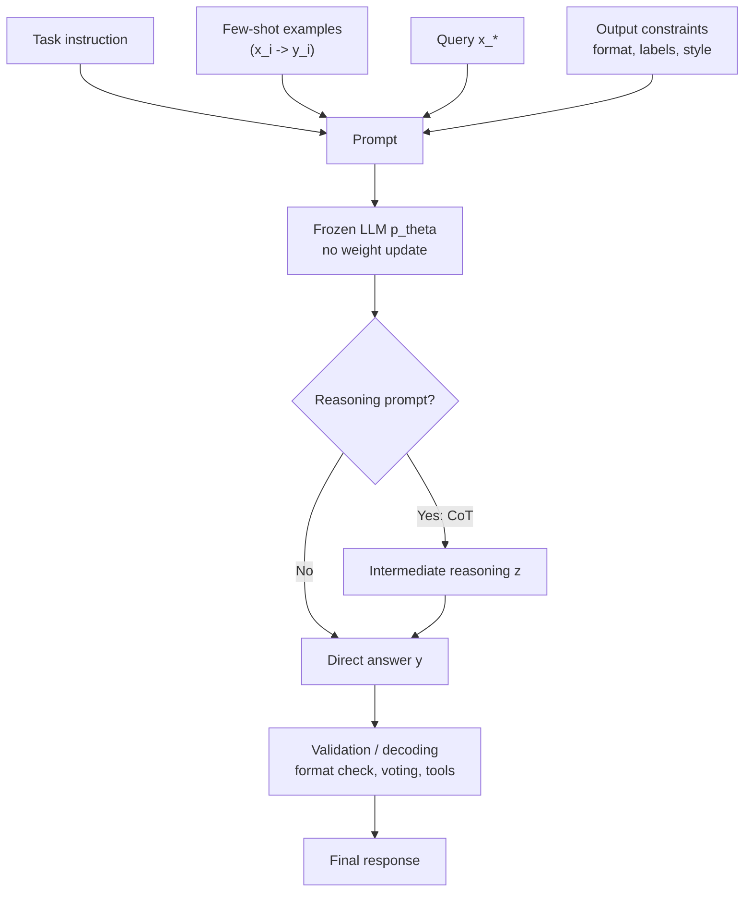

# In Context Learning and Prompting

Source: `DL_exam.pdf`, Question 40

Original question:

> In-context learning, prompting и Chain-of-Thought. Few-shot prompting, reasoning prompts, ограничения промптового подхода.

## Интуиция

`In-context learning` (`ICL`) - это способность LLM менять свое поведение по примерам и инструкциям, которые находятся прямо в текущем контексте, без обновления весов модели. Модель не "учится" в смысле `backpropagation`: параметры $\theta$ остаются фиксированными. Она просто условно генерирует ответ с учетом prompt, где могут быть описание задачи, несколько примеров, ограничения формата и текущий запрос.

`Prompting` - это способ задать задачу через текстовый интерфейс модели. Хороший prompt уменьшает неопределенность: говорит, что именно нужно сделать, какие входы считать важными, какой формат ответа нужен и какие ошибки недопустимы. В `few-shot prompting` мы добавляем несколько демонстраций "вход -> правильный выход", и модель продолжает этот шаблон для нового входа.

`Chain-of-Thought` (`CoT`) и другие `reasoning prompts` пытаются заставить модель явно или неявно разложить сложную задачу на шаги. Это полезно, когда ответ требует промежуточных рассуждений: математика, логика, планирование, многошаговые выводы. Но prompt не добавляет модели новых фундаментальных способностей и не гарантирует истинность рассуждений: модель может уверенно сгенерировать правдоподобную, но неверную цепочку.

Главная мысль для экзамена: prompting - это inference-time адаптация через условие в контексте, а не обучение параметров. Он дешевле и гибче fine-tuning, но более хрупок, ограничен context window, чувствителен к формулировкам и не дает надежной гарантии корректности.

## Что нужно сказать на экзамене

- `In-context learning`: модель с фиксированными параметрами $\theta$ решает новую задачу, используя инструкцию и демонстрации внутри prompt.
- Для autoregressive LLM ответ генерируется как условное распределение:

$$
p_\theta(y \mid c, x) = \prod_{t=1}^{|y|} p_\theta(y_t \mid c, x, y_{<t})
$$

где $c$ - контекст: инструкция, примеры, ограничения, документы, история диалога.

- В отличие от fine-tuning, в ICL нет шага:

$$
\theta \leftarrow \theta - \eta \nabla_\theta \mathcal{L}
$$

Параметры модели не меняются; меняется только условие генерации.

- `Prompting` включает: постановку задачи, роль/инструкцию, входные данные, few-shot examples, формат вывода, ограничения, критерии качества.
- `Zero-shot prompting`: задача задается только инструкцией, без примеров.
- `Few-shot prompting`: в prompt добавляются $k$ демонстраций $(x_i, y_i)$, после чего модель продолжает шаблон на новом $x_\*$.
- `Chain-of-Thought`: prompt стимулирует промежуточные шаги рассуждения перед финальным ответом; особенно полезен для многошаговых задач и достаточно сильных моделей.
- `Reasoning prompts`: CoT, decomposition, least-to-most prompting, self-consistency, ReAct-подобные схемы с рассуждением и действиями.
- Ограничения: prompt sensitivity, ограниченная длина контекста, отсутствие постоянного обучения, hallucinations, prompt injection, зависимость от качества примеров, стоимость длинного prompt, невозможность надежно заменить fine-tuning, RAG или верификацию.

## Подробный ответ

### In-context learning

Пусть есть pretrained или instruction-tuned LLM с параметрами $\theta$. На inference подается последовательность:

$$
s = [c, x]
$$

где $c$ - контекст задачи, а $x$ - новый запрос. Модель порождает ответ $y$:

$$
\hat{y} = \arg\max_y p_\theta(y \mid c, x)
$$

В `few-shot` случае контекст содержит демонстрации:

$$
c = \{(x_1,y_1), (x_2,y_2), \ldots, (x_k,y_k)\}
$$

и задача становится:

$$
\hat{y} = \arg\max_y p_\theta(y \mid x_1,y_1,\ldots,x_k,y_k,x_\*)
$$

Модель как бы выводит из контекста локальное правило: формат задачи, соответствие между входом и выходом, стиль ответа, label space, уровень подробности. Это не гарантирует, что внутри есть явный алгоритм обучения; практически важно только, что условное распределение меняется при добавлении примеров.

ICL хорошо работает, когда:

- задача близка к тому, что модель видела во время pretraining или instruction tuning;
- prompt задает понятный шаблон;
- примеры репрезентативны и не противоречат друг другу;
- ответ можно вывести из языковых и статистических знаний модели;
- задача помещается в context window.

ICL плохо работает, когда задача требует надежной новой информации, строгой формальной гарантии, большого скрытого состояния, длинных вычислений или стабильного поведения на миллионах однотипных запросов.

### Prompting

`Prompt` - это входная последовательность, которая управляет условным распределением модели. Для chat-моделей prompt обычно состоит из system message, user message, возможно assistant history и дополнительных данных. Для обычной decoder-only LLM это просто текстовая последовательность с разделителями.

Хороший prompt обычно задает:

| Компонент | Зачем нужен |
|---|---|
| Задача | Уменьшает неоднозначность: классифицировать, извлечь, суммировать, решить |
| Контекст | Дает данные, на которые надо опираться |
| Демонстрации | Показывают формат и decision boundary |
| Ограничения | Запрещают лишние предположения, задают область ответа |
| Формат вывода | Делает результат пригодным для проверки или downstream pipeline |
| Критерии | Уточняют, что считается хорошим ответом |

Пример структуры:

```text
Instruction: classify the sentiment as Positive, Negative, or Neutral.

Examples:
Text: "The delivery was fast, but the product broke."
Label: Negative

Text: "Works as expected."
Label: Positive

Now classify:
Text: "<new input>"
Label:
```

Здесь модель не обучается на этих примерах в параметрическом смысле. Она продолжает паттерн и выбирает вероятный label в заданном формате.

### Zero-shot, one-shot и few-shot prompting

`Zero-shot prompting` использует только инструкцию:

```text
Summarize the text in three bullet points.
Text: ...
```

Плюс: коротко и дешево. Минус: модель сама выбирает многие детали формата и критериев.

`One-shot prompting` добавляет один пример. Он особенно полезен, когда формат ответа нестандартный.

`Few-shot prompting` добавляет несколько примеров. Это помогает задать:

- пространство меток;
- формат вывода;
- стиль рассуждения;
- уровень детализации;
- скрытые правила разметки;
- типичные пограничные случаи.

Качество few-shot prompting зависит от выбора примеров. Важны близость к тестовому запросу, разнообразие, отсутствие противоречий, порядок примеров и баланс классов. Для классификации порядок и частота labels могут создавать `label bias`: модель предпочитает метку, которая чаще или ближе к концу prompt.

Практический компромисс: больше примеров дают больше информации, но занимают context window, увеличивают latency и могут вносить шум. Обычно лучше несколько качественных демонстраций, чем много слабых.

### Chain-of-Thought

`Chain-of-Thought prompting` просит модель сгенерировать промежуточные шаги перед ответом. Интуитивно это превращает прямой переход:

$$
x \rightarrow y
$$

в переход через промежуточное рассуждение:

$$
x \rightarrow z \rightarrow y
$$

где $z$ - цепочка рассуждений, план, вычисления или decomposition задачи.

С вероятностной точки зрения можно рассматривать рассуждение как промежуточную переменную:

$$
p_\theta(y \mid x) = \sum_z p_\theta(y,z \mid x)
$$

На практике CoT не суммирует все $z$, а генерирует один или несколько вариантов:

$$
\hat{z},\hat{y} \sim p_\theta(z,y \mid \text{prompt}, x)
$$

CoT помогает, потому что autoregressive generation получает промежуточные токены, на которые затем может опираться. Это похоже на внешнюю рабочую память: модель записывает частичные выводы в контекст, и следующие токены condition on them.

Но CoT имеет ограничения:

- рассуждение может быть post-hoc объяснением, а не истинной причиной ответа;
- длинная цепочка может накопить ошибку;
- модель может уверенно делать арифметические или логические ошибки;
- в некоторых задачах краткий прямой ответ лучше, чем искусственно длинное рассуждение;
- раскрывать подробные рассуждения не всегда желательно для production-систем, где важнее проверяемый результат и краткое обоснование.

### Reasoning prompts

`Reasoning prompts` - это семейство техник, где prompt задает процедуру решения, а не только формат ответа.

| Техника | Идея | Когда полезна |
|---|---|---|
| `Chain-of-Thought` | Сгенерировать шаги рассуждения перед ответом | Математика, логика, многошаговые QA |
| `Few-shot CoT` | Показать примеры с рассуждением и ответом | Когда модель должна имитировать нужный стиль решения |
| `Decomposition` | Разбить задачу на подзадачи | Сложные инструкции, planning |
| `Least-to-most prompting` | Сначала решить простые подзадачи, затем собрать ответ | Композиционные задачи |
| `Self-consistency` | Сэмплировать несколько reasoning paths и выбрать устойчивый ответ | Когда есть несколько возможных цепочек рассуждения |
| `ReAct` | Чередовать reasoning и actions/tools | Вопросы с поиском, API, внешними инструментами |

Для `self-consistency` можно записать:

$$
(z_j, y_j) \sim p_\theta(z,y \mid x), \quad j=1,\ldots,m
$$

затем выбрать ответ большинством или агрегировать scores:

$$
\hat{y} = \arg\max_y \sum_{j=1}^{m} \mathbf{1}[y_j = y]
$$

Это приближает marginalization по возможным рассуждениям, но увеличивает стоимость inference в $m$ раз и не защищает от систематической ошибки модели.

### Ограничения промптового подхода

Prompting удобен, потому что не требует датасета для обучения, GPU training и хранения новых весов. Но это не универсальная замена другим методам адаптации.

Основные ограничения:

- `Prompt sensitivity`: небольшие изменения формулировки, порядка примеров или разделителей могут менять ответ.
- Ограничение `context window`: все инструкции, примеры и данные должны поместиться в контекст; длинный prompt дороже и может ухудшать внимание к важным деталям.
- Нет постоянного обучения: после следующего запроса модель не помнит новый навык, если он снова не передан в prompt или внешнюю память.
- Зависимость от базовой модели: prompt не заставит слабую модель надежно решать задачу, которой она принципиально не владеет.
- `Hallucination`: модель может сгенерировать правдоподобный, но ложный ответ, особенно при недостатке данных.
- `Prompt injection`: внешний текст может пытаться переопределить инструкции, раскрыть скрытые данные или заставить модель нарушить политику.
- Нестабильность рассуждений: CoT может выглядеть убедительно, но содержать ошибки.
- Плохая проверяемость: естественно-языковые инструкции труднее валидировать, чем код, тесты или формальные constraints.
- Стоимость inference: длинные prompts и многократное сэмплирование увеличивают latency и compute.
- Ограничения privacy/security: prompt может содержать чувствительные данные; модель и система должны контролировать, что передается во внешний API или tool.

Сравнение с альтернативами:

| Подход | Что меняется | Плюсы | Минусы |
|---|---|---|---|
| Prompting / ICL | Только входной контекст | Быстро, без обучения, гибко | Хрупко, нет постоянной адаптации |
| Fine-tuning / SFT | Параметры или PEFT-модули | Стабильнее стиль и формат, дешевле короткий inference | Нужны данные и обучение |
| RAG | Контекст дополняется найденными документами | Лучше для свежих или внешних фактов | Нужны retrieval и контроль источников |
| Tools / agents | Модель вызывает внешние функции | Можно считать, искать, действовать | Сложнее orchestration и безопасность |

На экзамене важно не противопоставлять эти методы абсолютно. В реальных системах часто комбинируют: system prompt задает роль, few-shot examples задают формат, RAG дает факты, tools выполняют проверяемые операции, а fine-tuning стабилизирует поведение модели.

## Формулы / алгоритмы

### Условная генерация при ICL

Дано:

- фиксированная модель $p_\theta$;
- $k$ демонстраций $D_k = \{(x_i,y_i)\}_{i=1}^{k}$;
- новый вход $x_\*$;
- decoding rule: greedy, beam search, sampling или constrained decoding.

Prompt:

$$
c = [\text{instruction}; (x_1,y_1); \ldots; (x_k,y_k); x_\*]
$$

Autoregressive answer:

$$
p_\theta(y \mid c) = \prod_{t=1}^{T} p_\theta(y_t \mid c, y_1,\ldots,y_{t-1})
$$

Prediction:

$$
\hat{y} = \operatorname{Decode}(p_\theta(\cdot \mid c))
$$

Параметры не обновляются:

$$
\theta_{\text{after}} = \theta_{\text{before}}
$$

### Базовый алгоритм few-shot prompting

```text
Input:
  task description T
  examples E = {(x_i, y_i)}
  query x_*
  frozen LLM p_theta

Output:
  answer y_hat

Steps:
  1. Select representative examples from E.
  2. Order examples consistently and avoid conflicting labels.
  3. Write a clear instruction and output format.
  4. Construct prompt c = [T; examples; x_*; output marker].
  5. Decode answer y_hat from p_theta(y | c).
  6. Optionally validate format, check constraints, or ask model/tool to verify.
```

Практические caveats:

- если examples не помещаются, выбирать наиболее релевантные или использовать retrieval;
- для классификации следить за балансом labels;
- для structured output использовать JSON schema, constrained decoding или post-validation;
- для задач с фактами добавлять источники или RAG, а не надеяться на память модели.

### Алгоритм CoT self-consistency

```text
Input:
  problem x
  reasoning prompt R
  number of samples m
  frozen LLM p_theta

Output:
  final answer y_hat

Steps:
  1. Build prompt c = [R; x].
  2. For j = 1..m, sample a reasoning path z_j and answer y_j.
  3. Normalize answers y_j to comparable form.
  4. Choose the most frequent or highest-scoring answer.
  5. Return y_hat with a concise justification or verified computation.
```

Сложность inference примерно растет линейно по числу samples $m$ и длине reasoning chains:

$$
\text{cost} \propto m \cdot (|c| + |z| + |y|)
$$

## Диаграмма или изображение



Внешние изображения не использовались.

## Быстрая устная версия

`In-context learning` - это когда LLM с фиксированными весами решает задачу по инструкции и примерам, переданным прямо в prompt. Для autoregressive модели это просто условная генерация $p_\theta(y \mid c,x)$, где $c$ содержит описание задачи, few-shot examples и ограничения формата. В отличие от fine-tuning, нет обновления $\theta$ через градиент.

`Prompting` задает задачу текстом. `Zero-shot` использует только инструкцию, `few-shot` добавляет демонстрации "вход -> выход". `Chain-of-Thought` просит модель строить промежуточное рассуждение $z$ перед ответом $y$, что помогает в многошаговых задачах. Есть варианты вроде self-consistency, где сэмплируют несколько цепочек и выбирают наиболее устойчивый ответ.

Ограничения: prompt чувствителен к формулировке и порядку примеров, ограничен длиной контекста, не дает постоянного обучения, может hallucinate, уязвим к prompt injection и не заменяет fine-tuning, RAG, tools или формальную верификацию там, где нужны стабильность и проверяемость.

## Возможные уточняющие вопросы

- Чем ICL отличается от fine-tuning?
  - В ICL параметры модели фиксированы, а адаптация происходит через conditioning on context. В fine-tuning параметры или PEFT-модули обновляются по loss на датасете.

- Почему few-shot examples помогают?
  - Они задают локальный шаблон задачи: формат, labels, стиль, decision boundary и ожидаемую степень подробности.

- Что такое Chain-of-Thought?
  - Prompting-техника, где модель генерирует промежуточные шаги рассуждения перед финальным ответом.

- Почему CoT может улучшать reasoning?
  - Промежуточные токены становятся частью контекста, поэтому последующая генерация может опираться на частичные вычисления и decomposition задачи.

- Гарантирует ли CoT правильность?
  - Нет. CoT может быть правдоподобным, но неверным; для надежности нужны проверка, self-consistency, tools или формальные методы.

- Что такое self-consistency?
  - Сэмплирование нескольких reasoning paths и выбор ответа, который встречается чаще или имеет лучший score.

- Когда лучше использовать RAG вместо prompting?
  - Когда ответ зависит от внешних, свежих или точных фактов, которые нужно извлечь из источников.

- Когда лучше fine-tuning?
  - Когда нужен устойчивый стиль, формат или доменное поведение на большом числе запросов, а повторять длинный prompt дорого или нестабильно.

- Что такое prompt injection?
  - Атака, при которой текст внутри пользовательского ввода или retrieved documents пытается переопределить инструкции системы или заставить модель выполнить нежелательное действие.

## Частые ошибки

- Говорить, что при ICL модель "дообучается" в обычном смысле. Веса не меняются; меняется только контекст.
- Смешивать `prompt tuning` как PEFT-метод с обычным ручным `prompting`. В prompt tuning обучаются soft prompt embeddings, а в prompting пользователь просто пишет текст.
- Считать few-shot prompting надежной заменой датасету и fine-tuning. Он помогает, но остается чувствительным к примерам и формулировке.
- Думать, что больше примеров всегда лучше. Длинный prompt может добавить шум, увеличить стоимость и вытеснить важный контекст.
- Игнорировать порядок примеров и label bias в классификации.
- Считать CoT доказательством корректности. Это сгенерированное рассуждение, которое нужно проверять.
- Просить модель "думать пошагово" в задачах, где нужен строгий формат, но не валидировать результат.
- Использовать prompting для точных новых фактов без RAG или источников.
- Не учитывать context window и стоимость длинных prompts.
- Забывать про prompt injection при работе с retrieved или user-provided текстом.
