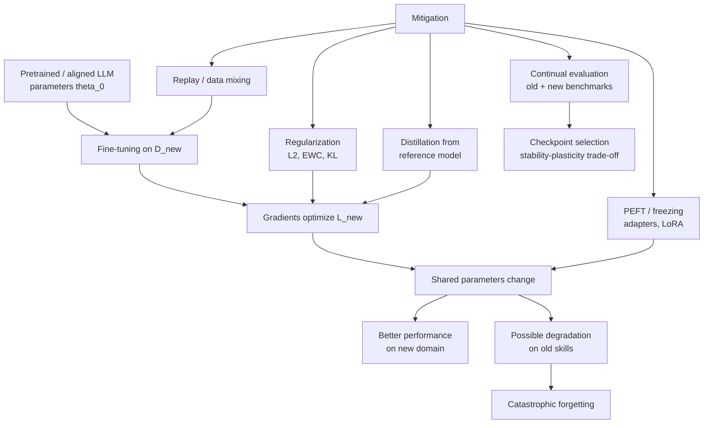

# Catastrophic Forgetting

Source: `DL_exam.pdf`, Question 41

Original question:

> Catastrophic forgetting при дообучении. Почему возникает, чем опасен, какие общие способы смягчения используются.

## Интуиция

`Catastrophic forgetting` -- это резкая потеря уже выученных способностей модели после дообучения на новой задаче, новом домене или новых предпочтениях. Интуитивно модель хранит много навыков в одних и тех же параметрах: знание языка, факты, стиль ответа, следование инструкциям, безопасность, кодирование, математику. Когда `fine-tuning` оптимизирует эти параметры только под новый датасет, градиенты начинают улучшать новую цель, но могут разрушать решения, которые были полезны для старых задач.

Для LLM это особенно опасно, потому что базовая модель обычно уже умеет много разнородных вещей. Узкое дообучение может сделать модель лучше в одном формате ответов, но хуже в общих знаниях, рассуждении, многоязычности, safety behavior или способности следовать инструкциям. Поэтому при адаптации LLM важно оптимизировать не только качество на новом датасете, но и сохранение прежних возможностей.

## Что нужно сказать на экзамене

- Дать определение: `catastrophic forgetting` -- деградация качества на ранее освоенных задачах после обучения на новых данных.
- Объяснить механизм: общие параметры, `distribution shift`, отсутствие старых данных в текущей функции потерь, конфликтующие градиенты, слишком большой `learning rate`, малый или узкий датасет, долгое обучение.
- Связать с LLM: после `SFT`, domain adaptation, preference tuning или `RLHF` модель может потерять general capabilities, alignment, factuality, формат следования инструкциям.
- Формально: fine-tuning минимизирует $L_{\text{new}}(\theta)$, но не контролирует $L_{\text{old}}(\theta)$.
- Назвать метрики: качество на old/new benchmarks, forgetting measure, regression tests, ablation по доменам и языкам.
- Общие способы смягчения:
  - смешивать новые данные со старыми или репрезентативным `replay` датасетом;
  - добавлять регуляризацию к исходным параметрам или к важным параметрам (`L2`, `EWC`, `L2-SP`);
  - использовать `knowledge distillation` от исходной модели;
  - ограничивать число обновляемых параметров: freezing, adapters, `LoRA`, other PEFT;
  - аккуратно выбирать `learning rate`, число эпох, `early stopping`, weight decay, batch mixing;
  - делать continual evaluation на старых и новых задачах.
- Важно: универсального метода нет; нужен компромисс `plasticity-stability`: способность учить новое против сохранения старого.

## Подробный ответ

Пусть дообучаемая модель имеет параметры $\theta$. До fine-tuning есть исходные параметры $\theta_0$, полученные после pretraining или instruction tuning. Новая задача задает распределение данных $D_{\text{new}}$, старая совокупность навыков условно задается распределением $D_{\text{old}}$. При обычном fine-tuning решается задача:

$$
\theta^* = \arg\min_\theta L_{\text{new}}(\theta).
$$

Проблема в том, что в этой цели нет прямого требования сохранять качество на $D_{\text{old}}$. Если обновления параметров полезны для $D_{\text{new}}$, но вредят старым задачам, оптимизатор все равно будет их делать. Поэтому после обучения может оказаться:

$$
L_{\text{new}}(\theta^*) < L_{\text{new}}(\theta_0),
\qquad
L_{\text{old}}(\theta^*) \gg L_{\text{old}}(\theta_0).
$$

Это и есть forgetting: модель стала лучше на новом распределении, но хуже на старом. Слово `catastrophic` подчеркивает, что падение может быть резким и непропорционально большим по сравнению с объемом дообучения.

Основные причины:

| Причина | Что происходит |
|---|---|
| Общие параметры | Один и тот же слой или attention head участвует во многих навыках; обновление под новую задачу меняет старые решения. |
| Отсутствие старых данных | Loss видит только $D_{\text{new}}$, поэтому нет штрафа за деградацию старых задач. |
| Конфликт градиентов | Градиент новой задачи может идти в направлении, увеличивающем loss старой задачи. |
| Узкий датасет | Модель переходит к стилю, словарю и паттернам маленького домена. |
| Агрессивный fine-tuning | Большой `learning rate`, много эпох или обновление всех весов увеличивают drift от $\theta_0$. |
| Смена objective | Например, preference tuning может усилить определенное поведение, но ослабить factuality или diversity. |

Для LLM catastrophic forgetting проявляется не только как падение accuracy на старой классификации. Возможны более тонкие регрессии: модель хуже отвечает на общие вопросы, забывает редкие языки, хуже пишет код, начинает чрезмерно следовать стилю нового датасета, теряет refusal/safety patterns, хуже держит формат инструкций или становится менее калиброванной. Это делает forgetting опасным в production: модель может пройти тесты на новой задаче, но незаметно стать хуже для других пользователей и сценариев.

Forgetting обычно рассматривают как часть дилеммы `stability-plasticity`:

- `plasticity` -- способность быстро выучить новую задачу;
- `stability` -- способность сохранить уже выученные знания и поведение.

Слишком сильная plasticity дает forgetting. Слишком сильная stability мешает адаптации.

### Способы смягчения

**1. Data replay и смешивание данных.** Вместо обучения только на $D_{\text{new}}$ используют смесь:

$$
L(\theta) =
\lambda L_{\text{new}}(\theta)
+ (1 - \lambda)L_{\text{replay}}(\theta),
$$

где $D_{\text{replay}}$ -- старые данные, curated instruction data, general-domain prompts или synthetic replay. Идея простая: если модель продолжает видеть старые задачи, loss не позволяет сильно испортить их качество. Недостатки: нужны данные, возможны privacy/licensing ограничения, смесь нужно балансировать.

**2. Регуляризация параметров.** Ограничивают уход от исходной модели:

$$
L(\theta) =
L_{\text{new}}(\theta)
+ \lambda \lVert \theta - \theta_0 \rVert_2^2.
$$

Это вариант `L2` или `L2-SP`: не все параметры могут свободно уйти от pretrained solution. Более продвинутый вариант -- `Elastic Weight Consolidation` (`EWC`), где важные для старых задач параметры штрафуются сильнее:

$$
L(\theta) =
L_{\text{new}}(\theta)
+ \frac{\lambda}{2}
\sum_i F_i(\theta_i - \theta_{0,i})^2.
$$

Здесь $F_i$ -- оценка важности параметра, часто через диагональ Fisher information. Интуиция: если параметр был критичен для старых задач, его нельзя сильно менять; менее важные параметры можно менять свободнее.

**3. Knowledge distillation от старой модели.** Сохраняют исходную модель как `teacher` $p_{\theta_0}$ и дообучают новую модель так, чтобы она не слишком отличалась от teacher на общих входах:

$$
L(\theta) =
L_{\text{new}}(\theta)
+ \lambda T^2
\operatorname{KL}
\left(
p_{\theta_0}^{(T)}(\cdot \mid x)
\;\|\;
p_{\theta}^{(T)}(\cdot \mid x)
\right).
$$

Температура $T$ смягчает распределение вероятностей. Такая distillation помогает сохранить не только правильный top-1 ответ, но и относительные предпочтения старой модели. Для LLM похожую роль может играть `KL`-штраф в preference tuning: новая policy не должна слишком далеко уходить от reference model.

**4. Ограничение обновляемых параметров.** Можно заморозить большую часть модели и обучать только небольшой набор параметров: classification head, adapters, prefix/prompt tuning, `LoRA`. Это уменьшает разрушение базовых представлений, потому что основные веса остаются близкими к $\theta_0$. Минус: если новая задача сильно отличается, ограниченной емкости может не хватить.

**5. Процедурные меры.** Используют меньший `learning rate`, меньше эпох, `early stopping` по old+new validation, gradual unfreezing, balanced batches, monitoring weight drift, checkpoint selection по Pareto-компромиссу между новой и старой метриками. Эти методы не гарантируют отсутствие forgetting, но часто резко снижают риск.

**6. Изоляция навыков и continual learning.** Для последовательных задач можно использовать task-specific adapters, routing, mixture-of-experts или отдельные heads. Тогда разные навыки меньше конкурируют за одни и те же параметры. Недостаток -- рост памяти, сложности маршрутизации и необходимость понимать, какой модуль использовать.

Оценивать forgetting нужно не только на новом датасете. Минимальный практический протокол: перед fine-tuning зафиксировать baseline $\theta_0$, собрать old validation suite, после каждого checkpoint измерять old/new metrics, смотреть худшие регрессии по категориям и выбирать модель по совместному критерию, а не только по $L_{\text{new}}$.

## Формулы / алгоритмы

**Forgetting measure.** Для задачи $i$ можно измерять забывание как падение относительно лучшего качества на предыдущих этапах:

$$
F_i = \max_{t < T} a_{i,t} - a_{i,T},
$$

где $a_{i,t}$ -- качество на старой задаче $i$ после шага или этапа $t$, а $T$ -- финальный этап. Среднее forgetting:

$$
F = \frac{1}{N}\sum_{i=1}^N F_i.
$$

**Градиентная причина конфликта.** Если новая и старая задачи имеют losses $L_{\text{new}}$ и $L_{\text{old}}$, то шаг gradient descent:

$$
\theta_{t+1} = \theta_t - \eta \nabla_\theta L_{\text{new}}(\theta_t)
$$

может увеличить старый loss, если направление шага плохо согласовано со старой задачей. В первом приближении:

$$
\Delta L_{\text{old}}
\approx
-\eta
\nabla_\theta L_{\text{old}}(\theta_t)^\top
\nabla_\theta L_{\text{new}}(\theta_t).
$$

Если скалярное произведение градиентов отрицательно, то $\Delta L_{\text{old}} > 0$: новая задача толкает параметры в сторону, вредную для старой.

**Общий алгоритм fine-tuning с контролем forgetting.**

1. Входы: pretrained или aligned модель $\theta_0$, новый датасет $D_{\text{new}}$, old validation suite $V_{\text{old}}$, new validation suite $V_{\text{new}}$.
2. Измерить baseline: $M_{\text{old}}(\theta_0)$ и $M_{\text{new}}(\theta_0)$.
3. Выбрать стратегию смягчения: replay, regularization, distillation, PEFT или их комбинацию.
4. Обучать checkpoints с малым `learning rate`, контролируя drift от $\theta_0$.
5. На каждом checkpoint считать $M_{\text{old}}$ и $M_{\text{new}}$.
6. Остановиться по `early stopping`, если новая метрика почти не растет, а old metrics деградируют.
7. Выбрать checkpoint по совместному критерию, например:

$$
S(\theta) =
M_{\text{new}}(\theta)
- \alpha \max(0, M_{\text{old}}(\theta_0) - M_{\text{old}}(\theta)).
$$

Практическая сложность в том, что old validation suite должен покрывать реальные способности, которые нельзя потерять. Если проверять только новую задачу, catastrophic forgetting можно не заметить.

## Диаграмма или изображение

Внешние изображения не использовались.

## Быстрая устная версия

`Catastrophic forgetting` -- это ситуация, когда после fine-tuning модель резко теряет ранее выученные способности. Причина в том, что новые данные оптимизируют только $L_{\text{new}}$, а старые задачи обычно не представлены в loss. Одни и те же параметры отвечают за много навыков, поэтому градиенты новой задачи могут разрушить старые представления. Для LLM это опасно: модель может стать лучше в узком домене, но хуже следовать инструкциям, терять общие знания, multilingual ability, coding ability или safety behavior.

Смягчают forgetting несколькими классами методов: добавляют replay или смесь старых и новых данных, штрафуют уход от исходных параметров через `L2` или `EWC`, используют distillation или KL к reference model, обновляют только малые PEFT-модули вроде adapters или `LoRA`, уменьшают learning rate и выбирают checkpoint по old+new evaluation. Главная идея -- держать баланс между plasticity, то есть обучением новому, и stability, то есть сохранением старого.

## Возможные уточняющие вопросы

- **Почему forgetting особенно заметен при последовательном обучении задач?** Потому что модель видит текущую задачу, но loss не содержит достаточной информации о предыдущих задачах.
- **Чем forgetting отличается от обычного overfitting?** Overfitting -- плохая обобщающая способность относительно обучаемого распределения; forgetting -- деградация на старых задачах после адаптации к новой.
- **Почему replay помогает?** Он возвращает старые задачи в objective, поэтому градиенты должны учитывать и новое качество, и сохранение старого.
- **Что делает EWC?** Штрафует изменение параметров, которые оценены как важные для старых задач.
- **Зачем KL к reference model в LLM tuning?** Чтобы новая модель не уходила слишком далеко от поведения исходной aligned модели.
- **Почему PEFT снижает риск forgetting?** Большинство базовых весов не меняется, поэтому pretrained representations сохраняются лучше.
- **Можно ли полностью устранить forgetting?** Обычно нет; можно только уменьшить его и подобрать компромисс между новой задачей и старыми способностями.
- **Как practically обнаружить forgetting?** Сравнить модель до и после fine-tuning на fixed regression suite: общие знания, инструкции, safety, domain-specific tasks, языки, код, reasoning.

## Частые ошибки

- Оценивать только новую задачу и считать fine-tuning успешным без old benchmark suite.
- Называть catastrophic forgetting просто "модель переобучилась"; это близкие, но разные явления.
- Забывать, что forgetting может затронуть alignment и safety, а не только accuracy.
- Считать, что freezing или `LoRA` гарантируют отсутствие forgetting; они только уменьшают риск.
- Использовать слишком большой `learning rate` и много эпох на маленьком датасете.
- Не балансировать replay: слишком много старых данных мешает адаптации, слишком мало -- не защищает старые навыки.
- Путать `knowledge distillation` с обычной supervised разметкой: distillation сохраняет распределение ответов teacher model, а не только hard labels.
- Не фиксировать baseline $\theta_0$ и поэтому не иметь честной точки сравнения для регрессий.
