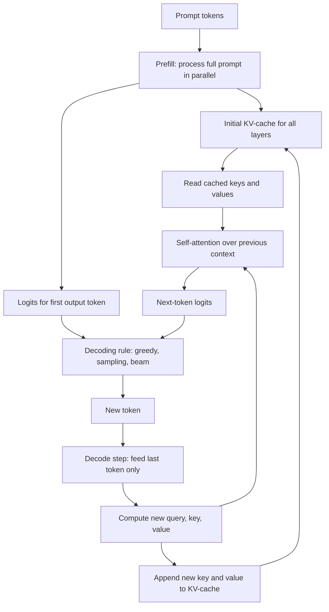

# LLM Inference

Source: `DL_exam.pdf`, Question 42

Original question:

> Инференс LLM. Training vs inference, autoregressive generation, latency, KV-cache, почему генерация дорогая.

## Интуиция

Инференс LLM - это использование уже обученной языковой модели для получения следующего токена и построения ответа. В отличие от training, где модель учится на больших батчах и обновляет веса, на inference веса фиксированы, а главная задача - быстро и достаточно дешево сгенерировать последовательность токенов.

Ключевая особенность decoder-only LLM: генерация autoregressive. Модель не пишет весь ответ сразу, а много раз решает одну и ту же задачу: по уже известному префиксу предсказать распределение следующего токена. Поэтому даже короткий ответ требует десятков или сотен последовательных forward pass. Это плохо параллелится по времени, потому что токен $y_t$ нужен для вычисления токена $y_{t+1}$.

Чтобы не пересчитывать attention для всего старого контекста на каждом шаге, используют KV-cache: для каждого слоя сохраняют уже вычисленные key и value для прошлых токенов. Тогда на decode-шаге новый query смотрит на сохраненные keys/values, а не строит их заново. KV-cache ускоряет генерацию, но сам занимает много GPU memory и требует чтения растущего объема данных на каждом новом токене.

Генерация дорогая из-за сочетания факторов: огромные веса модели, последовательная природа autoregressive decoding, большой и растущий контекст, память под KV-cache, а также требования к latency. В training можно эффективно заполнить GPU большими батчами и параллельными матричными операциями, а в decode часто приходится считать один следующий токен для каждого запроса, что делает процесс memory-bound и чувствительным к планированию батчей.

## Что нужно сказать на экзамене

- Инференс LLM: forward pass фиксированной модели для вычисления logits следующего токена и выбора токена decoding-стратегией.
- Training vs inference:
  - training обновляет параметры через loss и backpropagation;
  - inference не обновляет веса, но поддерживает состояние генерации: prompt, generated tokens, KV-cache, decoding parameters.
- Autoregressive generation задает факторизацию:
  $$p(y_{1:m} \mid x) = \prod_{t=1}^{m} p(y_t \mid x, y_{<t}).$$
- Генерация состоит из двух фаз:
  - `prefill`: параллельная обработка prompt, построение начального KV-cache;
  - `decode`: последовательное добавление по одному токену с использованием KV-cache.
- Latency обычно раскладывают на:
  - TTFT, `time to first token`: время до первого сгенерированного токена;
  - TPOT, `time per output token`: среднее время генерации следующего токена;
  - total latency: примерно $TTFT + m \cdot TPOT$ для $m$ output-токенов.
- KV-cache хранит keys и values для прошлых токенов во всех attention-слоях:
  $$\text{KV memory} \approx B \cdot L \cdot 2 \cdot H_{kv} \cdot T \cdot d_{head} \cdot s,$$
  где $B$ - batch size, $L$ - число слоев, $H_{kv}$ - число KV-heads, $T$ - длина контекста, $s$ - байт на число.
- Без KV-cache каждый decode-шаг заново обрабатывал бы весь префикс; с KV-cache пересчитывается только новый токен, но внимание к прошлым токенам и чтение cache все равно растут с длиной контекста.
- Почему дорого:
  - output-токены генерируются последовательно;
  - каждый токен требует прохода через всю модель;
  - GPU должен многократно читать большие веса;
  - KV-cache растет линейно с context length и batch size;
  - prefill имеет attention-стоимость по prompt length, decode имеет растущую стоимость чтения cache;
  - batching улучшает throughput, но может ухудшать latency отдельных запросов.

## Подробный ответ

Рассмотрим типичный decoder-only Transformer, обученный предсказывать следующий токен. На вход подается prompt $x = (x_1, \dots, x_n)$. Модель с параметрами $\theta$ возвращает logits:

$$z_t = f_\theta(x_{\le n}, y_{<t}),$$

после чего через softmax получаем распределение:

$$p_\theta(v \mid x, y_{<t}) = \frac{\exp(z_{t,v})}{\sum_{u \in V}\exp(z_{t,u})},$$

где $V$ - словарь токенов. Decoding-алгоритм выбирает следующий токен $y_t$: жадно, beam search, sampling, top-k, nucleus sampling, temperature scaling и т.д. Сам inference не меняет $\theta$; меняются только сгенерированный префикс и служебное состояние.

### Training vs inference

| Аспект | Training | Inference |
|---|---|---|
| Цель | Минимизировать loss, например negative log-likelihood | Получить ответ: токены, вероятности, embeddings или structured output |
| Параметры | Обновляются optimizer-ом | Фиксированы |
| Градиенты | Нужны activations для backward pass | Обычно `no_grad`, backward pass не выполняется |
| Параллелизм по токенам | Высокий: teacher forcing позволяет считать loss по многим позициям сразу | Ограничен: следующий output-токен зависит от предыдущего |
| Батчи | Большие, для эффективности обучения | Динамические, зависят от входящих запросов и latency |
| Память | Веса, optimizer states, gradients, activations | Веса, runtime buffers, KV-cache |
| Метрика эффективности | Training throughput, loss, convergence | TTFT, TPOT, throughput, memory, cost per token, quality |

При training с teacher forcing модель видит правильный префикс из датасета и параллельно считает предсказания для многих позиций. Например для последовательности $(w_1, \dots, w_T)$ objective:

$$\mathcal{L}(\theta) = -\sum_{t=1}^{T} \log p_\theta(w_t \mid w_{<t}).$$

Хотя causal mask запрещает смотреть в будущее, вычисления для всех позиций внутри одного forward pass можно выполнить параллельно на GPU. Затем идет backpropagation и обновление параметров.

При inference правильных будущих токенов нет. После prompt модель сначала выбирает $y_1$, потом уже с учетом $y_1$ выбирает $y_2$, и так далее. Поэтому output-часть становится последовательным процессом:

$$y_t \sim p_\theta(\cdot \mid x, y_1, \dots, y_{t-1}).$$

Это главное отличие: training хорошо параллелится по длине последовательности, а autoregressive generation по выходным токенам параллелится плохо.

### Prefill и decode

Инференс обычно делят на две фазы.

`Prefill` обрабатывает весь prompt. Если prompt имеет длину $n$, модель строит hidden states для всех prompt-токенов и одновременно заполняет KV-cache для каждого слоя. Attention внутри prompt использует causal mask: токен $i$ видит только позиции $\le i$. Эта фаза хорошо использует GPU, потому что в ней есть большие матричные операции и параллелизм по токенам prompt. Но attention по длинному prompt имеет квадратичную зависимость от длины контекста на уровне матрицы attention.

`Decode` генерирует output по одному токену. На шаге $t$ модель получает только последний токен, вычисляет для него новые hidden states, новые key/value и query. Query нового токена attends к сохраненным keys/values всех прошлых токенов. После выбора токена его key/value добавляются в cache, и шаг повторяется.

Без KV-cache на каждом decode-шаге пришлось бы заново прогонять всю последовательность длины $n + t - 1$. Тогда суммарная стоимость генерации быстро становилась бы очень большой. KV-cache заменяет повторное вычисление старых key/value на их хранение и чтение.

### KV-cache

В self-attention для слоя вычисляются:

$$Q = XW_Q,\quad K = XW_K,\quad V = XW_V.$$

Для нового токена на decode-шаге достаточно вычислить $q_t, k_t, v_t$ только для этого токена. Старые $K_{<t}$ и $V_{<t}$ берутся из cache:

$$\text{Attn}(q_t, K_{\le t}, V_{\le t}) =
\text{softmax}\left(\frac{q_t K_{\le t}^{\top}}{\sqrt{d_k}}\right)V_{\le t}.$$

После этого $k_t$ и $v_t$ записываются в cache. Так как cache хранится для каждого слоя, объем памяти растет линейно с batch size, числом слоев и длиной контекста:

$$\text{KV memory} \approx B \cdot L \cdot 2 \cdot H_{kv} \cdot T \cdot d_{head} \cdot s.$$

Здесь множитель $2$ соответствует key и value. $H_{kv}$ может быть меньше числа query-heads в architectures с multi-query attention или grouped-query attention; это уменьшает память KV-cache и bandwidth. При обычном multi-head attention $H_{kv}$ равно числу attention heads.

KV-cache дает выигрыш по compute, но не делает decode бесплатным. На каждом новом токене нужно:

- прочитать веса всех слоев;
- вычислить projections, MLP и normalization;
- прочитать все relevant keys/values из cache;
- посчитать attention нового query к растущему префиксу;
- записать новые key/value;
- применить decoding-стратегию к logits.

Чем длиннее контекст и чем больше batch, тем больше cache. Если cache не помещается в быструю GPU memory или плохо организован, inference замедляется.

### Latency, throughput и стоимость

Для пользователя важна не только суммарная скорость, но и форма задержки.

`TTFT` (`time to first token`) включает прием запроса, tokenization, scheduling, prefill prompt и первый decode-шаг. Длинный prompt увеличивает TTFT, потому что весь prompt нужно обработать до первого output-токена.

`TPOT` (`time per output token`) измеряет среднее время между последующими output-токенами. Оно зависит от размера модели, длины текущего контекста, batch size, состояния KV-cache, precision, hardware и decoding-стратегии.

Если сгенерировано $m$ токенов, грубая оценка:

$$\text{Total latency} \approx \text{TTFT} + (m - 1)\cdot \text{TPOT}.$$

Иногда также используют throughput:

$$\text{Throughput} = \frac{\text{number of generated tokens}}{\text{time}}.$$

Высокий throughput не гарантирует низкую latency. Например, server может объединять много запросов в batch, чтобы GPU работал эффективнее, но отдельный пользователь будет ждать scheduling и завершения батча. Поэтому inference serving обычно балансирует latency и throughput.

### Почему генерация LLM дорогая

Первая причина - autoregressive dependency. Нельзя заранее вычислить все output-токены, потому что распределение для $y_t$ зависит от реально выбранных $y_1,\dots,y_{t-1}$. Поэтому длинный ответ требует длинной цепочки последовательных decode-шагов.

Вторая причина - каждый output-токен проходит через всю модель. Даже если добавляется один токен, вычисления идут через все Transformer layers: attention, MLP, residual connections, normalization и output head. Для модели с миллиардами параметров это означает большое количество операций и постоянное чтение весов.

Третья причина - decode часто memory-bound. В training и prefill большие матричные умножения лучше загружают GPU. В decode один шаг может иметь малый batch и всего один новый токен на sequence, поэтому arithmetic intensity ниже: GPU много читает веса и KV-cache относительно объема вычислений.

Четвертая причина - KV-cache масштабируется с контекстом. Он экономит compute, но требует памяти:

$$O(BLTd)$$

в грубом виде, где $d$ связано с размером hidden representation. Для long context cache может стать главным ограничением batch size. Большой batch нужен для throughput, но большой batch увеличивает cache и может ухудшить latency.

Пятая причина - качество decoding тоже стоит ресурсов. Greedy decoding дешевле, sampling добавляет небольшую обработку logits, beam search дороже, потому что поддерживает несколько гипотез. При structured output или constraints могут появляться дополнительные проверки допустимых токенов.

Итог: inference LLM - это не один forward pass, а service loop с состоянием, памятью, очередями запросов и последовательным token-by-token decoding. Поэтому оптимизации inference включают batching, quantization, speculative decoding, efficient attention kernels, paged KV-cache, tensor/model parallelism, caching prompt-prefixes и ограничение max tokens.

## Формулы / алгоритмы

### Autoregressive factorization

Для prompt $x$ и ответа $y_{1:m}$:

$$p_\theta(y_{1:m}\mid x) = \prod_{t=1}^{m} p_\theta(y_t \mid x, y_{<t}).$$

Negative log-likelihood для заданного ответа:

$$-\log p_\theta(y_{1:m}\mid x) =
-\sum_{t=1}^{m}\log p_\theta(y_t \mid x, y_{<t}).$$

На inference обычно не минимизируют этот loss, а используют распределение для выбора токенов.

### Decode with KV-cache

**Objective:** сгенерировать до $m$ токенов или до `EOS`, используя фиксированную модель и уже построенный KV-cache.

**Inputs:** prompt tokens $x_{1:n}$, model $f_\theta$, max output length $m$, decoding parameters, optional stop tokens.

**Output:** generated tokens $y_{1:r}$, где $r \le m$.

**Procedure:**

1. Tokenize prompt.
2. Run `prefill` on all prompt tokens.
3. Store per-layer $K,V$ for prompt in KV-cache.
4. Compute logits for the next token.
5. Select next token by decoding rule.
6. While token is not `EOS` and length limit not reached:
   - feed the last generated token;
   - for each layer compute new $q_t,k_t,v_t$;
   - attend $q_t$ to cached $K_{\le t},V_{\le t}$;
   - append $k_t,v_t$ to KV-cache;
   - compute logits;
   - choose next token.
7. Detokenize generated tokens.

**Практические caveats:**

- Нет convergence в смысле training: inference завершается по `EOS`, лимиту длины, stop sequence или timeout.
- Чем длиннее prompt, тем больше `prefill` и TTFT.
- Чем длиннее generated sequence, тем больше decode-шагов и суммарная latency.
- Чем длиннее context, тем больше KV-cache и дороже attention на каждом decode-шаге.
- Малый batch снижает utilization GPU, большой batch может увеличить задержку и потребление памяти.

### Оценки сложности

Пусть $n$ - длина prompt, $m$ - число output-токенов, $T = n + m$ - итоговая длина, $L$ - число слоев. Упрощенно:

- Prefill attention по prompt: примерно $O(Ln^2d)$ для attention-части.
- Decode с KV-cache: для каждого нового токена attention к прошлому контексту примерно $O(LTd)$ на текущей длине $T$, плюс вычисления projections/MLP через все слои.
- Decode без KV-cache: старый префикс пересчитывался бы снова и снова, что обычно непрактично для LLM serving.
- KV-cache memory: $O(BLTH_{kv}d_{head})$.

Эти оценки грубые: в реальной системе важны precision, tensor parallelism, memory bandwidth, kernel fusion, layout cache, batch scheduling и размер MLP.

## Диаграмма или изображение

Локальные assets и внешние изображения не использовались.

## Быстрая устная версия

Инференс LLM - это генерация токенов фиксированной моделью без обновления весов. Для decoder-only LLM ответ генерируется autoregressive: $p(y_{1:m}\mid x)=\prod_t p(y_t\mid x,y_{<t})$, поэтому нельзя сразу получить весь ответ параллельно. Сначала идет `prefill`: prompt обрабатывается целиком, строится KV-cache. Потом идет `decode`: модель по одному добавляет токены, используя сохраненные key/value из прошлых позиций.

KV-cache нужен, чтобы не пересчитывать весь префикс на каждом шаге. Он сильно ускоряет decode, но занимает память $O(BLTd)$ и требует чтения растущего контекста. Latency обычно описывают через TTFT - время до первого токена - и TPOT - время на следующий output-токен. Генерация дорогая, потому что каждый новый токен требует прохода через всю большую модель, output-токены зависят друг от друга последовательно, а KV-cache и веса создают большую нагрузку на GPU memory bandwidth.

## Возможные уточняющие вопросы

**Что такое TTFT?**  
`Time to first token`: задержка от получения запроса до первого сгенерированного токена. Обычно включает scheduling, tokenization, prefill и первый decode.

**Что такое TPOT?**  
`Time per output token`: среднее время генерации каждого следующего токена после первого. Это важная метрика streaming-ответа.

**Почему training может быть параллельнее inference?**  
В training используют teacher forcing: все правильные токены известны, поэтому loss по позициям можно считать параллельно с causal mask. В inference будущие output-токены неизвестны и должны быть выбраны последовательно.

**KV-cache хранит activations всех слоев?**  
Не все activations, а прежде всего key и value tensors для attention в каждом слое и для каждой уже обработанной позиции. Activations для backward pass не нужны, потому что inference обычно идет без gradient computation.

**Почему KV-cache не убирает всю зависимость от длины контекста?**  
Он убирает повторное вычисление старых key/value, но новый query все равно attends к прошлым tokens, а значит нужно читать cache и считать attention scores по растущему контексту.

**Чем prefill отличается от decode?**  
Prefill обрабатывает все prompt-токены разом и заполняет cache; decode обрабатывает один новый токен за шаг и обновляет cache.

**Почему batching полезен и чем он опасен?**  
Batching повышает GPU utilization и throughput, но может увеличить latency из-за ожидания других запросов и большего KV-cache.

**Что дает quantization на inference?**  
Она уменьшает memory footprint и bandwidth для весов, иногда ускоряет inference, но может ухудшить качество или потребовать специальных kernels.

## Частые ошибки

- Говорить, что LLM генерирует весь ответ одним forward pass. Для autoregressive LLM ответ строится token-by-token.
- Смешивать training loss и inference decoding: на inference обычно не идет backpropagation и не обновляются веса.
- Думать, что KV-cache хранит готовые logits. На самом деле он хранит key/value для attention по прошлому контексту.
- Утверждать, что KV-cache делает стоимость decode постоянной. Она уменьшается относительно полного пересчета, но чтение cache и attention к прошлым позициям растут с context length.
- Игнорировать TTFT: длинный prompt может дать большую задержку до первого токена даже при быстром последующем decode.
- Путать throughput и latency: система может генерировать много tokens/sec суммарно, но отдельный запрос все равно может иметь высокую задержку.
- Забывать про memory-bound характер decode: bottleneck часто не только FLOPs, но и чтение весов и KV-cache из памяти.
- Не учитывать, что beam search дороже greedy/sampling, потому что поддерживает несколько candidates.
- Считать, что inference дешевле training во всех смыслах. Один forward без backward дешевле одного training step, но массовая token-by-token генерация больших моделей все равно очень дорогая в serving.
