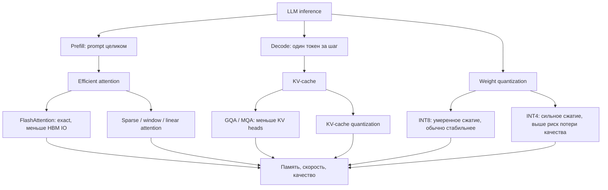

# Efficient LLM Inference

Source: `DL_exam.pdf`, Question 43

Original question:

> Ускорение и сжатие LLM на инференсе. Efficient attention, квантизация INT8/INT4, trade-off памяти, скорости и качества.

## Интуиция

Инференс LLM дорогой не только потому, что модель большая, но и потому, что генерация autoregressive: каждый новый токен требует нового forward pass через все слои. Во время генерации модель хранит `KV-cache`, чтобы не пересчитывать ключи и значения для прошлых токенов, но этот cache сам быстро становится главным потребителем памяти при длинном контексте и большом batch size.

Ускорение инференса обычно достигается тремя способами: меньше читать из памяти, меньше умножать матриц и лучше использовать GPU. `Efficient attention` уменьшает лишние чтения и записи или меняет структуру attention. Квантизация INT8/INT4 сжимает веса, активации или `KV-cache`, чтобы модель помещалась в память и быстрее передавалась через memory bandwidth. Главный компромисс: чем агрессивнее сжатие, тем выше риск деградации качества, численной нестабильности и потери скорости из-за dequantization overhead.

## Что нужно сказать на экзамене

- LLM inference имеет две фазы: `prefill` обрабатывает весь prompt параллельно, `decode` генерирует токены по одному.
- Основные метрики: latency до первого токена, tokens/sec, throughput, memory footprint, качество ответа.
- Стандартный self-attention для длины $n$ имеет вычислительную сложность $O(n^2 d)$ и память под матрицу attention $O(n^2)$, но при autoregressive decoding с `KV-cache` один новый токен смотрит на уже сохраненные $K,V$.
- `KV-cache` экономит вычисления, но требует память порядка $O(L \cdot B \cdot n \cdot h_{kv} \cdot d_h)$, где $L$ - число слоев, $B$ - batch size, $n$ - длина контекста, $h_{kv}$ - число KV-heads.
- `Efficient attention`: `FlashAttention` является exact attention, но IO-aware; он не материализует всю матрицу attention и считает softmax блоками. Sparse, sliding-window, low-rank и linear attention меняют саму структуру attention и могут быть approximate.
- `MQA` и `GQA` уменьшают число $K,V$ heads, поэтому уменьшают размер `KV-cache` и memory bandwidth на decoding.
- Квантизация: FP16/BF16 обычно 16 бит на параметр, INT8 - 8 бит, INT4 - 4 бита. INT4 дает примерно в 4 раза меньше памяти для весов, чем FP16, но чувствительнее к ошибке округления.
- Важные варианты: weight-only quantization, weight+activation quantization, `KV-cache` quantization, post-training quantization, quantization-aware training.
- Практические методы: per-channel/per-group scaling, zero-point, calibration, outlier handling, GPTQ/AWQ-подобные подходы для сохранения качества.
- Trade-off: память обычно уменьшается предсказуемо, скорость растет только если bottleneck был в memory bandwidth и есть быстрые kernels; качество падает сильнее при INT4, маленьких моделях, сложных reasoning-задачах и плохой calibration.

## Подробный ответ

### Где тратится время на инференсе

Autoregressive LLM оценивает вероятность следующего токена:

$$
p(x_t \mid x_{<t}) = \mathrm{softmax}(f_\theta(x_{<t}))_t.
$$

Генерация длиной $T$ требует последовательных шагов:

$$
x_t \sim p_\theta(\cdot \mid x_1,\ldots,x_{t-1}), \quad t=1,\ldots,T.
$$

Это нельзя полностью распараллелить по времени генерации, потому что следующий токен зависит от предыдущего. Поэтому различают:

| Фаза | Что происходит | Типичный bottleneck |
|---|---|---|
| `prefill` | prompt длины $n$ прогоняется через transformer, все позиции можно считать параллельно | compute, attention $O(n^2)$, память под активации/attention |
| `decode` | на каждом шаге добавляется один токен и обновляется `KV-cache` | memory bandwidth, чтение весов и KV-cache |

При обычном attention:

$$
Q = XW_Q,\quad K = XW_K,\quad V = XW_V,
$$

$$
\mathrm{Attention}(Q,K,V)=\mathrm{softmax}\left(\frac{QK^\top}{\sqrt{d_h}}\right)V.
$$

Для sequence length $n$ матрица $QK^\top$ имеет размер $n \times n$. Если ее материализовать, то память под attention растет как $O(n^2)$, а вычисления как $O(n^2 d_h)$ на head. Для длинных контекстов это становится дорогим.

### KV-cache

Без cache на каждом decode-шаге пришлось бы заново считать $K,V$ для всех прошлых токенов. `KV-cache` хранит ключи и значения прошлых токенов в каждом transformer layer. Тогда для нового токена считаются только новые $q_t,k_t,v_t$, а attention использует сохраненные $K_{\le t},V_{\le t}$:

$$
\mathrm{Attn}(q_t,K_{\le t},V_{\le t})
= \mathrm{softmax}\left(\frac{q_tK_{\le t}^\top}{\sqrt{d_h}}\right)V_{\le t}.
$$

Это меняет decode: вычисления на шаг остаются пропорциональны длине уже сгенерированного контекста, но не надо пересчитывать проекции всех прошлых токенов. Цена - память под cache:

$$
\mathrm{Mem}_{KV}
\approx 2 \cdot L \cdot B \cdot n \cdot h_{kv} \cdot d_h \cdot s,
$$

где множитель $2$ означает $K$ и $V$, $s$ - байт на число. Для FP16 $s=2$, для INT8 $s=1$, для INT4 $s=0.5$ без учета scales и metadata. Чем длиннее context, больше batch и больше число layers, тем важнее `KV-cache` compression.

### Efficient attention

`Efficient attention` может означать разные классы методов.

| Метод | Идея | Exact или approximate | Что ускоряет |
|---|---|---|---|
| `FlashAttention` | считать attention блоками в SRAM, не сохранять всю $n \times n$ матрицу | exact | меньше memory IO, меньше peak memory |
| `PagedAttention` | хранить KV-cache страницами, как virtual memory | exact по attention | лучше batching и управление памятью |
| `MQA` | все query heads делят один набор $K,V$ heads | архитектурное приближение | меньше KV-cache и bandwidth |
| `GQA` | группы query heads делят $K,V$ heads | архитектурный компромисс | меньше KV-cache, качество лучше MQA |
| Sliding-window attention | каждый токен смотрит на локальное окно | approximate/ограниченный контекст | меньше $O(n^2)$ для длинных последовательностей |
| Sparse/global attention | часть токенов имеет global attention, остальные sparse | approximate или структурный bias | длинный контекст дешевле |
| Linear attention | softmax attention заменяется kernel trick | approximate/другая модель | теоретически $O(n)$ или $O(n d^2)$ |

Главная идея `FlashAttention`: не вычислять и не хранить всю attention matrix. Softmax считается блочно с online-нормализацией. Для каждой строки поддерживаются текущий максимум $m_i$ и нормировочный множитель $\ell_i$, чтобы softmax оставался численно устойчивым:

$$
m_i = \max_j s_{ij}, \quad
\ell_i = \sum_j \exp(s_{ij}-m_i),
$$

$$
o_i = \frac{1}{\ell_i}\sum_j \exp(s_{ij}-m_i)v_j.
$$

Когда блоки $K,V$ обрабатываются последовательно, $m_i$ и $\ell_i$ обновляются без хранения всех $s_{ij}$. Поэтому результат такой же, как у обычного attention, но memory IO меньше. Это особенно важно, потому что GPU часто ограничен не только FLOPs, но и скоростью чтения/записи из HBM.

`MQA` и `GQA` особенно важны при decoding. Если query heads много, но KV-heads меньше, то `KV-cache` и чтение $K,V$ уменьшаются:

$$
h_{kv} < h_q.
$$

Например, при $h_q=32$ и $h_{kv}=8$ память KV-cache примерно в 4 раза меньше, чем при обычном multi-head attention с тем же $d_h$.

### Квантизация INT8 и INT4

Квантизация заменяет числа с плавающей точкой на низкоразрядные целые представления. Для равномерной affine quantization:

$$
x_q = \mathrm{clip}\left(\mathrm{round}\left(\frac{x}{s}\right)+z,\ q_{\min},q_{\max}\right),
$$

$$
\hat{x} = s(x_q-z),
$$

где $s$ - scale, $z$ - zero-point, $x_q$ - quantized integer, $\hat{x}$ - восстановленное приближение. Для symmetric quantization обычно $z=0$:

$$
x_q = \mathrm{clip}\left(\mathrm{round}\left(\frac{x}{s}\right), -2^{b-1},2^{b-1}-1\right).
$$

Для INT8 $b=8$, для INT4 $b=4$. Чем меньше $b$, тем больше quantization error:

$$
e = x - \hat{x}.
$$

Размер весов грубо:

$$
\mathrm{Mem}_{weights} \approx N \cdot \frac{b}{8} + \mathrm{Mem}_{scales},
$$

где $N$ - число параметров. Для модели с $N$ параметров:

| Формат | Байт на параметр | Грубый размер относительно FP16 |
|---|---:|---:|
| FP32 | 4 | $2 \times$ FP16 |
| FP16/BF16 | 2 | baseline |
| INT8 | 1 | $0.5 \times$ |
| INT4 | 0.5 | $0.25 \times$ |

На практике размер немного больше из-за scales, zero-points, group metadata и alignment.

### Что именно квантизуют

`Weight-only quantization`: квантизуют веса, а активации часто остаются FP16/BF16. Это популярно для LLM inference, потому что на decode-шаге приходится снова и снова читать большие матрицы весов. Если веса занимают меньше памяти, memory bandwidth bottleneck уменьшается. Умножение может идти как `INT4/INT8 weights + FP16 activations` с dequantization внутри kernel.

`Weight and activation quantization`: квантизуют и веса, и активации. Потенциально быстрее, если hardware хорошо поддерживает INT8 matmul, но сложнее сохранить качество, потому что активации зависят от input и имеют outliers.

`KV-cache quantization`: квантизуют сохраненные ключи и значения. Это помогает при длинных контекстах и большом batch size, где KV-cache может стать больше весов. Риск - ошибка в $K,V$ влияет на attention scores и на смешивание значений на каждом decode-шаге.

`Post-training quantization` (`PTQ`): модель квантизуют после обучения, обычно с calibration set. Дешевле и проще, но хуже для агрессивного INT4.

`Quantization-aware training` (`QAT`): во время обучения или дообучения моделируют квантизацию. Качество лучше, но требуется training pipeline и данные.

### Почему INT4 не всегда быстрее INT8

Сжатие памяти не гарантирует ускорение. Скорость зависит от bottleneck и kernels:

- если bottleneck - чтение весов из памяти, INT4 может сильно помочь;
- если bottleneck - compute или маленький batch, выигрыш может быть меньше;
- если dequantization выполняется неэффективно, overhead съедает ускорение;
- если hardware не имеет быстрых INT4 tensor cores/kernels, INT4 может быть хуже ожидаемого;
- для prefill, где большие matrix multiplications и attention хорошо грузят GPU, эффект quantization может отличаться от decode.

Типичный практический вывод: INT8 часто дает хороший компромисс качества и простоты; INT4 дает сильное сжатие, но требует более аккуратных методов, например group-wise scales, outlier handling, calibration и иногда fine-tuning.

### Trade-off памяти, скорости и качества

| Прием | Память | Скорость | Качество | Главный риск |
|---|---|---|---|---|
| `FlashAttention` | меньше peak memory | быстрее на длинных prompt | без потери, exact | нужен подходящий kernel/hardware |
| `GQA/MQA` | меньше KV-cache | быстрее decode | возможна небольшая потеря | меньше выразительность attention heads |
| INT8 weights | примерно в 2 раза меньше весов | часто быстрее decode | обычно малая потеря | outliers, calibration |
| INT4 weights | примерно в 4 раза меньше весов | может быть сильно быстрее | риск заметной потери | ошибка квантизации, плохие kernels |
| INT8/INT4 KV-cache | меньше cache при long context | выше throughput при batch/long context | может падать long-context качество | искажение attention |
| Sparse/window attention | меньше compute/memory при long context | быстрее длинные контексты | зависит от задачи | модель может не видеть нужные токены |
| Speculative decoding | меньше calls к большой модели | ниже latency | exact при правильной проверке | нужна draft model, сложность системы |

Важно различать `model compression` и `serving optimization`. Квантизация уменьшает саму модель или cache. Efficient batching, continuous batching, paged memory и speculative decoding улучшают serving, но не обязательно меняют параметры модели.

## Формулы / алгоритмы

### Оценка памяти весов

Для $N$ параметров и $b$ бит на параметр:

$$
\mathrm{Mem}_{weights} \approx N \cdot \frac{b}{8}.
$$

Пример без metadata:

$$
7 \cdot 10^9 \text{ params} \times 2 \text{ bytes} \approx 14 \text{ GB для FP16},
$$

$$
7 \cdot 10^9 \text{ params} \times 0.5 \text{ bytes} \approx 3.5 \text{ GB для INT4}.
$$

### Оценка памяти KV-cache

$$
\mathrm{Mem}_{KV}
\approx 2 \cdot L \cdot B \cdot n \cdot h_{kv} \cdot d_h \cdot s.
$$

Уменьшить эту величину можно через:

1. меньший $s$: FP16 $\rightarrow$ INT8/INT4 KV-cache;
2. меньший $h_{kv}$: `GQA` или `MQA`;
3. меньший $n$: sliding window, context compression, eviction;
4. лучшее управление памятью: paged KV-cache и continuous batching.

### Блочный exact attention в духе FlashAttention

Вход: $Q,K,V$, block size. Выход: $O=\mathrm{softmax}(QK^\top/\sqrt{d_h})V$.

1. Разбить $Q,K,V$ на блоки, которые помещаются в быструю память GPU.
2. Для каждого блока $Q_i$ инициализировать $m_i=-\infty$, $\ell_i=0$, $O_i=0$.
3. Последовательно читать блоки $K_j,V_j$.
4. Считать scores $S_{ij}=Q_iK_j^\top/\sqrt{d_h}$.
5. Обновить online softmax statistics $m_i,\ell_i$.
6. Накопить вклад $P_{ij}V_j$ без сохранения полной матрицы $P$.
7. Записать итоговый $O_i$.

Смысл алгоритма: асимптотика по FLOPs остается attention-like, но peak memory и число обращений к HBM резко уменьшаются.

### Простая схема PTQ

Вход: pretrained LLM, calibration texts, битность $b$, granularity. Выход: quantized model.

1. Выбрать, что квантизовать: weights, activations, KV-cache.
2. Выбрать granularity: per-tensor, per-channel или per-group.
3. Прогнать calibration set и оценить диапазоны или статистики.
4. Найти scales и zero-points.
5. Закодировать веса в INT8/INT4.
6. Проверить perplexity, downstream tasks и latency.
7. Если качество падает, использовать меньшие группы, outlier channels в FP16, mixed precision или QAT.

Практическая оговорка: `per-tensor` проще, но часто хуже для LLM; `per-channel` или `per-group` лучше учитывает разные масштабы каналов.

## Диаграмма или изображение

Внешние изображения не использовались.

## Быстрая устная версия

Ускорение LLM inference упирается в две фазы: `prefill`, где дорогой attention по prompt, и `decode`, где генерация идет по одному токену и часто ограничена memory bandwidth. `KV-cache` не дает заново считать ключи и значения прошлых токенов, но сам занимает много памяти, особенно при длинном контексте и большом batch.

`Efficient attention` уменьшает стоимость attention. `FlashAttention` является exact algorithm: он считает softmax блоками и не хранит всю матрицу $n \times n$, поэтому снижает memory IO и peak memory. `GQA/MQA` уменьшают число KV-heads и размер cache. Sparse или sliding-window attention ускоряют длинные контексты, но могут ограничить доступ к информации.

Квантизация INT8/INT4 сжимает веса, активации или KV-cache. INT8 обычно дает хороший баланс качества и памяти, INT4 сильнее сжимает и может ускорять decode, но больше рискует потерей качества. Реальный выигрыш по скорости зависит от hardware, kernels, batch size и того, был ли bottleneck в памяти. Главный trade-off: меньше память и потенциально выше throughput против ошибки квантизации, dequantization overhead и деградации качества.

## Возможные уточняющие вопросы

- Чем `FlashAttention` отличается от sparse attention?  
  `FlashAttention` считает тот же exact softmax attention, но более эффективно по памяти. Sparse attention меняет pattern внимания и обычно является приближением или архитектурным ограничением.

- Почему `KV-cache` ускоряет decode?  
  Он хранит $K,V$ прошлых токенов, поэтому на новом шаге не нужно пересчитывать их через все слои. Новый token делает attention к сохраненному cache.

- Почему `KV-cache` может стать проблемой?  
  Его размер растет линейно с длиной контекста, batch size, числом слоев и числом KV-heads. При long context cache может ограничивать batch и throughput.

- Что лучше: INT8 или INT4?  
  INT8 обычно стабильнее по качеству и проще. INT4 сильнее экономит память, но требует более аккуратной calibration, group-wise quantization и хороших kernels.

- Что такое weight-only quantization?  
  Веса хранятся в INT8/INT4, а активации остаются FP16/BF16. Это хорошо подходит для LLM decoding, где чтение весов часто является bottleneck.

- Зачем нужны per-channel или per-group scales?  
  Разные каналы имеют разные масштабы. Один scale на весь tensor может давать большую ошибку, а более мелкая granularity снижает quantization error.

- Может ли квантизация быть exact?  
  Нет, обычно это приближение к исходным весам или активациям. Исключение только тривиальное, если значения идеально представимы в выбранной сетке.

- Почему ускорение от INT4 не гарантировано?  
  Нужны эффективные INT4 kernels и низкий overhead dequantization. Если операция compute-bound или kernel плохой, память уменьшится, но скорость может почти не вырасти.

## Частые ошибки

- Говорить, что `FlashAttention` уменьшает асимптотику attention до $O(n)$. Для обычного dense attention он exact и в основном уменьшает memory IO и peak memory, а не превращает задачу в линейную.
- Забывать различать `prefill` и `decode`: bottlenecks и полезность оптимизаций у них разные.
- Считать, что `KV-cache` уменьшает память. Он уменьшает повторные вычисления, но добавляет память, растущую с длиной контекста.
- Путать INT8/INT4 хранение весов с полноценным INT8/INT4 вычислением. Часто веса квантизованы, но accumulation и части вычислений идут в FP16/FP32.
- Утверждать, что INT4 всегда быстрее INT8. Скорость зависит от kernels, hardware, batch size, memory bandwidth и dequantization.
- Игнорировать scales и metadata при оценке размера quantized model.
- Не упоминать calibration и outliers: для LLM несколько каналов с большими значениями могут сильно портить naive quantization.
- Считать sparse/window attention бесплатной заменой full attention. Она может ухудшить задачи, где ответ зависит от дальних токенов.
- Оценивать только memory footprint модели и забывать про KV-cache, который критичен для long context serving.
