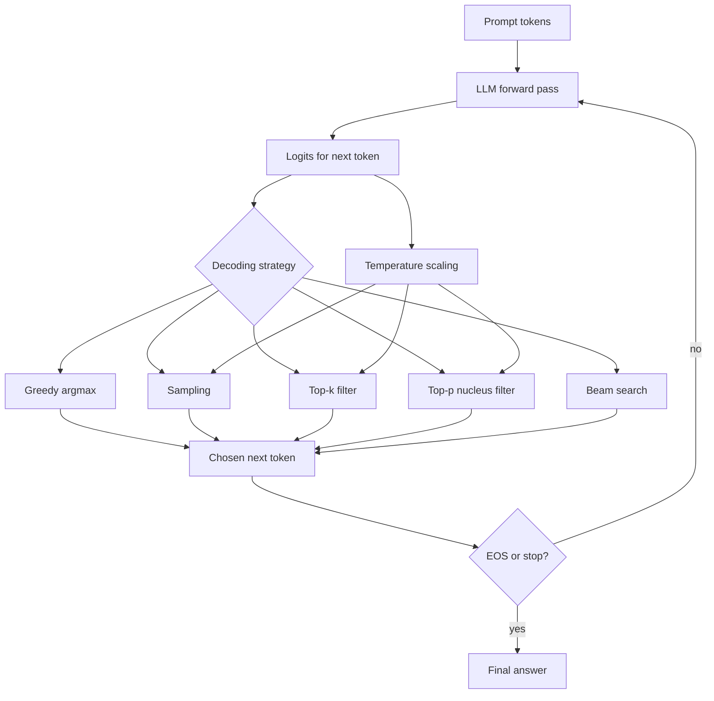

# LLM Decoding

Source: `DL_exam.pdf`, Question 44

Original question:

> Декодирование LLM. Greedy decoding, sampling, temperature, top-k/top-p, beam search, связь стратегии декодирования с качеством ответа.

## Интуиция

LLM на каждом шаге не сразу выдает готовый текст, а распределение вероятностей по следующему токену. Декодирование - это правило, которое превращает последовательность таких распределений в конкретный ответ. Поэтому одна и та же модель может вести себя как строгий детерминированный autocomplete, как разнообразный генератор идей или как поиск наиболее вероятной последовательности.

Главная идея: качество ответа зависит не только от модели, но и от стратегии выбора токенов. `greedy decoding` стабилен, но может быть скучным и застревать в локально вероятных продолжениях. `sampling` дает разнообразие, но может снижать точность. `temperature`, `top-k` и `top-p` управляют компромиссом между надежностью и разнообразием. `beam search` ищет несколько вероятных гипотез, но для открытой генерации текста часто дает слишком шаблонные ответы.

## Что нужно сказать на экзамене

- Авторегрессионная LLM задает $p_\theta(x_t \mid x_{<t})$ и генерирует токены слева направо до `EOS` или лимита длины.
- `Greedy decoding`: на каждом шаге выбирается токен с максимальной вероятностью.
- `Sampling`: токен случайно сэмплируется из распределения модели.
- `Temperature`: масштабирует logits перед `softmax`; низкая температура делает распределение острее, высокая - более плоским.
- `Top-k`: оставляет только $k$ наиболее вероятных токенов и сэмплирует из перенормированного распределения.
- `Top-p` / nucleus sampling: оставляет минимальное множество токенов, суммарная вероятность которого не меньше $p$.
- `Beam search`: хранит $B$ лучших частичных последовательностей по суммарному log-score и расширяет их на каждом шаге.
- Стратегии декодирования меняют не знания модели, а способ использования ее вероятностного распределения.
- Для точных задач обычно нужны более детерминированные настройки; для creative writing, brainstorming и диалогов - контролируемая случайность.
- Метрики качества: factuality, coherence, diversity, task accuracy, отсутствие повторов, latency и стоимость.

## Подробный ответ

Пусть уже сгенерирован префикс $x_{<t} = (x_1, \dots, x_{t-1})$. Модель возвращает logits $z_t \in \mathbb{R}^{|V|}$ по словарю $V$. Вероятности следующего токена:

$$
p_\theta(x_t=i \mid x_{<t}) =
\frac{\exp z_{t,i}}{\sum_{j \in V} \exp z_{t,j}}.
$$

Генерация всей последовательности обычно факторизуется авторегрессионно:

$$
p_\theta(x_{1:T}) = \prod_{t=1}^{T} p_\theta(x_t \mid x_{<t}).
$$

Декодер выбирает токены по одному. После выбора $x_t$ токен добавляется к контексту, модель пересчитывает распределение для следующего шага, и процесс продолжается до `EOS`, stop sequence или максимальной длины.

### Greedy decoding

`Greedy decoding` выбирает самый вероятный токен:

$$
x_t = \arg\max_{i \in V} p_\theta(i \mid x_{<t}).
$$

Плюсы: детерминированность, простота, низкая стоимость, хорошая воспроизводимость. Минусы: локально оптимальный выбор не гарантирует глобально лучшую последовательность; ответы могут быть однообразными; если модель вошла в неудачное продолжение, она не рассматривает альтернативы.

Greedy уместен для коротких factual answers, классификационных форматов, извлечения структурированных полей и случаев, где важна повторяемость.

### Sampling

При `sampling` следующий токен выбирается случайно:

$$
x_t \sim p_\theta(\cdot \mid x_{<t}).
$$

Это позволяет получать разные ответы на один и тот же prompt. Sampling полезен, когда существует много допустимых продолжений: генерация текста, brainstorming, диалог, creative writing. Недостаток: можно выбрать маловероятный, ошибочный или стилистически неподходящий токен, особенно если распределение имеет длинный хвост.

### Temperature

`Temperature` применяется к logits до `softmax`:

$$
p_T(i \mid x_{<t}) =
\frac{\exp(z_i / T)}{\sum_{j \in V} \exp(z_j / T)}.
$$

Где $T > 0$:

| Температура | Эффект | Практический смысл |
|---|---|---|
| $T \to 0$ | распределение стремится к argmax | почти greedy, высокая стабильность |
| $T = 1$ | исходное распределение модели | стандартный sampling |
| $T > 1$ | распределение становится более плоским | больше разнообразия, выше риск ошибок |

Важно: temperature не добавляет знания и не исправляет модель. Она только меняет энтропию распределения. Слишком низкая температура может давать сухие и повторяющиеся ответы, слишком высокая - incoherent или hallucinated текст.

### Top-k sampling

`Top-k` ограничивает множество кандидатов $K_t$:

$$
K_t = \operatorname{TopK}(p_\theta(\cdot \mid x_{<t}), k).
$$

После этого вероятности вне $K_t$ зануляются, а оставшиеся перенормируются:

$$
\tilde p(i) =
\begin{cases}
\frac{p(i)}{\sum_{j \in K_t} p(j)}, & i \in K_t, \\
0, & i \notin K_t.
\end{cases}
$$

Параметр $k$ фиксирует количество допустимых токенов. При малом $k$ генерация становится более консервативной; при большом $k$ растет разнообразие. Ограничение: одно и то же $k$ плохо адаптируется к форме распределения. Иногда модель уверена, и достаточно 2-3 токенов; иногда распределение широкое, и фиксированный $k$ может обрезать хорошие варианты.

### Top-p / nucleus sampling

`Top-p` выбирает минимальное множество наиболее вероятных токенов $N_t$, такое что:

$$
\sum_{i \in N_t} p(i \mid x_{<t}) \ge p,
$$

где токены отсортированы по убыванию вероятности. Затем сэмплирование идет из перенормированного распределения на $N_t$.

Top-p адаптивен: если модель уверена, nucleus маленький; если есть много правдоподобных продолжений, nucleus расширяется. Типичные значения вроде $p=0.8\ldots0.95$ дают баланс между качеством и разнообразием, но оптимальные настройки зависят от задачи.

### Beam search

`Beam search` приближенно ищет последовательность с высокой вероятностью. Вместо одной гипотезы он хранит $B$ лучших partial hypotheses. Score гипотезы обычно равен сумме log probabilities:

$$
s(x_{1:t}) = \sum_{\tau=1}^{t} \log p_\theta(x_\tau \mid x_{<\tau}).
$$

На каждом шаге каждая из $B$ гипотез расширяется кандидатами следующих токенов, затем оставляются $B$ лучших новых гипотез. Часто используют length normalization, потому что произведение вероятностей склонно предпочитать короткие последовательности:

$$
s_{\text{norm}}(x_{1:T}) =
\frac{1}{T^\alpha}
\sum_{t=1}^{T} \log p_\theta(x_t \mid x_{<t}),
$$

где $\alpha$ управляет штрафом за длину.

Beam search хорошо работал в задачах machine translation и sequence-to-sequence, где нужно найти одну высоковероятную последовательность при ограниченном пространстве ответов. Для LLM open-ended generation он может быть хуже sampling: высоковероятные последовательности часто generic, repetitive и менее естественные. Кроме того, beam search дороже greedy: примерно в $B$ раз больше активных гипотез, хотя вычисления можно батчить.

### Связь стратегии декодирования с качеством ответа

Качество зависит от задачи. Нет универсально лучшей стратегии.

| Задача | Подходящие настройки | Почему |
|---|---|---|
| Точный ответ, код, extraction, JSON | низкая temperature, greedy или constrained decoding | нужна стабильность и соблюдение формата |
| Объяснение учебной темы | низкая/средняя temperature, top-p | нужен баланс точности и естественности |
| Brainstorming | sampling, выше temperature, top-p | ценится разнообразие |
| Creative writing | sampling, top-p/top-k, иногда выше temperature | нужно избегать шаблонности |
| Machine translation / краткие seq2seq-задачи | beam search с length penalty | полезен поиск вероятной последовательности |

Низкая случайность повышает reproducibility и снижает риск странных токенов, но может уменьшить diversity и привести к повторяющимся формулировкам. Высокая случайность расширяет пространство ответов, но увеличивает риск hallucinations, ошибок фактов, нарушения инструкций и формата. Поэтому в production часто используют не только decoding parameters, но и системные инструкции, retrieval, reranking, validators, stop sequences, constrained decoding и постпроверку.

## Формулы / алгоритмы

### Общий алгоритм авторегрессионного декодирования

Objective: получить последовательность $x_{1:T}$, максимизирующую или сэмплирующую правдоподобное продолжение prompt.

Inputs: prompt $c$, модель $p_\theta$, словарь $V$, стратегия декодирования, лимит длины $T_{\max}$, stop condition.

Output: сгенерированная последовательность токенов.

1. Токенизировать prompt и задать начальный контекст $x_{<1}=c$.
2. Для $t=1,\dots,T_{\max}$:
   - получить logits $z_t$ модели для следующего токена;
   - применить temperature: $z_t \leftarrow z_t / T$;
   - при необходимости применить фильтр `top-k`, `top-p` или constraints;
   - получить распределение через `softmax`;
   - выбрать токен: `argmax` для greedy или random sample для sampling;
   - добавить токен в контекст;
   - остановиться при `EOS` или stop sequence.
3. Детокенизировать результат.

Практические caveats: стоимость генерации растет с длиной ответа; KV-cache уменьшает повторные вычисления attention; плохие stop conditions могут обрезать ответ или дать лишний текст; при structured output полезны constrained decoding и валидация.

### Greedy

$$
x_t = \arg\max_i p_\theta(i \mid x_{<t}).
$$

Сложность выбора после logits: $O(|V|)$ на шаг для поиска максимума.

### Sampling with temperature

$$
x_t \sim \operatorname{Categorical}
\left(
\operatorname{softmax}\left(\frac{z_t}{T}\right)
\right).
$$

При $T \to 0$ sampling приближается к greedy; при большом $T$ растет entropy:

$$
H(p) = -\sum_i p(i)\log p(i).
$$

### Top-k

1. Отсортировать или выбрать $k$ крупнейших вероятностей.
2. Занулить остальные токены.
3. Перенормировать распределение.
4. Сэмплировать из оставшихся токенов.

### Top-p

1. Отсортировать токены по вероятности.
2. Взять минимальный prefix токенов, чья суммарная вероятность $\ge p$.
3. Занулить остальные токены.
4. Перенормировать и сэмплировать.

### Beam search

Inputs: beam size $B$, max length $T_{\max}$.

1. Инициализировать beam одной пустой гипотезой со score $0$.
2. Для каждого шага расширить каждую активную гипотезу возможными следующими токенами.
3. Посчитать score новых гипотез:

$$
s(h + i) = s(h) + \log p_\theta(i \mid h).
$$

4. Оставить $B$ лучших гипотез.
5. Перенести завершенные гипотезы с `EOS` в список candidates.
6. Вернуть лучшую завершенную гипотезу по score, часто с length normalization.

Сложность примерно $O(T_{\max} \cdot B \cdot |V|)$ для наивного расширения, на практике используют top candidates и батчирование.

## Диаграмма или изображение

Внешние изображения не использовались.

## Быстрая устная версия

Декодирование LLM - это способ выбрать следующий токен из распределения $p(x_t \mid x_{<t})$. Greedy всегда берет argmax: быстро и стабильно, но может быть локально неоптимальным и однообразным. Sampling выбирает токен случайно, поэтому дает разнообразие, но повышает риск ошибок. Temperature масштабирует logits: низкая делает ответы более детерминированными, высокая - более разнообразными. Top-k оставляет $k$ самых вероятных токенов, top-p оставляет минимальное nucleus-множество с суммарной вероятностью хотя бы $p$. Beam search хранит несколько лучших гипотез и ищет высоковероятную последовательность, но для открытой генерации LLM может давать generic и repetitive ответы. Поэтому стратегию выбирают под задачу: точность и формат требуют низкой случайности, творческие задачи - контролируемого sampling.

## Возможные уточняющие вопросы

- Почему greedy не обязательно находит самую вероятную последовательность?  
  Потому что он оптимизирует каждый шаг локально, а ранний локально лучший токен может привести к худшему продолжению всей последовательности.

- Чем top-k отличается от top-p?  
  Top-k фиксирует число кандидатов, а top-p фиксирует суммарную probability mass и поэтому адаптируется к уверенности модели.

- Что происходит при temperature меньше 1?  
  Logits делятся на число меньше 1, различия между ними увеличиваются, распределение становится более острым.

- Почему высокая temperature может усиливать hallucinations?  
  Она повышает вероятность менее вероятных токенов, из-за чего модель чаще уходит в слабоподдержанные продолжения.

- Зачем beam search length penalty?  
  Сумма log probabilities обычно уменьшается с длиной, поэтому без нормализации поиск часто предпочитает слишком короткие ответы.

- Почему beam search не всегда хорош для LLM chat generation?  
  Он выбирает высоковероятные продолжения, которые часто оказываются безопасными, шаблонными и повторяющимися, а не самыми полезными или естественными.

- Можно ли одновременно использовать temperature и top-p?  
  Да. Обычно сначала масштабируют logits temperature, затем фильтруют распределение top-p/top-k и сэмплируют.

## Частые ошибки

- Говорить, что decoding меняет знания модели. Он меняет только способ выбора токенов из уже выученного распределения.
- Путать `temperature=0` с обычным sampling. На практике это почти greedy/argmax, а не случайный выбор.
- Считать beam search универсально лучшим методом. Для open-ended LLM generation он часто ухудшает diversity и естественность.
- Забывать перенормировку вероятностей после top-k или top-p.
- Думать, что top-p выбирает ровно фиксированное число токенов. Размер nucleus меняется на каждом шаге.
- Оценивать качество только по вероятности. Для пользователя важны также factuality, instruction following, формат, полнота, latency и отсутствие повторов.
- Игнорировать stop sequences и max tokens: стратегия выбора токенов не решает сама проблему корректного завершения ответа.
